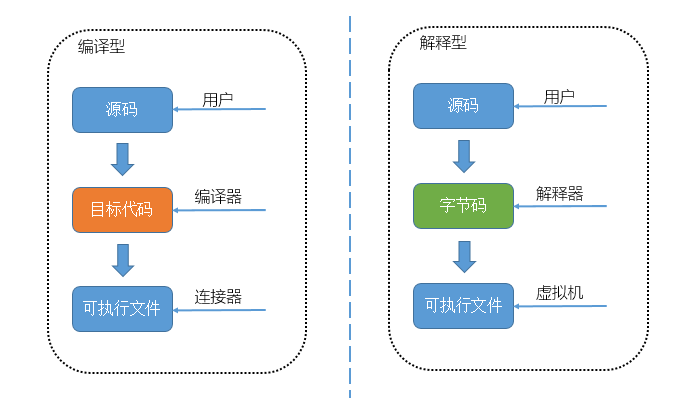

[语言](#语言) | [计算机体系结构](#计算机体系结构) | [操作系统](#操作系统) | [计算机网络](#计算机网络) | [Web](#Web) | [数据库](#数据库) | [分布式架构](#分布式架构) | [算法与数据结构](#算法与数据结构) | [工具](#工具)

- [参考](#参考)
    - [书籍](#书籍)
- [语言](#语言)
    - [Golang](#Golang)
    - [Python](#Python)
    - [PHP](#PHP)
    - [C++](#C++)
    - [面试](#面试（语言）)
        - [解释型语言和编译型语言的区别](#解释型语言和编译型语言的区别)
        - [动态语言和静态语言的区别](#动态语言和静态语言的区别)
        - [几种常用语言的区别](#几种常用语言的区别)
- [计算机体系结构](#计算机体系结构)
- [操作系统](#操作系统)
- [计算机网络](#计算机网络)
- [Web](#Web)
- [数据库](#数据库)
    - [关系型数据库](#关系型数据库)
    - [非关系型数据库](#非关系型数据库)
    - [Mysql](#Mysql)
    - [PostgreSQL](#PostgreSQL)
    - [Redis](#Redis)
    - [进程内缓存](#进程内缓存)
    - [面试](#面试（数据库）)
        - [关系型与非关系型数据库的区别](#关系型与非关系型数据库的区别)
        - [MySQL与PostgreSQL的区别](#MySQL与PostgreSQL的区别) 
        - [Redis与MySQL的区别](#Redis与MySQL的区别)
        - [为什么MongoDB使用B树](#为什么MongoDB使用B树)
- [分布式架构](#分布式架构)
- [算法与数据结构](#算法与数据结构)
- [工具](#工具)
    - [Docker](#Docker)
        - [基本概念](#基本概念)
        - [制作Docke容器步骤](#制作Docke容器步骤)
        - [优势](#优势)
        - [用途](#用途)
        - [Dokcer与虚拟机的区别](#Dokcer与虚拟机的区别)
        - [应用到微服务](#应用到微服务)
    - [K8S](#K8S)
    - [Git](#Git)
        - [查看改动](#查看改动)
        - [git_stash](#git-stash)
        - [git_pull](#git-pull)
        - [git_rebase](#git-rebase)
        - [git_cherry-pick](#git-cherry-pick)
    - [cloc](#cloc)
        - [安装](#安装)
        - [使用](#使用)

---
# 参考
## 书籍
高性能MySQL<br>
Redis开发与运维<br>
Redis深度历险：核心原理与应用实践<br>

# 语言
## Golang
[golang.md](./knowledge/golang.md)
## Python
[python.md](./knowledge/python.md)
## PHP
[php.md](./knowledge/php.md)
## C++
[c++.md](./knowledge/c++.md)
## 面试（语言）
### 解释型语言和编译型语言的区别
解释型语言：解释型语言的源代码不是直接翻译成机器指令，而是先翻译成中间代码，再由解释器对中间代码进行解释运行。<br>
编译型语言：将源代码编译生成机器指令，再由机器运行机器码。<br>



解释型语言跟编译型语言相比，运行慢。
### 动态语言和静态语言的区别
动态类型语言：编程时，不需要声明变量的数据类型，该语言会在第一次赋值给变量时，在内部记录数据类型。在运行时检查数据类型。优点：代码简洁，方便阅读。缺点：不提供数据类型的安全检查。<br>
静态类型语言：编程时，要声明变量的数据类型。在编译时检查数据类型。优点：提供数据类型的安全检查。缺点：代码不够简洁。
### 几种常用语言的区别
* c++：是编译型语言；是静态类型语言；基于源码的跨平台；
* java：是解释型语言；是静态类型语言；基于字节码的跨平台；
* python：是解释型语言；是动态类型语言；基于字节码的跨平台；

# 计算机体系结构
[computer_architecture.md](./knowledge/computer_architecture.md)

# 操作系统
[operating_system.md](./knowledge/operating_system.md)

# 计算机网络
[computer_network.md](./knowledge/computer_network.md)

# Web
[web.md](./knowledge/web.md)

# 数据库
数据库能快速查找对应的数据。
## 关系型数据库
概念<br>
依据关系模型创建数据库。所谓关系模型就是“一对一、一对多、多对多”等关系模型。关系模型就是指二维表格模型，因而一个关系型数据库就是由二维表及其之间的联系组成的一个数据组织。

常见的关系型数据库：Oracle、[PostgreSQL](#PostgreSQL)、[MySQL](#MySQL)等。

**瓶颈**<br>
* 并发读写需求。
* 海量数据的高效率读写。
* 高扩展性和可用性。

## 非关系型数据库
概念<br>
非关系型数据库主要是基于“非关系模型”的数据库（由于关系型太大，所以一般用“非关系型”来表示其他类型的数据库）。

分类
* 面向高性能并发读写的key-value数据库：key-value数据库的主要特点是具有极高的并发读写性能。以键值对存储数据。代表：[Redis](#Redis)、MemcacheDB等。
* 面向海量数据访问的面向文档数据库：这类数据库的主要特点是在海量的数据中可以快速的查询数据。代表：MongoDB、CouchDB等。
* 面向搜索数据内容的搜索引擎：搜索引擎是专门用于搜索数据内容的NoSQL数据库管理系统。主要是用于对海量数据进行近实时的处理和分析处理，可用于机器学习和数据挖掘。代表：Elasticsearch、plunk、Solr等。
* 面向可扩展性的分布式数据库：这类数据库的主要特点是具有很强的可拓展性。**列存储，列模型数据库以一列为一个记录，这种模型，数据即索引，IO很快，主要是一些分布式数据库**。普通的关系型数据库都是以行为单位来存储数据的，擅长以行为单位的读入处理，比如特定条件数据的获取。因此，关系型数据库也被成为面向行的数据库。相反，面向列的数据库是以列为单位来存储数据的，擅长以列为单位读入数据。这类数据库想解决的问题就是传统数据库存在可扩展性上的缺陷，这类数据库可以适应数据量的增加以及数据结构的变化，将数据存储在记录中，能够容纳大量动态列。代表：Cassandra、HBase等。

## MySQL
[mysql.md](./knowledge/mysql.md)
## PostgreSQL
[postgresql..md](./knowledge/postgresql.md)
## Redis
[redis.md](./knowledge/redis.md)
## 进程内缓存
*| 分布式缓存(例如Redis) | 进程本地缓存
---|---|---
优点|存储容量更大，可靠性更好，可以在集群间共享|读取本地内存，没有网络开销，速度更快
缺点|访问缓存有网络开销|存储容量有限，可靠性较低(服务重启缓存就没了)，无法共享(多个服务直接无法互相访问)
场景|缓存数据量较大，可靠性要求较高，需要在集群间共享|性能要求较高，缓存数据量较小

## 面试（数据库）
### 关系型与非关系型数据库的区别
* 成本：Nosql数据库简单易部署，基本都是开源软件，不需要像使用Oracle那样花费大量成本购买使用，相比关系型数据库价格便宜。
* **查询速度**：Nosql数据库将数据存储于缓存之中，而且不需要经过SQL层的解析。关系型数据库将数据存储在硬盘中，还要通过I/O加载到内存中，自然查询速度远不及Nosql数据库。
* 存储数据的格式：Nosql的存储格式是key-value形式、文档形式、图片形式等，所以可以存储基础类型以及对象或者集合等各种格式。而数据库则只支持基础类型。
* **扩展性**：关系型数据库有类似join这样的多表查询机制的限制，导致扩展很艰难。Nosql基于键值对，数据之间没有耦合性，所以非常容易水平扩展。
* 持久存储：Nosql不适用于持久存储。海量数据的持久存储，还是需要关系型数据库。
* 数据一致性：非关系型数据库一般强调的是数据最终一致性。不像关系型数据库一样强调数据的强一致性，从非关系型数据库中读到的有可能还是处于一个中间态的数据。
* **对事务的支持**：Nosql不提供对事务的处理。
### MySQL与PostgreSQL的区别
* PostgreSQL的主备复制属于物理复制，相对于MySQL基于binlog的逻辑复制，数据的一致性更加可靠，复制性能更高，对主机性能的影响也更小。

PostgreSQL具备更高的可靠性，对数据一致性完整性的支持高于MySQL，因此PostgreSQL更加适合严格的企业应用场景（比如金融、电信、ERP、CRM）；而MySQL查询速度较快，更加适合业务逻辑相对简单、数据可靠性要求较低的互联网场景（比如google、facebook、alibaba）。
### Redis与MySQL的区别
* Redis基于内存，读写速度快，也可做持久化，但是内存空间有限，当数据量超过内存空间时，需扩充内存，但内存价格贵。
* MySQL基于磁盘，读写速度没有Redis快，但是不受空间容量限制，性价比高。

大多数的应用场景是MySQL（主）+Redis（辅），MySQL做为主存储，Redis用于缓存，加快访问速度。需要高性能的地方使用Redis，不需要高性能的地方使用MySQL。存储数据在MySQL和Redis之间做同步。
### 为什么MongoDB使用B树
MongoDB是非关系型数据库。虽然遍历数据的查询是相对常见的，但是MongoDB认为查询单个数据记录远比遍历数据更加常见，由于B树的非叶结点也可以存储数据，所以查询一条数据所需要的平均随机IO次数会比B+树少，使用B树的MongoDB在类似场景中的查询速度就会比MySQL快。

# 分布式架构
[distributed_architecture.md](./knowledge/distributed_architecture.md)

# 算法与数据结构
[algorithms_and_data_structures.md](./knowledge/algorithms_and_data_structures.md)

# 工具
## Docker
### 基本概念
> 镜像（image）：Docker镜像是一个特殊的文件系统，除了提供容器运行时所需的程序、库、资源、配置等文件外，还包含了一些为运行时准备的一些配置参数（如匿名卷、环境变量、用户等）。镜像不包含任何动态数据，其内容在构建之后也不会被改变。<br>
容器（container）：容器就是将软件打包成标准化单元，以用于开发、交付和部署。<br>
仓库（repository）

容器是镜像运行时的实体。容器可以被创建、启动、停止、删除、暂停等。<br>
容器对进程进行隔离，是进城级别的。

### 制作Docke容器步骤
1. 编写Dockerfile文件。
2. 创建image文件：使用docker image build命令创建image文件。
3. 生成容器：docker container run命令会从image文件生成容器。

### 优势
* 一致的运行环境。
* 更快速的启动时间。
* 隔离型。
* 弹性伸缩，快速拓展。
* 迁移方便。
* 持续交付和部署。

### 用途
* 提供一次性的环境。
* 提供弹性的云服务。
* **组建微服务架构**。通过多个容器，一台机器可以跑多个服务，因此在本机就可以模拟出微服务架构。

### Dokcer与虚拟机的区别
虚拟机模拟的操作系统，隔离整个运行环境。docker用于隔离不同的应用。

特性 | 容器 | 虚拟机 
---|---|---
启动      | 秒级            | 分钟级
硬盘使用   | 一般为MB       | 一般为GB
性能      | 接近原生        | 弱于
系统支持量 | 单机支持上千个容器| 一般几十个

### 应用到微服务
微服务很适合用Docker容器实现，每个容器承载一个服务。一台计算机同时运行多个容器，从而就能很轻松地模拟出复杂的微服务架构。<br>
如何在一台计算机上实现多个服务，让它们互相配合，组合出一个应用程序。可以使用Docker Compose工具来管理多个容器的联动。<br>
Compose是Docker公司推出的一个工具软件，可以管理多个Docker容器组成一个应用。需要定义一个YAML格式的配置文件docker-compose.yml，写好多个容器之间的调用关系。然后，只要一个命令，就能同时启动/关闭这些容器。
```shell
# 启动所有服务
$ docker-compose up
# 关闭所有服务
$ docker-compose stop
```

## K8S
K8S，就是基于容器的集群管理平台。

## Git


### 查看改动
* git diff：可以查看当前没有add的内容修改（不在缓冲区的文件变化）。
* git diff --cached：查看已经add但没commit的改动（在缓冲区的文件变化）。
* git diff HEAD：是上面两条命令的合并。

### git stash
[参考](https://www.cnblogs.com/tocy/p/git-stash-reference.html)<br>

命令用法<br>
* git stash：会把所有未提交的修改（包括暂存的和非暂存的）都保存起来，用于后续恢复当前工作目录。
* git stash save "temp"：加message，记录版本。
* git stash pop：重新应用缓存的stash（默认应用第一个，即最新一个，并且删除这个缓存的stash）。
* git stash apply：多次应用stash，不删除。
* git stash list：查看所有stash。
* git stash apply stash_name：指定应用某个stash，默认使用最近的。
* git stash drop stash_name：移除某个stash。
* git stash clear：删除所有缓存的stash。
* git stash show [stash_name]：查看指定stash的修改文件状态。在该命令后面添加-p或--patch可以查看特定stash的全部diff。
* git stash branch：创建一个新的分支，检出储藏工作时的所处的提交，重新应用工作，如果成功，将会丢弃储藏。用于：恢复储藏的工作然后在新的分支上继续当时的工作。

暂存未跟踪或忽略的文件<br>
默认情况下，git stash会缓存下列文件：添加到暂存区的修改（staged changes），git跟踪的但并未添加到暂存区的修改（unstaged changes）。
但不会缓存以下文件：在工作目录中新的文件（untracked files），被忽略的文件（ignored files）。<br>
git stash命令提供了参数用于缓存上面两种类型的文件。使用-u或者--include-untracked可以stash untracked文件。使用-a或者--all命令可以stash当前目录下的所有修改。

作用<br>
储藏(stash)可以获取工作目录的中间状态——也就是修改过的被追踪的文件（工作区）和暂存的变更（暂存区），并将它保存到一个未完结变更的堆栈中（在本地仓库，不会被push到远程分支），随时可以重新应用。

### git pull
git pull等同于先做git fetch，再做merge。
```shell
$ git pull origin next
# 等同于
$ git fetch origin
$ git merge origin/next
```

### git rebase
[参考](http://jartto.wang/2018/12/11/git-rebase/)<br>
背景
* 提交次数太多，不利于review。
* 无用的commit太多，造成分支污染，不利于回退版本。

使用场景
* 对提交记录进行合并：进入git rebase的编辑模式，修改提交记录。
* 分支合并：git:(feature1) git rebase master。首先，git会把 feature1分支里面的每个commit取消掉。其次，把上面的操作临时保存成 patch文件，存在.git/rebase目录下。然后，把feature1分支更新到最新的 master分支。最后，把上面保存的patch文件应用到feature1分支上。
* 在过时分支上开发。

危险操作：因为改变了历史，要保证改分支只有自己使用。

### git cherry-pick
能够把另一个分支的一个或多个提交复制到当前分支，具体使用如下：
1. 首先git checkout到另一个分支。
2. 然后使用git log找到想要复制的commit的id，记录下来。
3. 切换到自己分支，使用git cherry-pick [上面记录的commit id]。

如果想要复制多个, 使用git cherry-pick (commitid1..commitid100]，commitid1为想复制的最老提交(不包括)，commitid100为想复制的最新提交(包括)。

如果想要包括commitid1，那么在commitid1后加^即可，即 git cherry-pick [commitid1^..commitid100]。

### commit
* 回滚到之前某一commit：git reset --hard commit_id
* 修改commit的注释：git commit --amend

## cloc
代码统计工具<br>
[github地址](https://github.com/AlDanial/cloc)
### 安装
```shell
brew isntall cloc
```
### 使用
```shell
#统计当前目录下代码
cloc .
#使用--exclude-dir过滤某些路径
cloc . --exclude-dir=vendor
#查看哪些文件代码量比较大，使用：--by-file参数
cloc . --by-file |head -n 30
```
参考：<br>
[代码统计工具cloc基本使用](https://zdyxry.github.io/2019/08/09/%E4%BB%A3%E7%A0%81%E7%BB%9F%E8%AE%A1%E5%B7%A5%E5%85%B7-cloc-%E5%9F%BA%E6%9C%AC%E4%BD%BF%E7%94%A8/)<br>
[cloc查看代码的行数](https://blog.csdn.net/qq_29828623/article/details/81207317)<br>

更多使用见[github地址](https://github.com/AlDanial/cloc)