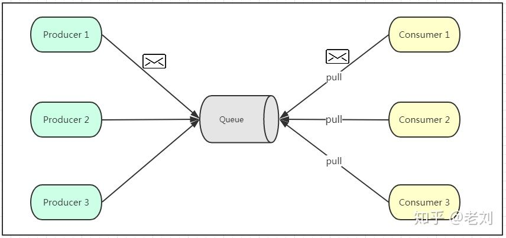
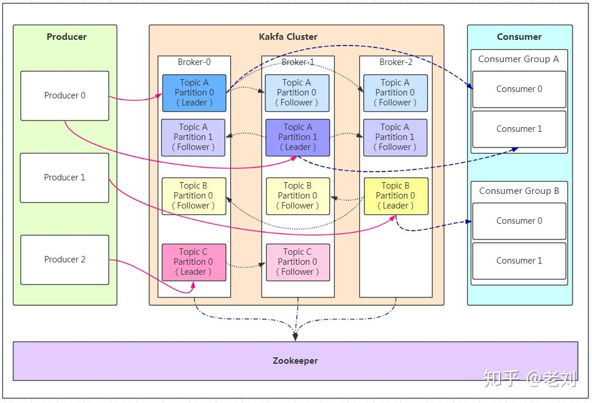
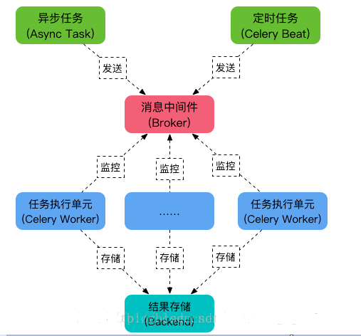

[语言](#语言) | [计算机体系结构](#计算机体系结构) | [操作系统](#操作系统) | [计算机网络](#计算机网络) | [Web](#Web) | [数据库](#数据库) | [分布式架构](#分布式架构) | [算法与数据结构](#算法与数据结构) | [工具](#工具)

- [参考](#参考)
    - [书籍](#书籍)
- [语言](#语言)
    - [Golang](#Golang)
    - [Python](#Python)
    - [C++](#C++)
    - [面试](#面试（语言）)
        - [解释型语言和编译型语言的区别](#解释型语言和编译型语言的区别)
        - [动态语言和静态语言的区别](#动态语言和静态语言的区别)
        - [几种常用语言的区别](#几种常用语言的区别)
- [计算机体系结构](#计算机体系结构)
- [操作系统](#操作系统)
    - [进程、线程、协程](#进程、线程、协程)
        - [进程](#进程)
        - [线程](#线程)
        - [协程](#协程)
        - [死锁](#死锁)
    - [CPU密集型和I/O密集型](#CPU密集型和I/O密集型)
    - [阻塞和非阻塞](#阻塞和非阻塞)
    - [同步和异步](#同步和异步)
    - [并发和并行](#并发和并行)
    - [IO模型](#IO模型)
    - [IO多路复用](#IO多路复用)
    - [select、poll、epoll](#select、poll、epoll)
        - [select](#select)
        - [poll](#poll)
        - [epoll](#epoll)
        - [总结](#总结)
    - [面试](#面试（操作系统）)
        - [进程和线程的区别与联系](#进程和线程的区别与联系)
        - [进程间通信方式](#进程间通信方式)
        - [同步/异步和阻塞/非阻塞](#同步/异步和阻塞/非阻塞)
        - [select、poll、epoll的区别](#select、poll、epoll的区别)
        - [linux基本命令](#linux基本命令)
- [计算机网络](#计算机网络)
    - [网络结构](#网络结构)
    - [ARP协议和RARP协议](#ARP协议和RARP协议)
    - [TCP协议和UDP协议](#TCP协议和UDP协议)
    - [TCP连接](#TCP连接)
        - [三次握手](#三次握手)
        - [四次挥手](#四次挥手)
    - [socket](#socket)
    - [无状态协议、有状态协议](#无状态协议、有状态协议)
    - [面向连接与无连接](#面向连接与无连接)
    - [长连接和短连接](#长连接和短连接)
    - [短轮询、长轮询、HTTP流](#短轮询、长轮询、HTTP流)
    - [HTTP协议](#HTTP协议)
    - [HTTPS协议](#HTTPS协议)
    - [DNS协议](#DNS协议)
    - [因特网编程和web编程](#因特网编程和web编程)
    - [面试](#面试（计算机网络）)
        - [TCP协议和UDP协议的区别](#TCP协议和UDP协议的区别)
        - [TCP三次握手和四次挥手](#TCP三次握手和四次挥手)
        - [HTTP和Socket的区别](#HTTP和Socket的区别)
        - [HTTP和WebSocket的区别](#HTTP和WebSocket的区别)
        - [HTTP1.0，HTTP1.1，HTTP2.0的区别](#HTTP1.0，HTTP1.1，HTTP2.0的区别)
        - [HTTP和HTTPS的区别](#HTTP和HTTPS的区别)
        - [URL和URI的区别](#URL和URI的区别)
- [Web](#Web)
    - [HTML](#HTML)
    - [WSGI、uwsgi、uWSGI](#WSGI、uwsgi、uWSGI)
    - [web服务器和web应用程序](#web服务器和web应用程序)
    - [Nginx](#Nginx)
        - [nginx](#nginx)
        - [正向代理](#正向代理)
        - [反向代理](#反向代理)
        - [负载均衡](#负载均衡)
        - [动静分离](#动静分离)
    - [后端框架](#后端框架)
        - [Flask(Python)](#Flask(Python))
        - [Tornado(Python)](#Tornado(Python))
        - [Gin(Golang)](#Gin(Golang))
    - [SQLAlchemy](#SQLAlchemy)
    - [Protobuf](#Protobuf)
    - [RESTful-API](#RESTful-API)
    - [面试](#面试（Web）)
        - [简述Nginx](#简述Nginx)
        - [Nginx如何做到高并发下的高效处理](#Nginx如何做到高并发下的高效处理)
        - [怎么保证Nginx的高可用](#怎么保证Nginx的高可用)
        - [sqlalchemy的优点、缺点](#sqlalchemy的优点、缺点)
        - [cookie和session的区别](#cookie和session的区别)
        - [常用的http返回状态码](#常用的http返回状态码)
        - [简述RESTful-API](#简述RESTful-API)
- [数据库](#数据库)
    - [关系型数据库](#关系型数据库)
    - [非关系型数据库](#非关系型数据库)
    - [Mysql](#Mysql)
    - [PostgreSQL](#PostgreSQL)
    - [Redis](#Redis)
    - [面试](#面试（数据库）)
        - [关系型与非关系型数据库的区别](#关系型与非关系型数据库的区别)
        - [Redis与MySQL的区别](#Redis与MySQL的区别)
- [分布式架构](#分布式架构)
    - [CAP理论](#CAP理论)
    - [web请求过程](#web请求过程)
    - [分布式锁](#分布式锁)
    - [负载均衡分类](#负载均衡分类)
    - [LVS+Keepalived](#LVS+Keepalived)
    - [负载均衡算法](#负载均衡算法)
    - [一致性哈希](#一致性哈希)
    - [分布式集群系统下的高可用session解决方案](#分布式集群系统下的高可用session解决方案)
    - [单体架构](#单体架构)
    - [MVC](#MVC)
    - [微服务架构](#微服务架构)
    - [RPC](#RPC)
    - [MVC、RPC、SOA、微服务架构之间的区别](#MVC、RPC、SOA、微服务架构之间的区别)
    - [熔断、服务降级、限流](#熔断、服务降级、限流)
    - [分布式数据库技术演变](#分布式数据库技术演变)
    - [数据库架构原则](#数据库架构原则)
    - [主从同步](#主从同步)
    - [消息队列](#消息队列)
    - [Kafka](#Kafka)
    - [Celery](#Celery)
    - [面试](#面试)
        - [四层和七层负载均衡之间的区别](#四层和七层负载均衡之间的区别)
        - [简述负载均衡算法](#简述负载均衡算法)
        - [分布式集群系统下怎么实现session高可用](#分布式集群系统下怎么实现session高可用)
        - [简述RPC](#简述RPC)
        - [数据库架构设计原则](#数据库架构设计原则)
        - [数据库架构主从同步方案](#数据库架构主从同步方案)
        - [简述消息队列](#简述消息队列)
- [算法与数据结构](#算法与数据结构)
- [工具](#工具)
    - [Docker](#Docker)
        - [基本概念](#基本概念)
        - [制作Docke容器步骤](#制作Docke容器步骤)
        - [优势](#优势)
        - [用途](#用途)
        - [Dokcer与虚拟机的区别](#Dokcer与虚拟机的区别)
        - [应用到微服务](#应用到微服务)
    - [Git](#Git)
        - [查看改动](#查看改动)
        - [git-stash](#git-stash)
        - [git-pull](#git-pull)
        - [git-rebase](#git-rebase)

---
# 参考
## 书籍
高性能MySQL

# 语言
## Golang
[golang.md](./knowledge/golang.md)
## Python
[python.md](./knowledge/python.md)
## C++
[c++.md](./knowledge/c++.md)
## 面试（语言）
### 解释型语言和编译型语言的区别
解释型语言：解释型语言的源代码不是直接翻译成机器指令，而是先翻译成中间代码，再由解释器对中间代码进行解释运行。<br>
编译型语言：将源代码编译生成机器指令，再由机器运行机器码。<br>


解释型语言跟编译型语言相比，运行慢。
### 动态语言和静态语言的区别
动态类型语言：编程时，不需要声明变量的数据类型，该语言会在第一次赋值给变量时，在内部记录数据类型。在运行时检查数据类型。优点：代码简洁，方便阅读。缺点：不提供数据类型的安全检查。<br>
静态类型语言：编程时，要声明变量的数据类型。在编译时检查数据类型。优点：提供数据类型的安全检查。缺点：代码不够简洁。
### 几种常用语言的区别
* c++：是编译型语言；是静态类型语言；基于源码的跨平台；
* java：是解释型语言；是静态类型语言；基于字节码的跨平台；
* python：是解释型语言；是动态类型语言；基于字节码的跨平台；

# 计算机体系结构
[computer_architecture.md](./knowledge/computer_architecture.md)

# 操作系统
## 进程、线程、协程
[参考](https://blog.csdn.net/daaikuaichuan/article/details/82951084)
### 进程
概念<br>
**计算机程序只不过是磁盘中可执行的二进制(或其它类型)的数据。它们只有在被读取到内存中，被操作系统调用的时候才开始它们的生命期。进程是程序的一次 执行。每个进程都有自己的地址空间，内存，数据栈以及其它记录其运行轨迹的辅助数据。操作系统管理在其上运行的所有进程，并为这些进程公平地分配时间。进程也可以通过fork和spawn操作来完成其它的任务。不过各个进程有自己的内存空间，数据栈等，所以只能使用进程间通讯(IPC)，而不能直接共享信息**。<br>
由于CPU同一时刻只能执行一个进程，如果不加以控制的话，一个进程可能使用CPU直到运行结束，于是出现了操作系统调度器，而进程也成为了调度单位。
进程的运行不仅仅需要CPU，还需要很多其他资源，如内存，显卡，GPS，磁盘等等，统称为程序的执行环境，也就是程序上下文。<br>
单CPU进行进程调度的时候，需要读取上下文+执行程序+保存上下文，即进程切换。<br>
在这里就出现了并发的概念，调度器切换CPU给不同进程使用的速度非常快，于是在使用者看来程序是在同时运行，这就是并发，而实际上CPU在同一时刻只在运行一个进程。<br>


特点<br>
* 进程是程序的一次执行。
* 进程是操作系统资源分配的基本单位（调度单位）：分配执行程序所需的资源，除了CPU，还有内存、显卡、磁盘等。统称为程序的执行环境，也就是程序上下文。


* 进程可以包括多个线程。
* 一个进程至少有一个线程。
* 进程有独立的地址空间，一个进程崩溃后，在保护模式下不会对其它进程产生影响。
* 进程之间的交流必须通过中间代理。

进程通信 [参考](#进程、线程、协程)<br>
进程之间互相交换信息的工作称之为进程通信IPC （InterProcess Communication）（主要是指大量数据的交换）。

进程通信的应用场景
* 数据传输：一个进程需要将它的数据发送给另一个进程，发送的数据量在一个字节到几兆字节之间。
* 共享数据：多个进程想要操作共享数据，一个进程对共享数据的修改，别的进程应该立刻看到。
* 通知事件：一个进程需要向另一个或一组进程发送消息，通知它（它们）发生了某种事件（如进程终止时要通知父进程）。
* 资源共享：多个进程之间共享同样的资源。为了作到这一点，需要内核提供锁和同步机制。
* 进程控制：有些进程希望完全控制另一个进程的执行（如Debug进程），此时控制进程希望能够拦截另一个进程的所有陷入和异常，并能够及时知道它的状态改变。

进程通信方式
* 管道（Pipe）<br>
特点
1. 它是半双工的（即数据只能在一个方向上流动），具有固定的读端和写端。
2. 它只能用于具有亲缘关系的进程之间的通信（父子进程或者兄弟进程之间）。
3. 它可以看成是一种特殊的文件，对于它的读写也可以使用普通的read、write等函数。但是它不是普通的文件，并不属于其他任何文件系统，并且只存在于内存中。
* 命名管道（FIFO）<br>
特点
1. FIFO可以在无关的进程之间交换数据，与无名管道不同。
2. FIFO有路径名与之相关联，它以一种特殊设备文件形式存在于文件系统中。
* 消息队列（Message Queue）<br>
消息队列，是消息的链接表，存放在内核中。一个消息队列由一个标识符（即队列ID）来标识。<br>
特点
1. 消息队列是面向记录的，其中的消息具有特定的格式以及特定的优先级。
2. 消息队列独立于发送与接收进程。进程终止时，消息队列及其内容并不会被删除。
3. 消息队列可以实现消息的随机查询,消息不一定要以先进先出的次序读取,也可以按消息的类型读取。
* 共享内存（Shared Memory）<br>
共享内存（Shared Memory），指两个或多个进程共享一个给定的存储区。<br>
特点
1. **共享内存是最快的一种IPC，因为进程是直接对内存进行存取**。
2. **因为多个进程可以同时操作，所以需要进行同步**。
3. 信号量+共享内存通常结合在一起使用，**信号量用来同步对共享内存的访问**。
* 信号量（Semaphore）<br>
信号量（semaphore）它是一个计数器。信号量用于实现进程间的互斥与同步，而不是用于存储进程间通信数据。<br>
特点
1. 信号量用于进程间同步，若要在进程间传递数据需要结合共享内存。
2. 信号量基于操作系统的PV操作，程序对信号量的操作都是原子操作。
3. 每次对信号量的PV操作不仅限于对信号量值加1或减1，而且可以加减任意正整数。
4. 支持信号量组。
* 套接字（Socket）<br>
套接字也是一种进程间通信机制，与其他通信机制不同的是，它可用于不同设备间的进程通信。它可以让不在同一台计算机，但通过网络连接计算机上的进程进行通信。

[参考](https://www.cnblogs.com/youngforever/p/3250270.html)<br>
进程同步方式
* 互斥量：只有拥有互斥对象的线程才能访问，因为互斥对象只有一个，所以能保证公共资源不会同时被多个线程访问。互斥不仅仅能够在同一应用程序不同线程中实现资源的安全共享，而且可以在不同应用程序的线程之间实现对资源的安全共享。
* 信号量：允许多个线程在同一时刻访问同一资源，但是需要限制在同一时刻访问此资源的最大线程数目。
* 管程：管程将共享变量和对它们的操作集中在一个模块中。管程是一种用于进程间同步的程序结构，能保证同一时刻只有一个进程在管程内活动，能有效解决信号量因不正确的使用而导致的一些时序错误。由于程序执行顺序的不确定性，进程在entry序列中的顺序并不一定是想要的，而condition变量就是用来操作entry序列的。有了condition变量，就可以让在自己前驱进程之前提前进入管程的进程挂起自己，退回到entry序列中重新排队。

同步和互斥
* 互斥：是指某一资源同时只允许一个访问者对其进行访问，具有唯一性和排它性。但互斥无法限制访问者对资源的访问顺序，即访问是无序的。
* 同步：是指在互斥的基础上（大多数情况），通过其它机制实现访问者对资源的有序访问。在大多数情况下，同步已经实现了互斥，特别是所有写入资源的情况必定是互斥的。少数情况是指可以允许多个访问者同时访问资源，如“第一类读写者模型”。

进程互斥、同步与通信的关系：进程竞争资源时要实施互斥，互斥是一种特殊的同步，实质上需要解决好进程同步问题，进程同步是一种进程通信。由此看来，进程互斥、同步都可以看作进程的通信。

父子进程的关系<br>
* 资源方面：子进程得到的是除了代码段是与父进程共享的意外事件，其他所有的都是得到父进程的一个副本，子进程的所有资源都继承父进程，得到父进程资源的副本。既然为副本，也就是说，二者并不共享地址空间。两个是单独的进程，继承了以后二者就没有什么联系了，子进程单独运行。（采用写时复制计数）
* 文件描述符方面：继承父进程的文件描述符时，相当于调用dup函数，父子进程共享文件表项，即共同操作同一个文件，一个进程修改了文件，另一个进程也知道此文件被修改了。

孤儿进程：一个父进程退出，而它的一个或多个子进程还在运行，那么那些子进程将成为孤儿进程。孤儿进程将被init进程（进程号为1）所收养，并由init进程对它们完成状态收集工作。

僵尸进程：一个进程使用fork创建子进程，如果子进程退出，而父进程并没有调用wait或waitpid获取子进程的状态信息，那么子进程的进程描述符仍然保存在系统中。这种进程称之为僵尸进程。

僵尸进程解决方法<br>
* 通过信号机制：子进程退出时向父进程发送SIGCHILD信号，父进程处理SIGCHILD信号。在信号处理函数中调用wait进程处理僵尸进程。
* fork两次，将子进程变为孤儿进程。

### 线程
概念<br>
CPU进程无法同时刻共享，但是出现一定要共享CPU的需求呢？此时线程的概念就出现了。线程被包含在进程当中，进程的不同线程间共享CPU和程序上下文。（共享进程分配到的资源）<br>
如果这个CPU是单核的话，那么在进程中的不同线程为了使用CPU核心，则会进行线程切换，但是由于共享了程序执行环境，这个线程切换比进程切换开销少了很多。在这里依然是并发，一个核心同时刻只能执行一个线程。<br>
如果这个CPU是多核的话，那么进程中的不同线程可以使用不同核心，真正的并行出现了。<br>
并行运行相互独立的子任务，这样的并行处理可以大幅度地提升整个任务的效率。这就是多线程编程的目的。<br>
线程的运行可能被抢占(中断)，或暂时的被挂起(也叫睡眠)，让其它的线程运行，这叫做让步。<br>
如果多个线程共同访问同一片数据，则由于数据访问的顺序不一样，有可能导致数据结果的不一致的问题。这叫做竞态条件(race condition)。<br>
另一个要注意的地方是，由于有的函数会在完成之前阻塞住，在没有特别为多线程做修改的情况下，这种“贪婪”的函数会让CPU的时间分配有所倾斜。导致各个线程分配到的运行时间可能不尽相同，不尽公平。

特点<br>
* 线程是cpu调度和分配的基本单位。
* 进程内的线程共享CPU和程序上下文（共享进程分配到的资源）。
* 不拥有系统资源，只拥有在运行中必不可少的资源。
* 线程有自己的栈空间和局部变量，但线程之间没有单独的地址空间，一个线程死掉就等于整个进程死掉，所以多进程的程序要比多线程的程序健壮。
* 线程之间可以直接进行交流。

线程同步方式<br>
线程同步是多线程中必须考虑和解决的问题，因为有可能发生多个线程同时访问（主要是写操作）同一资源，如果不进行线程同步，很可能会引起数据混乱，造成线程死锁等问题。
* 临界区：通过对多线程的串行化来访问公共资源或一段代码，速度快，适合控制数据访问。在任意时刻只允许一个线程对共享资源进行访问。
* 互斥量：只有拥有互斥对象的线程才能访问，因为互斥对象只有一个，所以能保证公共资源不会同时被多个线程访问。互斥不仅仅能够在同一应用程序不同线程中实现资源的安全共享，而且可以在不同应用程序的线程之间实现对资源的安全共享。
* 信号量：允许多个线程在同一时刻访问同一资源，但是需要限制在同一时刻访问此资源的最大线程数目。
* 事件：通过通知操作的方式来保持线程的同步，还可以方便实现对多个线程的优先级比较的操作。

总结：线程执行开销小，但不利于资源的管理和保护；而进程正相反。
* 单CPU中进程只能是并发，多CPU中进程可以并行。
* 单CPU单核中线程只能并发，单CPU多核中线程可以并行。
* 无论是并发还是并行，使用者来看，看到的是多进程，多线程。

### 协程
概念<br>
协程比线程更轻量级，在单线程中实现并发，**是用户级在程序中控制的，不是操作系统管理的**。

协程让出CPU，由用户控制。线程由操作系统控制调度CPU，用户无感知。

特点<br>
* 性能提升了，没有线程切换的开销。
* 和多线程比，线程数量越多，协程的性能优势就越明显。
* 协程在子程序内部是可中断的，然后转而执行别的子程序，在适当的时候再返回来接着执行。非阻塞。
* 访问共享资源的时候，也有锁的概念。
* 协程适合高并发处理：高并发+高扩展性+低成本

协程对比多线程的优势
* 极高的执行效率：子程序切换不是线程切换，而是由程序自身控制，因此，没有线程切换的开销，和多线程比，线程数量越多，协程的性能优势就越明显。
* 不需要多线程的锁机制：因为只有一个线程，也不存在同时写变量冲突，在协程中控制共享资源不加锁，只需要判断状态就好了，所以执行效率比多线程高很多。

### 死锁
概念<br>
是指两个或两个以上的进程在执行过程中，因争夺资源而造成的一种互相等待的现象，若无外力作用，他们都将无法推进下去。<br>

产生死锁的原因
* 系统资源不足。
* 进程运行时推进的顺序不合适。
* 资源分配不等当。
如果系统资源充足，进程的资源请求都能够得到满足，死锁出现的可能性就很低，否则就会因争夺有限的资源而陷入死锁。其次，进程运行推进顺序与速度不同，也可能产生死锁。

产生死锁的四个必要条件
* 互斥条件：一个资源每次只能被一个进程使用。
* 请求与保持条件：一个进程因请求资源而阻塞时，对已获得的资源保持不放。
* 不剥夺条件：进程已获得的资源，在未使用完之前，不能强行剥夺。
* 循环等待条件：若干进程之间形成一种头尾相接的循环等待资源关系。
这四个条件是死锁的必要条件，只要系统发生死锁，这些条件必然成立，而只要上述条件之一不满足，就不会发生死锁。

死锁的解除与预防<br>
理解了死锁的原因，尤其是产生死锁的四个必要条件，就可以最大可能地避免、预防和解除死锁。所以，在系统设计、进程调度等方面注意如何不让这四个必要条件成立，如何确定资源的合理分配算法，避免进程永久占据系统资源。此外，也要防止进程在处于等待状态的情况下占用资源。因此，对资源的分配要给予合理的规划。

## CPU密集型和I/O密集型
计算密集型程序（CPU密集型）：CPU计算花费时间多，任务越多，切换任务的时间越多，cpu执行任务的时间越少，效率越低。适合C语言多线程，适合用多进程，提高CPU的利用率。<br>
I/O密集型：I/O花费时间多，任务越多，CPU利用率越高，适合脚本语言开发的多线程。如web应用，线程、协程适用在I/O密集型。

对所有面向I/O的（会调用内建的操作系统C代码的）程序来说，GIL会在这个I/O调用之前被释放，以允许其它的线程在这个线程等待I/O的时候运行。如果某线程并未使用很多I/O操作，它会在自己的时间片内一直占用处理器(和GIL)。也就是说，I/O密集型的Python程序比计算密集型的程序更能充分利用多线程环境的好处。

## 阻塞和非阻塞
阻塞这个词来自操作系统的线程/进程的状态模型中。<br>
阻塞状态，就是说当线程中调用某个函数，需要IO请求，或者暂时得不到竞争资源的，操作系统会把该线程阻塞起来，避免浪费CPU资源，等到得到了资源，再变成就绪状态，等待CPU调度运行。<br>
* 阻塞调用：是指调用结果返回之前，当前线程会被挂起，函数只有在得到结果之后才会返回。
* 非阻塞调用：是指在不能立刻得到结果之前，该函数不会阻塞当前线程，而会立刻返回。

如果线程始终阻塞着，永远得不到资源，就会发生死锁。注意共享资源的使用，用信号量控制好，避免造成死锁。<br>
阻塞和挂起：阻塞是被动的，比如抢不到资源。挂起是主动的，线程自己调用 suspend() 把自己退出运行态了，某些时候调用 resume() 又恢复运行。

## 同步和异步
* 同步：在发出一个同步调用时，在没有得到结果之前，该调用就不返回。
* 异步：在发出一个异步调用后，调用者不会立刻得到结果，该调用就返回了。实际处理这个调用的部件在完成后，通过状态、通知和回调来通知调用者。

同步/异步和阻塞/非阻塞的区别<br>
同步的定义看起来跟阻塞很像，但是同步跟阻塞是两个概念，同步调用的时候，线程不一定阻塞，调用虽然没返回，但它还是在运行状态中的，CPU很可能还在执行这段代码。而阻塞的话，它就肯定不在CPU中跑这个代码了。这就是同步和阻塞的区别。同步是肯定可以在，阻塞是肯定不在。<br>
异步和非阻塞的定义比较像，两者的区别是异步是说调用的时候结果不会马上返回，线程可能被阻塞起来，也可能不阻塞，两者没关系。非阻塞是说调用的时候，线程肯定不会进入阻塞状态。

* 同步阻塞调用：得不到结果不返回，线程进入阻塞态等待。
* 同步非阻塞调用：得不到结果不返回，线程不阻塞一直在CPU运行。
* 异步阻塞调用：去到别的线程，让别的线程阻塞起来等待结果，自己不阻塞。
* 异步非阻塞调用：去到别的线程，别的线程一直在运行，直到得出结果。

同步只能让调用者去轮询自己，异步可以通过回调函数等通知。
一般异步是配合非阻塞使用的，这样才能发挥异步的效用。

阻塞，非阻塞：进程/线程要访问的数据是否就绪，进程/线程是否需要等待。<br>
同步，异步：访问数据的方式，同步需要主动读写数据，在读写数据的过程中还是会阻塞；异步只需要I/O操作完成的通知，并不主动读写数据，由操作系统内核完成数据的读写。

## 并发和并行
* 并发：多个程序在一个CPU上运行，CPU在多个程序之间快速切换。微观上不是同时运行，任意一个时刻只有一个程序在运行，但宏观上看起来就像多个程序同时运行一样，因为CPU切换速度非常快。
* 并行：多个程序在多个CPU上同时运行，任意一个时刻可以有很多个程序同时运行，互不干扰。

## IO模型
* 同步阻塞IO（Blocking IO）：即传统的IO模型。
* 同步非阻塞IO（Non-blocking IO）：默认创建的socket都是阻塞的，非阻塞IO要求socket被设置为NONBLOCK。注意这里所说的NIO并非Java的NIO（New IO）库。
* **[IO多路复用](#IO多路复用)**（IO Multiplexing）：即经典的Reactor设计模式，有时也称为异步阻塞IO，Java中的Selector和Linux中的epoll都是这种模型。
* 异步IO（Asynchronous IO）：即经典的Proactor设计模式，也称为异步非阻塞IO。

## IO多路复用
基本原理<br>
select，poll，epoll，kqueue这些function会不断的轮询所负责的所有socket，当某个socket就绪（一般是读就绪或者写就绪），就通知用户进程。

好处<br>
单个进程/线程可以同时处理多个网络连接的IO，可以提高服务器的吞吐能力。

使用场合<br>
* 当客户处理多个描述字时（一般是交互式输入和网络套接口），必须使用I/O复用。
* 当一个客户同时处理多个套接口时，而这种情况是可能的，但很少出现。
* 如果一个TCP服务器既要处理监听套接口，又要处理已连接套接口，一般也要用到I/O复用。
* 如果一个服务器即要处理TCP，又要处理UDP，一般要使用I/O复用。
* 如果一个服务器要处理多个服务或多个协议，一般要使用I/O复用。

多路复用的实现有多种方式：select、poll、epoll，kqueue。

## **select、poll、epoll**
[参考1](https://blog.csdn.net/davidsguo008/article/details/73556811)<br>
[参考2](https://www.cnblogs.com/aspirant/p/9166944.html) 
### select
特点<br>
* 单个进程能监视的文件描述符数量有限制，默认值是1024。select采用轮询的方式扫描文件描述符，文件描述符数量越多，性能越差。
* 内核/用户空间内存拷贝问题，select需要复制大量的句柄数据结构，产生巨大的开销。
* select返回的是含有整个句柄的数组，应用程序需要遍历整个数组才能发现哪些句柄发生了事件。
* select的触发方式是水平触发，应用程序如果没有完成对一个已经就绪的文件描述符进行IO操作，那么之后每次select调用还是会将这些文件描述符通知进程。

### poll
相比select模型，poll使用链表保存文件描述符，因此没有了监视文件数量的限制，但其他三个缺点依然存在。

### epoll
特点<br>
* 单个进程能监视的文件描述符不受限制。所支持的FD上限是最大可以打开文件的数目，这个数字一般远大于2048。如在1GB内存的机器上大约是10万左右。一般来说这个数目和系统内存关系很大。
* 内存拷贝，利用mmap()文件映射内存，加速与内核空间的消息传递。即epoll使用mmap减少复制开销。
* IO的效率不会随着监视fd的数量的增长而下降。epoll不同于select和poll轮询的方式，而是通过每个fd定义的回调函数来实现的。只有就绪的fd才会执行回调函数。

epoll实现<br>
epoll通过在Linux内核中申请一个简易的文件系统(文件系统一般用什么数据结构实现？B+树)。把原先的select/poll调用分成了3个部分：
1. 调用epoll_create()建立一个epoll对象(在epoll文件系统中为这个句柄对象分配资源)。
2. 调用epoll_ctl向epoll对象中添加这100万个连接的套接字。
3. 调用epoll_wait收集发生的事件的连接。

在进程启动时建立一个epoll对象，然后在需要的时候向这个epoll对象中添加或者删除连接。同时，epoll_wait的效率也非常高，因为调用epoll_wait时，并没有一股脑的向操作系统复制这100万个连接的句柄数据，内核也不需要去遍历全部的连接。epoll使用“事件”的就绪通知方式，通过epoll_ctl注册fd，一旦该fd就绪，内核就会采用类似callback的回调机制来激活该fd，epoll_wait便可以收到通知。

epoll的ET与LT模式<br>
LT（水平触发）：当检测到描述符事件通知应用程序，如果应用程序没有立即处理该事件，那么下次会再次通知应用程序此事件。<br>
ET（边缘触发）：当检测到描述符事件通知应用程序，如果这次没有把数据全部读写完(如读写缓冲区太小)，那么下次调用epoll_wait()时，它不会通知应用程序，也就是它只会通知应用程序一次，直到该文件描述符上出现第二次可读写事件才会通知应用程序。ET模式减少了epoll被重复触发的次数，效率比LT高。

### **总结**
在select/poll时代，服务器进程每次都把这100万个连接告诉操作系统(从用户态复制句柄数据结构到内核态)，让操作系统内核去查询这些套接字上是否有事件发生。轮询完后，再将句柄数据复制到用户态，让服务器应用程序轮询处理已发生的网络事件，这一过程资源消耗较大。因此，select/poll一般只能处理几千的并发连接。<br>
epoll：在进程启动时建立一个epoll对象，然后在需要的时候向这个epoll对象中添加或者删除连接。同时，epoll_wait的效率也非常高，因为调用epoll_wait时，并没有一股脑的向操作系统复制这100万个连接的句柄数据，内核也不需要去遍历全部的连接。epoll使用“事件”的就绪通知方式，通过epoll_ctl注册fd，一旦该fd就绪，内核就会采用类似callback的回调机制来激活该fd，epoll_wait便可以收到通知。<br>
select、poll是跨平台的，epoll是linux独有的。

个人理解（比如10万个连接）
* select：10万个连接到用户态，形成文件描述符数组。整个文件描述符数组从用户态复制到内核。内核轮询（线性操作）查看是否有文件描述符就绪。有就绪时，整个文件描述符数组从内核复制到用户态。服务器的应用程序轮询文件描述符数组（只知道有就绪，不知道哪个就绪），处理就绪的套接字。
* poll：与select类似，只不过连接文件描述符的是链表，故没有文件描述符数量的限制。
* epoll：内核中红黑树存放epoll事件，管理事件的增减。所有事件注册一个回调函数。当事件就绪（有读写操作）时，调用回调函数通知，将就绪的事件添加到双链表中。服务器的应用程序只需要处理双链表中已经就绪的事件。用户态和内核的复制是通过共享内存实现的。

libevent<br>
由于epoll（Linux）, kqueue（FreeBSD）, IOCP（Windows）每个接口都有自己的特点，程序移植非常困难，于是需要对这些接口进行封装，以让它们易于使用和移植，其中libevent库就是其中之一。跨平台，封装底层平台的调用，提供统一的API，但底层在不同平台上自动选择合适的调用。按照libevent的官方网站，libevent库提供了以下功能：当一个文件描述符的特定事件（如可读，可写或出错）发生了，或一个定时事件发生了，libevent就会自动执行用户指定的回调函数，来处理事件。

## 面试（操作系统）
### **进程和线程的区别与联系**
区别
* 调度：线程作为调度和分配的基本单位，进程作为拥有资源的基本单位。
* 并发性：不仅进程之间可以并发执行，同一个进程的多个线程之间也可并发执行。
* 拥有资源：进程是拥有资源的一个独立单位，线程不拥有系统资源，但可以访问隶属于进程的资源。进程所维护的是程序所包含的资源（静态资源），如：地址空间，打开的文件句柄集，文件系统状态，信号处理handler等。线程所维护的是运行相关的资源（动态资源），如：运行栈，调度相关的控制信息，待处理的信号集等。
* 系统开销：在创建或撤消进程时，由于系统都要为之分配和回收资源，导致系统的开销明显大于创建或撤消线程时的开销。但是进程有独立的地址空间，一个进程崩溃后，在保护模式下不会对其它进程产生影响，而线程只是一个进程中的不同执行路径。线程有自己的堆栈和局部变量，但线程之间没有单独的地址空间，一个进程死掉就等于所有的线程死掉，所以多进程的程序要比多线程的程序健壮。但在进程切换时，耗费资源较大，效率要差一些。

联系
* 一个线程只能属于一个进程。而一个进程可以有多个线程，但至少有一个线程。
* 资源分配给进程，同一进程的所有线程共享该进程的所有资源。
* 处理机分给线程，即真正在处理机上运行的是线程。
* 线程在执行过程中，需要协作同步。不同进程的线程间要利用消息通信的办法实现同步。<br>

### 进程间通信方式
* 管道：只有父子进程或者兄弟进程能通讯。速度慢，容量有限。
* 命名管道：任何进程间都能通讯。速度慢。    
* 消息队列：容量受到系统限制，且要注意第一次读的时候，要考虑上一次没有读完数据的问题。  
* 共享内存区：能够很容易控制容量，速度快。但要保持同步，比如一个进程在写的时候，另一个进程要注意读写的问题，相当于线程中的线程安全。当然，共享内存区同样可以用作线程间通讯，不过没这个必要，线程间本来就已经共享了同一进程内的一块内存。
* 信号量：只能传递信号，没有传递数据的能力。只能用来同步，与共享内存区配合使用。
* 套接字：与其他通信机制不同的是，它可用于不同设备间的进程通信。它可以让不在同一台计算机，但通过网络连接计算机上的进程进行通信。
### 同步/异步和阻塞/非阻塞
同步和异步的概念描述的是用户线程与内核的交互方式。
* 同步：指用户线程发起IO请求后需要等待或者轮询内核IO操作完成后才能继续执行。
* 异步：指用户线程发起IO请求后仍继续执行，当内核IO操作完成后会通知用户线程，或者调用用户线程注册的回调函数。

阻塞和非阻塞的概念描述的是用户线程调用内核IO操作的方式。
* 阻塞：指IO操作需要彻底完成后才返回到用户空间。
* 非阻塞：指IO操作被调用后立即返回给用户一个状态值，无需等到IO操作彻底完成。
### select、poll、epoll的区别
1. 支持一个进程所能打开的最大连接数
* select：单个进程所能打开的最大连接数有FD_SETSIZE宏定义，其大小是32个整数的大小（在32位的机器上，大小就是3232，同理64位机器上FD_SETSIZE为3264），当然可以对其进行修改，然后重新编译内核，但是性能可能会受到影响，这需要进一步的测试。
* poll：poll本质上和select没有区别，但是它没有最大连接数的限制，原因是它是基于链表来存储的。
* epoll：虽然连接数有上限，但是很大。1G内存的机器上可以打开10万左右的连接，2G内存的机器可以打开20万左右的连接。<br>
2. FD剧增后带来的IO效率问题
* select：因为每次调用时都会对连接进行线性遍历，所以随着FD的增加会造成遍历速度慢的“线性下降性能问题”。
* poll：同上。
* epoll：因为epoll内核中实现是根据每个fd上的callback函数来实现的，只有活跃的socket才会主动调用callback。所以在活跃socket较少的情况下，使用epoll没有前面两者的线性下降的性能问题，但是所有socket都很活跃的情况下，可能会有性能问题。
3. 消息传递方式
* select：内核需要将消息传递到用户空间，都需要内核拷贝动作。
* poll：同上。
* epoll：epoll通过内核和用户空间共享一块内存来实现的。

总结
1. select，poll实现需要自己不断轮询所有fd集合，直到设备就绪，期间可能要睡眠和唤醒多次交替。而epoll其实也需要调用epoll_wait不断轮询就绪链表，期间也可能多次睡眠和唤醒交替，但是它是设备就绪时，调用回调函数，把就绪fd放入就绪链表中，并唤醒在epoll_wait中进入睡眠的进程。虽然都要睡眠和交替，但是select和poll在“醒着”的时候要遍历整个fd集合，而epoll在“醒着”的时候只要判断一下就绪链表是否为空就行了，这节省了大量的CPU时间。这就是回调机制带来的性能提升。
2. select，poll每次调用都要把fd集合从用户态往内核态拷贝一次，并且要把current往设备等待队列中挂一次。而epoll只要一次拷贝，而且把current往等待队列上挂也只挂一次（在epoll_wait的开始，注意这里的等待队列并不是设备等待队列，只是一个epoll内部定义的等待队列）。这也能节省不少的开销。 
### linux基本命令
* 查看文件尾内容：tail<br>
查看desc.txt的最后100行内容：tail -100 desc.txt
* 搜索文件：find<br>
在opt目录下查找以.txt结尾的文件：find /opt -name '*.txt'
* 显示或配置网络设备：ifconfig<br>
显示网络设备情况：ifconfig
* 显示网络相关信息：netstat<br>
列出所有端口：netstat -a
* 显示进程状态：ps<br>
显示当前所有进程：ps -ef<br>
显示当前所有java相关进程：ps -ef | grep java
* 查看目录使用情况：du<br>
查看/opt/test目录的磁盘使用情况：du -h /opt/test
* 查看磁盘空间使用情况：df<br>
查看磁盘空间使用情况：df -h 
* 显示系统当前进程信息：top<br>
显示系统当前进程信息：top
* 改变文件或目录的访问权限：chmod<br>
权限范围：u（拥有者）、g（群组）、o(其它用户)，权限代号：r（读权限/4）、w（写权限/2）、x（执行权限/1）。<br>
给文件拥有者增加test.sh的执行权限：chmod u+x test.sh<br>
给文件拥有者增加test目录及其下所有文件的执行权限：chmod u+x -R test
* 帮助命令：man<br>
查看ls命令的帮助文档：man ls
* linux压缩、解压命令<br>
tar文件（打包工具，把很多文件打包成一个文件，⼤⼩不变）。<br>
压缩：tar cvf FileName.tar FileName<br>
解压：tar xvf FileName.tar<br>
gz文件，容量更小，压缩文件⼤小。<br>
压缩：tar zcvf FileName.tar.gz FileName<br> 
解压：tar zxvf FileName.tar.gz
* 统计输出信息的⾏数<br>
wc -l

# 计算机网络
## 网络结构
[参考](https://www.cnblogs.com/blknemo/p/10079644.html)<br>
五层体系结构
* 物理层：字节流的传输。数据单元：数据位（bit）。典型设备：中继器、集线器，使用了光纤、同轴电缆、双绞线。中间设备：中继器、集线器。网络协议：无。
* 数据链路层：数据报的传输。数据单元：数据帧（Frame）。典型设备：网卡、网桥、交换机。中间设备：网桥、交换机。网络协议：CSMA/CD协议等。
* 网络层：负责路由分配，完成主机到主机的传输。数据单元：数据包（Packet）。典型设备：路由器、防火墙、多层交换机。中间设备：路由器。网络协议：IP协议、ARP协议、RARP协议等。
* 传输层：端到端的传输，完成进程到进程的传输。数据单元：数据段（Segment）。典型设备：进程和端口。中间设备：网关。网络协议：TCP协议、UDP协议。
* 应用层：面向应用提供服务。数据单元：报文（message）。典型设备：应用程序，如FTP、SMTP、HTTP。中间设备：网关。网络协议：DNS协议、FTP协议、HTTP协议、SMTP协议、SSH协议、TELNET协议等。

名词解释<br>
> 网卡：拥有MAC地址（独一无二的），用于连接计算机与外界局域网。属于数据链路层。<br>
路由器：路由器是连接两个或多个网络的硬件设备，在网络间起网关的作用。它能理解数据中的IP地址，如果它接收到一个数据包，就检查其中的IP地址，如果目标地址是本地网络的就不理会，如果是其他网络的，就将数据包转发出本地网络。它的作用在于连接相同或不同类型网络，并且能找到网络中数据传输最合适的路径即路由选择。属于网络层。<br>
网关：网关（Gateway）负责第三层（网络层）以上的数据中继，实现不同体系结构的网络协议转换，它通常采用软件的方法实现，并且与特定的应用服务一一对应。比如：OSI的文件传输服务FTAM和TCP/IP的文件传输服务FTP，尽管二者都是文件传输但是由于所执行的协议不同不能直接进行通信，而需要网关将两个文件传输系统互连，达到相互进行文件传输的目的。属于网络层以上。

路由器和交换机的区别<br>
路由器实现了不同网络之间的数据转发，交换机实现了特定网络内的数据交换。

网关和路由器的区别<br>
网关实质上是一个网络通向其他网络的IP地址。只有设置好网关的IP地址，TCP/IP协议才能实现不同网络之间的相互通信。网关的IP地址是具有路由功能的设备的IP地址。具有路由功能的设备有路由器、启用了路由协议的服务器（实质上相当于一台路由器）、代理服务器（也相当于一台路由器）。路由器可进行数据格式的转换，成为不同协议之间网络互连的必要设备。 

## ARP协议和RARP协议
不管网络层使用的是什么协议，在实际网络的链路上传送数据帧时，最终还是必须使用硬件地址。

ARP协议<br>
概念<br>
地址解析协议。IP地址解析为MAC地址（物理地址）。ARP是解决同一个局域网上的主机或路由器的IP地址和硬件地址的映射问题。<br>
工作流程<br>
1. 首先，每台主机都会在自己的ARP缓冲区（ARP Cache）中建立一个ARP列表，以表示IP地址和MAC地址的对应关系。  
2. 当源主机需要将一个数据包发送到目的主机时，会首先检查自己的ARP列表中是否存在该IP地址对应的MAC地址，如果有，就直接将数据包发送到这个MAC地址；如果没有，就向本地网段发起一个ARP请求的广播包，查询此目的主机对应的MAC地址。此ARP请求数据包里包括源主机的IP地址、硬件地址、以及目的主机的IP地址。
3. 网络中所有的主机收到这个ARP请求后，会检查数据包中的目的IP是否和自己的IP地址一致。如果不相同就忽略此数据包；如果相同，该主机首先将发送端的MAC地址和IP地址添加到自己的ARP列表中，如果ARP表中已经存在该IP的信息，则将其覆盖，然后给源主机发送一个ARP响应数据包，告诉对方自己是它需要查找的MAC地址。
4. 源主机收到这个ARP响应数据包后，将得到的目的主机的IP地址和MAC地址添加到自己的ARP列表中，并利用此信息开始数据的传输。如果源主机一直没有收到ARP响应数据包，表示ARP查询失败。

如果所要找的主机和源主机不在同一个局域网上，那么就要通过ARP找到一个位于本局域网上的某个路由器的硬件地址，然后把分组发送给这个路由器，让这个路由器把分组转发给下一个网络。剩下的工作就由下一个网络来做。

RARP协议<br>
逆地址解析协议。MAC地址解析为IP地址。<br>
比如局域网中有一台主机只知道物理地址而不知道IP地址，那么可以通过RARP协议发出征求自身IP地址的广播请求，然后由RARP服务器负责回答。
工作流程<br>
1. 给主机发送一个本地的RARP广播，在此广播包中，声明自己的MAC地址并且请求任何收到此请求的RARP服务器分配一个IP地址。
2. 本地网段上的RARP服务器收到此请求后，检查其RARP列表，查找该MAC地址对应的IP地址。
3. 如果存在，RARP服务器就给源主机发送一个响应数据包并将此IP地址提供给对方主机使用。
4. 如果不存在，RARP服务器对此不做任何的响应。
5. 源主机收到从RARP服务器的响应信息，就利用得到的IP地址进行通讯；如果一直没有收到RARP服务器的响应信息，表示初始化失败。


ARP和RARP请求是广播方式，应答都是单播方式。

网关：网关IP就是默认路由的内网IP地址。正常环境下，当用户接入网络时，都会通过DHCP协议或手工配置的方式得到IP和网关信息。<br>
代理ARP：当ARP请求目标跨网段时，网关设备收到此ARP请求，会用自己的MAC地址返回给请求者，这便是代理ARP（Proxy ARP)。

## TCP协议和UDP协议
* TCP（Transmission Control Protocol）协议：传输控制协议。提供可靠的面向连接的服务。传输数据前须先建立连接，结束后释放。可靠的全双工信道。可靠、有序、无丢失、不重复。
* UDP (User Datagram Protocol ）协议：用户数据报协议。发送数据前无需建立连接。不使用拥塞控制。不保证可靠交付，最大努力交付。

## TCP连接
### 三次握手
一个TCP发送包的首部为：16bit源端口号，16bit目的端口号，32位序列号（该包的编号），32位确认序列号（用以接收方回信时的序号）。其他的标志位：确认位ACK，推送位PUSH，同步位SYN，终止位FIN。确认序列号ack可以维护TCP协议的状态。<br>


### 四次挥手


为什么连接的时候是三次握手，关闭的时候却是四次挥手？<br>
因为当服务端收到客户端的SYN连接请求报文后，可以直接发送SYN+ACK报文。其中，ACK报文是用来应答的，SYN报文是用来同步的。但是关闭连接时，当服务端收到FIN报文时，很可能并不会立即关闭SOCKET，所以只能先回复一个ACK报文，确认收到FIN报文。只有等服务器端所有的报文都发送完了，服务器端才能发送FIN报文，因此不能一起发送。故需要四部挥手。

为什么TIME_WAIT状态需要经过2MSL（最长报文段生存时间）才能返回到CLOSE状态？<br>
虽然按道理，四个报文都发送完毕，可以直接进入CLOSE状态了。但是如果网络是不可靠的，最后一个ACK有可能丢失。所以，TIME_WAIT状态就是用来重发可能丢失的ACK报文。**为了保证客户端最后一次挥手的报文能够到达服务器，若第4次挥手的报文段丢失了，服务器就会超时重传第3次挥手的报文段，所以客户端此时不是直接进入CLOSED，而是保持TIME_WAIT（等待2MSL就是TIME_WAIT）。当客户端再次受到服务器因为超时重传而发送的第3次挥手的请求时，客户端就会重新给服务器发送第4次挥手的报文（保证服务器能够受到客户端的回应报文）。最后，客户端、服务器才真正断开连接**。

## socket
socket是处于传输层之上封装的网络接口，方便应用层、会话层等使用。客户端与服务端在通信之前必须要创建一个socket，通过双向的通信连接实现数据的交换。socket用于描述IP地址（主机）和端口。socket不是协议，是一个调用接口。

由于此socket对于tcp/ip各种协议通用，故socket必须提供各种选项，例如使用IPv4和IPv6分别对应选项AF_INET和AF_INET6。另外，还要指定到底是TCP还是UDP，由于TCP是基于数据流的，所以设置为SOCK_STREAM，而UDP是基于数据报的，因而设置为SOCK_DGRAM。


套接字有两种，分别是基于文件型的和基于网络型的。
* 基于文件型：同一台电脑上，文件系统的确是不同的进程都能访问的。套接字可以用在同一台主机上多个应用程序之间的通讯，也被称进程间通讯（IPC）。
* 基于网络型：用于客户端和服务端之间的通信。**套接字编程，属于网络编程**。

在HTTP工作开始之前，Web浏览器首先要通过网络与Web服务器建立连接，该连接是通过TCP来完成的，该协议与IP协议共同构建Internet，即著名的TCP/IP协议族，因此Internet又被称作是TCP/IP网络。**HTTP是比TCP更高层次的应用层协议，根据规则，只有低层协议建立之后才能进行更高层协议的连接，因此，首先要建立TCP连接**，一般TCP连接的端口号是80。一旦建立了TCP连接，Web浏览器就会向Web服务器发送HTTP请求命令。

## 无状态协议、有状态协议
* 无状态协议：服务器和客户端都没有维护任何状态。HTTP协议是无状态协议。之前发过的请求，对现在的请求不会产生任何影响。当然，完全的无状态是没法实现登录这种功能的。HTTP协议利用session和cookie来判断用户是否处于登陆状态，从而推送不同的网页给浏览器。Web服务器在HTTP协议之上使用session来维护用户的登陆状态。所以HTTP是无状态的，而session是有状态的。Web客户端使用cookie维护用户的登陆状态。在协议层面，每次发起操作是否需要重新握手或自带认证，如果需要，就是无状态协议。

* 有状态协议：客户端或者服务端需要维护一个状态。TCP协议是有状态协议。TCP协议实际上是双方都维护了一个状态，双方都变成已连接的状态，才可以开始传输数据。双方都变成连接关闭状态时，这时候双方都释放需要维护这个状态的资源。握手实际上就是为了达到两边的状态一致。

每个协议可以依据自身的需要，来决定自己是否有状态。

## 面向连接与无连接
套接字的类型只有两种：一种是面向连接的套接字，一种是无连接套接字。
* 面向连接
**在通讯之前一定要建立一条连接**。这种通讯方式也被称为“虚电路”或“流套接字”。**面向连接的通讯方式提供了顺序的，可靠的，不会重复的数据传输，而且也不会被加上数据边界**。这也意味着，每一个要发送的信息，可能会被拆分成多份，每一份都会不多不少地正确到达目的地。然后被重新按顺序拼装起来，传给正在等待的应用程序。实现这种连接的主要协议就是传输控制协议(即TCP)。
* 无连接
与流套接字完全相反的是数据报型的无连接套接字。这意味着，**无需建立连接就可以进行通讯**。但这时，**数据到达的顺序，可靠性及数据不重复性就无法保证了**。数据报会保留数据边界，这就表示，数据不会像面向连接的协议那样被拆分成小块。实现这种连接的主要协议就是用户数据报协议(即UDP)。<br>
使用数据报来传输数据就像邮政服务一样。邮件和包裹不一定会按它们发送的顺序到达。事实上，它们还有可能根本到不了！而且，由于网络的复杂性，数据还可能被重复传送。<br>
优点：由于面向连接套接字要提供一些保证，以及要维持虚电路连接，这都是很重的额外负担。数据报没有这些负担，所以它更“便宜”。通常能提供更好的性能，更适合某些应用场合。

## 长连接和短连接
* 长连接：长连接指建立SOCKET连接后不管是否使用都保持连接，但安全性较差。
* 短连接：短连接是指SOCKET连接后,发送完数据后马上断开连接。 

HTTP是短连接，也可以建立长连接的。使用Connection:keep-alive，HTTP 1.1默认进行持久连接。HTTP1.1和HTTP1.0相比较而言，最大的区别就是增加了持久连接支持，但还是无状态的，或者说是不可以信任的。 

使用场景
* 长连接：长连接多用于操作频繁，点对点的通讯，而且连接数不能太多的情况。每个TCP连接都需要三步握手，这需要时间，如果每个操作都是先连接，再操作，那么处理速度会降低很多。所以每个操作完后都不断开，下次处理时直接发送数据包就OK了，不用建立TCP连接。例如：数据库的连接用长连接，如果用短连接频繁的通信，会造成socket错误，而且频繁的socket创建也是对资源的浪费。 

* 短连接：像Web网站的http服务一般都用短链接，因为长连接对于服务端来说会耗费一定的资源，而像Web网站这么频繁的成千上万甚至上亿客户端的连接用短连接会更省一些资源。如果用长连接，而且同时有成千上万的用户，如果每个用户都占用一个连接的话，那可想而知吧。所以在并发量大，但每个用户无需频繁操作的情况下用短连接好。 
  
## 短轮询、长轮询、HTTP流
* 传统轮询技术（Ajax短轮询）：客户端向服务器发起HTTP请求，无论数据是否更新，服务器都会传输数据。一个request对应一个response。缺点：数据交互实时性较低，服务端到浏览器端的数据反馈效率低。
* 服务器推送技术（Ajax长轮询）：是短轮询的变种，是客户端向服务器发起HTTP请求，只有等待数据更新后才会传输数据，否则服务器保持连接状态。接着发起下一次HTTP请求，一个request对应一个response。缺点：服务器没有数据到达时，HTTP连接会停留一段时间，造成服务器资源浪费，数据交互的实时性也很低。
* 服务器推送技术（HTTP流）：客户端只发起一次HTTP请求，服务器保持连接状态，在数据更新之后，服务器会传输数据，否则保持连接状态。此时一个requset对应多个response。

无论是短轮询、长轮询、还是HTTP流，相同点在于都需要客户端先发起HTTP请求。

## HTTP协议
客户端可能向服务器端发出各种请求。这些请求可能包括获得一个网页视图或者提交一个包含数据的表单。这个请求经过服务器端的处理，然后会以特定的格式（HTML等等）返回给客户端浏览。<br>
Web客户端和服务器端交互使用的“语言”，Web交互的标准协议是HTTP(超文本传输协议)。HTTP协议是TCP/IP协议的上层协议，这意味着HTTP协议依靠TCP/IP协议来进行低层的交流工作。它的职责不是路由或者传递消息（TCP/IP协议处理这些），而是通过发送、接受HTTP消息来处理客户端的请求。<br>
HTTP协议属于无状态协议，它不跟踪从一个客户端到另一个客户端的的请求信息。服务器端持续运行，但是客户端的活动是独立进行的：一旦一个客户的请求完成后，活动将被终止。可以随时发送新的请求，但是他们会被处理成独立的服务请求。由于每个请求缺乏上下文背景，有些URL会有很长的变量和值作为请求的一部分，以便提供一些状态信息。另外一个选项是“cookie”：保存在客户端的客户状态信息。<br>
**用于web编程**。

## HTTPS协议
HTTPS协议（超文本传输安全协议）在HTTP协议的基础上加入了SSL协议。SSL协议依靠证书来验证服务器的身份，并为浏览器和服务器之间的通信加密。HTTPS=HTTP+SSL。

HTTPS的解决方案<br>
用非对称算法随机加密出一个对称密钥，然后双方用对称密钥进行通信。具体来说，就是客户端生成一个随机密钥，用服务器的公钥对这个密钥进行非对称加密，服务器用私钥进行解密，然后双方就用这个对称密钥来进行数据加密了。

HTTPS通信过程（四次握手）
1. 客户端将自己支持的加密算法发送给服务器，请求服务器证书。
2. 服务器选取一组加密算法，生成非对称密钥：私钥、公钥。公钥上传到数字认证机构，获取公钥证书。将公钥证书（公钥+数字签名）发送给客户端。
3. 客户端校验证书合法性，验证公钥证书上的数字签名。生成随机对称密钥，用公钥加密后发送给服务器。
4. 服务器用私钥解密出对称密钥，返回一个响应，HTTPS连接建立完成。<br>

随后双方通过这个对称密钥进行安全的数据通信。

HTTPS采用混合加密机制：交换密钥阶段：使用非对称加密。通信交换报文阶段：使用对称加密。

HTTPS可以做到三点：
* 数据的保密性。
* 校验双方身份的真实性。
* 数据的完整性。

为什么要用证书<br>
因为公开加密还存在一些问题：就是无法证明公开秘钥的正确性。为了解决这个问题，HTTPS采取了有数字认证机构和其相关机构颁发的公开秘钥证书。服务端上传公钥到数字认证机构，获取数字证书。客户端去数字认证机构验证公钥证书上的数字签名，确认服务器公钥真实性。


对称加密和非对称加密
* 对称加密：加密、解密使用同一个密钥。优点：加密速度快；缺点：如果密钥泄漏，则无法做到保密。
* 非对称加密（公开密钥加密）：使用一对非对称的密钥，公钥加密则私钥解密，私钥加密则公钥解密。可用来校验数字签名。优点：能提供更好的身份认证技术，安全性更高。缺点：加密/解密比较复杂，没有对称加密快。

单向认证和双向认证
* 单向认证：客户端认证服务端。
* 双向认证：除了客户端要认证服务端，服务端也要认证客户端。连接过程都用对方的公钥加密。

## DNS协议
[参考](https://blog.csdn.net/baidu_37964071/article/details/80500825)<br>
DNS协议是用来将域名转换为IP地址（也可以将IP地址转换为相应的域名地址）。IP地址是面向主机的，而域名则是面向用户的。基于UDP实现的，服务器的端口号为53。

域名解析过程<br>
域名解析总体可分为以下过程：
1. 输入域名后，先查找自己主机对应的域名服务器，域名服务器先查找自己的数据库中的数据。
2. 如果没有，就向上级域名服务器进行查找，依次类推。
3. 最多回溯到根域名服务器，肯定能找到这个域名的IP地址。
4. 域名服务器自身也会进行一些缓存，把曾经访问过的域名和对应的IP地址缓存起来，可以加速查找过程。<br>

具体可描述如下：
1. 主机先向本地域名服务器进行递归查询。
2. 本地域名服务器采用迭代查询，向一个根域名服务器进行查询。
3. 根域名服务器告诉本地域名服务器，下一次应该查询的顶级域名服务器的IP地址。
4. 本地域名服务器向顶级域名服务器进行查询。
5. 顶级域名服务器告诉本地域名服务器，下一步查询权限服务器的IP地址。
6. 本地域名服务器向权限服务器进行查询。
7. 权限服务器告诉本地域名服务器所查询的主机的IP地址。
8. 本地域名服务器最后把查询结果告诉主机。

## 因特网编程和web编程
* 因特网编程：涵盖更多范围的应用程序，包括其他的一些因特网协议，例如FTP，SMTP等，同时也包括网络编程和套接字编程。
* web编程：仅包括针对Web的应用程序开发，Web客户端（浏览器等）和服务器。

因特网（Internet）是一组全球信息资源的总汇。有一种粗略的说法，认为INTERNET是由于许多小的网络（子网）互联而成的一个逻辑网，每个子网中连接着若干台计算机（主机）。Internet以相互交流信息资源为目的，基于一些共同的协议，并通过许多路由器和公共互联网而成，它是一个信息资源和资源共享的集合。<br>

web（World Wide Web）即全球广域网，也称为万维网，它是一种基于超文本和HTTP的、全球性的、动态交互的、跨平台的分布式图形信息系统。是建立在Internet（因特网）上的一种网络服务，为浏览者在Internet上查找和浏览信息提供了图形化的、易于访问的直观界面，其中的文档及超级链接将Internet上的信息节点组织成一个互为关联的网状结构。

## 面试（计算机网络）
### TCP协议和UDP协议的区别
* TCP协议：面向连接，传输可靠（保证数据正确性和数据顺序），用于传输大量数据（流模式），速度慢，建立连接需要开销较多（时间、系统资源）。
* UDP协议：面向非连接（无连接），传输不可靠（不保证数据正确性和数据顺序），用于传输少量数据（数据包模式），速度快。

### [TCP三次握手和四次挥手](#TCP连接)

### HTTP和Socket的区别
* HTTP：是基于TCP协议的应用层协议；是短连接，客户端向服务器发送一次请求，服务器端响应后连接即断掉；服务器需要等客户端发送请求后，才能将数据回传给客户端。
* Socket：对TCP/IP协议的封装，本身不是协议，是一个调用接口（API），通过socket，可以使用TCP/IP协议；是长连接，理论上客户端和服务端一旦建立连接，则不会主动断掉；可以由服务器直接向客户端发送数据。只接收文档和二进制数据。

### HTTP和WebSocket的区别
**待细看**
* HTTP：是传统的客户端对服务器发起请求的模式。
* WebSocket：真正的全双工方式，建立连接后客户端与服务器端是完全平等的，可以互相主动请求。Websocket解决了轮询实时交互性和全双工的问题。

### HTTP1.0，HTTP1.1，HTTP2.0的区别
* HTTP1.0：一个TCP连接只传递一个HTTP请求，每次连接都要三次握手和慢启动，会造成延时。
* HTTP1.1：长连接，使用管道。一个TCP连接传递多个HTTP请求和响应，减少建立连接和关闭连接的消耗和延迟。HTTP请求排队串行处理。缺点：一旦某请求超时，后续请求只能被阻塞。
* HTTP2.0：多路复用。一个TCP连接传递多个HTTP请求和响应，减少建立连接和关闭连接的消耗和延迟。HTTP请求是并行的。优点：某请求耗时，不会影响其他请求的正常执行。

### HTTP和HTTPS的区别
* HTTP协议：被用于在Web浏览器和网站服务器之间传递信息。HTTP协议以明文方式发送内容，不提供任何方式的数据加密。如果攻击者截取了Web浏览器和网站服务器之间的传输报文，就可以直接读懂其中的信息。因此，HTTP协议不适合传输一些敏感信息，比如：信用卡号、密码等支付信息。
* [HTTPS协议](#HTTPS协议)：为了数据传输的安全，HTTPS在HTTP的基础上加入了SSL协议，SSL依靠证书来验证服务器的身份，并为浏览器和服务器之间的通信加密。HTTPS=HTTP+SSL。

### URL和URI的区别
* URL（Uniform Resource Locator）：统一资源定位符。URL是一个表示资源位置的字符串，基本的URL格式为 “协议://IP地址/路径和文件名”。URL对于我们而言，就是将URL输入到浏览器地址栏上就可以访问到对应资源。
* URI（Uniform Resource Identifier）：统一资源标识符。URI是一个用于标识某一互联网资源名称的字符串。

URL是一种URI，它标识一个互联网资源，并指定对其进行操作或获取该资源的方法。可能通过对主要访问手段的描述，也可能通过网络“位置”进行标识。URI可被视为定位符（URL），名称（URN）或两者兼备。统一资源名（URN）如同一个人的名称，而统一资源定位符（URL）代表一个人的住址。换言之，URN定义某事物的身份，而URL提供查找该事物的方法。URN仅用于命名，而不指定地址。

# Web
web（World Wide Web）即全球广域网，也称为万维网，它是一种基于超文本和HTTP的、全球性的、动态交互的、跨平台的分布式图形信息系统。是建立在Internet（因特网）上的一种网络服务，为浏览者在Internet上查找和浏览信息提供了图形化的、易于访问的直观界面，其中的文档及超级链接将Internet上的信息节点组织成一个互为关联的网状结构。

因特网（Internet）是一组全球信息资源的总汇。有一种粗略的说法，认为INTERNET是由于许多小的网络（子网）互联而成的一个逻辑网，每个子网中连接着若干台计算机（主机）。Internet以相互交流信息资源为目的，基于一些共同的协议，并通过许多路由器和公共互联网而成，它是一个信息资源和资源共享的集合。
## HTML
超文本：不止文本，还可以有链接、图片。描述超文本的方式有很多，例如：HTML，TGML，还有markdown。超文本的用途也很多，例如：描述一个网页，或者描述一个Word文档。<br>
HTML：用于描述超文本。HTML是人与浏览器沟通的语言，告诉浏览器该怎么表现出我们要的东西。

## WSGI、uwsgi、uWSGI
WSGI：Web服务器网关接口。是一种规范，一种通信协议，提供了一种标准，一种sever与application之间的一种标准，**它定义了使用web应用程序与web服务器程序之间的接口格式，实现web应用程序与web服务器程序间的解耦**。要实现WSGI协议，必须同时实现web server和web application。可以有多个实现WSGI server的服务器，也可以有多个实现WSGI application的框架，可以选择任意的server和application组合实现自己的web应用，可以根据项目实际情况搭配使用。<br>

uwsgi：与WSGI一样是一种通信协议，是uWSGI服务器的独占协议，用于定义传输信息的类型(type of information)，每一个uwsgi packet前4byte为传输信息类型的描述，与WSGI协议是两种东西，据说该协议是fcgi协议的10倍快。

uWSGI：uWSGI是一个Web服务器，实现了WSGI协议、uwsgi协议、http协议等。uWSGI服务器自己实现了基于uwsgi协议的server部分，只需要在uwsgi的配置文件中指定application的地址，uWSGI就能直接和应用框架中的WSGI application通信。

## web服务器和web应用程序
web服务器：web服务器用于处理静态页面的内容，对于脚本语言产生的动态内容，它通过WSGI或者uwsgi接口交给web应用程序来处理。负责从客户端接收请求，将请求转发给web应用程序，将web应用程序返回的响应返回给客户端。<br>
web应用程序：用来处理客户端的动态请求，并返回给web服务器。

web服务器和web应用程序之间的连接依靠WSGI和uwsgi之类的协议等。

常见的web服务器和web应用程序
* web服务器：Apache、[Nginx](#Nginx)、Gunicorn
* web应用程序：Flask、Django

Django，Flask是实现了WSGI application协议的web框架。

## Nginx
### nginx
Nginx是一款轻量级的Web服务器、反向代理服务器及电子邮件（IMAP/POP3）代理服务器。

**特点**
* 内存占用少
* 启动快
* 并发能力强：基于异步IO模型，（epoll，kqueue）

**主要提供的服务**
* web服务
* 反向代理
* 负载均衡
* 动静分离
* 缓存

优点
* 高并发、高性能（这是其他web服务器不具有的）
* 可扩展性好（模块化设计，第三方插件生态圈丰富）
* 高可靠性（可以在服务器行持续不间断的运行数年）
* 热部署（这个功能对于Nginx来说特别重要，热部署指可以在不停止Nginx服务的情况下升级Nginx）
* BSD许可证（意味着可以将源代码下载下来进行修改然后使用自己的版本）

与其他对比：
* Apache：高并发时消耗系统资源相对多一些；基于传统的select模型；
* nginx：消耗代码资源比较低；基于异步IO模型，（epoll，kqueue），性能强，能够支持上万并发；对小文件支持很好，性能很高（限静态小文件1M）。

名次解释<br>

### 正向代理
> 概念<br>
为客户端做代理，代替客户端去访问服务器。<br>
特点<br>
正向代理最大的特点是客户端非常明确要访问的服务器地址。服务器只清楚请求来自哪个代理服务器，而不清楚来自哪个具体的客户端。正向代理模式屏蔽或者隐藏了真实客户端信息。客户端必须要进行一些特别的设置才能使用正向代理。<br>
实例<br>
VPN。正向代理“代理”的是客户端，而且客户端是知道目标的，而目标是不知道客户端是通过VPN访问的。<br>
作用<br>
访问原来无法访问的资源，如 Google。可以做缓存，加速访问资源。对客户端访问授权，上网进行认证。代理可以记录用户访问记录（上网行为管理），对外隐藏用户信息。

### 反向代理
> 概念<br>
为服务器做代理，代替服务器接受客户端请求。此时代理服务器对外就表现为一个服务器。<br>
特点<br>
客户端明确，服务端不明确。如有多个服务器，由nginx的负载均衡算法决定连接到哪个服务器。<br>
实例<br>
在外网访问百度的时候，其实会进行一个转发，代理到内网去，这就是所谓的反向代理，即反向代理“代理”的是服务器端，而且这一个过程对于客户端而言是透明的。<br>
作用<br>
可以起到保护网站安全的作用，因为任何来自Internet的请求都必须先经过代理服务器。<br>
使用场景<br>
主要用于服务器集群分布式部署的情况下，反向代理隐藏了服务器的信息。

### **负载均衡**
客户端发送的、Nginx反向代理服务器接收到的请求数量，就是负载量。请求数量按照一定的规则进行分发，到不同的服务器处理的规则，就是一种均衡规则。所以将服务器接收到的请求按照规则分发的过程，称为负载均衡。**在高并发情况下需要使用，其原理就是将并发请求分摊到多个服务器执行，减轻每台服务器的压力，多台服务器(集群)共同完成工作任务，从而提高了数据的吞吐量**。

nginx支持的四种负载均衡调度算法
* weight轮询（默认）：接收到的请求按照顺序逐一分配到不同的后端服务器，即使在使用过程中，某一台后端服务器宕机，Nginx会自动将该服务器剔除出队列，请求受理情况不会受到任何影响。这种方式下，可以给不同的后端服务器设置一个权重值（weight），用于调整不同的服务器上请求的分配率。权重数据越大，被分配到请求的几率越大。该权重值，主要是针对实际工作环境中不同的后端服务器硬件配置进行调整的。
* ip_hash：每个请求按照发起客户端的ip的hash结果进行匹配，这样的算法下一个固定ip地址的客户端总会访问到同一个后端服务器，这也在一定程度上解决了集群部署环境下Session共享的问题。
* fair：智能调整调度算法，动态的根据后端服务器的请求处理到响应的时间进行均衡分配。响应时间短处理效率高的服务器分配到请求的概率高，响应时间长处理效率低的服务器分配到的请求少，它是结合了前两者的优点的一种调度算法。但是需要注意的是Nginx默认不支持fair算法，如果要使用这种调度算法，要安装upstream_fair模块。
* url_hash：按照访问的URL的hash结果分配请求，每个请求的URL会指向后端固定的某个服务器，可以在Nginx作为静态服务器的情况下提高缓存效率。同样要注意Nginx默认不支持这种调度算法，要使用的话需要安装Nginx的hash软件包。

**负载均衡可能带来的问题**<br>
负载均衡所带来的明显的问题是：一个请求，可以到A server，也可以到B server，得注意的是：用户状态的保存问题，如Session会话信息，不能再保存到服务器上。解决方法：将Session单独存储到服务器上或者Redis中。

### 动静分离
动静分离是让动态网站里的动态网页根据一定规则把不变的资源和经常变的资源区分开来，动静资源做好了拆分以后，就可以根据静态资源的特点将其做缓存操作，这就是网站静态化处理的核心思路。

静态资源和动态资源<br>
* 静态资源一般都是设计好的html页面，图片、视频等。而动态资源依靠设计好的程序来实现按照需求的动态响应。
* 静态资源的交互性差，动态资源可以根据需求自由实现。
* 在服务器的运行状态不同，静态资源不需要数据库参于程序处理，动态可能需要多个数据库的参与运算。

## 后端框架
### Flask(Python)
### Tornado(Python)
### Gin(Golang)

## SQLAlchemy
优点
* 对数据表的抽象，允许开发人员首先考虑数据模型，同时使得Python程序更加简洁易读。
* 对各种数据库引擎的封装，使得开发人员在面对不同数据库时，只需要做简单修改即可，工作量大大减少。

## Protobuf
Protocol buffers是一种语言中立，平台无关，可扩展的序列化数据的格式，可用于通信协议，数据存储等。<br>
Protocol buffers在序列化数据方面，是灵活的，高效的。相比于XML来说，Protocol buffers更加小巧，更加快速，更加简单。一旦定义了要处理的数据的数据结构之后，就可以利用Protocol buffers的代码生成工具生成相关的代码。甚至可以在无需重新部署程序的情况下更新数据结构。只需使用Protobuf对数据结构进行一次描述，即可利用各种不同语言或从各种不同数据流中对结构化数据轻松读写。<br>
Protocol buffers很适合做数据存储或RPC数据交换格式。可用于通讯协议、数据存储等领域的语言无关、平台无关、可扩展的序列化结构数据格式。

## **RESTful API**
RESTful API是一套协议，用来规范多种形式的前端和同一个后台的交互方式。
设计原则和规范：
* 资源：资源是网络上的一个实体，一段文本，一张图片或者一首歌曲。资源总是要通过一种载体来反映它的内容。文本可以用TXT，也可以用HTML或者XML，图片可以用JPG格式或者PNG格式，JSON是现在最常用的资源表现形式。
* 统一接口：RESTful风格的数据操作CRUD（create，read，update，delete）分别对应HTTP方法：GET用来获取资源，POST用来新建资源（也可以用于更新资源），PUT用来更新资源，DELETE用来删除资源，这样就统一了数据操作的接口。
* URI：可以用一个URI（统一资源定位符）指向资源，即每个URI都对应一个特定的资源。要获取这个资源访问它的URI就可以，因此URI就成了每一个资源的地址或识别符。一般的，每个资源至少有一个URI与之对应，最典型的URI就是URL。
* 无状态：所谓无状态即所有的资源都可以URI定位，而且这个定位与其他资源无关，也不会因为其他资源的变化而变化。

**RESTful API中，URL中只使用名词来指定资源，原则上不使用动词。对于资源的操作类型应该通过http动词表示，get/post/put/delete分别对应数据库的CRUD操作**。<br>
优点：行为与资源分离，更容易理解。<br>
缺点：业务逻辑有时难以被抽象为资源的增删改查。有些对象不能抽象为资源，比如登陆（login）本来就是一个动作。

## 面试（Web）
### 简述Nginx
[Nginx](#nginx)
### Nginx如何做到高并发下的高效处理
Nginx采用了Linux的epoll模型，epoll模型基于事件驱动机制，它可以监控多个事件是否准备完毕，如果OK，那么放入epoll队列中，这个过程是异步的。worker只需要从epoll队列循环处理即可。
### 怎么保证Nginx的高可用
Keepalived+Nginx实现高可用，解决单点问题。<br>
Keepalived是一个高可用解决方案，主要是用来防止服务器单点发生故障，可以通过和Nginx配合来实现Web服务的高可用。（其实，Keepalived不仅仅可以和Nginx配合，还可以和很多其他服务配合）<br>
Keepalived+Nginx实现高可用的思路：
1. 请求不要直接打到Nginx上，应该先通过Keepalived（这就是所谓虚拟IP，VIP）
2. Keepalived应该能监控Nginx的生命状态（提供一个用户自定义的脚本，定期检查Nginx进程状态，进行权重变化，从而实现Nginx故障切换）。


### **后端框架的区别**
* django：同步框架。基于WSGI。相比flask更原生。必须使用内置的orm，Django ORM与数据库的交互上慢，Django自带的ORM远不如SQLAlchemy强大。部署的时候可以使用gunicorn（可以部署多进程）+gevent（协程），写同步的方式写异步。
* flask：轻量级，同步框架。基于WSGI。加上celery+redis的异步特性，性能与tornado相当。更灵活，可以自由选择数据库交互组件，扩展性好。部署的时候可以使用gunicorn（可以部署多进程）+gevent（协程），写同步的方式写异步。
* tornado：异步框架，处理http请求时速度更快，时间更短，非阻塞+epoll。不基于WSGI，可以作为web服务器。相比django是更原始的框架。Tornado没有提供异步的ORM工具。sqlalchemy是同步的，tornado是异步的，组合效果没有sqlalchemy+flask好。是单进程、单线程的，使用协程实现高并发。

### sqlalchemy的优点、缺点
优点：隐藏数据访问细节，切换数据库的时候方便，不需要做大量的修改，提高开发效率。<br>
缺点：不容易处理复杂查询语句。进行关系数据的映射，会影响性能，现在已经通过方法（LazyLoad，Cache）减轻这种影响了。不容易处理复杂查询语句。
### **cookie和session的区别**
都是为了存储用户的相关信息<br>
cookie以文本格式存储在浏览器上，存储量有限；而session（会话）存储在服务端，可以无限量存储多个变量并且比cookie更安全。

### **常用的http返回状态码**
状态码 | 含义
---|---
200 | 请求成功
301 | 永久性重定向
302 | 临时性重定向
401 | 未经授权
403 | 拒绝访问
404 | 找不到请求的资源
500 | 服务器内部错误
503 | 服务器忙
### **简述RESTful API**
**RESTful API中，URL中只使用名词来指定资源，原则上不使用动词。对于资源的操作类型应该通过http动词表示，get/post/put/delete分别对应数据库的CRUD操作**。<br>
优点：行为与资源分离，更容易理解。<br>
缺点：业务逻辑有时难以被抽象为资源的增删改查。有些对象不能抽象为资源，比如登陆（login）本来就是一个动作。

# 数据库
数据库能快速查找对应的数据。
## 关系型数据库
概念<br>
依据关系模型创建数据库。所谓关系模型就是“一对一、一对多、多对多”等关系模型。关系模型就是指二维表格模型，因而一个关系型数据库就是由二维表及其之间的联系组成的一个数据组织。

常见的关系型数据库：Oracle、[PostgreSQL](#PostgreSQL)、[MySQL](#MySQL)等。

**瓶颈**<br>
* 并发读写需求。
* 海量数据的高效率读写。
* 高扩展性和可用性。

## 非关系型数据库
概念<br>
非关系型数据库主要是基于“非关系模型”的数据库（由于关系型太大，所以一般用“非关系型”来表示其他类型的数据库）。

分类
* 面向高性能并发读写的key-value数据库：key-value数据库的主要特点是具有极高的并发读写性能。以键值对存储数据。代表：[Redis](#Redis)、MemcacheDB等。
* 面向海量数据访问的面向文档数据库：这类数据库的主要特点是在海量的数据中可以快速的查询数据。代表：MongoDB、CouchDB等。
* 面向搜索数据内容的搜索引擎：搜索引擎是专门用于搜索数据内容的NoSQL数据库管理系统。主要是用于对海量数据进行近实时的处理和分析处理，可用于机器学习和数据挖掘。代表：Elasticsearch、plunk、Solr等。
* 面向可扩展性的分布式数据库：这类数据库的主要特点是具有很强的可拓展性。**列存储，列模型数据库以一列为一个记录，这种模型，数据即索引，IO很快，主要是一些分布式数据库**。普通的关系型数据库都是以行为单位来存储数据的，擅长以行为单位的读入处理，比如特定条件数据的获取。因此，关系型数据库也被成为面向行的数据库。相反，面向列的数据库是以列为单位来存储数据的，擅长以列为单位读入数据。这类数据库想解决的问题就是传统数据库存在可扩展性上的缺陷，这类数据库可以适应数据量的增加以及数据结构的变化，将数据存储在记录中，能够容纳大量动态列。代表：Cassandra、HBase等。

## MySQL
[mysql.md](./knowledge/mysql.md)
## PostgreSQL
## Redis
[redis.md](./knowledge/redis.md)
## 面试（数据库）
### 关系型与非关系型数据库的区别
* 成本：Nosql数据库简单易部署，基本都是开源软件，不需要像使用Oracle那样花费大量成本购买使用，相比关系型数据库价格便宜。
* **查询速度**：Nosql数据库将数据存储于缓存之中，而且不需要经过SQL层的解析。关系型数据库将数据存储在硬盘中，还要通过I/O加载到内存中，自然查询速度远不及Nosql数据库。
* 存储数据的格式：Nosql的存储格式是key-value形式、文档形式、图片形式等等，所以可以存储基础类型以及对象或者集合等各种格式。而数据库则只支持基础类型。
* **扩展性**：关系型数据库有类似join这样的多表查询机制的限制，导致扩展很艰难。Nosql基于键值对，数据之间没有耦合性，所以非常容易水平扩展。
* 持久存储：Nosql不使用于持久存储。海量数据的持久存储，还是需要关系型数据库。
* 数据一致性：非关系型数据库一般强调的是数据最终一致性。不像关系型数据库一样强调数据的强一致性，从非关系型数据库中读到的有可能还是处于一个中间态的数据。
* **对事务的支持**：Nosql不提供对事务的处理。
### Redis与MySQL的区别
* Redis基于内存，读写速度快，也可做持久化，但是内存空间有限，当数据量超过内存空间时，需扩充内存，但内存价格贵。
* MySQL基于磁盘，读写速度没有Redis快，但是不受空间容量限制，性价比高。

大多数的应用场景是MySQL（主）+Redis（辅），MySQL做为主存储，Redis用于缓存，加快访问速度。需要高性能的地方使用Redis，不需要高性能的地方使用MySQL。存储数据在MySQL和Redis之间做同步。

# 分布式架构
## CAP理论
CAP理论：一个分布式系统不可能同时满足C（一致性）、A（可用性）、P（分区容错性）三个基本需求，并且最多只能满足其中的两项。对于一个分布式系统来说，分区容错是基本需求，否则不能称之为分布式系统，因此需要在C和A之间寻求平衡。
* C（Consistency）一致性：一致性是指更新操作成功并返回客户端完成后，所有节点在同一时间的数据完全一致。与ACID的C完全不同。
* A（Availability）可用性：可用性是指服务一直可用，而且是正常响应时间。
* P（Partition tolerance）分区容错性：分区容错性是指分布式系统在遇到某节点或网络分区故障的时候，仍然能够对外提供满足一致性和可用性的服务。

## web请求过程

* DNS域名服务：将域名解析成IP地址。
* CDN<br>
CND(Content Delivery Network)，内容分布网络，是构筑在现有Internet上的一种先进的流量分布网络。目的是通过现有的Internet中增加一层新的网络架构，将网站的内容发布到最接近用户的网络“边缘”，使用户就近取得所有内容，提高用户访问速度。<br>
CDN以缓存网站中的静态数据为主，如css、js、图片和静态页面等数据，用户从主站服务器请求到动态内容（可能包含静态资源）后再从CDN上下载这些静态数据，从而加速网页数据的下载内容。
* [Nginx](#Nginx)<br>
负载均衡设备，反向代理请求，如果有多台服务器，指定哪台服务器来处理请求。
* **分布式**：一个业务拆分为多个子业务，部署在多个服务器上。分解任务。其中一个服务挂了，影响所有的服务。分布一致性（数据一致性）：消息中间件保证数据一致性，只要最终一致就行。使用分布式锁保证分布一致性。
* **集群**：同一个业务，部署在多个服务器上。分担请求的压力。其中一个服务挂了，不影响别的服务。
* [负载均衡](#负载均衡算法)：调度者如何合理分配任务，保证所有后端服务器都将性能充分发挥，从而保持服务器集群的整体性能最优，这就是负载均衡问题。采用负载均衡算法：源地址哈希法、加权轮询法（nginx负载均衡默认算法）等。

## 分布式锁
[参考](https://www.jianshu.com/p/31d3de863ff7)<br>
分布式锁，是指在分布式的部署环境下，通过锁机制来让多客户端互斥的对共享资源进行访问。系统有多份并且部署在不同的机器上时，资源已经不是在线程之间共享了，而是属于进程之间共享的资源。

实现方式
* 基于数据库实现：基于数据库的乐观锁（加版本号），基于数据库的悲观锁（加排他锁）。
* 基于Redis实现：使用set，只有在某个key不存在的时候，才会执行成功。那么当多个进程同时并发的去设置同一个key的时候，就永远只会有一个进程成功。设置值为进程的信息。并且设置键的过期时间。删除键的时候判断值是不是等于自己进程的信息。针对redis集群模式的分布式锁，可以采用redis的Redlock机制。
* 基于ZooKeeper实现：当某客户端要进行逻辑的加锁时，就在zookeeper上的某个指定节点的目录下，去生成一个唯一的临时有序节点， 然后判断自己是否是这些有序节点中序号最小的一个，如果是，则算是获取了锁。如果不是，则说明没有获取到锁，那么就需要在序列中找到比自己小的那个节点，并对其调用exist()方法，对其注册事件监听，当监听到这个节点被删除了，那就再去判断一次自己当初创建的节点是否变成了序列中最小的。如果是，则获取锁，如果不是，则重复上述步骤。

三种实现方式的比较
* 从性能角度（从高到低）：缓存 > Zookeeper >= 数据库
* 从可靠性角度（从高到低）：Zookeeper > 缓存 > 数据库

## 负载均衡分类
[参考](https://www.cnblogs.com/kevingrace/p/6137881.html)
* 二层负载均衡（mac）
根据OSI模型分的二层负载，一般是用虚拟mac地址方式，外部对虚拟MAC地址请求，负载均衡接收后分配后端实际的MAC地址响应。
* 三层负载均衡（ip）
一般采用虚拟IP地址方式，外部对虚拟的ip地址请求，负载均衡接收后分配后端实际的IP地址响应。(即一个ip对一个ip的转发, 端口全放开)
* 四层负载均衡（tcp）
在三次负载均衡的基础上，即从第四层"传输层"开始, 使用"ip+port"接收请求，再转发到对应的机器。
* 七层负载均衡（http）
从第七层"应用层"开始, 根据虚拟的url或IP，主机名接收请求，再转向相应的处理服务器。

技术原理
* 四层负载均衡：主要通过报文中的目标地址和端口，再加上负载均衡设备设置的服务器选择方式，决定最终选择的内部服务器。<br>
以常见的TCP为例，负载均衡设备在接收到第一个来自客户端的SYN请求时，即通过上述方式选择一个最佳的服务器，并对报文中目标IP地址进行修改(改为后端服务器IP），直接转发给该服务器。TCP的连接建立，即**三次握手是客户端和服务器直接建立的，负载均衡设备只是起到一个类似路由器的转发动作**。在某些部署情况下，为保证服务器回包可以正确返回给负载均衡设备，在转发报文的同时可能还会对报文原来的源地址进行修改。
* 七层负载均衡：主要通过报文中的真正有意义的应用层内容，再加上负载均衡设备设置的服务器选择方式，决定最终选择的内部服务器。<br>
以常见的TCP为例，负载均衡设备如果要根据真正的应用层内容再选择服务器，只能先代理最终的服务器和客户端建立连接(三次握手)后，才可能接受到客户端发送的真正应用层内容的报文，然后再根据该报文中的特定字段，再加上负载均衡设备设置的服务器选择方式，决定最终选择的内部服务器。**负载均衡设备在这种情况下，更类似于一个代理服务器。负载均衡和前端的客户端以及后端的服务器会分别建立TCP连接**。所以从这个技术原理上来看，七层负载均衡明显的对负载均衡设备的要求更高，处理七层的能力也必然会低于四层模式的部署方式。

安全性：网络中最常见的SYN Flood攻击，即黑客控制众多源客户端，使用虚假IP地址对同一目标发送SYN攻击，通常这种攻击会大量发送SYN报文，耗尽服务器上的相关资源，以达到Denial of Service(DoS)的目的。
* 四层模式下这些SYN攻击都会被转发到后端的服务器上。
* 七层模式下这些SYN攻击自然在负载均衡设备上就截止，不会影响后台服务器的正常运营。另外负载均衡设备可以在七层层面设定多种策略，过滤特定报文，例如SQL Injection等应用层面的特定攻击手段，从应用层面进一步提高系统整体安全。

软/硬件负载均衡
* 软件负载均衡的优点是需求环境明确，配置简单，操作灵活，成本低廉，效率不高，能满足普通的企业需求；缺点是依赖于系统，增加资源开销；软件的优劣决定环境的性能；系统的安全，软件的稳定性均会影响到整个环境的安全。
* 硬件负载均衡优点是独立于系统，整体性能大量提升，在功能、性能上优于软件方式；智能的流量管理，多种策略可选，能达到最佳的负载均衡效果；缺点是价格昂贵。

## LVS+Keepalived
在lvs（Linux虚拟服务器）+keepalived环境里面，lvs主要的工作是提供调度算法，把客户端请求按照需求调度在real服务器，keepalived主要的工作是提供lvs控制器的一个冗余（高可用），并且对real服务器做健康检查，发现不健康的real服务器，就把它从lvs集群中剔除，real服务器只负责提供服务。

## 负载均衡算法
* 随机算法<br>
Random随机，按权重设置随机概率。在一个截面上碰撞的概率高，但调用量越大分布越均匀，而且按概率使用权重后也比较均匀，有利于动态调整提供者权重。
* 轮询及加权轮询<br>
轮询(Round Robbin)：当服务器群中各服务器的处理能力相同时，且每笔业务处理量差异不大时，最适合使用这种算法。轮询，按公约后的权重设置轮循比率。存在慢的提供者累积请求问题，比如：第二台机器很慢，但没挂，当请求调到第二台时就卡在那，久而久之，所有请求都卡在调到第二台上。<br>
加权轮询(Weighted Round Robbin)：为轮询中的每台服务器附加一定权重的算法。比如服务器1权重1，服务器2权重2，服务器3权重3，则顺序为1-2-2-3-3-3-1-2-2-3-3-3- ......。Nginx负载均衡默认算法。
* 最小连接及加权最小连接<br>
最少连接(Least Connections)：在多个服务器中，与处理连接数(会话数)最少的服务器进行通信。即使在每台服务器处理能力各不相同，每笔业务处理量也不相同，也能够在一定程度上降低服务器的负载。<br>
加权最少连接(Weighted Least Connection)：为最少连接算法中的每台服务器附加权重，该算法事先为每台服务器分配处理连接的数量，并将客户端请求转至连接数最少的服务器上。
* 哈希算法<br>
普通哈希：数据key哈希后对服务器的数量进行取模操作，路由到服务器。缺点：服务器数量变更时，所有数据key路由位置都会发生改变。<br>
[一致性哈希](#一致性哈希)：一致性Hash，相同参数的请求总是发到同一提供者。当某一台提供者挂时，原本发往该提供者的请求，基于虚拟节点，平摊到其它提供者，不会引起剧烈变动。
* IP地址散列<br>
通过管理发送方IP和目的地IP地址的散列，将来自同一发送方的分组(或发送至同一目的地的分组)统一转发到相同服务器的算法。当客户端有一系列业务需要处理而必须和一个服务器反复通信时，该算法能够以流(会话)为单位，保证来自相同客户端的通信能够一直在同一服务器中进行处理。
* URL散列<br>
通过管理客户端请求URL信息的散列，将发送至相同URL的请求转发至同一服务器的算法。

## **一致性哈希**
[参考](http://www.zsythink.net/archives/1182/)
1. 求出服务器（节点）的哈希值，并将其配置到0～2^32的闭环上。
2. 采用同样的方法求出存储数据的键的哈希值，并映射到相同的闭环上。
3. 从数据映射到的位置开始顺时针查找，将数据保存到找到的第一个服务器上。

优点：服务器数量发生改变时，只有部分存储数据受影响。对于节点的增减都只需重定位环空间中的一小部分数据，具有较好的容错性和可扩展性。

Hash环的数据倾斜问题：一致性Hash算法在服务节点太少时，容易因为节点分部不均匀而造成数据倾斜（存储数据大部分集中在某一台服务器上）。使用“虚拟节点”解决。

虚拟节点<br>
由实际节点虚拟复制而来的节点被称为"虚拟节点"，即对每一个服务节点计算多个哈希，每个计算结果位置都放置一个此服务节点，称为虚拟节点。具体做法可以在服务器IP或主机名的后面增加编号来实现。虚拟节点越多，hash环上的节点就越多，存储数据被均匀分布的概率就越大。

## 分布式集群系统下的高可用session解决方案
实际应用时，用户请求一般都有会话信息（一次登录后，在同一浏览器上的多次请求访问都归属于该次会话，如往该购物车中添加商品、提交订单等都会绑定到该登录用户），这就要求当用户请求从一台服务器切换到另一台服务器时，用户会话信息能继续保留，不需要再次登录，保证无缝切换。

集群应用下session管理的几种实现技术
* session复制<br>
服务器端保持用户会话信息，集群中的应用服务器要做会话信息同步，保证会话信息的一致性。<br>
session复制主要依赖应用中间件（tomcat、websphere、weblogic等）实现，一般应用中间件都提供session复制技术。<br>
由于会话信息同步会占用大量的网络开销，对于集群规模比较大的应用服务器集群不太适用该技术。
* cookie记录session<br>
这种方式是把用户会话信息记录在客户端浏览器的cookie中。用户每次请求服务器时，会把cookie中的会话信息传给服务器，服务器处理完用户请求后再将修改后的会话信息更新到cookie中，这样当下一次用户请求被切换到其它服务器时，用户cookie中的会话信息能继续保持。<br>
基于cookie的session实现机制简单易用，可用性高，支持应用服务器的线性伸缩，一般被广泛应用。由于cookie不适宜存储大量信息，所以存储在cookie中的session信息尽量不要太多。
* 中央session服务器<br>
这种方式是通过建立一个中央的session服务器，实现各应用服务器之间共享会话信息。每个应用服务器对session信息的读写都通过统一的session服务器来完成，这样保证了session信息的全局共享统一。当某台服务器宕机时，其它服务器从中央的session服务器上读取用户请求的原有会话信息，从而继续保持用户会话。<br>
这种方式能实现应用服务器的线性伸缩，同时能存储大量会话信息，缺点是方案相对较重。

目前，为了使web能适应大规模的访问，需要实现应用的集群部署。而实现集群部署首先要解决session的统一，即需要实现session的共享机制。<br>
目前，在集群系统下实现session统一的有如下几种方案：
* 应用服务器间的session复制共享（如tomcat session共享）。
* 基于redis缓存的session共享

session也要防止单点故障，满足高可用。

## 单体架构
单体架构也被称为单体系统或者是单体应用，就是一种系统中所有的功能、模块耦合在一个应用中的架构方式。用简单的方式理解就是将整个应用包括应用、数据库等都在同一个服务器上。而分布式从简单的角度上理解就是将应用和数据等分开到不同的服务器上，然后对于应用和数据库进行不同方向上的性能优化等等操作。

优点：项目易于管理，部署简单。<br>
缺点：测试成本高，可伸缩性差，可靠性差，迭代困难，跨语言程度差，团队协作难。

## MVC
MVC模式（单体结构）：模型（Model）、视图（View）和控制器（Controller）。
* 最上面的一层，是直接面向最终用户的"视图层"（View）。它是提供给用户的操作界面，是程序的外壳。
* 最底下的一层，是核心的"数据层"（Model），也就是程序需要操作的数据或信息。
* 中间的一层，就是"控制层"（Controller），它负责根据用户从"视图层"输入的指令，选取"数据层"中的数据，然后对其进行相应的操作，产生最终结果。

## 微服务架构
[参考1](https://www.cnblogs.com/kenshinobiy/p/11113124.html) [参考2](https://www.solves.com.cn/news/cj/2020-03-14/13844.html)<br>
微服务架构是一种架构概念，旨在通过将功能分解到各个离散的服务中以实现对解决方案的解耦。<br>
按业务划分服务。每个服务独立不影响，进程隔离，数据隔离，资源隔离，每个服务可以独立的开发、测试、构建、部署。<br>
每个服务一个docker部署，容器之间达到进程级别的隔离。<br>

客户端如何访问这些服务<br>
一般在后台N个服务和UI之间会有一个代理或者叫API Gateway，他的作用包括：
* 提供统一服务入口，让微服务对前台透明。
* 聚合后台的服务，节省流量，提升性能。
* 提供安全，过滤，流控等API管理功能。


服务之间通信方式：
* 同步通信：RPC、REST等。
* 异步通信：消息队列（Kafka等）。

同步通信和异步通信的区别<br>
> 同步通信<br>
一般同步调用比较简单，一致性强，但是容易出调用问题，性能体验上也会差些，特别是调用层次多的时候。
* REST：一般REST基于HTTP，更容易实现，更容易被接受，服务端实现技术也更灵活些，各个语言都能支持。同时能跨客户端，对客户端没有特殊的要求，只要封装了HTTP的SDK就能调用，所以相对使用的广一些。
* [RPC](#RPC)：传输协议更高效，安全更可控，特别在一个公司内部，如果有统一的开发规范和统一的服务框架，开发效率优势更明显。
> 异步通信<br>
异步消息的方式在分布式系统中有特别广泛的应用，它既能降低调用服务之间的耦合，又能成为调用之间的缓冲，确保消息积压不会冲垮被调用方，同时能保证调用方的服务体验，继续干自己该干的活，不至于被后台性能拖慢。不过需要付出的代价是一致性的减弱，需要接受数据最终一致性。还有就是后台服务一般要实现幂等性，因为消息发送出于性能的考虑一般会有重复（保证消息的被收到且仅收到一次对性能是很大的考验）。最后就是必须引入一个独立的broker（中间件），如果公司内部没有技术积累，对broker分布式管理也是一个很大的挑战。

服务发现<br>
通过zookeeper等类似技术做服务注册信息的分布式管理。当服务上线时，服务提供者将自己的服务信息注册到zookeeper（或类似框架），并通过心跳维持长连接，实时更新连接信息。服务调用者通过zookeeper寻址，根据可定制算法，找到一个服务，还可以将服务信息缓存在本地以提高性能。当服务下线时，zookeepe会发通知给服务客户端。
* 客户端实现：优点是架构简单，扩展灵活，只对服务注册器依赖。缺点是客户端要维护所有调用服务的地址，有技术难度，一般大公司都有成熟的内部框架支持，比如Dubbo。
* 服务端实现：优点是简单，所有服务对于前台调用方透明，一般在小公司在云服务上部署的应用采用的比较多。


服务挂了，如何解决<br>
* 重试机制
* 限流
* 熔断机制
* 负载均衡
* 降级（本地缓存）

优点和缺点
* 优点：复杂度可控，独立按需扩展，技术选型灵活，容错，可用性高。
* 缺点：多服务运维难度，系统部署依赖，服务间通信成本，数据一致性，系统集成测试，重复工作，性能监控等。

微服务架构中组件
* 监控：发现故障的征兆。
* 定位问题：链路跟踪。链路跟踪只能定位到哪个服务出现问题，不能提供具体的错误信息。查找具体的错误信息的能力则需要由日志分析组件来提供。
* 分析问题：日志分析。
* 网关：权限控制，服务治理。调用者和被调用者中间加一层网关，每次调用时进行权限校验。
* 服务注册于发现：动态扩容。
* [熔断、服务降级、限流](#熔断、服务降级、限流)。

新增服务实例<br>
使用服务自动注册与发现。首先，需要部署一个服务发现服务，它提供所有已注册服务的地址信息的服务。DNS也算是一种服务发现服务。然后各个应用服务在启动时自动将自己注册到服务发现服务上。并且应用服务启动后会实时(定期)从服务发现服务同步各个应用服务的地址列表到本地。服务发现服务也会定期检查应用服务的健康状态，去掉不健康的实例地址。这样新增实例时只需要部署新实例，实例下线时直接关停服务即可，服务发现会自动检查服务实例的增减。

## **RPC**
RPC（Remote Procedure Call）：远程过程调用，简单的理解是一个节点请求另一个节点提供的服务。

用途：用于分布式架构中，多个服务分别部署在不同机器，不同服务之间要调用，属于跨机器调用。

RPC要解决的问题：
* 解决分布式系统中，服务之间的调用问题。
* 远程调用时，要能够像本地调用一样方便，让调用者感知不到远程调用的逻辑。

**RPC架构组件**
* 注册中心：服务端注册，客户端发现。集群部署时，客户端利用负载均衡算法，从众多服务实例中选择一个进行请求。可使用redis、zookeeper。
* 序列化/反序列化：转换为二进制字节流用于网络传输，使用protobuf等。<br>
序列化：将对象转换成二进制流。<br>
反序列化：将二进制流转换成对象。
* 网络传输：使用HTTP、TCP，大部分用的TCP，gRPC（谷歌开发）用的HTTP2。

RPC架构图


RPC框架组成


* 客户端(Client)：服务调用方。
* 客户端存根(Client Stub)：存放服务端地址信息，将客户端的请求参数数据信息打包成网络消息，再通过网络传输发送给服务端。
* 服务端存根(Server Stub)：接收客户端发送过来的请求消息并进行解包，然后再调用本地服务进行处理。
* 服务端(Server)：服务的真正提供者。
* Network Service：底层传输，可以是TCP或HTTP。

同步调用/异步调用<br>
同步调用就是客户端等待调用执行完成并返回结果。异步调用就是客户端不等待调用执行完成返回结果，不过依然可以通过回调函数等接收到返回结果的通知。

基于HTTP/TCP的RPC
* 基于HTTP：HTTP报头较冗长，每次连接都要进行三次握手，信息传输时间长，效率低。可以使用JSON和XML格式的请求或响应数据。
* 基于TCP：可以建立长连接，减少网络开销，提高性能，实现更大的吞吐量和并发数。

开源RPC框架
* 跟语言平台绑定：Dubbo（java、阿里）、Motan（java、微博）、Tars（c++、腾讯）、Spring Cloud（java）。
* 跨语言平台：gRPC（谷歌）、Thrift（Facebook）。

## MVC、RPC、SOA、微服务架构之间的区别
* MVC架构：MVC应该是一种设计模式，算作是单体架构的一种。比较有代表性的技术：Struts2、SpringMVC、Spring、Mybatis、Hibernate等。
* RPC架构：RPC（Remote Procedure Call），远程过程调用，它是一种通过网络远程计算机请求，而不需要了解底层网络技术的协议。代表技术：Thrift、Hessian等。
* SOA架构：SOA（Service oriented Architecture）面向服务架构。
* 微服务架构：微服务就是一个轻量级的服务治理方案，代表技术：SpringCloud、dubbo等。

## 熔断、服务降级、限流
* 熔断<br>
当一个服务因为各种原因停止响应时，调用方通常会等待一段时间，然后超时或者收到错误返回。如果调用链路比较长，可能会导致请求堆积，整条链路占用大量资源一直在等待下游响应。所以当多次访问一个服务失败时，应熔断，标记该服务已停止工作，直接返回错误。直至该服务恢复正常后再重新建立连接。
* 服务降级<br>
当下游服务停止工作后，如果该服务并非核心业务，则上游服务应该降级，以保证核心业务不中断。比如网上超市下单界面有一个推荐商品凑单的功能，当推荐模块挂了后，下单功能不能一起挂掉，只需要暂时关闭推荐功能即可。
* 限流<br>
一个服务挂掉后，上游服务或者用户一般会习惯性地重试访问。这导致一旦服务恢复正常，很可能因为瞬间网络流量过大又立刻挂掉。因此服务需要能够自我保护——限流。限流策略有很多，最简单的比如当单位时间内请求数过多时，丢弃多余的请求。另外，也可以考虑分区限流。仅拒绝来自产生大量请求的服务的请求。例如商品服务和订单服务都需要访问促销服务，商品服务由于代码问题发起了大量请求，促销服务则只限制来自商品服务的请求，来自订单服务的请求则正常响应。

## 分布式数据库技术演变
单应用+单数据库架构——>分布式部署+单数据库架构——>分布式部署+缓存+单数据库架构——>分布式部署+主从读写分离——>分布式部署+垂直拆分数据库——>分布式部署+水平分库分表　

## 数据库架构原则
高并发：通过设计保证系统能够同时并行处理很多请求。<br>
高并发指标：响应时间（Response Time），吞吐量（Throughput），每秒查询率QPS（Query Per Second），并发用户数等。<br>
为了应对高并发访问，海量数据等，采用分布式架构，拆分业务，使用集群部署，使用负载均衡分流。

指标：**高性能、高可用、可伸缩、可扩展、安全性、敏捷性**。
* 高性能：应用层：缓存、异步、集群；数据层：主从读写分离、缓存。
* 高可用性：单点和可用：一点挂了是否会影响这个系统。应用层：负载均衡。数据层：冗余备份。
* 可伸缩：应用层：应用切分；数据层：分库分表等。
* 可扩展：横向扩展服务（集群）。
* 安全性：防止跨站脚本攻击（XSS），防止注入SQL攻击（过滤）。
* 敏捷性：应用层：集群、拆分业务；数据层：数据库、缓存集群。

防止跨站脚本攻击：恶意攻击者往Web页面里插入恶意Script代码，当用户浏览该页面时，嵌入Web里面的Script代码会被执行，从而达到恶意攻击用户的目的。XSS攻击针对的是用户层面的攻击。

**防止注入SQL攻击**：通过把SQL命令插入到Web表单提交或输入域名或页面请求的查询字符串，最终达到欺骗服务器执行恶意的SQL命令。

SQL注入攻击的思路
* 找到SQL注入的位置。
* 判断服务器类型和后台数据库类型。
* 针对不同服务器和数据库的特点进行SQL注入攻击。

防SQL注入的方法
* 检查用户输入变量的数据类型和格式<br>
a. 前端使用JS检查是否包含非法字符。<br>
b. 使用正则表达式过滤传入的参数。<br>
c. 使用PHP函数检查变量
* 过滤特殊的符号<br>
对于一些无法固定格式的变量，要进行一些特殊符号的过滤或转义处理。如PHP通常采用addslashes函数，它会在制定的预定义字符前添加反斜杠转义，这些预定义字符包括单引号、双引号、反斜杠和NULL。该方法相对安全，但还是能破解。
* 绑定变量，使用预编译语句<br>
MySQL的mysqli驱动提供了预编译语句的支持，不同的程序语言，都分别有使用预编译语句的方法。实际上，绑定变量使用预编译语句是预防SQL注入的最佳方式，使用预编译的SQL语句语义不会发生改变，在SQL语句中，变量用问号?表示，这样也就无法改变SQL语句的结构，即使用户输入 “ 'or 1=1 – ” 这样的数据也只会当作字符串来解释查询，这样就从根本上杜绝了SQL攻击的发生。

## **主从同步**
从库从主库拉取binlog日志（二进制文件，记录数据库的更新），再执行一遍（redis主从同步一个道理），需要时间，在这个同步时间内可能出现主库和从库数据不一致的情况。不能保证集群的ACID，能保证最终一致性。应用于主从读写分离和冗余备份。

数据不一致解决方案：
* 半同步复制：等主从同步完成之后，主库上的写请求再返回，这就是常说的“半同步复制"。
* 消息中间件：所有的读写都走中间件，在主从同步时间内，读请求路由到主库，主从同步时间过后，读请求路由到从库。<br>
常用消息中间件：Kafka等。<br>
缺点：成本高。
* 缓存记录写key<br>
写流程：
1. 如果key要发生写操作，记录在cache里，并设置“经验主从同步时间”的cache超时时间，例如500ms。
2. 然后修改主数据库。<br>
读流程：
1. 先到缓存里查看，对应key有没有相关数据。
2. 有相关数据，说明缓存命中，这个key刚发生过写操作，此时需要将请求路由到主库读最新的数据。
3. 如果缓存没有命中，说明这个key上近期没有发生过写操作，此时将请求路由到从库，继续读写分离。<br>
优点：成本低。<br>
缺点：为了保证“一致性”，引入了一个cache组件，并且读写数据库时都多了缓存操作。

## 消息队列
消息队列中间件是分布式系统中重要的组件，主要解决应用解耦、异步消息、流量削锋等问题。实现高性能、高可用、可伸缩和最终一致性架构。是大型分布式系统不可缺少的中间件。放在系统架构中，叫消息中间件。

优点：
* 解耦消息的生产和消费。
* 缓冲。

缺点：
* 系统可用性降低：比如消息队列挂了的时候，服务就不可用了。
* 系统复杂性增加

目前在生产环境，使用较多的消息队列有ActiveMQ、RabbitMQ、ZeroMQ、[Kafka](#Kafka)、MetaMQ、RocketMQ等。

**场景分为异步处理、应用解耦、流量削锋和消息通讯、最终一致性、日志处理（kafka）等场景**。

模式：
* 点对点：点对点模式通常是基于拉取或者轮询的消息传送模型，这个模型的特点是发送到队列的消息被一个且只有一个消费者进行处理。生产者将消息放入消息队列后，由消费者主动的去拉取消息进行消费。点对点模型的的优点是消费者拉取消息的频率可以由自己控制。但是消息队列是否有消息需要消费，在消费者端无法感知，所以在消费者端需要额外的线程去监控。



* 发布/订阅模型：发布订阅模型可以有多种不同的订阅者。生产者将消息放入消息队列后，队列会将消息推送给订阅过该类消息的消费者（类似微信公众号）。由于是消费者被动接收推送，所以无需感知消息队列是否有待消费的消息。但消息队列无法感知消费者消费的速度，所以推送的速度成了发布订阅模模式的一个问题。


如何保证顺序性：
* 单线程消费来保证消息的顺序性。
* 对消息进行编号，消费者处理时根据编号判断顺序。 

如何保证消息不被重复消费（保证幂等性），这个问题针对业务场景来答分以下几点：
* 比如，拿到这个消息做数据库的insert操作。那就容易了，给这个消息做一个唯一主键，那么就算出现重复消费的情况，就会导致主键冲突，避免数据库出现脏数据。
* 再比如，拿到这个消息做redis的set的操作。那就容易了，不用解决，因为无论set几次结果都是一样的，set操作本来就算幂等操作。
* 准备一个第三方介质，来做消费记录。以redis为例，给消息分配一个全局id，只要消费过该消息，将<id,message>以K-V形式写入redis。那消费者开始消费前，先去redis中查询有没有消费记录即可。

如何保证可靠性，生产者、消息队列、消费者都有可能丢失数据：
* 生产者丢失数据：发送消息队列之后，成功之后返回确认给生产者。
* 消息队列丢失数据：消息持久化。
* 消费者丢失数据：采用手动确认消息（消息队列确认消费者接受到消息之后会把该消息删除）。

如何保证高可用：使用集群。

如何选型：
* 中小型软件公司，建议选RabbitMQ。一方面，erlang语言天生具备高并发的特性，而且它的管理界面用起来十分方便。RabbitMQ的社区十分活跃，可以解决开发过程中遇到的bug，这点对于中小型公司来说十分重要。
* 大型软件公司，根据具体使用在RocketMq和Kafka之间二选一。一方面，大型软件公司，具备足够的资金搭建分布式环境，也具备足够大的数据量。针对RocketMQ,大型软件公司也可以抽出人手对RocketMQ进行定制化开发，毕竟国内有能力改JAVA源码的人，还是相当多的。至于Kafka，根据业务场景选择，如果有日志采集功能，肯定是首选Kafka了。具体该选哪个，看使用场景。

## **Kafka**
[参考](https://zhuanlan.zhihu.com/p/68052232)



* Producer：Producer即生产者，消息的产生者，是消息的入口。
* kafka cluster：kafka集群。
* Broker：Broker是kafka实例，每个服务器上有一个或多个kafka的实例，姑且认为每个broker对应一台服务器。每个kafka集群内的broker都有一个不重复的编号，如图中的broker-0、broker-1等。<br>
* Topic：消息的主题，可以理解为消息的分类，kafka的数据就保存在topic。在每个broker上都可以创建多个topic。
* Partition：Topic的分区，每个topic可以有多个分区，分区的作用是做负载，提高kafka的吞吐量。同一个topic在不同的分区的数据是不重复的，partition的表现形式就是一个一个的文件夹。
* Replication：每一个分区都有多个副本，副本的作用是做备胎。当主分区（Leader）故障的时候会选择一个备胎（Follower）上位，成为Leader。在kafka中默认副本的最大数量是10个，且副本的数量不能大于Broker的数量，follower和leader绝对是在不同的机器，同一机器对同一个分区也只可能存放一个副本（包括自己）。
* Message：每一条发送的消息主体。
* Consumer：消费者，即消息的消费方，是消息的出口。
* Consumer Group：可以将多个消费者组成一个消费者组，在kafka的设计中同一个分区的数据只能被消费者组中的某一个消费者消费。同一个消费者组的消费者可以消费同一个topic的不同分区的数据，这也是为了提高kafka的吞吐量。
* Zookeeper：kafka集群依赖zookeeper来保存集群的的元信息，来保证系统的可用性。
* Rebalance：重平衡。消费者组内某个消费者实例挂掉后，其他消费者实例自动重新分配订阅主题分区的过程。Rebalance是Kafka消费者端实现高可用的重要手段。

工作流程
1. 发送数据：Producer往leader分区写入数据，follower分区主动去leader分区进行同步。producer采用push模式将数据发布到broker，每条消息追加到分区中，顺序写入磁盘，所以保证同一分区内的数据是有序的。
2. 保存数据：Producer将数据写入kafka后，集群就需要对数据进行保存了。kafka将数据保存在磁盘。Kafka初始会单独开辟一块磁盘空间，顺序写入数据（效率比随机写入高）。
3. 消费数据：Kafka采用的是点对点的模式，消费者主动的去kafka集群拉取消息，与producer相同的是，消费者在拉取消息的时候也是找leader去拉取。多个消费者可以组成一个消费者组（consumer group），每个消费者组都有一个组id。同一个消费组者的消费者可以消费同一topic下不同分区的数据，但是不会组内多个消费者消费同一分区的数据。在实际的应用中，建议消费者组的consumer的数量与partition的数量一致。

分区的目的
* 方便扩展：一个topic可以有多个partition，所以可以通过扩展机器去轻松的应对日益增长的数据量。
* 提高并发：以partition为读写单位，可以多个消费者同时消费数据，提高了消息的处理效率。

producer选择分发partition的原则：
* partition在写入的时候可以指定需要写入的partition，如果有指定，则写入对应的partition。
* 如果没有指定partition，但是设置了数据的key，则会根据key的值hash出一个partition。
* 如果既没指定partition，又没有设置key，则会轮询选出一个partition。

如何保证消息不丢失：<br>
通过ACK应答机制。在生产者向队列写入数据的时候可以设置参数来确定是否确认kafka接收到数据，这个参数可设置的值为0、1、all。
* 0代表producer往集群发送数据不需要等到集群的返回，不确保消息发送成功。安全性最低但是效率最高。
* 1代表producer往集群发送数据只要leader应答就可以发送下一条，只确保leader发送成功。
* all代表producer往集群发送数据需要所有的follower都完成从leader的同步才会发送下一条，确保leader发送成功和所有的副本都完成备份。安全性最高，但是效率最低。

**kafka为什么性能好**
* 顺序写：操作系统每次从磁盘读写数据的时候，需要先寻址，也就是先要找到数据在磁盘上的物理位置，然后再进行数据读写，如果是机械硬盘，寻址就需要较长的时间。kafka的设计中，数据其实是存储在磁盘上面，一般来说，会把数据存储在内存上面性能才会好。但是kafka用的是顺序写，追加数据是追加到末尾，磁盘顺序写的性能极高，在磁盘个数一定、转数达到一定的情况下，基本和内存速度一致。随机写的话是在文件的某个位置修改数据，性能会较低。
* 零拷贝：kafka利用了Linux的sendFile技术（NIO），省去了进程切换和一次数据拷贝，让性能变得更好。
* 消息压缩
* 分批发送：Kafka将数据记录分批发送，从生产者到文件系统（Kafka主题日志）到消费者，可以端到端的查看这些批次的数据。

**Kafka的特性**
* 高吞吐、低延迟：kakfa最大的特点就是收发消息非常快，kafka每秒可以处理几十万条消息，它的最低延迟只有几毫秒。
* 高伸缩性：每个主题（topic）包含多个分区（partition），主题中的分区可以分布在不同的主机（broker）中。
* 持久性、可靠性：Kafka能够允许数据的持久化存储，消息被持久化到磁盘，并支持数据备份防止数据丢失，Kafka底层的数据存储是基于Zookeeper存储的，Zookeeper的数据能够持久存储。
* 容错性：允许集群中的节点失败，某个节点宕机，Kafka集群能够正常工作。
* 高并发：支持数千个客户端同时读写。

Kafka的使用场景
* 活动跟踪：Kafka可以用来跟踪用户行为，比如淘宝购物，打开淘宝的那一刻，登陆信息、登陆次数都会作为消息传输到Kafka，当浏览购物的时候，浏览信息、搜索指数、购物爱好都会作为一个个消息传递给Kafka，这样就可以生成报告，可以做智能推荐，购买喜好等。
* 传递消息：Kafka另外一个基本用途是传递消息，应用程序向用户发送通知就是通过传递消息来实现的，这些应用组件可以生成消息，而不需要关心消息的格式，也不需要关心消息是如何发送的。
* 度量指标：Kafka也经常用来记录运营监控数据。包括收集各种分布式应用的数据，生产各种操作的集中反馈，比如报警和报告。
* 日志记录：Kafka的基本概念来源于提交日志，比如可以把数据库的更新发送到Kafka上，用来记录数据库的更新时间，通过kafka以统一接口服务的方式开放给各种consumer，例如hadoop、Hbase、Solr等。
* 流式处理：流式处理是有一个能够提供多种应用程序的领域。
* 限流削峰：Kafka多用于互联网领域某一时刻请求特别多的情况下，可以把请求写入Kafka中，避免直接请求后端程序导致服务崩溃。

## Celery
Celery是一个专注于实时处理和任务调度的分布式任务队列。

架构<br>
Celery的架构由三部分组成，消息中间件（message broker），任务执行单元（worker）和任务执行结果存储（task result store）组成。
* 消息中间件：Celery本身不提供消息服务，但是可以方便的和第三方提供的消息中间件集成，包括RabbitMQ、Redis等，官方推荐使用RabbitMQ。
* 任务执行单元：Worker是Celery提供的任务执行的单元，worker并发的运行在分布式的系统节点中。
* 任务结果存储：Task result store用来存储Worker执行的任务的结果，Celery支持以不同方式存储任务的结果，包括Redis、MongoDB、Django ORM、AMQP等。

架构组成图<br>
消息队列的输入是工作的一个单元，称为任务，独立的职程（Worker）进程持续监视队列中是否有需要处理的新任务。<br>
Celery用消息通信，通常使用中间间（Broker）在客户端和职程间斡旋。这个过程从客户端向队列添加消息开始，之后中间人把消息派送给职程。<br>
Celery系统可包含多个职程和中间人，以此获得高可用性和横向扩展能力。



用途<br>
通常使用它来实现异步任务（async task）和定时任务（crontab）。异步任务通常在业务逻辑中被触发并发执行任务队列，而定时任务由Celery Beat进程周期性地将任务发往任务队列。可以用来发邮件。

## 面试
### 四层和七层负载均衡之间的区别
[负载均衡分类](#负载均衡分类)

区别 | 四层负载均衡（layer 4） | 七层负载均衡（layer 7）
---|---|---
基于 | 基于IP+Port的 | 基于虚拟的URL或主机IP等
类似于 | 路由器 | 代理服务器
握手次数 | 1次 | 2次
复杂度 | 低 | 高
性能 | 高，无需解析内容 | 中，需要算法识别URL，Cookie和HTTP head等信息
安全性 | 低，无法识别DDoS等攻击 | 高，可以防御SYN cookie以SYN flood等
额外功能 | 无 | 会话保持，图片压缩，防盗链等
### 简述负载均衡算法
[负载均衡算法](#负载均衡算法)<br>
[一致性哈希](#一致性哈希)
### 分布式集群系统下怎么实现session高可用
[分布式集群系统下的高可用session解决方案](#分布式集群系统下的高可用session解决方案)
### 简述RPC
[RPC](#RPC)
### 数据库架构设计原则
[数据库架构设计原则](#数据库架构原则)
### 数据库架构主从同步方案
[主从同步](#主从同步)
### 简述消息队列
[消息队列](#消息队列)<br>
[Kafka](#Kafka)

# 算法与数据结构
[algorithms_and_data_structures.md](./knowledge/algorithms_and_data_structures.md)

# 工具
## Docker
### 基本概念
> 镜像（image）：Docker镜像是一个特殊的文件系统，除了提供容器运行时所需的程序、库、资源、配置等文件外，还包含了一些为运行时准备的一些配置参数（如匿名卷、环境变量、用户等）。镜像不包含任何动态数据，其内容在构建之后也不会被改变。<br>
容器（container）：容器就是将软件打包成标准化单元，以用于开发、交付和部署。<br>
仓库（repository）<br>

容器是镜像运行时的实体。容器可以被创建、启动、停止、删除、暂停等。<br>
容器对进程进行隔离，是进城级别的。<br>

### 制作Docke容器步骤
1. 编写Dockerfile文件。
2. 创建image文件：使用docker image build命令创建image文件。
3. 生成容器：docker container run命令会从image文件生成容器。

### 优势
* 一致的运行环境。
* 更快速的启动时间。
* 隔离型。
* 弹性伸缩，快速拓展。
* 迁移方便。
* 持续交付和部署。

### 用途
* 提供一次性的环境。
* 提供弹性的云服务。
* **组建微服务架构**。通过多个容器，一台机器可以跑多个服务，因此在本机就可以模拟出微服务架构。

### Dokcer与虚拟机的区别
虚拟机模拟的操作系统，隔离整个运行环境。docker用于隔离不同的应用。

特性 | 容器 | 虚拟机 
---|---|---
启动      | 秒级            | 分钟级
硬盘使用   | 一般为MB       | 一般为GB
性能      | 接近原生        | 弱于
系统支持量 | 单机支持上千个容器| 一般几十个

### 应用到微服务
微服务很适合用Docker容器实现，每个容器承载一个服务。一台计算机同时运行多个容器，从而就能很轻松地模拟出复杂的微服务架构。<br>
如何在一台计算机上实现多个服务，让它们互相配合，组合出一个应用程序。可以使用Docker Compose工具来管理多个容器的联动。<br>
Compose是Docker公司推出的一个工具软件，可以管理多个Docker容器组成一个应用。需要定义一个YAML格式的配置文件docker-compose.yml，写好多个容器之间的调用关系。然后，只要一个命令，就能同时启动/关闭这些容器。
```shell
# 启动所有服务
$ docker-compose up
# 关闭所有服务
$ docker-compose stop
```

## Git


### 查看改动
* git diff：可以查看当前没有add的内容修改（不在缓冲区的文件变化）。
* git diff --cached：查看已经add但没commit的改动（在缓冲区的文件变化）。
* git diff HEAD：是上面两条命令的合并。

### git stash
[参考](https://www.cnblogs.com/tocy/p/git-stash-reference.html)<br>

命令用法<br>
* git stash：会把所有未提交的修改（包括暂存的和非暂存的）都保存起来，用于后续恢复当前工作目录。
* git stash save "temp"：加message，记录版本。
* git stash pop：重新应用缓存的stash（默认应用第一个，即最新一个，并且删除这个缓存的stash）。
* git stash apply：多次应用stash，不删除。
* git stash list：查看所有stash。
* git stash apply stash_name：指定应用某个stash，默认使用最近的。
* git stash drop stash_name：移除某个stash。
* git stash clear：删除所有缓存的stash。
* git stash show [stash_name]：查看指定stash的修改文件状态。在该命令后面添加-p或--patch可以查看特定stash的全部diff。
* git stash branch：创建一个新的分支，检出储藏工作时的所处的提交，重新应用工作，如果成功，将会丢弃储藏。用于：恢复储藏的工作然后在新的分支上继续当时的工作。

暂存未跟踪或忽略的文件<br>
默认情况下，git stash会缓存下列文件：添加到暂存区的修改（staged changes），git跟踪的但并未添加到暂存区的修改（unstaged changes）。
但不会缓存以下文件：在工作目录中新的文件（untracked files），被忽略的文件（ignored files）。<br>
git stash命令提供了参数用于缓存上面两种类型的文件。使用-u或者--include-untracked可以stash untracked文件。使用-a或者--all命令可以stash当前目录下的所有修改。

作用<br>
储藏(stash)可以获取工作目录的中间状态——也就是修改过的被追踪的文件（工作区）和暂存的变更（暂存区），并将它保存到一个未完结变更的堆栈中（在本地仓库，不会被push到远程分支），随时可以重新应用。

### git pull
git pull等同于先做git fetch，再做merge。
```shell
$ git pull origin next
# 等同于
$ git fetch origin
$ git merge origin/next
```

### git rebase
[参考](http://jartto.wang/2018/12/11/git-rebase/)<br>
背景
* 提交次数太多，不利于review。
* 无用的commit太多，造成分支污染，不利于回退版本。

使用场景
* 对提交记录进行合并：进入git rebase的编辑模式，修改提交记录。
* 分支合并：git:(feature1) git rebase master。首先，git会把 feature1分支里面的每个commit取消掉。其次，把上面的操作临时保存成 patch文件，存在.git/rebase目录下。然后，把feature1分支更新到最新的 master分支。最后，把上面保存的patch文件应用到feature1分支上。
* 在过时分支上开发。

危险操作：因为改变了历史，要保证改分支只有自己使用。