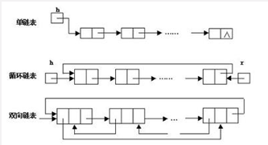
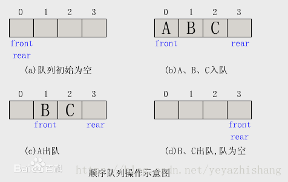
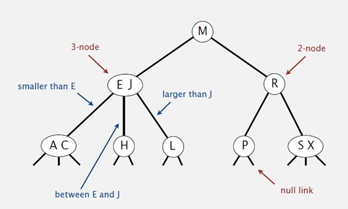

- [基础](#基础)
    - [数据结构](#数据结构)
        - [数组](#数组)
        - [链表](#链表)
        - [栈](#栈)
        - [队列](#队列)
        - [树](#树)
        - [堆](#堆)
        - [图](#图)
        - [散列表](#散列表)
    - [算法](#算法)
        - [查找算法](#查找算法)
            - [顺序查找](#顺序查找)
            - [二分查找](#二分查找)
            - [插值查找](#插值查找)
            - [斐波那契查找](#斐波那契查找)
            - [数表查询](#数表查询)
                - [二叉树查找算法](#二叉树查找算法)
                - [平衡查找树之2-3查找树](#平衡查找树之2-3查找树)
                - [平衡查找树之红黑树](#平衡查找树之红黑树)
                - [B树](#B树)
                - [B+树](#B+Tree)
            - [分块查找](#分块查找)        
            - [哈希查找](#哈希查找)
        - [排序算法](#排序算法)
            - [插入排序](#插入排序：直接插入排序)
            - [二分插入排序](#插入排序的改进：二分插入排序)
            - [希尔排序](#插入排序的更高效改进：希尔排序)
            - [选择排序](#选择排序)
            - [堆排序](#堆排序)
            - [冒泡排序](#冒泡排序)
            - [双向冒泡排序](#冒泡排序的改进：鸡尾酒排序/双向冒泡排序)
            - [快速排序](#快速排序)
            - [归并排序](#归并排序)
            - [计数排序](#计数排序)
            - [基数排序](#基数排序)
            - [桶排序](#桶排序)
            - [排序算法比较](#排序算法比较)
        - [位图（Bitmap）算法](#位图（Bitmap）算法)
        - [分治、动态规划、贪心算法](#分治、动态规划、贪心算法)
- [面试](#面试)
    - [B树和B+树的区别](#B树和B+树的区别)
    - [常用的排序算法](#常用的排序算法)
    - [Bitmap应用](#Bitmap应用)
        - [如何判断一个数是否在40亿个整数中（查找）](#如何判断一个数是否在40亿个整数中（查找）)
        - [M（如10亿）个int整数，只有其中N个数重复出现过，读取到内存中并将重复的整数删除（去重）](#M（如10亿）个int整数，只有其中N个数重复出现过，读取到内存中并将重复的整数删除（去重）)
        - [对10亿个不重复的整数进行排序（排序）](#对10亿个不重复的整数进行排序（排序）)
        - [如何只用2GB内存从20亿，40亿，80亿个整数中找到出现次数最多的数](#如何只用2GB内存从20亿，40亿，80亿个整数中找到出现次数最多的数)
    - [位运算](#位运算)

---
# 基础
时间复杂度：算法的执行时间与原操作执行次数之和成正比。时间复杂度由小到大：O(1)、O(logn)、O(n)、O(nlogn)、O(n^2)、O(n^3)。幂次时间复杂度由小到大O(2^n)、O(n!)、O(n^n)。<br>
空间复杂度：若输入数据所占空间只取决于问题本身，和算法无关，则只需要分析除输入和程序之外的辅助变量所占额外空间。
## 数据结构
[参考](https://blog.csdn.net/yeyazhishang/article/details/82353846)<br>
数据结构是指相互之间存在着一种或多种关系的数据元素的集合和该集合中数据元素之间的关系组成。
### 数组
数组是可以在内存中连续存储多个元素的结构，在内存中的分配也是连续的，数组中的元素通过数组下标进行访问，数组下标从0开始。

优点：
* 按照索引查询元素速度快。
* 按照索引遍历数组方便。

缺点：
* 数组的大小固定后就无法扩容了。
* 数组只能存储一种类型的数据。
* 添加，删除的操作慢，因为要移动其他的元素。

适用场景：频繁查询，对存储空间要求不大，很少增加和删除的情况。

### 链表
链表是物理存储单元上非连续的、非顺序的存储结构，数据元素的逻辑顺序是通过链表的指针地址实现，每个元素包含两个结点，一个是存储元素的数据域 (内存空间)，另一个是指向下一个结点地址的指针域。根据指针的指向，链表能形成不同的结构，例如单链表，双向链表，循环链表等。



优点：
* 链表是很常用的一种数据结构，不需要初始化容量，可以任意加减元素。
* 添加或者删除元素时只需要改变前后两个元素结点的指针域指向地址即可，所以添加，删除很快。

缺点：
* 因为含有大量的指针域，占用空间较大。
* 查找元素需要遍历链表来查找，非常耗时。

适用场景：数据量较小，需要频繁增加，删除操作的场景。

### 栈
栈是一种特殊的线性表，仅能在线性表的一端操作，栈顶允许操作，栈底不允许操作。栈的特点是：先进后出，或者说是后进先出，从栈顶放入元素的操作叫入栈，取出元素叫出栈。


适用场景：常应用于实现递归功能方面的场景，例如斐波那契数列、进制转换、括号匹配的检验。

### 队列
队列与栈一样，也是一种线性表，不同的是，队列可以在一端添加元素，在另一端取出元素，也就是：先进先出。从一端放入元素的操作称为入队，取出元素为出队。



使用场景：因为队列先进先出的特点，在多线程阻塞队列管理中非常适用。

### 树
树是一种数据结构，它是由n（n>=1）个有限节点组成一个具有层次关系的集合。它具有以下的特点：
* 每个节点有零个或多个子节点。
* 没有父节点的节点称为根节点。
* 每一个非根节点有且只有一个父节点。
* 除了根节点外，每个子节点可以分为多个不相交的子树。

树有很多扩展的数据结构，包括二叉树、平衡二叉树、红黑树、B树、B+树等，在实际应用中广泛用到。例如mysql的数据库索引结构用的就是B+树，还有HashMap的底层源码中用到了红黑树。

二叉树是树的特殊一种，具有如下特点：
* 每个结点最多有两颗子树，结点的度最大为2。
* 左子树和右子树是有顺序的，次序不能颠倒。
* 即使某结点只有一个子树，也要区分左右子树。


二叉树是一种比较有用的折中方案，它添加，删除元素都很快，并且在查找方面也有很多的算法优化，所以，二叉树既有链表的好处，也有数组的好处，是两者的优化方案，在处理大批量的动态数据方面非常有用。

### 堆
堆是一种比较特殊的数据结构，可以被看做一棵树的数组对象，具有以下的性质：
* 堆中某个节点的值总是不大于或不小于其父节点的值。
* 堆总是一棵完全二叉树。

将根节点最大的堆叫做大顶堆，根节点最小的堆叫做小顶堆。常见的堆有二叉堆、斐波那契堆等。


因为堆有序的特点，一般用来做数组中的排序，称为堆排序。

### 图
[参考](https://baijiahao.baidu.com/s?id=1629054934725051961&wfr=spider&for=pc)<br>
图是由结点的有穷集合V和边的集合E组成。其中，为了与树形结构加以区别，在图结构中常常将结点称为顶点，边是顶点的有序偶对，若两个顶点之间存在一条边，就表示这两个顶点具有相邻关系。

按照顶点指向的方向可分为无向图和有向图：

 


图是一种比较复杂的数据结构，在存储数据上有着比较复杂和高效的算法，分别有邻接矩阵、邻接表（类似哈希表链式存储）、逆邻接表、十字链表、邻接多重表、边集数组等存储结构。

### 散列表
散列表，也叫哈希表，是根据关键码和值 (key和value) 直接进行访问的数据结构，通过key和value来映射到集合中的一个位置，这样就可以很快找到集合中的对应元素。<br>
记录的存储位置=f(key)。这里的对应关系f称为散列函数，又称为哈希 (hash）函数，而散列表就是把Key通过一个固定的算法函数即所谓的哈希函数转换成一个整型数字，然后就将该数字对数组长度进行取余，取余结果就当作数组的下标，将value存储在以该数字为下标的数组空间里，这种存储空间可以充分利用数组的查找优势来查找元素，所以查找的速度很快。<br>
采用散列技术将记录存储在一块连续的存储空间中，这块连续存储空间称为散列表或哈希表（Hash table）。

当两个关键字key1!=key2，但是却有f(key1)=f(key2)，这种现象称为冲突。

处理散列冲突的方法
* 开放定址法（线性探测法）：开放定址法就是一旦发生了冲突，就去寻找下一个空的散列地址，只要散列表足够大，空的散列地址总能找到，并将记录存入。
* 链地址法：将所有关键字为同义词的记录存储在一个单链表中，称这种表为同义词子表，在散列表中只存储所有同义词子表前面的指针。链地址法对于可能会造成很多冲突的散列函数来说，提供了绝不会出现找不到地址的保证。当然，这也就带来了查找时需要遍历单链表的性能损耗。


Hash Table的查询速度非常的快，几乎是O(1)的时间复杂度。

Hash表在海量数据处理中有着广泛应用。<br>
题目：海量日志数据，提取出某日访问百度次数最多的那个IP。
方案：IP的数目还是有限的，最多2^32个，所以可以考虑使用hash将ip直接存入内存，然后进行统计。

## 算法
[参考](https://www.cnblogs.com/maybe2030/p/4715035.html)
### 查找算法
查找定义：根据给定的某个值，在查找表中确定一个其关键字等于给定值的数据元素（或记录）。

查找算法分类：
* 静态查找和动态查找：静态或者动态都是针对查找表而言的。动态表指查找表中有删除和插入操作的表。
* 无序查找和有序查找。无序查找：被查找数列有序无序均可。有序查找：被查找数列必须为有序数列。

平均查找长度（Average Search Length，ASL）：需和指定key进行比较的关键字的个数的期望值，称为查找算法在查找成功时的平均查找长度。对于含有n个数据元素的查找表，查找成功的平均查找长度为：ASL = Pi*Ci的和。Pi：查找表中第i个数据元素的概率。Ci：找到第i个数据元素时已经比较过的次数。

#### 顺序查找
顺序查找适合于存储结构为顺序存储或链接存储的线性表。

基本思想：顺序查找也称为线形查找，属于无序查找算法。从数据结构线形表的一端开始，顺序扫描，依次将扫描到的结点关键字与给定值k相比较，若相等则表示查找成功；若扫描结束仍没有找到关键字等于k的结点，表示查找失败。

复杂度分析：查找成功时的平均查找长度为:（假设每个数据元素的概率相等）ASL=1/n(1+2+3+…+n)=(n+1)/2；当查找不成功时，需要n+1次比较，时间复杂度为O(n)。所以，顺序查找的时间复杂度为O(n)。
```C++
//顺序查找
int SequenceSearch(int a[], int value, int n)
{
    int i;
    for(i=0; i<n; i++)
        if(a[i]==value)
            return i;
    return -1;
}
```

#### 二分查找
元素必须是有序的，如果是无序的则要先进行排序操作。

基本思想：也称为是折半查找，属于有序查找算法。用给定值k先与中间结点的关键字比较，中间结点把线形表分成两个子表，若相等则查找成功；若不相等，再根据k与该中间结点关键字的比较结果确定下一步查找哪个子表，这样递归进行，直到查找到或查找结束发现表中没有这样的结点。

复杂度分析：最坏情况下，关键词比较次数为log2(n+1)，且期望时间复杂度为O(log2n)；

使用场景：折半查找的前提条件是需要有序表顺序存储，对于静态查找表，一次排序后不再变化，折半查找能得到不错的效率。但对于需要频繁执行插入或删除操作的数据集来说，维护有序的排序会带来不小的工作量，那就不建议使用。
```C++
//二分查找，循环版本
int BinarySearch1(int a[], int value, int n)
{
    int low, high, mid;
    low = 0;
    high = n-1;
    while(low<=high)
    {
        mid = (low+high)/2;
        if(a[mid]==value)
            return mid;
        if(a[mid]>value)
            high = mid-1;
        if(a[mid]<value)
            low = mid+1;
    }
    return -1;
}

//二分查找，递归版本
int BinarySearch2(int a[], int value, int low, int high)
{
    int mid = low+(high-low)/2;
    if(a[mid]==value)
        return mid;
    if(a[mid]>value)
        return BinarySearch2(a, value, low, mid-1);
    if(a[mid]<value)
        return BinarySearch2(a, value, mid+1, high);
}
```

#### 插值查找
基本思想：基于二分查找算法，将查找点的选择改进为自适应选择，可以提高查找效率。当然，差值查找也属于有序查找。

复杂度分析：查找成功或者失败的时间复杂度均为O(log2(log2n))。

使用场景:对于表长较大，而关键字分布又比较均匀的查找表来说，插值查找算法的平均性能比折半查找要好的多。反之，数组中如果分布非常不均匀，那么插值查找未必是很合适的选择。
```C++
//插值查找
int InsertionSearch(int a[], int value, int low, int high)
{
    int mid = low+(value-a[low])/(a[high]-a[low])*(high-low);
    if(a[mid]==value)
        return mid;
    if(a[mid]>value)
        return InsertionSearch(a, value, low, mid-1);
    if(a[mid]<value)
        return InsertionSearch(a, value, mid+1, high);
}
```

#### 斐波那契查找
基本思想：也是二分查找的一种提升算法，通过运用黄金比例的概念在数列中选择查找点进行查找，提高查找效率。同样地，斐波那契查找也属于一种有序查找算法。

复杂度分析：最坏情况下，时间复杂度为O(log2n)，且其期望复杂度也为O(log2n)。
　　
#### 数表查询
##### 二叉树查找算法
基本思想：二叉查找树是先对待查找的数据进行生成树，确保树的左分支的值小于右分支的值，然后在就行和每个节点的父节点比较大小，查找最适合的范围。 这个算法的查找效率很高，但是如果使用这种查找方法要首先创建树。 

二叉查找树（BinarySearch Tree，也叫二叉搜索树，或称二叉排序树Binary Sort Tree）或者是一棵空树，或者是具有下列性质的二叉树：
* 若任意节点的左子树不空，则左子树上所有结点的值均小于它的根结点的值。
* 若任意节点的右子树不空，则右子树上所有结点的值均大于它的根结点的值。
* 任意节点的左、右子树也分别为二叉查找树。

二叉查找树性质：对二叉查找树进行中序遍历，即可得到有序的数列。

复杂度分析：它和二分查找一样，插入和查找的时间复杂度均为O(logn)，但是在最坏的情况下仍然会有O(n)的时间复杂度。原因在于插入和删除元素的时候，树没有保持平衡。在最坏的情况下仍然要有较好的时间复杂度，这就是平衡查找树设计的初衷。

##### 平衡查找树之2-3查找树
定义：和二叉树不一样，2-3树运行每个节点保存一个或者两个的值。对于普通的2节点(2-node)，它保存1个key和左右两个子节点。对应3节点(3-node)，保存两个Key，2-3查找树的定义如下：
1. 要么为空，要么：
2. 对于2节点，该节点保存一个key及对应value，以及两个指向左右节点的节点，左节点也是一个2-3节点，所有的值都比key要小，右节点也是一个2-3节点，所有的值比key要大。
3. 对于3节点，该节点保存两个key及对应value，以及三个指向左中右的节点。左节点也是一个2-3节点，所有的值均比两个key中的最小的key还要小；中间节点也是一个2-3节点，中间节点的key值在两个跟节点key值之间；右节点也是一个2-3节点，节点的所有key值比两个key中的最大的key还要大。



性质：
* 如果中序遍历2-3查找树，就可以得到排好序的序列。
* 在一个完全平衡的2-3查找树中，根节点到每一个为空节点的距离都相同。（这也是平衡树中“平衡”一词的概念，根节点到叶节点的最长距离对应于查找算法的最坏情况，而平衡树中根节点到叶节点的距离都一样，最坏情况也具有对数复杂度。）

复杂度分析：2-3树的查找效率与树的高度是息息相关的。
* 在最坏的情况下，也就是所有的节点都是2-node节点，查找效率为lgN。
* 在最好的情况下，所有的节点都是3-node节点，查找效率为log3N约等于0.631lgN。

距离来说，对于1百万个节点的2-3树，树的高度为12-20之间，对于10亿个节点的2-3树，树的高度为18-30之间。<br>
对于插入来说，只需要常数次操作即可完成，因为只需要修改与该节点关联的节点即可，不需要检查其他节点，所以效率和查找类似。

##### 平衡查找树之红黑树
2-3查找树能保证在插入元素之后能保持树的平衡状态，最坏情况下即所有的子节点都是2-node，树的高度为lgn，从而保证了最坏情况下的时间复杂度。但是2-3树实现起来比较复杂，于是就有了一种简单实现2-3树的数据结构，即红黑树（Red-Black Tree）。

基本思想：红黑树的思想就是对2-3查找树进行编码，尤其是对2-3查找树中的3-nodes节点添加额外的信息。红黑树中将节点之间的链接分为两种不同类型，红色链接，他用来链接两个2-nodes节点来表示一个3-nodes节点。黑色链接用来链接普通的2-3节点。特别的，使用红色链接的两个2-nodes来表示一个3-nodes节点，并且向左倾斜，即一个2-node是另一个2-node的左子节点。这种做法的好处是查找的时候不用做任何修改，和普通的二叉查找树相同。

定义：红黑树是一种具有红色和黑色链接的平衡查找树，同时满足：
* 红色节点向左倾斜。
* 一个节点不可能有两个红色链接。
* 整个树完全黑色平衡，即从根节点到所以叶子结点的路径上，黑色链接的个数都相同。

性质：整个树完全黑色平衡，即从根节点到所有叶子结点的路径上，黑色链接的个数都相同（2-3树的第2性质，从根节点到叶子节点的距离都相等）。

复杂度分析：最坏的情况就是，红黑树中除了最左侧路径全部是由3-node节点组成，即红黑相间的路径长度是全黑路径长度的2倍。

红黑树的平均高度大约为logn。

应用：
* Java中的java.util.TreeMap，java.util.TreeSet。
* C++ STL中的：map，multimap，multiset。
* .NET中的：SortedDictionary，SortedSet等。

##### B树
B树（B-tree）是一种树状数据结构，它能够存储数据、对其进行排序并允许以O(logn)的时间复杂度进行查找、顺序读取、插入和删除的数据结构。B树，概括来说是一个节点可以拥有多于2个子节点的二叉查找树。与自平衡二叉查找树不同，B树为系统最优化大块数据的读和写操作。B-tree算法减少定位记录时所经历的中间过程，从而加快存取速度。**普遍运用在数据库和文件系统**。

定义：B树可以看作是对2-3查找树的一种扩展，允许每个节点有M-1个子节点。
* 根节点至少有两个子节点。
* 每个节点有M-1个key，并且以升序排列。
* 位于M-1和M key的子节点的值位于M-1 和M key对应的Value之间。
* 其它节点至少有M/2个子节点。

优点：由于B树的每一个节点都包含key和value，因此经常访问的元素可能离根节点更近，因此访问也更迅速。

##### B+Tree
B+树是对B树的一种变形树，它与B树的差异在于：
* 有k个子结点的结点必然有k个关键码。
* 非叶结点仅具有索引作用，跟记录有关的信息均存放在叶结点中。
* 树的所有叶结点构成一个有序链表，可以按照关键码排序的次序遍历全部记录。

B和B+树的区别在于，B+树的非叶子结点只包含导航信息，不包含实际的值，所有的叶子结点和相连的节点使用链表相连，便于区间查找和遍历。

优点：
* 由于B+树在内部节点上不含数据信息，因此在内存页中能够存放更多的key。 数据存放的更加紧密，具有更好的空间局部性。因此访问叶子节点上关联的数据也具有更好的缓存命中率。
* B+树的叶子结点都是相连的，因此对整棵树的遍历只需要一次线性遍历叶子结点即可。而且由于数据顺序排列并且相连，所以便于区间查找和搜索。而B树则需要进行每一层的递归遍历。相邻的元素可能在内存中不相邻，所以缓存命中性没有B+树好。

但是B树也有优点，其优点在于，由于B树的每一个节点都包含key和value，如果经常访问的元素离根节点更近，访问能更迅速。

B/B+树常用于文件系统和数据库系统中，它通过对每个节点存储个数的扩展，使得对连续的数据能够进行较快的定位和访问，能够有效减少查找时间，提高存储的空间局部性从而减少IO操作。它广泛用于文件系统及数据库中，如：
* Windows：HPFS文件系统。
* Mac：HFS，HFS+文件系统。
* Linux：ResiserFS，XFS，Ext3FS，JFS文件系统。
* 数据库：ORACLE，MYSQL，SQLSERVER等中。

树表查找总结：<br>
二叉查找树平均查找性能不错，为O(logn)，但是最坏情况会退化为O(n)。在二叉查找树的基础上进行优化，可以使用平衡查找树。平衡查找树中的2-3查找树，这种数据结构在插入之后能够进行自平衡操作，从而保证了树的高度在一定的范围内进而能够保证最坏情况下的时间复杂度。但是2-3查找树实现起来比较困难，红黑树是2-3树的一种简单高效的实现，它巧妙地使用颜色标记来替代2-3树中比较难处理的3-node节点问题。红黑树是一种比较高效的平衡查找树，应用非常广泛，很多编程语言的内部实现都或多或少的采用了红黑树。除此之外，2-3查找树的另一个扩展——B/B+平衡树，在文件系统和数据库系统中有着广泛的应用。

#### 分块查找
分块查找又称索引顺序查找，它是顺序查找的一种改进方法。

算法思想：将n个数据元素"按块有序"划分为m块（m ≤ n）。每一块中的结点不必有序，但块与块之间必须"按块有序"。即第1块中任一元素的关键字都必须小于第2块中任一元素的关键字。而第2块中任一元素又都必须小于第3块中的任一元素，……。

算法流程：
1. 先选取各块中的最大关键字构成一个索引表。
2. 查找分两个部分：先对索引表进行二分查找或顺序查找，以确定待查记录在哪一块中。然后，在已确定的块中用顺序法进行查找。

#### 哈希查找
[哈希表](#散列表)

算法思想：哈希的思路很简单，如果所有的键都是整数，那么就可以使用一个简单的无序数组来实现：将键作为索引，值即为其对应的值，这样就可以快速访问任意键的值。

算法流程：
1. 用给定的哈希函数构造哈希表。
2. 根据选择的冲突处理方法解决地址冲突。常见的解决冲突的方法：拉链法和线性探测法。
3. 在哈希表的基础上执行哈希查找。

哈希表是一个在时间和空间上做出权衡的经典例子。如果没有内存限制，那么可以直接将键作为数组的索引。那么所有的查找时间复杂度为O(1)；如果没有时间限制，那么我们可以使用无序数组并进行顺序查找，这样只需要很少的内存。哈希表使用了适度的时间和空间来在这两个极端之间找到了平衡。只需要调整哈希函数算法即可在时间和空间上做出取舍。

复杂度分析：单纯论查找复杂度：对于无冲突的Hash表而言，查找复杂度为O(1)（注意，在查找之前需要构建相应的Hash表）。

比较B+Tree/Hash_Map/STL Map三种数据结构。**对于内存中数据，查找性能较好的数据结构是Hash_Map，对于磁盘中数据，查找性能较好的数据结构是B+Tree**。Hash操作能根据散列值直接定位数据的存储地址，设计良好的hash表能在常数级时间下找到需要的数据，但是更适合于内存中的查找。B+树是一种是一种树状的数据结构，适合做索引，对磁盘数据来说，索引查找是比较高效的。STL_Map的内部实现是一颗红黑树，但是只是一棵在内存中建立二叉树的树，不能用于磁盘操作，而其内存查找性能也比不上Hash查找。

### 排序算法
排序有内部排序和外部排序。
* 内部排序：被排序的数据元素全部存放在计算机内存中的排序算法。
* 外部排序：指的是大文件的排序，即待排序的记录存储在外存储器上，待排序的文件无法一次装入内存，需要在内存和外部存储器之间进行多次数据交换，以达到排序整个文件的目的。

衡量排序算法性能的两个常用指标是算法的时间复杂度和空间复杂度。<br>
常用算法执行中的关键字比较次数和数据元素的移动次数来衡量排序算法的时间复杂度。排序算法的时间复杂度可以按照最好情况、最坏情况和平均情况分别进行计算。<br>
排序算法的空间复杂度是指算法执行过程中需要的额外的存储单元。

稳定性：对于待排序序列中的任意两个数据元素d1和d2，它们的关键字相等，排序之前，d1排在d2的前面，排序之后，如果d1仍然在d2的前面，则称排序算法是稳定的，否则称排序算法是不稳定的。选堆快希不稳。


#### 插入排序：直接插入排序
算法的步骤如下：
1. 从第一个元素开始，该元素可以认为已经被排序。
2. 取出下一个元素，在已经排序的元素序列中从后向前扫描。
3. 如果该元素（已排序）大于新元素，将该元素移到下一位置。
4. 重复步骤3，直到找到已排序的元素小于或者等于新元素的位置。
5. 将新元素插入到该位置后。
6. 重复步骤2~5。
```C++
//C++
void InsertSort(int a[], int n){
    int i, j, tmp;
    for(i = 1; i<n; i++){
        tmp = a[i];
        j = i - 1;
        while( j>=0 && a[j] > tmp){
            a[j+1] = a[j];
            j--;
        }
        a[j+1] = tmp;
    }
}
```
```python
#Python
def InsertSort(data):
    for i in range(1, len(data)):
        temp = data[i]
        j = i-1
        while j>=0 and data[j]>temp:
            data[j+1]=data[j]
            j-=1
        data[j+1] = temp
```
总结：
直接插入排序关键字比较次数和数据元素移动次数与数据元素的初始状态有关。<br>
最好情况为输入序列是已经排好序的，每一趟插入，只需要比较一次就可以确定待插入的数据元素的位置，需要移动2次数据元素。因此总的关键字比较次数为n-1，总的数据元素移动次数为2(n-1)。<br>
最坏情况为输入序列是反序的，每一趟中，待插入的数据元素需要与前面已排序序列中的每一个数据元素进行比较，移动次数等于比较次数。因此，总的比较次数和移动次数都是n(n-1)/2。
* 分类：内部比较排序。
* 最差时间复杂度：时间复杂度为n(n-1)/2, 即O(n^2)。
* 最优时间复杂度：时间复杂度为(n-1), 即O(n)。
* 平均时间复杂度：O(n^2)。
* 空间复杂度：O(1)。
* 稳定性：稳定。

插入排序不适合对于数据量比较大的排序应用。但是，如果需要排序的数据量很小，比如量级小于千，那么插入排序还是一个不错的选择。

#### 插入排序的改进：二分插入排序
算法的步骤如下：
1. 从第一个元素开始，该元素可以认为已经被排序。
2. 取出下一个元素，在已经排序的元素序列中二分查找到第一个比它大的数的位置。
3. 将新元素插入到该位置后。
4. 重复上述两步。
```C++
//C++
void BinInsertSort(int a[], int n){
    int i, j, tmp, mid, low, high;
    for(i = 1; i<n; i++){
        tmp = a[i];
        low = 0;
        high = i - 1;
        while (low <= high){
           mid = (low + high) / 2;
           if (a[mid] > tmp)
               high = mid - 1;
           else
               low = mid + 1;
        }
        for(j = i - 1; j >= low; j--)
            a[j + 1] = a[j];
        a[low] = tmp;
    }
}
```
```python
#Python
def BinInserSort(data): 
    for i in range(1, len(data)):
        temp = data[i]
        low = 0
        high = i-1
        while low <= high:
            mid = (low+high)//2
            if data[mid] > temp:
                high = mid-1
            else:
                low = mid+1
        for j in range(i-1, low-1, -1):
            data[j+1] = data[j]
        data[low] = temp
```
总结：二分插入排序的关键字比较次数与数据元素的初始状态无关。二分插入排序总的关键字比较次数约为nlogn。二分插入排序数据元素的移动次数与数据序列的初始状态有关，最好情况下需要移动2(n-1)次，最坏情况下需要移动n(n-1)/2次。
* 分类：内部比较排序。
* 最差时间复杂度：O(n^2)。
* 最优时间复杂度：O(nlogn)。
* 平均时间复杂度：O(n^2)。
* 空间复杂度：O(1)。
* 稳定性：稳定。

当n较大时，二分插入排序的比较次数比直接插入排序的最差情况好得多，但比直接插入排序的最好情况要差，所当以元素初始序列已经接近升序时，直接插入排序比二分插入排序比较次数少。二分插入排序元素移动次数与直接插入排序相同，依赖于元素初始序列。

#### 插入排序的更高效改进：希尔排序
算法的步骤如下：
1. 先取一个小于n的整数d1作为第一个增量，把文件的全部记录分成d1个组。
2. 所有距离为d1的倍数的记录放在同一个组中，在各组内进行直接插入排序。
3. 取第二个增量d2< d1重复上述的分组和排序。
4. 直至所取的增量dt=1(dt< dt-l< … < d2 < d1)，即所有记录放在同一组中进行直接插入排序为止。
```C++
//C++
void ShellSort(int a[], int n){
    int i, j, temp;
    int h = 0;
    while (h<=n)  
    {  
        h = h * 3 + 1;  
    }   
    while (h > 0)   
    {  
        for ( i = h; i < n; i++ )  
        {  
            j = i - h;  
            temp = a[i];               
            while (( j >= 0 ) && ( a[j] > temp ))  
            {  
                a[j + h] = a[j];  
                j = j - h;  
            }  
            a[j + h] = temp;  
        }  
        h = ( h - 1 ) / 3;  
    }     
}
```
```python
#Python
def ShellSort(data): 
    h = 0
    while h <= len(data):
        h = h*3+1
    while h > 0:
        for i in range(h, len(data)):
            temp = data[i]
            j = i-h
            while j >= 0 and data[j] > temp:
                data[j+h] = data[j]
                j -= h
            data[j+h] = temp
        h = (h-1) // 3
```
总结：希尔排序的时间复杂度与增量序列的选取有关，例如希尔增量时间复杂度为O(n^2)，而Hibbard增量的希尔排序的时间复杂度为O(N^(5/4))，但是现今仍然没有人能找出希尔排序的精确下界。
* 分类：内部比较排序。
* 最差时间复杂度：根据步长序列的不同而不同, 已知最好的为O(n(logn)^2)。
* 最优时间复杂度：O(n)。
* 平均时间复杂度：根据步长序列的不同而不同。
* 空间复杂度：O(1)。
* 稳定性：不稳定。

#### 选择排序
算法的步骤如下：
1. 首先在未排序序列中找到最小（大）元素，存放到排序序列的起始位置。
2. 然后，再从剩余未排序元素中继续寻找最小（大）元素，放到已排序序列的末尾。
3. 以此类推，直到所有元素均排序完毕。
```C++
//C++
void SelectSort(int a[], int n){
    int i, j, k, tmp;
    for(i = 0; i < n - 1; i++){
        k = i;
        for (j = i + 1; j <n; j++)
            if(a[j] < a[k])
                k = j;
        if(k != i){
            tmp = a[i];
            a[i] = a[k];
            a[k] = tmp;
        }
    }
}
```
```python
#Python
def SelectSort(data): #选择排序
    for i in range(len(data)-1):
        k = i
        for j in range(i+1, len(data)):
            if data[j] < data[k]:
                k = j
        if k != i:
            data[k],data[i] = data[i],data[k]
```
总结：选择排序的关键字比较次数与序列的初始状态无关。总的比较次数为n(n-1)/2。选择排序总的移动次数与序列的初始状态有关。当序列已经排好序时，元素的移动次数为0。当每一趟都需要移动数据元素时，总的移动次数为n-1。
* 分类：内部比较排序。
* 最差时间复杂度：O(n^2)。
* 最优时间复杂度：O(n^2)。
* 平均时间复杂度：O(n^2)。
* 空间复杂度：O(1)。
* 稳定性：不稳定。

#### 堆排序
基本概念：一般都指的是[二叉堆](#堆)，它满足二个特性：
* 父结点的键值总是大于或等于（小于或等于）任何一个子节点的键值。
* 每个结点的左子树和右子树都是一个二叉堆（都是最大堆或最小堆）。

什么是堆调整(Heap Adjust)？<br>
这是为了保持堆的特性而做的一个操作。对某一个节点为根的子树做堆调整，其实就是将该根节点进行“下沉”操作(具体是通过和子节点交换完成的)，一直下沉到合适的位置，使得刚才的子树满足堆的性质。

例如对最大堆做堆调整：
1. 在对应的数组元素A[i]，左孩子A[LEFT(i)],，和右孩子A[RIGHT(i)]中找到最大的那一个，将其下标存储在largest中。
2. 如果A[i]已经就是最大的元素，则程序直接结束。
3. 否则，i的某个子结点为最大的元素，将A[largest]与A[i]交换。
4. 再从交换的子节点开始，重复1,2,3步，直至叶子节点，算完成一次堆调整。
一般做一次堆调整的时间复杂度为log(n)。

如何建堆：建堆是一个通过不断的堆调整，使得整个二叉树中的数满足堆性质的操作。在数组中的话，一般从下标为n/2的数开始做堆调整，一直到下标为0的数(因为下标大于n/2的数都是叶子节点，其子树已经满足堆的性质了)。

如何进行堆排序：堆排序是在对数组建堆的操作之后完成的。数组储存成堆的形式之后，第一次将A[0]与A[n-1]交换，再对A[0…n-2]重新恢复堆。第二次将A[0]与A[n-2]交换，再对A[0…n-3]重新恢复堆，重复这样的操作直到A[0]与A[1]交换。由于每次都是将最小的数据并入到后面的有序区间，故操作完成后整个数组就有序了。
```C++
//C++
void CreateHeap (int a[], int n){
    int i, j, k, tmp;
    for (k = 1; k < n; k++){
        i = k;
        tmp = a[k];
        while (i != 0)
        {
            j = (i - 1) / 2;
            if (tmp <= a[j])
                break;
            a[i] = a[j];
            i = j;
        }
        a[i] = tmp;
    }
}

void SiftDown(int a[], int n, int i){
    int tmp = a[i];
    int j = 2 * i + 1;
    while (j <= n - 1){
        if (j < n - 1 && a[j] < a[j + 1])
            j++;
        if (tmp > a[j])
            break;
        a[i] = a[j];
        i = j;
        j = 2 * i + 1;
    }
    a[i] = tmp;
}

void HeapSort(int a[], int n){
    CreateHeap(a, n);
    while (n > 0)
    {
        int tmp;
        tmp = a[0];
        a[0] = a[n - 1];
        a[n - 1] = tmp;
        SiftDown(a, n - 1, 0);
        n--;
    }
}
```
```python
#Python
def SiftDown(data, start, end): #堆调整
    temp = data[start]
    i = start
    j = i*2+1
    while j <= end:
        if j < end and data[j] < data[j+1]:
            j += 1
        if data[j] <= temp:
            break
        data[i] = data[j]
        i = j
        j = 2*i+1
    data[i] = temp

def HeapSort(data): #堆排序
    for i in range(len(data)//2-1, -1, -1):
        SiftDown(data, i, len(data)-1) # 构建大顶堆
    for i in range(len(data)-1, 0, -1):
        data[0], data[i] = data[i], data[0]
        SiftDown(data, 0, i-1) # 堆排序
```
总结：一个具有n个数据元素的堆可以用一棵完全二叉树表示，当把堆顶元素和堆尾元素交换后，重新调整的比较和交换的次数只取决于完全二叉树的高度，其值为logn。堆排序的总趟数为n，每一趟都需要调整，故堆排序的时间复杂度为O(nlogn)。
* 分类：内部比较排序。
* 最差时间复杂度：O(nlogn)。
* 最优时间复杂度：O(nlogn)。
* 平均时间复杂度：O(nlogn)。
* 空间复杂度：O(1)。
* 稳定性：不稳定。

应用在海量数据Top K问题中。

#### 冒泡排序
算法的步骤如下：
1. 比较相邻的元素。如果第一个比第二个大，就交换他们两个。
2. 对每一对相邻元素作同样的工作，从开始第一对到结尾的最后一对。在这一点，最后的元素应该会是最大的数。
3. 针对所有的元素重复以上的步骤，除了最后一个。
4. 持续每次对越来越少的元素重复上面的步骤，直到没有任何一对数字需要比较。
```C++
//C++
void BubbleSort(int a[], int n)
{
    for (int i = 0; i < n - 1; i++) {
        for (int j = 0; j < n - i - 1; j++) {
            if (a[j] > a[j + 1]) {
                int tmp = a[j];
                a[j] = a[j + 1];
                a[j + 1] = tmp;
            }
        }
    }
}
```
```python
#Python
def BubbleSort(data):
    for i in range(len(data)-1):
        for j in range(len(data)-1-i):
            if data[j]>data[j+1]:
                data[j], data[j+1] = data[j+1], data[j]
```
带旗标flag：
```C++
//C++
void BubbleSortWithFlag(int a[], int n)
{
    int tmp, i, j, flag;
    flag = n-1; //flag记录一趟比较中最后一次发生交换的位置
    while (flag > 0) {
        j = flag - 1; //j用于记录要比较的最后位置
        flag = 0; //重置flag初值   
        for (i = 0; i <= j; i++)
            if (a[i] > a[i + 1]) {
                tmp = a[i];
                a[i] = a[i + 1];
                a[i + 1] = tmp;
                flag = i;
            }
    }
}
```
```python
#Python
def BubbleSortWithFlag(data):
    flag = len(data)-1
    while flag > 0:
        j = flag
        flag = 0
        for i in range(j):
            if data[i] > data[i+1]:
                data[i], data[i+1] = data[i+1], data[i]
                flag = i

    return data
```
总结：冒泡排序的关键字比较次数与数据元素的初始状态无关。因此冒泡排序总的比较次数为n(n-1)/2。冒泡排序的数据元素移动次数与序列的初始状态有关。在最好的情况下，移动次数为0次；在最坏的情况下，移动次数为n(n-1)/2次。
* 分类：内部比较排序。
* 最差时间复杂度：O(n^2)。
* 最优时间复杂度：如果能在内部循环第一次运行时，使用一个旗标来表示有无需要交换的可能，可以把最优时间复杂度降低到O(n)。
* 平均时间复杂度：O(n^2)。
* 空间复杂度：O(1)。
* 稳定性：稳定。

#### 冒泡排序的改进：鸡尾酒排序/双向冒泡排序
算法的步骤如下：
1. 依次比较相邻的两个数，将小数放在前面，大数放在后面。
2. 第一趟可得到：将最大数放到最后一位。
3. 第二趟可得到：将最小数放到第一位。
4. 如此下去，重复以上过程，直至最终完成排序。
```C++
//C++
void BubbleSortWithDoubleSide(int a[], int n)  
{ 
    int left = 0; //初始化边界
    int right=n-1;  
    while (left < right)  
    {  
        for (int i=left; i<right; i++) //前半轮，将最大元素放到后面 
            if (a[i] > a[i + 1])  
            {  
                int temp=a[i];  
                a[i]=a[i + 1];  
                a[i + 1]=temp;  
            }  
        right --;                     
        for (int i = right; i > left; i--) //后半轮，将最小元素放到前面 
            if (a[i - 1] > a[i])  
            {  
                int temp=a[i];  
                a[i]=a[i - 1];  
                a[i - 1]=temp;  
            }      
        left++;                
    }  
} 
```
```python
#Python
def BubbleSortWithDoubleSide(data): 
    left = 0
    right = len(data)-1
    while left < right:
        for i in range(left,right):
            if data[i] > data[i+1]:
                data[i], data[i+1] = data[i+1], data[i]
        right -= 1
        for i in range(right, left, -1):
            if data[i-1] > data[i]:
                data[i-1], data[i] = data[i], data[i-1]
        left += 1
```
总结：鸡尾酒排序最糟或是平均所花费的次数都是O(n^2)，但如果序列在一开始已经大部分排序过的话，会接近O(n)。
* 分类：内部比较排序。
* 最差时间复杂度：O(n^2)。
* 最优时间复杂度：如果序列在一开始已经大部分排序过的话，会接近O(n)。
* 平均时间复杂度：O(n^2)。
* 空间复杂度：O(1)。
* 稳定性：稳定。

#### 快速排序
快速排序使用分治策略(Divide and Conquer)来把一个序列分为两个子序列。步骤为：
1. 从序列中挑出一个元素，作为"基准"(pivot)。
2. 把所有比基准值小的元素放在基准前面，所有比基准值大的元素放在基准的后面（相同的数可以到任一边），这个称为分区(partition)操作。
3. 对每个分区递归地进行步骤1~3，递归的结束条件是序列的大小是0或1，这时整体已经被排好序了。

基准选择:
* 固定基准：比如固定选择第一个位置的值为基准。缺点：如果数列原本有序（逆序），每一轮仅仅确定了基准元素的位置，没有发挥分治法的优势，需要进行N轮，时间复杂度退化为O(n^2)。
* 随机基准：取随机位置的元素，放在第一个位置。缺点：由于随机性，不能很好的适应所有情况。
* 三数取中：比较开头、中间、结尾的元素，中间大的值作为基准元素，放在第一个位置。
```C++
//C++
void QuickSort(int a[], int left, int right)  
{  
    int i,j,tmp; 
    tmp = a[left]; //基准元素保存在tmp中
    i = left;
    j = right;
    while (i != j) //i、j相遇时完成划分
    {  
        while(a[j] >= tmp && i<j)   
            j--; //从右向左找第1个小于标准值的位置j  
        if(i<j) //找到了，位置为j  
        {   
            a[i] = a[j];  
            i++;  
        } //将第j个元素置于左端并将i加1 
        while(a[i] <= tmp && i<j)  
            i++; //从左向右找第1个大于标准值的位置i  
        if(i<j) //找到了，位置为i  
        {   
            a[j] = a[i];  
            j--;  
        } //将第i个元素置于右端并将j减1  
        a[i] = tmp; //将标准值放入它的最终位置i,本次划分结束  
        QuickSort(a, left, i-1); //对标准值左半部递归调用本函数  
        QuickSort(a, i+1, right); //对标准值右半部递归调用本函数  
    }  
}
```
```python
#Python
def NumberOfThree(data, left, right):
    middle = left + (right-left)//2
    if data[left] > data[right]:
        data[left],data[right] = data[right],data[left]
    if data[left] > data[middle]:
        data[left],data[middle] = data[middle],data[left]
    if data[middle] > data[right]:
        data[middle],data[right] = data[right],data[middle]

    data[left],data[middle] = data[middle],data[left]
    return data[left]

def Partion(data, left, right):
    temp = data[left] # 固定基准
    #temp = NumberOfThree(data, left, right) # 三数取中
    i = left
    j = right
    while i < j:
        while i < j and data[j] >= temp:
            j -= 1
        if i < j:
            data[i] = data[j]
            i += 1
        while i < j and data[i] <= temp:
            i += 1
        if i < j:
            data[j] = data[i]
            j -= 1
    data[i] = temp
    return i

def QuickSort(data, left, right):
    if left < right:
        pivot = Partion(data, left, right)
        QuickSort(data, left, pivot-1)
        QuickSort(data, pivot+1, right)
```
总结：
* 分类：内部比较排序。
* 最差时间复杂度：每次选取的基准都是最大的元素（或者每次都是最小），导致每次只划分出了一个子序列，需要进行n-1次划分才能结束递归，时间复杂度为O(n^2)。
* 最优时间复杂度：每次选取的基准都能使划分均匀，只需要logn次划分就能结束递归，时间复杂度为O(nlogn)。
* 平均时间复杂度：O(nlogn)。
* 空间复杂度：O(logn)～O(n)，主要是递归造成的栈空间的使用（用来保存left和right等局部变量），取决于递归树的深度，一般为O(logn)，最差为O(n)（基本有序的情况）。
* 稳定性：不稳定。

#### 归并排序
归并排序的实现分为递归实现与非递归(迭代)实现。递归实现的归并排序是算法设计中分治策略的典型应用，将一个大问题分割成小问题分别解决，然后用所有小问题的答案来解决整个大问题。非递归(迭代)实现的归并排序首先进行是两两归并，然后四四归并，然后是八八归并，一直下去直到归并了整个数组。

算法简介：归并排序是建立在归并操作上的一种有效的排序算法。该算法是采用分治法（Divide and Conquer）的一个非常典型的应用。归并排序是一种稳定的排序方法。将已有序的子序列合并，得到完全有序的序列。即先使每个子序列有序，再使子序列段间有序。若将两个有序表合并成一个有序表，称为2-路归并。

算法描述(递归版本)：
1. Divide: 把长度为n的输入序列分成两个长度为n/2的子序列。
2. Conquer: 对这两个子序列分别采用归并排序。
3. Combine: 将两个排序好的子序列合并成一个最终的排序序列。

归并操作步骤：
1. 申请空间，使其大小为两个已经排序序列之和，该空间用来存放合并后的序列。
2. 设定两个指针，最初位置分别为两个已经排序序列的起始位置。
3. 比较两个指针所指向的元素，选择相对小的元素放入到合并空间，并移动指针到下一位置。
4. 重复步骤3直到某一指针到达序列尾。
5. 将另一序列剩下的所有元素直接复制到合并序列尾。
```C++
//C++
int L[10]; // 两个子数组定义成全局变量（辅助存储空间,大小正比于元素的个数）
int R[10];

void merge(int A[], int left, int middle, int right) // 合并两个已排好序的数组A[left...middle]和A[middle+1...right]
{
    int n1 = middle - left + 1; // 两个数组的大小
    int n2 = right - middle;
    for (int i = 0; i < n1; i++) // 把两部分分别拷贝到两个数组中
        L[i] = A[left + i];
    for (int j = 0; j < n2; j++)
        R[j] = A[middle + j + 1];
    L[n1] = INT_MAX; // 使用无穷大作为哨兵值放在子数组的末尾
    R[n2] = INT_MAX; // 这样可以免去检查某个子数组是否已读完的步骤
    int i = 0;
    int j = 0;
    for (int k = left; k <= right; k++) // 依次比较两个子数组中的值，每次取出更小的那一个放入原数组
    {
        if (L[i] <= R[j]) 
        {
            A[k] = L[i];
            i++;
        }
        else
        {
            A[k] = R[j];
            j++;
        }
    }

}

void mergesort_recursion(int A[], int left, int right) // 递归实现的归并排序(自顶向下)
{
    int middle = (left + right) / 2;
    if (left < right) // 当待排序的序列长度为1时(left == right)，递归“开始回升”
    {
        mergesort_recursion(A, left, middle);
        mergesort_recursion(A, middle + 1, right);
        merge(A, left, middle, right);
    }
}

void mergesort_iteration(int A[], int left, int right)  // 非递归(迭代)实现的归并排序(自底向上)
{
    int low, middle, high; // 子数组索引,前一个为A[low...middle],后一个子数组为A[middle+1...high]
    for (int size = 1; size <= right - left; size *= 2) // 子数组的大小初始为1,每轮翻倍
    {
        low = left;
        while (low + size - 1 <= right - 1 ) // 后一个子数组存在(需要归并)
        {
            middle = low + size - 1;    
            high = middle + size;        
            if (high > right) // 后一个子数组大小不足size
                high = right;
            merge(A, low, middle, high);
            low = high + 1; // 前一个子数组索引向后移动
        }
    }
}
```
```python
#Python
def Merge(list1, list2):
    list1_index, list2_index = 0, 0
    result = []
    while list1_index < len(list1) and list2_index < len(list2):
        if list1[list1_index] <= list2[list2_index]:
            result.append(list1[list1_index])
            list1_index+=1
        else:
            result.append(list2[list2_index])
            list2_index+=1
    result += list1[list1_index:]
    result += list2[list2_index:]
    return result

def MergeSort(data):
    if len(data) <= 1:
        return data
    mid = len(data)//2
    left = MergeSort(data[:mid])
    right = MergeSort(data[mid:])
    return Merge(left,right)
```
总结：归并排序在O(N*logN)的几种排序方法（快速排序，归并排序，希尔排序，堆排序）也是效率比较高的。
* 分类：内部比较排序。
* 最差时间复杂度：O(nlogn)。
* 最优时间复杂度：O(nlogn)。
* 平均时间复杂度：O(nlogn)。
* 空间复杂度：O(n)。
* 稳定性：稳定。

#### 计数排序
计数排序用到一个额外的计数数组C，根据数组C来将原数组A中的元素排到正确的位置。通过反向填充目标数组，填充完毕后将对应的数字统计递减，可以确保计数排序的稳定性。

算法的步骤如下：
1. 统计数组A中每个值A[i]出现的次数，存入C[A[i]]。
2. 从前向后，使数组C中的每个值等于其与前一项相加，这样数组C[A[i]]就代表了数组A中小于等于A[i]的元素个数。
3. 反向填充目标数组B：将数组元素A[i]放在数组B的第C[A[i]]项（即B[C[A[i]] - 1]），每放一个元素就将C[A[i]]递减。
```python
#Python
def CountSort(data): 
    max_value = max(data)
    min_value = min(data)
    count_list = [0] * (max_value-min_value+1)
    for i in data:
        count_list[i-min_value] += 1
    result = []
    for index, value in enumerate(count_list):
        while value > 0:
            result.append(index+min_value)
            value -= 1
    return result
```
总结：计数排序的时间复杂度和空间复杂度取决于数组A的数据范围(等于A中元素的最大值与最小值的差加上1)，因此对于数据范围很大的数组，计数排序需要大量时间和内存。它只能对整数进行排序。
* 分类：内部非比较排序。
* 最差时间复杂度：O(n+k)。
* 最优时间复杂度：O(n+k)。
* 平均时间复杂度：O(n+k)。
* 空间复杂度：O(n+k)。
* 稳定性：稳定。

#### 基数排序
基数排序是一种非比较型整数排序算法，其原理是将整数按位数切割成不同的数字，然后按每个位数分别比较。它是这样实现的：将所有待比较正整数统一为同样的数位长度，数位较短的数前面补零。然后，从最低位开始进行基数为10的计数排序，一直到最高位计数排序完后，数列就变成一个有序序列（利用了计数排序的稳定性）。

算法的步骤如下：
1. 将所有待比较数值（正整数）统一为同样的数位长度，数位较短的数前面补零。
2. 从最低位开始，依次进行一次排序。
3. 这样从最低位排序一直到最高位排序完成以后, 数列就变成一个有序序列。
```python
#Python
def RadixSort(data): 
    i = 0
    max_value = max(data)
    j = len(str(max_value))
    while i < j:
        bucket_list = [[] for index in range(10)]
        for item in data:
            bucket_list[item//(10**i)%10].append(item)
        data.clear()
        for k in bucket_list:
            for v in k:
                data.append(v)
        i+=1
```
总结：基数排序的时间复杂度是O(n*dn)，其中n是排序元素个数，dn是数字位数。这个时间复杂度不一定优于O(nlogn)，dn的大小取决于数字位的选择（比如比特位数），和待排序数据所属数据类型的全集的大小。dn决定了进行多少轮处理，而n是每轮处理的操作数目。
* 分类：内部非比较排序。
* 最差时间复杂度：O(n*dn)。
* 最优时间复杂度：
* 平均时间复杂度：O(n*dn)。
* 空间复杂度：O(n)。
* 稳定性：稳定。

如果考虑和比较排序进行对照，基数排序的形式复杂度虽然不一定更小，但由于不进行比较，因此其基本操作的代价较小，而且如果适当的选择基数，dn一般不大于logn，所以基数排序一般要快过基于比较的排序，比如快速排序。**由于整数也可以表达字符串（比如名字或日期）和特定格式的浮点数，所以基数排序并不是只能用于整数排序**。

#### 桶排序
桶排序也叫箱排序。工作的原理是将数组元素映射到有限数量个桶里，利用计数排序可以定位桶的边界，每个桶再各自进行桶内排序（使用其它排序算法或以递归方式继续使用桶排序）。

算法的步骤如下：
1. 设置一个定量的数组当作空桶子。
2. 寻访串行，并且把项目一个一个放到对应的桶子去。
3. 对每个不是空的桶子进行排序。
4. 从不是空的桶子里把项目再放回原来的串行中。
```python
#Python
def BucketSort(data): 
    min_value = min(data)
    max_value = max(data)
    bucket_range = (max_value-min_value)/len(data)
    bucket_list = [[] for i in range(len(data)+1)]
    for item in data:
        bucket_list[int((item-min_value)//bucket_range)].append(item)
    data.clear()
    for k in bucket_list:
        for v in sorted(k):
            data.append(v)
```
总结：桶排序最好情况下使用线性时间O(n)，很显然桶排序的时间复杂度，取决与对各个桶之间数据进行排序的时间复杂度，因为其它部分的时间复杂度都为O(n)。很显然，桶划分的越小，各个桶之间的数据越少，排序所用的时间也会越少。但相应的空间消耗就会增大。
* 分类：内部非比较排序。
* 最差时间复杂度：
* 最优时间复杂度：O(n)。
* 平均时间复杂度：O(n)。
* 空间复杂度：O(n)。
* 稳定性：稳定。

桶排序是稳定的，且在大多数情况下常见排序里最快的一种，比快排还要快，缺点是非常耗空间。基本上是最耗空间的一种排序算法，而且只能在某些情形下使用。桶排序不是比较排序，不受到O(nlogn)下限的影响，它是鸽巢排序的一种归纳结果，当所要排序的数组值分散均匀的时候，桶排序拥有线性的时间复杂度。<br>
可以证明，即使选用插入排序作为桶内排序的方法，桶排序的平均时间复杂度为线性。具体证明，请参考算法导论。其空间复杂度也为线性。

#### 排序算法比较


### 位图（Bitmap）算法
[参考](https://blog.csdn.net/pipisorry/article/details/62443757)<br>
所谓的Bit-map就是用一个bit位来标记某个元素对应的Value，而Key即是该元素。由于采用了Bit为单位来存储数据，因此在存储空间方面，可以大大节省。

优点：
* 运算效率高，不进行比较和移位。
* 占用内存少。比如最大的数MAX=10000000，只需占用内存为MAX/8=1250000Byte=1.25M。
* 位图做交集和并集运算的时候有很大的便利。

缺点：
* 所有的数据不能重复，即不可对重复的数据进行排序。（少量重复数据查找还是可以的，用2-bitmap）
* 当数据类似（1，1000，10万）只有3个数据的时候，用bitmap时间复杂度和空间复杂度相当大，只有当数据比较密集时才有优势。

bitmap应用
* **可进行海量数据的快速查找、去重、排序**，一般来说数据范围是int的10倍以下。
* 去重数据而达到压缩数据。
* 还可以用于爬虫系统中url去重、解决全组合问题。

2-Bitmap：每个数分配2bit，可以表示：00表示不存在，01表示出现一次，10表示多次，11无意义。

问题案例
1. 使用位图法判断整形数组是否存在重复。
2. 在2.5亿个整数中找出不重复的整数，注，内存不足以容纳这2.5亿个整数：可用2-Bitmap。
3. 如何判断一个数是否在40亿个整数中？
4. 对10亿个不重复的整数进行排序。
5. 找出10亿个数字中重复的数字。

位图在实际项目中的使用
* OAuth2，可以使用bitmap来存储权限。
* 用户每日登陆情况。

### 分治、动态规划、贪心算法
[理论](https://blog.csdn.net/yapian8/article/details/28240973)<br>
应用题：[最大子序和](https://leetcode-cn.com/problems/maximum-subarray/solution/zheng-li-yi-xia-kan-de-dong-de-da-an-by-lizhiqiang/) [官方解答](https://leetcode-cn.com/problems/maximum-subarray/solution/zui-da-zi-xu-he-by-leetcode/)

# 面试
## B树和B+树的区别
B和B+树的区别在于，B+树的非叶子结点只包含导航信息，不包含实际的值，所有的叶子结点和相连的节点使用链表相连，便于区间查找和遍历。

* 由于B+树在内部节点上不含数据信息，因此在内存页中能够存放更多的key。 数据存放的更加紧密，具有更好的空间局部性。因此访问叶子节点上关联的数据也具有更好的缓存命中率。
* B+树的叶子结点都是相连的，因此对整棵树的遍历只需要一次线性遍历叶子结点即可。而且由于数据顺序排列并且相连，所以便于区间查找和搜索。而B树则需要进行每一层的递归遍历。相邻的元素可能在内存中不相邻，所以缓存命中性没有B+树好。
* B树的优点在于，由于B树的每一个节点都包含key和value，如果经常访问的元素离根节点更近，访问会更迅速。
## 常用的排序算法
* [插入排序](#插入排序：直接插入排序)
* [选择排序](#选择排序)
* [堆排序](#堆排序)
* [冒泡排序](#冒泡排序)
* [快速排序](#快速排序)

[排序算法比较](#排序算法比较)
## Bitmap应用
### 如何判断一个数是否在40亿个整数中（查找）
一个整数表示的范围为0~2^32，2^32大概42亿多点。2^32bit等于2^29byte，等于512MB，故需要512兆的内存空间。把40亿数据放入2^32bit中，存在为1，不存在为0。待判断的数找到对应下标，相应位上为1则大数据中，为0则不在。
### M（如10亿）个int整数，只有其中N个数重复出现过，读取到内存中并将重复的整数删除（去重）
一个整数表示的范围为0~2^32，2^32大概42亿多点。2^32bit等于2^29byte，等于512MB，故需要512兆的内存空间。把10亿数据放入2^32bit中，存在为1，不存在为0。如果位上为1则表示相同值的数已经出现过，则此数为重复值。
### 对10亿个不重复的整数进行排序（排序）
* 数据库排序<br>
将文本文件导入到数据库中，让数据库进行索引排序操作后提取数据到文件。  
* 分治法（多路归并）<br>
把大数据分成多个小文件，先对每个小文件进行排序，再整体排序，从每个文件的最小元素开始比较。
* Bitmap（位图）排序<br>
最大值作为内存的总位数，数据存入相应位数，从最低位顺序读取，即为顺序的数据。
### 如何只用2GB内存从20亿，40亿，80亿个整数中找到出现次数最多的数
[参考](https://zhuanlan.zhihu.com/p/67031676)

## 位运算
[参考](https://mp.weixin.qq.com/s/C6o6T9ju34vAxNBg5zobWw)