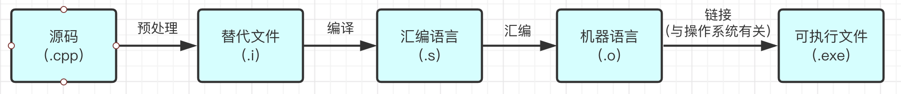
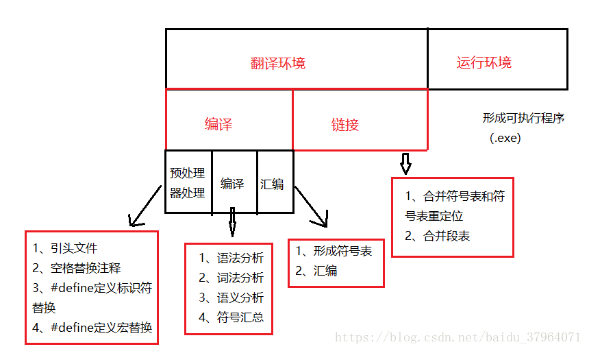

- [基础](#基础)
    - [简介](#简介)
- [面试](#面试)
    - [重载和重写的区别](#重载和重写的区别)
    - [申请/释放动态内存](#申请/释放动态内存)

---
# 基础
## 简介
c++是编译型语言。 
过程：c++源文件编译成汇编语言文件，汇编之后生成机器码文件，机器码文件链接之后生成可执行文件。其中链接操作：需要操作系统装载，给机器码文件增加信息，要遵守操作系统的约定，与操作系统有关。编译器（gcc、g++等）四个操作（预处理、编译、汇编、链接）都可以进行。

特点：c++源码是可移植的。不同的计算机有不同的机器语言，特定的汇编语言与特定的机器语言一一对应。所以，c++在不同的平台上要重新编译，生成该平台可以执行的机器语言。

源码执行顺序：先编译，编译自上而下，如果函数在定义之前被调用，则需要先进行声明，不然，会编译报错。再运行，从主函数开始运行。

# 面试
## 重载和重写的区别
* 重载 
函数具有的不同的参数列表，而函数名相同的函数。重载要求参数列表必须不同，比如参数的类型不同、参数的个数不同、参数的顺序不同。如果仅仅是函数的返回值不同是没办法重载的，因为重载要求参数列表必须不同。（发生在同一个类里）。
* 重写（覆盖） 
存在类中，子类重写从基类继承过来的函数。被重写的函数不能是static的。必须是virtual的。但是函数名、返回值、参数列表都必须和基类相同（发生在基类和子类）。
* 重定义 
也叫做隐藏，子类重新定义父类中有相同名称的非虚函数（参数列表可以不同）。（发生在基类和子类）。

在程序运行时的多态性通过继承和虚函数来体现（动态绑定）；
在程序编译时多态性体现在函数和运算符的重载上（静态绑定）；

## 申请/释放动态内存
new/delete为运算符，调用对象的构造函数/析构函数；malloc/free为库函数。