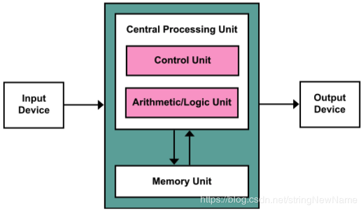
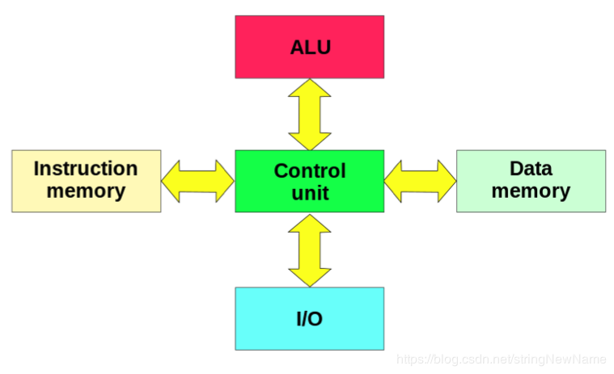
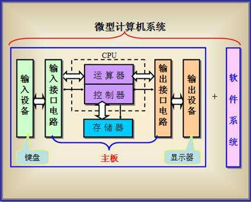
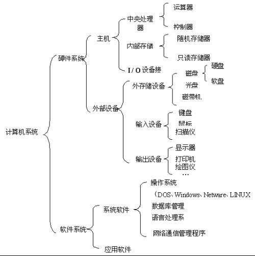
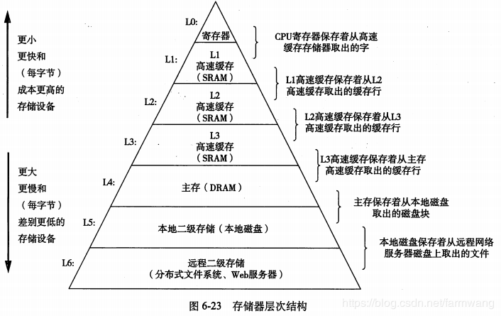
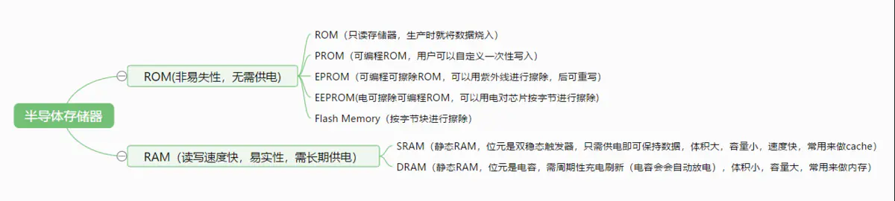
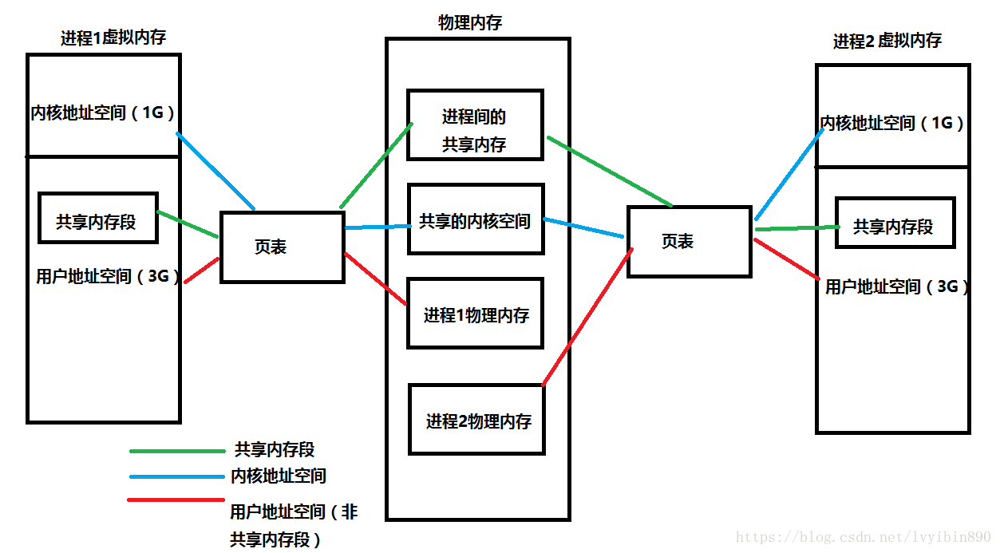
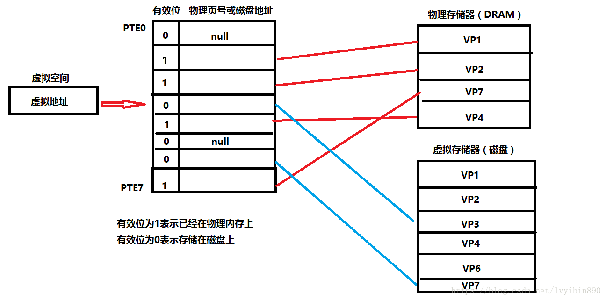

- [基础](#基础)
    - [计算机体系结构](#计算机体系结构)
        - [冯诺伊曼结构](#冯诺伊曼结构)
        - [哈佛结构](#哈佛结构)
    - [计算机存储器的层次结构](#计算机存储器的层次结构)
    - [L1缓存、L2缓存、L3缓存](#L1缓存、L2缓存、L3缓存)
    - [寄存器、缓存、内存存取速度](#寄存器、缓存、内存存取速度)
    - [RAM和ROM（内存）](#RAM和ROM（内存）)
    - [物理内存和虚拟内存](#物理内存和虚拟内存)
    - [分页和分段](#分页和分段)
    - [内存碎片](#内存碎片)
    - [内存和外存](#内存和外存)
    - [硬盘和软盘](#硬盘和软盘)
- [面试](#面试)
    - [一级缓存、二级缓存、三级缓存](#一级缓存、二级缓存、三级缓存)

---
# 基础
## 计算机体系结构
### 冯诺伊曼结构
结构
* 运算单元：包含算术逻辑单元和寄存器
* 控制单元：包含指令寄存器和程序计数器
* 存储单元：存储数据和指令
* 输入设备、输出设备

CPU（中央处理器）：主要包括两个部分，即控制器、运算器，其中还包括高速缓冲存储器及实现它们之间联系的数据、控制的总线。一级缓存和二级缓存集成在了CPU中，有些三级缓存也集成在了CPU中。 

特点
* 程序（指令）和数据存储在一起
* 将CPU和内存分离：CPU负责运算，内存负责存储数据。

### 哈佛结构

特点
* 将程序（指令）和数据分开存储，在同一时刻处理器可以读取指令，同时可以操作数据。

总结 
现代计算机中，处理器芯片之外仍然遵循冯诺伊曼结构。冯诺伊曼结构并不区分程序和数据，因此较为简单，成本低，对外围设备的扩展性也好，缺点是存在通信瓶颈。而在处理器芯片内部，观察其微结构，则通常是将指令和数据分开存储，即遵循哈佛结构。哈佛结构虽然较为复杂，但具有更高的执行效率，可以同时操作指令和数据，并能够分别对其访存行为进行观察从而预测。

## 计算机存储器的层次结构

寄存器：寄存器是CPU的内部组成单元，可用来暂存指令、数据和位址。在中央处理器的控制部件中，包含的寄存器有指令寄存器（IR）和程序计数器(PC)。在中央处理器的算术及逻辑部件中，包含的寄存器有累加器（ACC）。寄存器拥有非常高的读写速度，所以在寄存器之间的数据传送非常快。

缓存：缓存就是为了避免数据多次从一个地方拿到另一个地方，从而在中间通过其中的一个划分一块区域作为临时存放数据地址，以便下次取用方便的说法。 
高速缓存（Cache）：高速缓冲存储器，是位于CPU与主内存间的一种容量较小但速度很高的存储器。由于CPU的速度远高于主内存，CPU直接从内存中存取数据要
等待一定时间周期，Cache中保存着CPU刚用过或循环使用的一部分数据，当CPU再次使用该部分数据时可从Cache中直接调用，这样就减少了CPU的等待时间，提高了系统的效率。**Cache缓存是为了弥补CPU与内存之间运算速度的差异而设置的的部件，为了解决CPU运算速度与内存读写速度不匹配的矛盾**。高速缓存是内存的部分拷贝。Cache又分为一级缓存（L1 Cache）和二级缓存（L2 Cache）和三级缓存（L3 Cache），一级缓存和二级缓存都集成在CPU中，部分高端CPU还具有三级缓存。

内存（主存）：内存是用于存放数据的单元。其作用是用于暂时存放CPU中的运算数据，以及与硬盘等外部存储器交换的数据。一般分为只读存储器（ROM）、随机存储器（RAM）和高速缓存存储器（cache）。

外存：外部存储器，分为硬盘、光盘等。

层次结构 
**CPU<--->寄存器<--->缓存<--->内存<--->外存**

主存与存储器之间以page（通常是4K）为单位进行交换，Cache与主存之间是以cache line（通常64byte）为单位交换的。

局部性 
局部性就是说被引用过一次的存储器位置，很可能在后续再被引用多次；而且在该位置附近的其他位置，也很可能会在后续一段时间内被引用。 
计算机到处使用一级级的缓存来提升性能，归根结底就是利用了局部性的特征，如果没有这个特性，一级级的缓存不会有那么大的作用。所以一个局部性很好的程序运行速度会更快。

## L1缓存、L2缓存、L3缓存
> 一级缓存：是CPU的第一层高速缓存。主要分为数据缓存和指令缓存，二者分别用来存放数据以及对执行这些数据的指令进行即时解码，而且两者可以同时被CPU访问，减少了争用Cache所造成的冲突，提高了处理器效能。一级缓存的容量与结构对CPU性能影响十分大，但是由于它的结构比较复杂，又考虑到成本等因素，一般来说，CPU的一级缓存较小，通常CPU的一级缓存也就能做到256KB左右的水平。**这是对CPU性能影响最大的一层**。

> 二级缓存：是CPU的第二层高速缓存。分内部和外部两种芯片，内部芯片速度基本上与CPU主频相同，而外部芯片只有主频的一半。而二级缓存的容量会直接影响到CPU的性能，二级缓存的容量越大越好。例如intel的第八代i7-8700处理器，共有六个核心数量，而每个核心都拥有256KB的二级缓存，属于各核心独享，这样二级缓存总数就达到了1.5MB。

> 三级缓存：是CPU的第三层高速缓存。其作用是进一步降低内存的延迟，同时提升海量数据量计算时的性能。和一级缓存、二级缓存不同的是，三级缓存是核心共享的，能够将容量做的很大。**读取速度没一级二级快，但一般三级缓存容量比前面两级大很多**。

每一级缓存中所储存的全部数据都是下一级缓存的一部分，这三种缓存的技术难度和制造成本是相对递减的，所以其容量也是相对递增的。当CPU要读取一个数据时，首先从一级缓存中查找，如果没有找到再从二级缓存中查找，如果还是没有就从三级缓存或内存中查找。 
一般来说，每级缓存的命中率大概都在80%左右，也就是说全部数据量的80%都可以在一级缓存中找到，只剩下20%的总数据量才需要从二级缓存、三级缓存或内存中读取，由此可见一级缓存是整个CPU缓存架构中最为重要的部分。

## 寄存器、缓存、内存存取速度
存取数据速度：寄存器>缓存>内存，速度依次变慢。 
> CPU访问寄存器，寄存器是CPU的一部分，所以访问快。 

> CPU访问缓存，要锁住相应内容以及解锁。且同步Cache和内存之间的内容时，这段期间这个Cache块不能访问，不可用。 

> CPU访问内存，首先请求通信需要时间。其次，通信通道是是有限的，有总线带宽限制，抢占宽带也需要时间。 

## RAM和ROM（内存）
RAM和ROM属于内部存储（内存）。 

RAM 
随机存取存储器（Random Access Memory，RAM）又称作“随机存储器”，是与CPU直接交换数据的内部存储器，也叫主存(内存)。

特点
* 可以随时读写，而且速度很快，通常作为操作系统或其他正在运行中的程序的临时数据存储媒介。
* 当电源关闭时RAM不能保留数据。如果需要保存数据，就必须把它们写入一个长期的存储设备中（例如硬盘）。

ROM 
只读存储器（Read Only Memory，ROM）。ROM所存数据，一般是装入整机前事先写好的，整机工作过程中只能读出，而不像随机存储器那样能快速地、方便地加以改写。ROM所存数据稳定，断电后所存数据也不会改变。

特点
* 只能读。
* 断电后所存数据稳定

RAM和ROM的区别 
* RAM可以随时读写且速度很快；ROM只能读。
* RAM断电后数据丢失；ROM断电后数据不丢失。

电脑和手机分别解读RAM和ROM的含义 
电脑中RAM是运行内存，是随时可读写的。因为CPU处理的数据都是以运行内存为中介的。断电后信息是不保存的。计算机中的ROM主要是用来存储一些系统信息，或者启动程序BIOS程序，这些都是非常重要的，只可以读一般不能修改，断电也不会消失。 
在手机里面，RAM跟电脑的运行内存一样。手机中的ROM有一部分用来存储系统信息，还有一些装机软件，剩余的大部分容量都是就是拿来作为硬盘用的，可读可写。

## 物理内存和虚拟内存
[参考](https://www.jianshu.com/p/1ffde2de153f) 
物理内存：CPU的地址线可以直接进行寻址的内存空间大小。程序能寻址的范围是有限的，这取决于CPU的地址线条数。通俗的讲就是内存条的大小。

虚拟内存（内存交换区）：可以理解为进程所需的内存空间总和，把硬盘中的一部分空间用来当做内存使用。作用：是为了解决计算机在运行较大的程序时内存不足的情况。

早期没有虚拟内存的时候出现的问题
* 有多个程序需要运行时，但是内存空间不足了，需要将其他程序暂时拷贝到硬盘当中，然后将新的程序装入内存运行。由于大量的数据装入装出，内存的使用效率会十分低。
* 由于程序都是直接访问物理内存的，所以一个进程可以修改其他进程的内存数据，甚至修改内核地址空间中的数据。
* 因为内存地址是随机分配的，所以程序运行的地址也是不正确的。

进程访问地址的过程
1. 每次访问地址空间上的某一个地址时，都需要把地址翻译为实际物理内存地址。
2. 所有进程共享这整一块物理内存时，每个进程只把自己目前需要的虚拟地址空间映射到物理内存上。
3. 进程需要知道哪些地址空间上的数据在物理内存上，哪些不在（可能这部分存储在磁盘上），还有在物理内存上的哪里，这就需要通过页表来记录。
4. 页表的每一个表项分两部分，第一部分记录此页是否在物理内存上，第二部分记录物理内存页的地址（如果在的话）。
5. 当进程访问某个虚拟地址的时候，先去看页表，如果发现对应的数据不在物理内存上，就会发生缺页异常。
6. 缺页异常的处理过程：操作系统立即阻塞该进程，并将硬盘里对应的页换入内存，然后使该进程就绪，如果内存已经满了，没有空地方了，那就找一个页覆盖，至于具体覆盖的哪个页，就需要看操作系统的页面置换算法是怎么设计的了。

物理内存和虚拟内存图示

页表的工作原理

1. CPU想访问虚拟地址所在的虚拟页（VP3）时，根据页表，找出页表中第四条的值，判断有效位。如果有效位为1，DRMA缓存命中，根据物理页号，找到物理页当中的内容，返回。
2. 若有效位为0，参数缺页异常，调用内核缺页异常处理程序。如果物理存储器满，则需要页面置换，否则，不需要。内核通过页面置换算法选择一个页面作为被覆盖的页面，将该页的内容刷新到磁盘空间当中。然后把VP3映射的磁盘文件缓存到该物理页上面。然后页表中第四条，有效位变成1，存储上可以对应物理内存页的地址的内容。
3. 缺页异常处理完毕后，返回中断前的指令，重新执行，此时物理内存命中。将找到的内容映射到高速缓存当中，CPU从高速缓存中获取该值，结束。

虚拟内存机制的优点 
* 既然每个进程的内存空间都是一致而且固定的（32位平台下都是4G），所以链接器在链接可执行文件时，可以设定内存地址，而不用去管这些数据最终实际内存地址，这交给内核来完成映射关系。
* 当不同的进程使用同一段代码时，比如库文件的代码，在物理内存中可以只存储一份这样的代码，不同进程只要将自己的虚拟内存映射过去就好了，这样可以节省物理内存。
* 在程序需要分配连续空间的时候，只需要在虚拟内存分配连续空间，而不需要物理内存是连续的。实际上，往往物理内存都是断断续续的内存碎片。这样就可以有效地利用物理内存。

内存颠簸 
如果物理内存不足了，数据会在主存和磁盘之间频繁交换，命中率很低，性能出现急剧下降，我们称这种现象叫内存颠簸。这时系统的swap（磁盘）空间利用率开始增高，CPU利用率中iowait占比开始增高。

## 分页和分段
* 概念：页是信息的物理单元，分页是为实现离散分配方式，以消减内存的外碎片，提高内存的利用率。或者说。分页仅仅是由于系统管理的需要，而不是用户的需要；段是信息的逻辑单位，它含有一组其意义相对完整的信息。分段的目的是为了能更好的满足用户的需要。
* 大小：页的大小固定且由系统确定，把逻辑地址划分为页号和页内地址两部分，是由机器硬件实现的，因而一个系统只能有一种大小的页面，每页大小为4k；段的长度却不固定，决定于用户所编写的程序，通常由编辑程序在对源程序进行编辑时，根据信息的性质来划分。
* 作业空间地址：分页的作业空间地址是一维的，即单一的线性空间，程序员只需利用一个记忆符，即可表示一地址；分段的作业地址空间是二维的，程序员在标识一个地址时，既需给出段名，又需给出段内地址。

## 内存碎片
* 内部碎片：内部碎片就是已经被分配出去（能明确指出属于哪个进程）却不能被利用的内存空间。占有这些区域或页面的进程并不使用这个存储块。而在进程占有这块存储块时，系统无法利用它。直到进程释放它，或进程结束时，系统才有可能利用这个存储块。
* 外部碎片：外部碎片指的是还没有被分配出去（不属于任何进程）。这些存储块的总和可以满足当前申请的长度要求，但是由于它们的地址不连续或其他原因，使得系统无法满足当前申请。

总之，在内存上，外部碎片是位于任何两个操作系统分配的用于装载进程的内存区域或页面之间的空闲区域。内部碎片是位于一个操作系统分配的用于装载进程的内存区域或页面内部的空闲区域。

单道连续分配只有内部碎片。多道固定连续分配既有内部碎片，又有外部碎片。多道可变连续分配只有外部碎片。

## 内存和外存
内存（主存）：与CPU经过总线连接的存储器是内存，是CPU能直接寻址的存储空间。有RAM、ROM等。是计算机中的内存条。 

外存：指除CPU缓存和计算机内存以外的存储器，它们用电缆与主板相连接。有磁盘、光盘、固态存储器等。 

内存和外存的区别
* 内存存取速度快，但是容量小、价格贵；外存容量大、价格低，但是存取速度慢。
* 存储数据：内存用于存放那些立即要用的程序和数据；外存用于存放暂时不用的程序和数据。
* 性能不同：外存比内存的速度慢得多；与外存不同的是，RAM直接通过更宽更快的总线连接到CPU。
* 访问权限不同：CPU只能直接访问内存；**外存要先加载到到内存CPU才能处理**。
* 断电时：内存受断电影响，会丢失一部分数据；外存不受断电影响。

一般来说内存越大电脑运行速度会越快，外存越大能够存储的文件就越多。

## 硬盘和软盘
硬盘：一般都装在机箱里面，容量较大，能够存储的文件比较多。 
软盘：是可移动的，一般用来存储文件和不同电脑之间进行拷贝文件，功能与现在的U盘类似。容量比硬盘小得多且存储速度比硬盘慢很多。目前已经被淘汰。

# 面试
## 一级缓存、二级缓存、三级缓存
[一级缓存、二级缓存、三级缓存](#L1缓存、L2缓存、L3缓存)