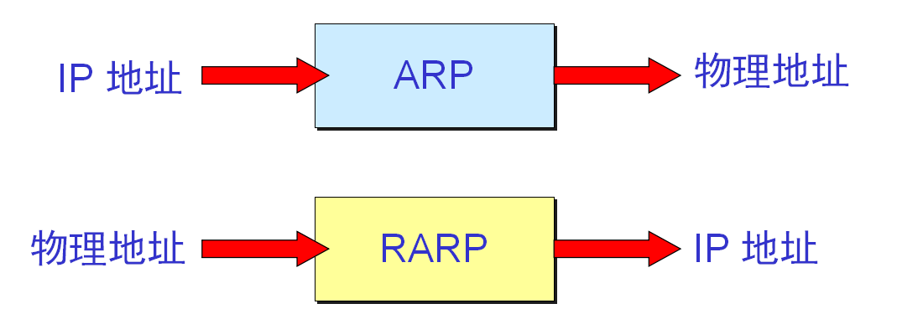
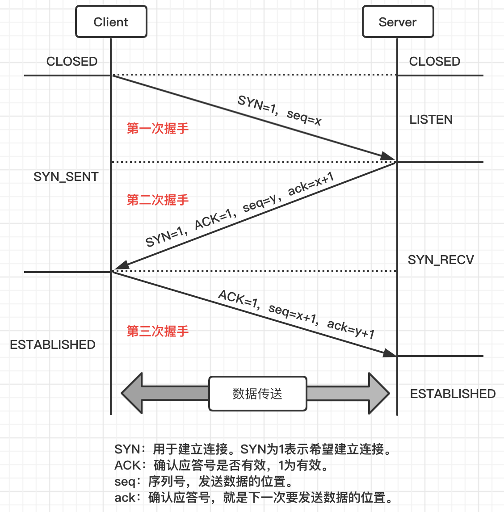
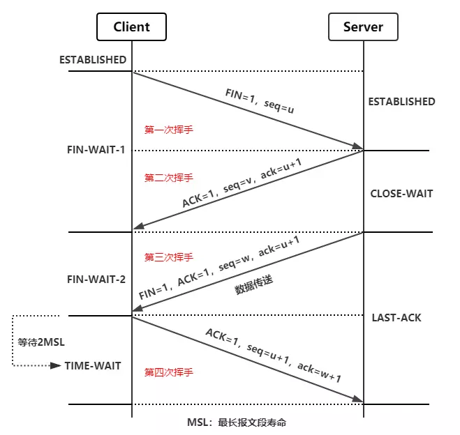
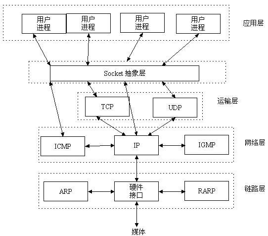
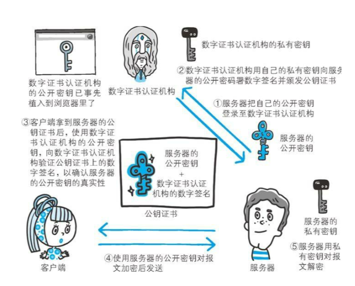

- [基础](#基础)   
    - [网络结构](#网络结构)
    - [ARP协议和RARP协议](#ARP协议和RARP协议)
    - [TCP协议和UDP协议](#TCP协议和UDP协议)
    - [TCP连接](#TCP连接)
        - [三次握手](#三次握手)
        - [四次挥手](#四次挥手)
    - [TCP协议如何保证可靠传输](#TCP协议如何保证可靠传输)
    - [socket](#socket)
    - [无状态协议、有状态协议](#无状态协议、有状态协议)
    - [面向连接与无连接](#面向连接与无连接)
    - [长连接和短连接](#长连接和短连接)
    - [短轮询、长轮询、HTTP流](#短轮询、长轮询、HTTP流)
    - [HTTP协议](#HTTP协议)
    - [HTTPS协议](#HTTPS协议)
    - [DNS协议](#DNS协议)
    - [因特网编程和web编程](#因特网编程和web编程)
- [面试](#面试)
    - [讲述ARP协议和RARP协议](#讲述ARP协议和RARP协议)
    - [TCP协议和UDP协议的区别](#TCP协议和UDP协议的区别)
    - [TCP三次握手和四次挥手](#TCP三次握手和四次挥手)
    - [HTTP和Socket的区别](#HTTP和Socket的区别)
    - [HTTP和WebSocket的区别](#HTTP和WebSocket的区别)
    - [HTTP1.0，HTTP1.1，HTTP2.0的区别](#HTTP1.0，HTTP1.1，HTTP2.0的区别)
    - [HTTP和HTTPS的区别](#HTTP和HTTPS的区别)
    - [URL和URI的区别](#URL和URI的区别)

---
# 基础
## 网络结构
[参考](https://www.cnblogs.com/blknemo/p/10079644.html) 
五层体系结构
* 物理层：字节流的传输。数据单元：数据位（bit）。典型设备：中继器、集线器，使用了光纤、同轴电缆、双绞线。中间设备：中继器、集线器。网络协议：无。
* 数据链路层：数据报的传输。数据单元：数据帧（Frame）。典型设备：网卡、网桥、交换机。中间设备：网桥、交换机。网络协议：CSMA/CD协议等。
* 网络层：负责路由分配，完成主机到主机的传输。数据单元：数据包（Packet）。典型设备：路由器、防火墙、多层交换机。中间设备：路由器。网络协议：IP协议、ARP协议、RARP协议等。
* 传输层：端到端的传输，完成进程到进程的传输。数据单元：数据段（Segment）。典型设备：进程和端口。中间设备：网关。网络协议：TCP协议、UDP协议。
* 应用层：面向应用提供服务。数据单元：报文（message）。典型设备：应用程序，如FTP、SMTP、HTTP。中间设备：网关。网络协议：DNS协议、FTP协议、HTTP协议、SMTP协议、SSH协议、TELNET协议等。

名词解释 
> 网卡：拥有MAC地址（独一无二的），用于连接计算机与外界局域网。属于数据链路层。 
路由器：路由器是连接两个或多个网络的硬件设备，在网络间起网关的作用。它能理解数据中的IP地址，如果它接收到一个数据包，就检查其中的IP地址，如果目标地址是本地网络的就不理会，如果是其他网络的，就将数据包转发出本地网络。它的作用在于连接相同或不同类型网络，并且能找到网络中数据传输最合适的路径即路由选择。属于网络层。 
网关：网关（Gateway）负责第三层（网络层）以上的数据中继，实现不同体系结构的网络协议转换，它通常采用软件的方法实现，并且与特定的应用服务一一对应。比如：OSI的文件传输服务FTAM和TCP/IP的文件传输服务FTP，尽管二者都是文件传输但是由于所执行的协议不同不能直接进行通信，而需要网关将两个文件传输系统互连，达到相互进行文件传输的目的。属于网络层以上。

路由器和交换机的区别 
路由器实现了不同网络之间的数据转发，交换机实现了特定网络内的数据交换。

网关和路由器的区别 
网关实质上是一个网络通向其他网络的IP地址。只有设置好网关的IP地址，TCP/IP协议才能实现不同网络之间的相互通信。网关的IP地址是具有路由功能的设备的IP地址。具有路由功能的设备有路由器、启用了路由协议的服务器（实质上相当于一台路由器）、代理服务器（也相当于一台路由器）。路由器可进行数据格式的转换，成为不同协议之间网络互连的必要设备。 

## ARP协议和RARP协议
不管网络层使用的是什么协议，在实际网络的链路上传送数据帧时，最终还是必须使用硬件地址。

ARP协议 
概念 
地址解析协议。IP地址解析为MAC地址（物理地址）。ARP是解决同一个局域网上的主机或路由器的IP地址和硬件地址的映射问题。 
工作流程 
1. 首先，每台主机都会在自己的ARP缓冲区（ARP Cache）中建立一个ARP列表，以表示IP地址和MAC地址的对应关系。  
2. 当源主机需要将一个数据包发送到目的主机时，会首先检查自己的ARP列表中是否存在该IP地址对应的MAC地址，如果有，就直接将数据包发送到这个MAC地址；如果没有，就向本地网段发起一个ARP请求的广播包，查询此目的主机对应的MAC地址。此ARP请求数据包里包括源主机的IP地址、硬件地址、以及目的主机的IP地址。
3. 网络中所有的主机收到这个ARP请求后，会检查数据包中的目的IP是否和自己的IP地址一致。如果不相同就忽略此数据包；如果相同，该主机首先将发送端的MAC地址和IP地址添加到自己的ARP列表中，如果ARP表中已经存在该IP的信息，则将其覆盖，然后给源主机发送一个ARP响应数据包，告诉对方自己是它需要查找的MAC地址。
4. 源主机收到这个ARP响应数据包后，将得到的目的主机的IP地址和MAC地址添加到自己的ARP列表中，并利用此信息开始数据的传输。如果源主机一直没有收到ARP响应数据包，表示ARP查询失败。

如果所要找的主机和源主机不在同一个局域网上，那么就要通过ARP找到一个位于本局域网上的某个路由器的硬件地址，然后把分组发送给这个路由器，让这个路由器把分组转发给下一个网络。剩下的工作就由下一个网络来做。

RARP协议 
逆地址解析协议。MAC地址解析为IP地址。 
比如局域网中有一台主机只知道物理地址而不知道IP地址，那么可以通过RARP协议发出征求自身IP地址的广播请求，然后由RARP服务器负责回答。
工作流程 
1. 给主机发送一个本地的RARP广播，在此广播包中，声明自己的MAC地址并且请求任何收到此请求的RARP服务器分配一个IP地址。
2. 本地网段上的RARP服务器收到此请求后，检查其RARP列表，查找该MAC地址对应的IP地址。
3. 如果存在，RARP服务器就给源主机发送一个响应数据包并将此IP地址提供给对方主机使用。
4. 如果不存在，RARP服务器对此不做任何的响应。
5. 源主机收到从RARP服务器的响应信息，就利用得到的IP地址进行通讯；如果一直没有收到RARP服务器的响应信息，表示初始化失败。

ARP和RARP请求是广播方式，应答都是单播方式。

网关：网关IP就是默认路由的内网IP地址。正常环境下，当用户接入网络时，都会通过DHCP协议或手工配置的方式得到IP和网关信息。 
代理ARP：当ARP请求目标跨网段时，网关设备收到此ARP请求，会用自己的MAC地址返回给请求者，这便是代理ARP（Proxy ARP)。

## TCP协议和UDP协议
* TCP（Transmission Control Protocol）协议：传输控制协议。提供可靠的面向连接的服务。传输数据前须先建立连接，结束后释放。可靠的全双工信道。可靠、有序、无丢失、不重复。
* UDP (User Datagram Protocol ）协议：用户数据报协议。发送数据前无需建立连接。不使用拥塞控制。不保证可靠交付，最大努力交付。

## TCP连接
### 三次握手
一个TCP发送包的首部为：16bit源端口号，16bit目的端口号，32位序列号（该包的编号），32位确认序列号（用以接收方回信时的序号）。其他的标志位：确认位ACK，推送位PUSH，同步位SYN，终止位FIN。确认序列号ack可以维护TCP协议的状态。 

### 四次挥手

为什么连接的时候是三次握手，关闭的时候却是四次挥手？ 
因为当服务端收到客户端的SYN连接请求报文后，可以直接发送SYN+ACK报文。其中，ACK报文是用来应答的，SYN报文是用来同步的。但是关闭连接时，当服务端收到FIN报文时，很可能并不会立即关闭SOCKET，所以只能先回复一个ACK报文，确认收到FIN报文。只有等服务器端所有的报文都发送完了，服务器端才能发送FIN报文，因此不能一起发送。故需要四次挥手。

为什么TIME_WAIT状态需要经过2MSL（最长报文段生存时间）才能返回到CLOSE状态？ 
虽然按道理，四个报文都发送完毕，可以直接进入CLOSE状态了。但是如果网络是不可靠的，最后一个ACK有可能丢失。所以，TIME_WAIT状态就是用来重发可能丢失的ACK报文。**为了保证客户端最后一次挥手的报文能够到达服务器，若第4次挥手的报文段丢失了，服务器就会超时重传第3次挥手的报文段，所以客户端此时不是直接进入CLOSED，而是保持TIME_WAIT（等待2MSL就是TIME_WAIT）。当客户端再次收到服务器因为超时重传而发送的第3次挥手的请求时，客户端就会重新给服务器发送第4次挥手的报文（保证服务器能够收到客户端的回应报文）。最后，客户端、服务器才真正断开连接**。

## TCP协议如何保证可靠传输
TCP通过确认和重传、[滑动窗口](https://blog.csdn.net/wdscq1234/article/details/52444277)、累计ACK、流量控制、拥塞控制实现可靠性。[参考](https://blog.csdn.net/cmm0401/article/details/77878998)

## socket
socket（套接字）是处于传输层之上封装的网络接口，方便应用层、会话层等使用。客户端与服务端在通信之前必须要创建一个socket，通过双向的通信连接实现数据的交换。socket用于描述IP地址（主机）和端口。socket不是协议，是一个调用接口。

由于此socket对于TCP/IP各种协议通用，故socket必须提供各种选项，例如使用IPv4和IPv6分别对应选项AF_INET和AF_INET6。另外，还要指定到底是TCP还是UDP，由于TCP是基于数据流的，所以设置为SOCK_STREAM，而UDP是基于数据报的，因而设置为SOCK_DGRAM。

套接字有两种，分别是基于文件型的和基于网络型的。
* 基于文件型：同一台电脑上，文件系统的确是不同的进程都能访问的。套接字可以用在同一台主机上多个应用程序之间的通讯，也被称进程间通讯（IPC）。
* 基于网络型：用于客户端和服务端之间的通信。**套接字编程，属于网络编程**。

在HTTP工作开始之前，Web浏览器首先要通过网络与Web服务器建立连接，该连接是通过TCP来完成的，该协议与IP协议共同构建Internet，即著名的TCP/IP协议族，因此Internet又被称作是TCP/IP网络。**HTTP是比TCP更高层次的应用层协议，根据规则，只有低层协议建立之后才能进行更高层协议的连接，因此，首先要建立TCP连接**，一般TCP连接的端口号是80。一旦建立了TCP连接，Web浏览器就会向Web服务器发送HTTP请求命令。

## 无状态协议、有状态协议
* 无状态协议：服务器和客户端都没有维护任何状态。HTTP协议是无状态协议。之前发过的请求，对现在的请求不会产生任何影响。当然，完全的无状态是没法实现登录这种功能的。HTTP协议利用session和cookie来判断用户是否处于登录状态，从而推送不同的网页给浏览器。Web服务器在HTTP协议之上使用session来维护用户的登录状态。所以HTTP是无状态的，而session是有状态的。Web客户端使用cookie维护用户的登录状态。在协议层面，每次发起操作是否需要重新握手或自带认证，如果需要，就是无状态协议。

* 有状态协议：客户端或者服务端需要维护一个状态。TCP协议是有状态协议。TCP协议实际上是双方都维护了一个状态，双方都变成已连接的状态，才可以开始传输数据。双方都变成连接关闭状态时，这时候双方都释放需要维护这个状态的资源。握手实际上就是为了达到两边的状态一致。

每个协议可以依据自身的需要，来决定自己是否有状态。

## 面向连接与无连接
套接字的类型只有两种：一种是面向连接的套接字，一种是无连接套接字。
* 面向连接 
**在通讯之前一定要建立一条连接**。这种通讯方式也被称为“虚电路”或“流套接字”。**面向连接的通讯方式提供了顺序的，可靠的，不会重复的数据传输，而且也不会被加上数据边界**。这也意味着，每一个要发送的信息，可能会被拆分成多份，每一份都会不多不少地正确到达目的地。然后被重新按顺序拼装起来，传给正在等待的应用程序。实现这种连接的主要协议就是传输控制协议(即TCP)。
* 无连接 
与流套接字完全相反的是数据报型的无连接套接字。这意味着，**无需建立连接就可以进行通讯**。但这时，**数据到达的顺序，可靠性及数据不重复性就无法保证了**。数据报会保留数据边界，这就表示，数据不会像面向连接的协议那样被拆分成小块。实现这种连接的主要协议就是用户数据报协议(即UDP)。 
使用数据报来传输数据就像邮政服务一样。邮件和包裹不一定会按它们发送的顺序到达。事实上，它们还有可能根本到不了！而且，由于网络的复杂性，数据还可能被重复传送。 
优点：由于面向连接套接字要提供一些保证，以及要维持虚电路连接，这都是很重的额外负担。数据报没有这些负担，所以它更“便宜”。通常能提供更好的性能，更适合某些应用场合。

## 长连接和短连接
* 长连接：长连接指建立SOCKET连接后不管是否使用都保持连接，但安全性较差。
* 短连接：短连接是指SOCKET连接后,发送完数据后马上断开连接。 

HTTP是短连接，也可以建立长连接的。使用Connection:keep-alive，HTTP 1.1默认进行持久连接。HTTP1.1和HTTP1.0相比较而言，最大的区别就是增加了持久连接支持，但还是无状态的，或者说是不可以信任的。 

使用场景
* 长连接：长连接多用于操作频繁，点对点的通讯，而且连接数不能太多的情况。每个TCP连接都需要三步握手，这需要时间，如果每个操作都是先连接，再操作，那么处理速度会降低很多。所以每个操作完后都不断开，下次处理时直接发送数据包就OK了，不用建立TCP连接。例如：数据库的连接用长连接，如果用短连接频繁地通信，会造成socket错误，而且频繁的socket创建也是对资源的浪费。 

* 短连接：像Web网站的http服务一般都用短链接，因为长连接对于服务端来说会耗费一定的资源，而像Web网站这么频繁的成千上万甚至上亿客户端的连接用短连接会更省一些资源。如果用长连接，而且同时有成千上万的用户，如果每个用户都占用一个连接的话，那可想而知吧。所以在并发量大，但每个用户无需频繁操作的情况下用短连接好。 
  
## 短轮询、长轮询、HTTP流
* 传统轮询技术（Ajax短轮询）：客户端向服务器发起HTTP请求，无论数据是否更新，服务器都会传输数据。一个request对应一个response。缺点：数据交互实时性较低，服务端到浏览器端的数据反馈效率低。
* 服务器推送技术（Ajax长轮询）：是短轮询的变种，是客户端向服务器发起HTTP请求，只有等待数据更新后才会传输数据，否则服务器保持连接状态。接着发起下一次HTTP请求，一个request对应一个response。缺点：服务器没有数据到达时，HTTP连接会停留一段时间，造成服务器资源浪费，数据交互的实时性也很低。
* 服务器推送技术（HTTP流）：客户端只发起一次HTTP请求，服务器保持连接状态，在数据更新之后，服务器会传输数据，否则保持连接状态。此时一个requset对应多个response。

无论是短轮询、长轮询、还是HTTP流，相同点在于都需要客户端先发起HTTP请求。

## HTTP协议
客户端可能向服务器端发出各种请求。这些请求可能包括获得一个网页视图或者提交一个包含数据的表单。这个请求经过服务器端的处理，然后会以特定的格式（HTML等）返回给客户端浏览。 
Web客户端和服务器端交互使用的“语言”，Web交互的标准协议是HTTP(超文本传输协议)。HTTP协议是TCP/IP协议的上层协议，这意味着HTTP协议依靠TCP/IP协议来进行低层的交流工作。它的职责不是路由或者传递消息（TCP/IP协议处理这些），而是通过发送、接收HTTP消息来处理客户端的请求。 
HTTP协议属于无状态协议，它不跟踪从一个客户端到另一个客户端的的请求信息。服务器端持续运行，但是客户端的活动是独立进行的：一旦一个客户的请求完成后，活动将被终止。可以随时发送新的请求，但是它们会被处理成独立的服务请求。由于每个请求缺乏上下文背景，有些URL会有很长的变量和值作为请求的一部分，以便提供一些状态信息。另外一个选项是“cookie”：保存在客户端的客户状态信息。 
**用于web编程**。

## HTTPS协议
HTTPS协议（超文本传输安全协议）在HTTP协议的基础上加入了SSL协议。SSL协议依靠证书来验证服务器的身份，并为浏览器和服务器之间的通信加密。HTTPS=HTTP+SSL。

SSL协议是安全套接层协议，其目的是在TCP/IP基础上建立可靠的传输服务，它位于传输层和应用层之间，属于传输层面的安全协议，但在现有的传输层TCP之上。

HTTPS的解决方案：用非对称算法随机加密出一个对称密钥，然后双方用对称密钥进行通信。

HTTPS通信过程（四次握手）
1. 客户端将自己支持的加密算法发送给服务器，请求服务器证书。
2. 服务器选取一组加密算法，生成非对称密钥：私钥、公钥。公钥上传到数字认证机构，获取公钥证书。将公钥证书（公钥+数字签名）发送给客户端。
3. 客户端校验证书合法性，验证公钥证书上的数字签名。生成随机对称密钥，用公钥加密后发送给服务器。
4. 服务器用私钥解密出对称密钥，返回一个响应，HTTPS连接建立完成。 

随后双方通过这个对称密钥进行安全的数据通信。

HTTPS采用混合加密机制：交换密钥阶段：使用非对称加密。通信交换报文阶段：使用对称加密。

HTTPS可以做到三点：
* 数据的保密性。
* 校验双方身份的真实性。
* 数据的完整性。

为什么要用证书？ 
因为公开加密还存在一些问题：就是无法证明公开秘钥的正确性。为了解决这个问题，HTTPS采取了有数字认证机构和其相关机构颁发的公开秘钥证书。服务端上传公钥到数字认证机构，获取数字证书。客户端去数字认证机构验证公钥证书上的数字签名，确认服务器公钥真实性。

对称加密和非对称加密
* 对称加密：加密、解密使用同一个密钥。优点：加密速度快。缺点：如果密钥泄漏，则无法做到保密。
* 非对称加密（公开密钥加密）：使用一对非对称的密钥，公钥加密则私钥解密，私钥加密则公钥解密。可用来校验数字签名。优点：能提供更好的身份认证技术，安全性更高。缺点：加密/解密比较复杂，没有对称加密快。

单向认证和双向认证
* 单向认证：客户端认证服务端。
* 双向认证：除了客户端要认证服务端，服务端也要认证客户端。连接过程都用对方的公钥加密。

## DNS协议
[参考](https://blog.csdn.net/baidu_37964071/article/details/80500825) 
DNS协议是用来将域名转换为IP地址（也可以将IP地址转换为相应的域名地址）。IP地址是面向主机的，而域名则是面向用户的。基于UDP实现的，服务器的端口号为53。

域名解析过程 
域名解析总体可分为以下过程：
1. 输入域名后，先查找自己主机对应的域名服务器，域名服务器先查找自己的数据库中的数据。
2. 如果没有，就向上级域名服务器进行查找，依次类推。
3. 最多回溯到根域名服务器，肯定能找到这个域名的IP地址。
4. 域名服务器自身也会进行一些缓存，把曾经访问过的域名和对应的IP地址缓存起来，可以加速查找过程。 

具体可描述如下：
1. 主机先向本地域名服务器进行递归查询。
2. 本地域名服务器采用迭代查询，向一个根域名服务器进行查询。
3. 根域名服务器告诉本地域名服务器，下一次应该查询的顶级域名服务器的IP地址。
4. 本地域名服务器向顶级域名服务器进行查询。
5. 顶级域名服务器告诉本地域名服务器，下一步查询权限服务器的IP地址。
6. 本地域名服务器向权限服务器进行查询。
7. 权限服务器告诉本地域名服务器所查询的主机的IP地址。
8. 本地域名服务器最后把查询结果告诉主机。

## 因特网编程和web编程
* 因特网编程：涵盖更多范围的应用程序，包括其他的一些因特网协议，例如FTP、SMTP等，同时也包括网络编程和套接字编程。
* web编程：仅包括针对Web的应用程序开发，Web客户端（浏览器等）和服务器。

因特网（Internet）是一组全球信息资源的总汇。有一种粗略的说法，认为Internet是由许多小的网络（子网）互联而成的一个逻辑网，每个子网中连接着若干台计算机（主机）。Internet以相互交流信息资源为目的，基于一些共同的协议，并通过许多路由器和公共互联网组成，它是一个信息资源和资源共享的集合。 

web（World Wide Web）即全球广域网，也称为万维网，它是一种基于超文本和HTTP的、全球性的、动态交互的、跨平台的分布式图形信息系统。是建立在Internet（因特网）上的一种网络服务，为浏览者在Internet上查找和浏览信息提供了图形化的、易于访问的直观界面，其中的文档及超级链接将Internet上的信息节点组织成一个互为关联的网状结构。

# 面试
## [讲述ARP协议和RARP协议](#ARP协议和RARP协议)
## TCP协议和UDP协议的区别
* TCP协议：面向连接，传输可靠（保证数据正确性和数据顺序），用于传输大量数据（流模式），速度慢，建立连接需要开销较多（时间、系统资源）。
* UDP协议：面向非连接（无连接），传输不可靠（不保证数据正确性和数据顺序），用于传输少量数据（数据包模式），速度快。

## [TCP三次握手和四次挥手](#TCP连接)

## HTTP和Socket的区别
* HTTP：是基于TCP协议的应用层协议；是短连接，客户端向服务器发送一次请求，服务器端响应后连接即断掉；服务器需要等客户端发送请求后，才能将数据回传给客户端。
* Socket：对TCP/IP协议的封装，本身不是协议，是一个调用接口（API），通过socket，可以使用TCP/IP协议；是长连接，理论上客户端和服务端一旦建立连接，则不会主动断掉；可以由服务器直接向客户端发送数据。只接收文档和二进制数据。

## HTTP和WebSocket的区别
**待细看**
* HTTP：是传统的客户端对服务器发起请求的模式。
* WebSocket：真正的全双工方式，建立连接后客户端与服务器端是完全平等的，可以互相主动请求。Websocket解决了轮询实时交互性和全双工的问题。

## HTTP1.0，HTTP1.1，HTTP2.0的区别
* HTTP1.0：短连接。一个TCP连接只传递一个HTTP请求，每次连接都要三次握手和慢启动，会造成延时。
* HTTP1.1：长连接，使用管道。一个TCP连接传递多个HTTP请求和响应，减少建立连接和关闭连接的消耗和延迟。HTTP请求排队串行处理。缺点：一旦某请求超时，后续请求只能被阻塞。传输的是纯文本数据。
* HTTP2.0：长连接，多路复用。一个TCP连接传递多个HTTP请求和响应，减少建立连接和关闭连接的消耗和延迟。HTTP请求是并行的。优点：某请求耗时，不会影响其他请求的正常执行。传输的是二进制数据，负载更低且更易于解析以及不易出错。首部压缩。服务端推送。主动重置连接。

## HTTP和HTTPS的区别
* HTTP协议：被用于在Web浏览器和网站服务器之间传递信息。HTTP协议以明文方式发送内容，不提供任何方式的数据加密。如果攻击者截取了Web浏览器和网站服务器之间的传输报文，就可以直接读懂其中的信息。因此，HTTP协议不适合传输一些敏感信息，比如：信用卡号、密码等支付信息。
* [HTTPS协议](#HTTPS协议)：为了数据传输的安全，HTTPS在HTTP的基础上加入了SSL协议，SSL依靠证书来验证服务器的身份，并为浏览器和服务器之间的通信加密。HTTPS=HTTP+SSL。

## URL和URI的区别
* URL（Uniform Resource Locator）：统一资源定位符。URL是一个表示资源位置的字符串，基本的URL格式为 “协议://IP地址/路径和文件名”。URL对于我们而言，就是将URL输入到浏览器地址栏上就可以访问到对应资源。
* URI（Uniform Resource Identifier）：统一资源标识符。URI是一个用于标识某一互联网资源名称的字符串。

URL是一种URI，它标识一个互联网资源，并指定对其进行操作或获取该资源的方法。可能通过对主要访问手段的描述，也可能通过网络“位置”进行标识。URI可被视为定位符（URL），名称（URN）或两者兼备。统一资源名（URN）如同一个人的名称，而统一资源定位符（URL）代表一个人的住址。换言之，URN定义某事物的身份，而URL提供查找该事物的方法。URN仅用于命名，而不指定地址。