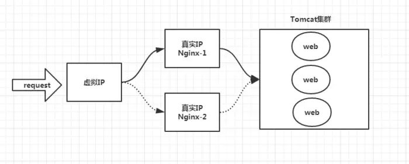

- [基础](#基础)
    - [CAP理论](#CAP理论)
    - [分布式锁](#分布式锁)
    - [分布式系统事务一致性](#分布式系统事务一致性)
    - [分布式系统下的session一致性](#分布式系统下的session一致性)
    - [负载均衡分类](#负载均衡分类)
    - [负载均衡算法](#负载均衡算法)
    - [负载均衡高可用](#负载均衡高可用)
    - [一致性哈希](#一致性哈希)
    - [web请求过程](#web请求过程)
    - [集群、分布式、微服务区别](#集群、分布式、微服务区别)
        - [集群和分布式的区别](#集群和分布式的区别)
        - [分布式和微服务的区别](#分布式和微服务的区别)
    - [单体架构](#单体架构)
    - [MVC](#MVC)
    - [微服务架构](#微服务架构)
    - [RPC](#RPC)
    - [gRPC](#gRPC)
    - [MVC、RPC、SOA、微服务架构之间的区别](#MVC、RPC、SOA、微服务架构之间的区别)
    - [限流、熔断、降级](#限流、熔断、降级)
        - [限流](#限流)
        - [熔断](#熔断)
        - [降级](#降级)
    - [平滑重启](#平滑重启)
        - [Nginx平滑重启](#Nginx平滑重启)
        - [PHP平滑重启](#PHP平滑重启)
        - [Golang平滑重启](#Golang平滑重启)
    - [分布式数据库技术演变](#分布式数据库技术演变)
    - [数据库架构原则](#数据库架构原则)
    - [主从同步](#主从同步)
    - [缓存与数据库一致性](#缓存与数据库一致性)
    - [消息队列](#消息队列)
    - [Kafka](#Kafka)
    - [Celery](#Celery)
- [面试](#面试)
    - [四层和七层负载均衡之间的区别](#四层和七层负载均衡之间的区别)
    - [简述负载均衡算法](#简述负载均衡算法)
    - [分布式集群系统下怎么实现事务一致性](#分布式集群系统下怎么实现事务一致性)
    - [分布式集群系统下怎么实现session高可用](#分布式集群系统下怎么实现session高可用)
    - [简述RPC](#简述RPC)
    - [数据库架构设计原则](#数据库架构设计原则)
    - [数据库架构主从同步方案](#数据库架构主从同步方案)
    - [简述消息队列](#简述消息队列)
    - [一致性解决方案](#一致性解决方案)
    - [高并发下的接口幂等性解决方案](#高并发下的接口幂等性解决方案)
    
---
# 基础
## CAP理论
CAP理论：一个分布式系统不可能同时满足C（一致性）、A（可用性）、P（分区容错性）三个基本需求，并且最多只能满足其中的两项。对于一个分布式系统来说，分区容错是基本需求，否则不能称之为分布式系统，因此需要在C和A之间寻求平衡。
* C（Consistency）一致性：一致性是指更新操作成功并返回客户端完成后，所有节点在同一时间的数据完全一致。与ACID的C完全不同。
* A（Availability）可用性：可用性是指服务一直可用，而且是正常响应时间。
* P（Partition tolerance）分区容错性：分区容错性是指分布式系统在遇到某节点或网络分区故障的时候，仍然能够对外提供满足一致性和可用性的服务。

## 分布式锁
[参考](https://www.jianshu.com/p/31d3de863ff7)<br>
分布式锁，是指在分布式的部署环境下，通过锁机制来让多客户端互斥地对共享资源进行访问。系统有多份并且部署在不同的机器上时，资源已经不是在线程之间共享了，而是属于进程之间共享的资源。

实现方式
* 基于数据库实现：基于数据库的乐观锁（加版本号），基于数据库的悲观锁（加排他锁）。
* [基于Redis实现](https://www.jianshu.com/p/a1ebab8ce78a)：使用**set**(key, value, nx=True, ex=xxx)，只有在某个key不存在的时候，才会执行成功（加上参数nx=True，只在键不存在时，才对键进行设置操作）。那么当多个进程同时并发的去设置同一个key的时候，就永远只会有一个进程成功。设置值为进程的信息，并且设置键的过期时间（set可以设置过期时间，setnx不能设置过期时间）。删除键的时候判断值是不是等于自己进程的信息。可以让获得锁的线程开启一个守护线程，用来给快要过期的锁“续航”。如果到了过期时间，获得锁的线程还没执行完，守护线程会执行expire指令，为这把锁“续命”。当线程执行完任务，会显式关掉守护线程。如果节点忽然断电，由于线程和守护线程在同一个进程，守护线程也会停下。这把锁到了超时的时候，没人给它续命，也就自动释放了。<br>
针对redis集群模式的分布式锁，可以采用redis的Redlock机制。redlock使用「大多数机制」。加锁时，它会向过半节点发送set(key, value, nx=True, ex=xxx) 指令，只要过半节点set成功，那就认为加锁成功。释放锁时，需要向所有节点发送del指令。不过Redlock算法还需要考虑出错重试、时钟漂移等很多细节问题，同时因为Redlock需要向多个节点进行读写，意味着相比单实例Redis性能会下降一些。
* 基于ZooKeeper实现：当某客户端要进行逻辑的加锁时，就在zookeeper上的某个指定节点的目录下，去生成一个唯一的临时有序节点， 然后判断自己是否是这些有序节点中序号最小的一个，如果是，则算是获取了锁。如果不是，则说明没有获取到锁，那么就需要在序列中找到比自己小的那个节点，并对其调用exist()方法，对其注册事件监听，当监听到这个节点被删除了，那就再去判断一次自己当初创建的节点是否变成了序列中最小的。如果是，则获取锁，如果不是，则重复上述步骤。

三种实现方式的比较
* 从性能角度（从高到低）：缓存 > Zookeeper >= 数据库
* 从可靠性角度（从高到低）：Zookeeper > 缓存 > 数据库

## 分布式系统事务一致性
[参考](https://www.cnblogs.com/luxiaoxun/p/8832915.html)
* 两阶段/三阶段提交
1. 协调者问所有的参与者结点，是否可以执行提交操作。各个参与者开始事务执行的准备工作：如：为资源上锁，预留资源。参与者响应协调者，如果事务的准备工作成功，则回应“可以提交”，否则回应“拒绝提交”。
2. 如果所有的参与者都回应“可以提交”，那么，协调者向所有的参与者发送“正式提交”的命令。参与者完成正式提交，并释放所有资源，然后回应“完成”，协调者收集各结点的“完成”回应后结束这个Global Transaction。如果有一个参与者回应“拒绝提交”，那么，协调者向所有的参与者发送“回滚操作”，并释放所有资源，然后回应“回滚完成”，协调者收集各结点的“回滚”回应后，取消这个Global Transaction。<br>
缺点：所有的操作必须是事务性资源（比如数据库、消息队列、EJB组件等），存在使用局限性比较适合传统的单体应用；由于是强一致性，资源需要在事务内部等待，性能影响较大，吞吐率不高，不适合高并发与高性能的业务场景。
* 提供回滚接口<br>
主业务服务发起并完成整个业务活动，从服务提供三个接口：Try、Confirm、Cancel。
1. 主业务服务分别调用所有从业务的try操作，并在活动管理器中登记所有从业务服务。当所有从业务服务的try操作都调用成功或者某个从业务服务的try操作失败，进入第二阶段。
2. 活动管理器根据第一阶段的执行结果来执行confirm或cancel操作。如果第一阶段所有try操作都成功，则活动管理器调用所有从业务活动的confirm操作。否则调用所有从业务服务的cancel操作。<br>
缺点：Canfirm和Cancel的幂等性很难保证；如果串行的服务很多，回滚的成本实在太高。
* **本地消息表**<br>
本地数据库操作和生产消息到消息队列组成事务，都成功则提交，否则，执行回滚。<br>
消息队列怎么通知消费方：<br>
a.采用时效性高的MQ，由对方订阅消息并监听，有消息时自动触发事件。<br>
b.采用定时轮询扫描的方式，去检查消息表的数据。<br>
怎么避免重复消费：消费完成后，通过本地事务控制来更新这个“消费状态表”。<br>
缺点：关系型数据库的吞吐量和性能方面存在瓶颈，频繁的读写消息会给数据库造成压力。
* **MQ（非事务消息）**
* **MQ（事务消息）**


## 分布式系统下的session一致性
实际应用时，用户请求一般都有会话信息（一次登录后，在同一浏览器上的多次请求访问都归属于该次会话，如往该购物车中添加商品、提交订单等都会绑定到该登录用户），这就要求当用户请求从一台服务器切换到另一台服务器时，用户会话信息能继续保留，不需要再次登录，保证无缝切换。

集群应用下session管理的几种实现技术
* session同步<br>
思路：多个服务器之间相互同步session。<br>
缺点：数据传输占内网带宽，有延时；不便于水平扩展。
* 客户端存储<br>
思路：把用户会话信息记录在客户端浏览器的cookie中。<br>
缺点：每次http请求都需要携带session，占外网带宽；存在数据泄漏、窃取等安全隐患；session存储的数据大小受cookie限制。
* **反向代理hash一致性**<br>
思路：反向代理层使用用户ip（四层代理hash）或者http协议内容（七层代理hash）做hash，负责转发，保证同一个浏览器用户的请求落在同一个服务器上。<br>
优点：负载均衡。<br>
缺点：服务器重启时，一部分session会丢失；水平扩展时，rehash后session重新分布，也会有一部分用户路由不到正确的session。
* **后端统一存储**<br>
思路：将session存储在后端数据库或者**缓存**。<br>
优点：没有安全隐患；可以水平扩展；服务器重启或者扩容都不会有session丢失。<br>
缺点：增加了一次网络调用。

session也要防止单点故障，满足高可用。

## 负载均衡分类
[参考](https://www.cnblogs.com/kevingrace/p/6137881.html)
* 二层负载均衡（mac）
根据OSI模型分的二层负载，一般是用虚拟mac地址方式，外部对虚拟MAC地址请求，负载均衡接收后分配后端实际的MAC地址响应。
* 三层负载均衡（ip）
一般采用虚拟IP地址方式，外部对虚拟的ip地址请求，负载均衡接收后分配后端实际的IP地址响应。(即一个ip对一个ip的转发, 端口全放开)
* 四层负载均衡（tcp）
在三次负载均衡的基础上，即从第四层"传输层"开始, 使用"ip+port"接收请求，再转发到对应的机器。
* 七层负载均衡（http）
从第七层"应用层"开始, 根据虚拟的url或IP，主机名接收请求，再转向相应的处理服务器。

技术原理
* 四层负载均衡：主要通过报文中的目标地址和端口，再加上负载均衡设备设置的服务器选择方式，决定最终选择的内部服务器。<br>
以常见的TCP为例，负载均衡设备在接收到第一个来自客户端的SYN请求时，即通过上述方式选择一个最佳的服务器，并对报文中目标IP地址进行修改(改为后端服务器IP），直接转发给该服务器。TCP的连接建立，即**三次握手是客户端和服务器直接建立的，负载均衡设备只是起到一个类似路由器的转发动作**。在某些部署情况下，为保证服务器回包可以正确返回给负载均衡设备，在转发报文的同时可能还会对报文原来的源地址进行修改。**如LVS负载均衡**。
* 七层负载均衡：主要通过报文中的真正有意义的应用层内容，再加上负载均衡设备设置的服务器选择方式，决定最终选择的内部服务器。<br>
以常见的TCP为例，负载均衡设备如果要根据真正的应用层内容再选择服务器，只能先代理最终的服务器和客户端建立连接(三次握手)后，才可能接受到客户端发送的真正应用层内容的报文，然后再根据该报文中的特定字段，再加上负载均衡设备设置的服务器选择方式，决定最终选择的内部服务器。**负载均衡设备在这种情况下，更类似于一个代理服务器。负载均衡和前端的客户端以及后端的服务器会分别建立TCP连接**。所以从这个技术原理上来看，七层负载均衡明显的对负载均衡设备的要求更高，处理七层的能力也必然会低于四层模式的部署方式。**如Nginx负载均衡**。

安全性：网络中最常见的SYN Flood攻击，即黑客控制众多源客户端，使用虚假IP地址对同一目标发送SYN攻击，通常这种攻击会大量发送SYN报文，耗尽服务器上的相关资源，以达到Denial of Service(DoS)的目的。
* 四层模式下这些SYN攻击都会被转发到后端的服务器上。
* 七层模式下这些SYN攻击自然在负载均衡设备上就截止，不会影响后台服务器的正常运营。另外负载均衡设备可以在七层层面设定多种策略，过滤特定报文，例如SQL Injection等应用层面的特定攻击手段，从应用层面进一步提高系统整体安全。

软/硬件负载均衡
* 软件负载均衡的优点是需求环境明确，配置简单，操作灵活，成本低廉，效率不高，能满足普通的企业需求；缺点是依赖于系统，增加资源开销；软件的优劣决定环境的性能；系统的安全，软件的稳定性均会影响到整个环境的安全。
* 硬件负载均衡优点是独立于系统，整体性能大量提升，在功能、性能上优于软件方式；智能的流量管理，多种策略可选，能达到最佳的负载均衡效果；缺点是价格昂贵。

## 负载均衡算法
* 随机算法<br>
Random随机，按权重设置随机概率。在一个截面上碰撞的概率高，但调用量越大分布越均匀，而且按概率使用权重后也比较均匀，有利于动态调整提供者权重。
* 轮询及加权轮询<br>
轮询(Round Robbin)：当服务器群中各服务器的处理能力相同时，且每笔业务处理量差异不大时，最适合使用这种算法。轮询，按公约后的权重设置轮循比率。存在慢的提供者累积请求问题，比如：第二台机器很慢，但没挂，当请求调到第二台时就卡在那，久而久之，所有请求都卡在调到第二台上。<br>
加权轮询(Weighted Round Robbin)：为轮询中的每台服务器附加一定权重的算法。比如服务器1权重1，服务器2权重2，服务器3权重3，则顺序为1-2-2-3-3-3-1-2-2-3-3-3- ......。Nginx负载均衡默认算法。
* 最小连接及加权最小连接<br>
最少连接(Least Connections)：在多个服务器中，与处理连接数(会话数)最少的服务器进行通信。即使在每台服务器处理能力各不相同，每笔业务处理量也不相同，也能够在一定程度上降低服务器的负载。<br>
加权最少连接(Weighted Least Connection)：为最少连接算法中的每台服务器附加权重，该算法事先为每台服务器分配处理连接的数量，并将客户端请求转至连接数最少的服务器上。
* 哈希算法<br>
普通哈希：数据key哈希后对服务器的数量进行取模操作，路由到服务器。缺点：服务器数量变更时，所有数据key路由位置都会发生改变。<br>
[一致性哈希](#一致性哈希)：一致性Hash，相同参数的请求总是发到同一提供者。当某一台提供者挂时，原本发往该提供者的请求，基于虚拟节点，平摊到其它提供者，不会引起剧烈变动。
* IP地址散列<br>
通过管理发送方IP和目的地IP地址的散列，将来自同一发送方的分组(或发送至同一目的地的分组)统一转发到相同服务器的算法。当客户端有一系列业务需要处理而必须和一个服务器反复通信时，该算法能够以流(会话)为单位，保证来自相同客户端的通信能够一直在同一服务器中进行处理。
* URL散列<br>
通过管理客户端请求URL信息的散列，将发送至相同URL的请求转发至同一服务器的算法。

## 负载均衡高可用
Keepalived+Nginx实现高可用。<br>
Keepalived是一个高可用解决方案，主要是用来防止服务器单点发生故障，可以通过和Nginx配合来实现Web服务的高可用。（其实，Keepalived不仅仅可以和Nginx配合，还可以和很多其他服务配合）

Keepalived+Nginx实现高可用的思路：
* 请求不要直接打到Nginx上，应该先通过Keepalived（这就是所谓虚拟IP，VIP）
* Keepalived应该能监控Nginx的生命状态（提供一个用户自定义的脚本，定期检查Nginx进程状态，进行权重变化,，从而实现Nginx故障切换）


## **一致性哈希**
[参考](http://www.zsythink.net/archives/1182/)
1. 求出服务器（节点）的哈希值，并将其配置到0～2^32的闭环上。
2. 采用同样的方法求出存储数据的键的哈希值，并映射到相同的闭环上。
3. 从数据映射到的位置开始顺时针查找，将数据保存到找到的第一个服务器上。

优点：服务器数量发生改变时，只有部分存储数据受影响。对于节点的增减都只需重定位环空间中的一小部分数据，具有较好的容错性和可扩展性。

Hash环的数据倾斜问题：一致性Hash算法在服务节点太少时，容易因为节点分部不均匀而造成数据倾斜（存储数据大部分集中在某一台服务器上）。使用“虚拟节点”解决。

虚拟节点<br>
由实际节点虚拟复制而来的节点被称为"虚拟节点"，即对每一个服务节点计算多个哈希，每个计算结果位置都放置一个此服务节点，称为虚拟节点。具体做法可以在服务器IP或主机名的后面增加编号来实现。虚拟节点越多，hash环上的节点就越多，存储数据被均匀分布的概率就越大。

## web请求过程

* [DNS域名服务](computer_network.md#DNS协议)：将域名解析成IP地址。
* CDN<br>
CND(Content Delivery Network)：内容分布网络，是构筑在现有Internet上的一种先进的流量分布网络。目的是通过现有的Internet中增加一层新的网络架构，将网站的内容发布到最接近用户的网络“边缘”，使用户就近取得所有内容，提高用户访问速度。<br>
CDN以缓存网站中的静态数据为主，如css、js、图片和静态页面等数据，用户从主站服务器请求到动态内容（可能包含静态资源）后再从CDN上下载这些静态数据，从而加速网页数据的下载内容。
* [Nginx](web.md#Nginx)<br>
负载均衡设备，反向代理请求，如果有多台服务器，指定哪台服务器来处理请求。
* **分布式**：一个业务拆分为多个子业务，部署在多个服务器上。分解任务。其中一个服务挂了，影响所有的服务。[分布一致性（数据一致性）](#分布式系统事务一致性)：消息中间件保证数据一致性，只要最终一致就行。
* **集群**：同一个业务，部署在多个服务器上，分担请求的压力。其中一个服务挂了，不影响别的服务。
* [负载均衡](#负载均衡算法)：调度者如何合理分配任务，保证所有后端服务器都将性能充分发挥，从而保持服务器集群的整体性能最优，这就是负载均衡问题。采用负载均衡算法：源地址哈希法、加权轮询法（nginx负载均衡默认算法）等。

## 集群、分布式、微服务区别
### 集群和分布式的区别
* 分布式是指将不同的业务分布在不同的地方。而集群指的是将几台服务器集中在一起，实现同一业务。分布式中的每一个节点，都可以做集群。而集群并不一定就是分布式的。集群中一台服务器垮了，其它的服务器可以顶上来。分布式的每一个节点，都完成不同的业务，一个节点垮了，那这个业务就不可访问了。
* 分布式是以缩短单个任务的执行时间来提升效率的，而集群则是通过提高单位时间内执行的任务数来提升效率。

分布式需要做好事务管理。集群模式需要做好session共享。

好的设计应该是分布式和集群的结合，先分布式再集群，具体实现就是业务拆分成很多子业务，然后针对每个子业务进行集群部署，这样每个子业务如果出了问题，整个系统完全不会受影响。

### 分布式和微服务的区别
* 微服务是设计层面，分布式是部署层面。微服务侧重于微小服务进程隔离级别，分布式侧重于机器隔离。
* 微服务的应用不一定是分散在多个服务器上，也可以是同一个服务器。分布式将不同的业务部署在不同的服务器。

## 单体架构
单体架构也被称为单体系统或者是单体应用，就是一种系统中所有的功能、模块耦合在一个应用中的架构方式。用简单的方式理解就是应用、数据库等都在同一个服务器上。而分布式从简单的角度上理解就是将应用和数据等分开到不同的服务器上，然后对于应用和数据库进行不同方向上的性能优化等等操作。

优点：项目易于管理，部署简单。<br>
缺点：测试成本高，可伸缩性差，可靠性差，迭代困难，跨语言程度差，团队协作难。

## MVC
MVC模式（单体结构）：模型（Model）、视图（View）和控制器（Controller）。
* 最上面的一层，是直接面向最终用户的"视图层"（View）。它是提供给用户的操作界面，是程序的外壳。
* 最底下的一层，是核心的"数据层"（Model），也就是程序需要操作的数据或信息。
* 中间的一层，就是"控制层"（Controller），它负责根据用户从"视图层"输入的指令，选取"数据层"中的数据，然后对其进行相应的操作，产生最终结果。

## 微服务架构
[参考1](https://www.cnblogs.com/kenshinobiy/p/11113124.html) [参考2](https://www.solves.com.cn/news/cj/2020-03-14/13844.html)<br>
微服务架构是一种架构概念，旨在通过将功能分解到各个离散的服务中以实现对解决方案的解耦。<br>
按业务划分服务。每个服务独立不影响，进程隔离，数据隔离，资源隔离，每个服务可以独立的开发、测试、构建、部署。<br>
每个服务一个docker部署，容器之间达到进程级别的隔离。<br>

客户端如何访问这些服务<br>
一般在后台N个服务和UI之间会有一个代理或者叫API Gateway，他的作用包括：
* 提供统一服务入口，让微服务对前台透明。
* 聚合后台的服务，节省流量，提升性能。
* 提供安全，过滤，流控等API管理功能。


服务之间通信方式：
* 同步通信：RPC、REST等。
* 异步通信：消息队列（Kafka等）。

同步通信和异步通信的区别<br>
> 同步通信<br>
一般同步调用比较简单，一致性强，但是容易出调用问题，性能体验上也会差些，特别是调用层次多的时候。
* REST：一般REST基于HTTP，更容易实现，更容易被接受，服务端实现技术也更灵活些，各个语言都能支持。同时能跨客户端，对客户端没有特殊的要求，只要封装了HTTP的SDK就能调用，所以相对使用的广一些。
* [RPC](#RPC)：传输协议更高效，安全更可控，特别在一个公司内部，如果有统一的开发规范和统一的服务框架，开发效率优势更明显。
> 异步通信<br>
异步消息的方式在分布式系统中有特别广泛的应用，它既能降低调用服务之间的耦合，又能成为调用之间的缓冲，确保消息积压不会冲垮被调用方，同时能保证调用方的服务体验，继续干自己该干的活，不至于被后台性能拖慢。不过需要付出的代价是一致性的减弱，需要接受数据最终一致性。还有就是后台服务一般要实现幂等性，因为消息发送出于性能的考虑一般会有重复（保证消息的被收到且仅收到一次对性能是很大的考验）。最后就是必须引入一个独立的broker（中间件），如果公司内部没有技术积累，对broker分布式管理也是一个很大的挑战。

服务发现<br>
通过zookeeper等类似技术做服务注册信息的分布式管理。当服务上线时，服务提供者将自己的服务信息注册到zookeeper（或类似框架），并通过心跳维持长连接，实时更新连接信息。服务调用者通过zookeeper寻址，根据可定制算法，找到一个服务，还可以将服务信息缓存在本地以提高性能。当服务下线时，zookeeper会发通知给服务客户端。
* 客户端实现：优点是架构简单，扩展灵活，只对服务注册器依赖。缺点是客户端要维护所有调用服务的地址，有技术难度，一般大公司都有成熟的内部框架支持，比如Dubbo。
* 服务端实现：优点是简单，所有服务对于前台调用方透明，一般在小公司在云服务上部署的应用采用的比较多。


服务挂了，如何解决<br>
* 重试机制
* 限流
* 熔断机制
* 负载均衡
* 降级（本地缓存）

优点和缺点
* 优点：复杂度可控，独立按需扩展，技术选型灵活，容错，可用性高。
* 缺点：多服务运维难度，系统部署依赖，服务间通信成本，数据一致性，系统集成测试，重复工作，性能监控等。

微服务架构中组件
* 监控：发现故障的征兆。
* 定位问题：链路跟踪。链路跟踪只能定位到哪个服务出现问题，不能提供具体的错误信息。查找具体的错误信息的能力则需要由日志分析组件来提供。
* 分析问题：日志分析。
* 网关：权限控制，服务治理。调用者和被调用者中间加一层网关，每次调用时进行权限校验。
* 服务注册于发现：动态扩容。
* [限流、熔断、降级](#限流、熔断、降级)。

新增服务实例<br>
使用服务自动注册与发现。首先，需要部署一个服务发现服务，它提供所有已注册服务的地址信息的服务。DNS也算是一种服务发现服务。然后各个应用服务在启动时自动将自己注册到服务发现服务上。并且应用服务启动后会实时(定期)从服务发现服务同步各个应用服务的地址列表到本地。服务发现服务也会定期检查应用服务的健康状态，去掉不健康的实例地址。这样新增实例时只需要部署新实例，实例下线时直接关停服务即可，服务发现会自动检查服务实例的增减。

## **RPC**
RPC（Remote Procedure Call）：远程过程调用，简单的理解是一个节点请求另一个节点提供的服务。

用途：用于分布式架构中，多个服务分别部署在不同机器，不同服务之间要调用，属于跨机器调用。

RPC要解决的问题：
* 解决分布式系统中，服务之间的调用问题。
* 远程调用时，要能够像本地调用一样方便，让调用者感知不到远程调用的逻辑。

**RPC架构组件**
* 注册中心：服务端注册，客户端发现。集群部署时，客户端利用负载均衡算法，从众多服务实例中选择一个进行请求。可使用redis、zookeeper。
* 序列化/反序列化：转换为二进制字节流用于网络传输，可使用protobuf、xml、json等。
* 网络传输：使用HTTP、TCP，大部分用的TCP，gRPC（谷歌开发）用的HTTP2。

RPC架构图


RPC框架组成


* 客户端(Client)：服务调用方。
* 客户端存根(Client Stub)：存放服务端地址信息，将客户端的请求参数数据信息打包成网络消息，再通过网络传输发送给服务端。
* 服务端存根(Server Stub)：接收客户端发送过来的请求消息并进行解包，然后再调用本地服务进行处理。
* 服务端(Server)：服务的真正提供者。
* Network Service：底层传输，可以是TCP或HTTP。

同步调用/异步调用<br>
同步调用就是客户端等待调用执行完成并返回结果。异步调用就是客户端不等待调用执行完成返回结果，不过依然可以通过回调函数等接收到返回结果的通知。

**数据交互xml、json、protobuf格式比较**
* xml：相比于json，它的数据更加冗余，因为需要成对的闭合标签。文本数据格式保存。
* json：使用了键值对的方式，不仅压缩了一定的数据空间，同时也具有可读性。文本数据格式保存。
* protobuf：给字段进行编号，只需顺序传递值，序列化后体积相比xml和json很小，适合网络传输。因为profobuf是二进制数据格式，需要编码和解码，数据本身不具有可读性，因此只能反序列化之后得到真正可读的数据。适合高性能，对响应速度有要求的数据传输场景。protobuf也支持跨平台多语言。

**基于HTTP/TCP的RPC**
* 基于HTTP：HTTP报头较冗长，信息传输时间长，效率低。HTTP1.0短连接，HTTP1.1长连接（串行），HTTP2.0长连接（并行）。
* 基于TCP：可以建立长连接，减少网络开销，提高性能，实现更大的吞吐量和并发数。

开源RPC框架
* 跟语言平台绑定：Dubbo（java、阿里）、Motan（java、微博）、Tars（c++、腾讯）、Spring Cloud（java）。
* 跨语言平台：[gRPC](#gRPC)（谷歌）、Thrift（Facebook）。

## **gRPC**
[参考](https://blog.csdn.net/weiwangchao_/article/details/82023191)<br>
gRPC由google开发，是一款语言中立、平台中立、开源的远程过程调用（RPC）系统。

特性
* 基于HTTP2。
* 使用protobuf进行消息序列化。
* 多语言支持。

gRPC服务发现与服务治理（注册中心）的方案：etcd、zookeeper、consul。

## MVC、RPC、SOA、微服务架构之间的区别
* MVC架构：MVC应该是一种设计模式，算作是单体架构的一种。比较有代表性的技术：Struts2、SpringMVC、Spring、Mybatis、Hibernate等。
* RPC架构：RPC（Remote Procedure Call），远程过程调用，它是一种通过网络远程计算机请求，而不需要了解底层网络技术的协议。代表技术：Thrift、Hessian等。
* SOA架构：SOA（Service oriented Architecture）面向服务架构。
* 微服务架构：微服务就是一个轻量级的服务治理方案，代表技术：SpringCloud、dubbo等。

## 限流、熔断、降级
### 限流
[参考](https://blog.51cto.com/zero01/2307787)<br>
限流的目的是通过对并发访问/请求进行限速，或者对一个时间窗口内的请求进行限速来保护系统，一旦达到限制速率则可以拒绝服务、排队或等待、降级等处理。

限流分类：
* 合法性验证限流：比如验证码、IP黑名单等，这些手段可以有效的防止恶意攻击和爬虫采集。
* 容器限流：比如Tomcat、Nginx等限流手段，其中Tomcat可以设置最大线程数（maxThreads），当并发超过最大线程数会排队等待执行；而[Nginx](./web.md#限流)提供了两种限流手段：一是控制速率，二是控制并发连接数。
* 服务端限流：在服务器端通过限流算法实现限流。

服务端限流的常用算法：
* 计数器法：设置指定时间内能通过的请求数，如果指定时间内超过了指定请求数，则拒绝服务；如果超过了指定时间间隔则重新开始计数。缺点：不能消除“突刺现象”。计数器算法其实就是滑动窗口算法。只是它没有对时间窗口做进一步地划分，所以只有1格。
* 滑动窗口：当滑动窗口的格子划分的越多，那么滑动窗口的滚动就越平滑，限流的统计就会越精确。
* 漏桶算法：把水比作请求，漏桶比作处理请求的能力，水先进入到漏桶，漏桶里的水按照一定速率流出，当流出的速度小于流入的速度时，由于漏桶有限，后续进入的水直接溢出，也就是拒绝请求。缺点：无法应对短时间的突发流量。
* **令牌桶算法**：在令牌桶算法中，存在一个桶，用来存放固定数量的令牌。算法中存在一种机制，以一定的速率往桶中放令牌。每次请求调用需要先获取令牌，只有拿到令牌，才有机会继续执行，否则选择等待可用的令牌、或者直接拒绝。优点：允许流量一定程度的突发。

集群限流<br>
比如为了限制某个资源被每个用户或者商户的访问次数，5s只能访问2次，或者一天只能调用1000次，这种需求，单机限流是无法实现的，这时就需要通过集群限流进行实现。

如何实现：为了控制访问次数，肯定需要一个计数器，而且这个计数器只能保存在第三方服务，比如redis。

大概思路：每次有相关操作的时候，就向redis服务器发送一个incr命令，比如需要限制某个用户访问/index接口的次数，只需要拼接用户id和接口名生成redis的key，每次该用户访问此接口时，只需要对这个key执行incr命令，在这个key带上过期时间，就可以实现指定时间的访问频率。

应用场景：
* Web服务：用户增长过快、热点事件、竞争对象爬虫、恶意的刷单等。
* 对内的RPC服务：一个服务A的接口可能被BCDE多个服务进行调用，在B服务发生突发流量时，直接把A服务给调用挂了，导致A服务对CDE也无法提供服务。可以使用限流手段对每个调用方进行限流。

### 熔断
[参考](https://segmentfault.com/a/1190000012338949)<br>
当一个服务因为各种原因停止响应时，调用方通常会等待一段时间，然后超时或者收到错误返回。如果调用链路比较长，可能会导致请求堆积，整条链路占用大量资源一直在等待下游响应。所以当多次访问一个服务失败时，应熔断，标记该服务已停止工作，直接返回错误。直至该服务恢复正常后再重新建立连接。

### 降级
当下游服务停止工作后，如果该服务并非核心业务，则上游服务应该降级，以保证核心业务不中断。比如网上超市下单界面有一个推荐商品凑单的功能，当推荐模块挂了后，下单功能不能一起挂掉，只需要暂时关闭推荐功能即可。

## 平滑重启
平滑重启一般应用于业务更新或者版本发布过程中，能够避免因为代码发布重启服务导致的暂时性服务不可用的影响。

平滑重启要求：
* 已接受的请求不能中断。
* 新来的请求要及时响应。

平滑重启原理：让旧的业务进程逐个退出并逐个创建新的进程。<br>
WorkerMan分为主进程和子进程，主进程负责监控子进程，子进程负责接收客户端的连接和连接上发来的请求数据，做相应的处理并返回数据给客户端。当业务代码更新时，只要更新子进程，便可以达到更新代码的目的。<br>
当WorkerMan主进程收到平滑重启信号时，主进程会向其中一个子进程发送安全退出(让对应进程处理完毕当前请求后才退出)信号，当这个进程退出后，主进程会重新创建一个新的子进程（这个子进程载入了新的PHP代码），然后主进程再次向另外一个旧的进程发送停止命令，这样一个进程一个进程的重启，直到所有旧的进程全部被置换为止。
### Nginx平滑重启
平滑重启过程：
1. master使用新配置 fork出n-1个worker及新master
2. 新worker处理新情求，旧worker执行完退出
3. master重新加载配置，期间使用新master接管服务
4. master加载配置完毕，新master切换为worker工作模式
平滑重启完，master进程号并不会发生变化。

Nginx中的平滑重启：对配置文件进行语法检测以及平滑重启。
```bash
/usr/local/bin/nginx -t         # 语法检测
/usr/local/bin/nginx -s reload  # 平滑加载配置文件
```

参考：<br>
[php教程_聊聊nginx平滑重启和FPM平滑重启](https://www.zzsucai.com/biancheng/9946.html)
### PHP平滑重启
FPM平滑重启，需要等子进程完全退出后，才会启动新的master及子进程，随后旧master退出。<br>
php-fpm的平滑重启方式（SIGUSR2）目前做不到真正的平滑重启，只能做到平滑的关闭（对正在处理的请求保持执行，空闲进程终止，一旦所有worker进程都死掉后，master进程就会调用exec启动新的php-fpm进程，而不是fork exec，在exec的进程中就会出现一个窗口期，导致上游调用失败）。

平滑重启方案：
nginx与php-fpm通信模式改为unix socket模式，绕过tcp/ip协议，提升通信性能。<br>
unix socket其实严格意义上应该叫unix domain socket，它是unix系统进程间通信（IPC）的一种被广泛采用方式，以文件（一般是.sock）作为socket的唯一标识（描述符），需要通信的两个进程引用同一个socket描述符文件就可以建立通道进行通信了。

平滑重启过程：
1. 生成新的socket文件覆盖旧的sock文件（rename）<br>
虽然sock文件名改了，但是在Linux VFS里innode和文件名是分离的，innode节点并没有变，所以Nginx每次拿到的sock地址和PHP正在listen的sock地址都是同一个innode信息。
2. 平滑关闭旧的php。

参考：<br>
[php教程_聊聊nginx平滑重启和FPM平滑重启](https://www.zzsucai.com/biancheng/9946.html)<br>
[PHP 连接方式介绍以及如何攻击 PHP-FPM](https://cloud.tencent.com/developer/article/1425023?from=information.detail.php%E6%89%8B%E5%86%8C7%E4%B8%8E5)
### Golang平滑重启
平滑重启过程：
1. 监听USR2信号。
2. 收到信号后将服务监听的文件描述符传递给新的子进程。
3. 此时新老进程同时接收请求。
4. 父进程停止接收新请求, 等待旧请求完成(或超时)。
5. 父进程退出。

要点:
* 新老进程同时监听同一端口, Go很早就支持。
* 如何等待旧的请求完成, 这个在Go1.8（新增了Server.Shutdown）之前是需要费一番功夫的。

步骤：
* 用新的可执行文件替换老的可执行文件（如只需优雅重启，可以跳过这一步）。
* 通过pid给正在运行的老进程发送特定的信号（kill -SIGUSR2 $pid）。
* 正在运行的老进程，接收到指定的信号后，以子进程的方式启动新的可执行文件并开始处理新请求。
* 老进程不再接受新的请求，等待未完成的服务处理完毕，然后正常结束。
* 新进程在父进程退出后，会被init进程领养，并继续提供服务。

可以使用框架：grace、endless、overseer、manners。

参考：<br>
[Golang开发支持平滑升级（优雅重启）的HTTP服务](http://tabalt.net/blog/graceful-http-server-for-golang/)

## 分布式数据库技术演变
单应用+单数据库架构——>分布式部署+单数据库架构——>分布式部署+缓存+单数据库架构——>分布式部署+主从读写分离——>分布式部署+垂直拆分数据库——>分布式部署+水平分库分表　

## 数据库架构原则
高并发：通过设计保证系统能够同时并行处理很多请求。<br>
高并发指标：响应时间（Response Time），吞吐量（Throughput），每秒查询率QPS（Query Per Second），并发用户数等。<br>
为了应对高并发访问，海量数据等，采用分布式架构，拆分业务，使用集群部署，使用负载均衡分流。

指标：**高性能、高可用、可伸缩、可扩展、安全性、敏捷性**。
* 高性能：应用层：缓存、异步、集群；数据层：主从读写分离、缓存。
* 高可用性：单点和可用：一点挂了是否会影响这个系统。应用层：负载均衡。数据层：冗余备份。
* 可伸缩：应用层：应用切分；数据层：分库分表等。
* 可扩展：横向扩展服务（集群）。
* 安全性：防止跨站脚本攻击（XSS），防止注入SQL攻击（过滤）。
* 敏捷性：应用层：集群、拆分业务；数据层：数据库、缓存集群。

防止跨站脚本攻击：恶意攻击者往Web页面里插入恶意Script代码，当用户浏览该页面时，嵌入Web里面的Script代码会被执行，从而达到恶意攻击用户的目的。XSS攻击针对的是用户层面的攻击。

**防止注入SQL攻击**：通过把SQL命令插入到Web表单提交或输入域名或页面请求的查询字符串，最终达到欺骗服务器执行恶意的SQL命令。

SQL注入攻击的思路
* 找到SQL注入的位置。
* 判断服务器类型和后台数据库类型。
* 针对不同服务器和数据库的特点进行SQL注入攻击。

防SQL注入的方法
* 检查用户输入变量的数据类型和格式<br>
a. 前端使用JS检查是否包含非法字符。<br>
b. 使用正则表达式过滤传入的参数。<br>
c. 使用PHP函数检查变量。
* 过滤特殊的符号<br>
对于一些无法固定格式的变量，要进行一些特殊符号的过滤或转义处理。如PHP通常采用addslashes函数，它会在制定的预定义字符前添加反斜杠转义，这些预定义字符包括单引号、双引号、反斜杠和NULL。该方法相对安全，但还是能破解。
* 绑定变量，使用预编译语句<br>
MySQL的mysqli驱动提供了预编译语句的支持，不同的程序语言，都分别有使用预编译语句的方法。实际上，绑定变量使用预编译语句是预防SQL注入的最佳方式，使用预编译的SQL语句语义不会发生改变，在SQL语句中，变量用问号?表示，这样也就无法改变SQL语句的结构，即使用户输入 “ 'or 1=1 – ” 这样的数据也只会当作字符串来解释查询，这样就从根本上杜绝了SQL攻击的发生。

## **主从同步**
从库从主库拉取binlog日志（二进制文件，记录数据库的更新），再执行一遍，需要时间，在这个同步时间内可能出现主库和从库数据不一致的情况。不能保证集群的ACID，能保证最终一致性。应用于主从读写分离和冗余备份。

数据不一致解决方案：
* 半同步复制：等主从同步完成之后，主库上的写请求再返回，这就是常说的“半同步复制"。
* 消息中间件：所有的读写都走中间件，在主从同步时间内，读请求路由到主库，主从同步时间过后，读请求路由到从库。<br>
常用消息中间件：Kafka等。<br>
缺点：成本高。
* 缓存记录写key<br>
写流程：
1. 如果key要发生写操作，记录在cache里，并设置“经验主从同步时间”的cache超时时间，例如500ms。
2. 然后修改主数据库。<br>
读流程：
1. 先到缓存里查看，对应key有没有相关数据。
2. 有相关数据，说明缓存命中，这个key刚发生过写操作，此时需要将请求路由到主库读最新的数据。
3. 如果缓存没有命中，说明这个key上近期没有发生过写操作，此时将请求路由到从库，继续读写分离。<br>
优点：成本低。<br>
缺点：为了保证“一致性”，引入了一个cache组件，并且读写数据库时都多了缓存操作。

## **缓存与数据库一致性**
[参考](https://blog.kido.site/2018/11/24/db-and-cache-preface/)<br>
可以利用消息中间和缓存Cache。

强一致性：加一个缓存，将近期被修改的数据进行标记锁定。读的时候，标记锁定的数据强行走DB，没锁定的数据，先走缓存。

写流程：
1. 把修改的数据通过cache标记“正在被修改”，并设置“经验数据库同步缓存时间”的cache超时时间。
2. 先删除缓存。
3. 更新DB。
4. 监听从库(资源少的话主库也ok)的binlog，通过分析binlog解析出需要刷新的数据标识，然后将数据标识写入MQ。
5. 接下来就消费MQ，解析MQ消息来读库获取相应的数据刷新缓存redis。

读流程：
1. 先读cache，看看要读的数据是否被标记，如果被标记，则直接读主库；如果没有被标记，读redis，如果缓存没读到，则去读DB，之后再异步将数据标识写入MQ（这里MQ与写流程的MQ是同一个），接下来就消费MQ，解析MQ消息来读库获取相应的数据刷新缓存redis。

## 消息队列
消息队列是分布式系统中重要的组件，主要解决应用解耦、异步消息、流量削锋等问题。实现高性能、高可用、可伸缩和最终一致性架构。是大型分布式系统不可缺少的中间件。放在系统架构中，叫消息中间件。

优点：
* 解耦消息的生产和消费。
* 缓冲。

缺点：
* 系统可用性降低：比如消息队列挂了的时候，服务就不可用了。
* 系统复杂性增加。

目前在生产环境，使用较多的消息队列有ActiveMQ、RabbitMQ、ZeroMQ、[Kafka](#Kafka)、MetaMQ、RocketMQ等。

**场景分为异步处理、应用解耦、流量削锋和消息通讯、最终一致性、日志处理（kafka）等场景**。

模式：
* 队列模式：点对点模式通常是基于拉取或者轮询的消息传送模型，这个模型的特点是发送到队列的消息被一个且只有一个消费者进行处理。生产者将消息放入消息队列后，由消费者主动的去拉取消息进行消费。点对点模型的的优点是消费者拉取消息的频率可以由自己控制。但是消息队列是否有消息需要消费，在消费者端无法感知，所以在消费者端需要额外的线程去监控。


* 发布/订阅模型：发布订阅模型可以有多种不同的订阅者。生产者将消息放入消息队列后，队列会将消息推送给订阅过该类消息的消费者（类似微信公众号）。由于是消费者被动接收推送，所以无需感知消息队列是否有待消费的消息。但消息队列无法感知消费者消费的速度，所以推送的速度成了发布订阅模模式的一个问题。


如何保证顺序性：
* 单线程消费来保证消息的顺序性。
* 对消息进行编号，消费者处理时根据编号判断顺序。 

如何保证消息不被重复消费（保证幂等性），这个问题针对业务场景来答分以下几点：
* 比如，拿到这个消息做数据库的insert操作。那就容易了，给这个消息做一个唯一主键，那么就算出现重复消费的情况，就会导致主键冲突，避免数据库出现脏数据。
* 再比如，拿到这个消息做redis的set的操作。那就容易了，不用解决，因为无论set几次结果都是一样的，set操作本来就是幂等操作。
* 准备一个第三方介质，来做消费记录。以redis为例，给消息分配一个全局id，只要消费过该消息，将<id,message>以K-V形式写入redis。那消费者开始消费前，先去redis中查询有没有消费记录即可。

如何保证可靠性，生产者、消息队列、消费者都有可能丢失数据：
* 生产者丢失数据：发送消息队列之后，成功之后返回确认给生产者。
* 消息队列丢失数据：消息持久化。
* 消费者丢失数据：采用手动确认消息（消息队列确认消费者接受到消息之后会把该消息删除）。

如何保证高可用：使用集群。

如何选型：
* 中小型软件公司，建议选RabbitMQ。一方面，erlang语言天生具备高并发的特性，而且它的管理界面用起来十分方便。RabbitMQ的社区十分活跃，可以解决开发过程中遇到的bug，这点对于中小型公司来说十分重要。
* 大型软件公司，根据具体使用在RocketMq和Kafka之间二选一。一方面，大型软件公司，具备足够的资金搭建分布式环境，也具备足够大的数据量。针对RocketMQ，大型软件公司也可以抽出人手对RocketMQ进行定制化开发，毕竟国内有能力改JAVA源码的人，还是相当多的。至于Kafka，根据业务场景选择，如果有日志采集功能，肯定是首选Kafka了。具体该选哪个，看使用场景。

## **Kafka**
[参考1](https://zhuanlan.zhihu.com/p/68052232) [参考2](https://www.iteblog.com/archives/2605.html) 


* Producer：Producer即生产者，消息的产生者，是消息的入口。
* kafka cluster：kafka集群。
* Broker：Broker是kafka实例，每个服务器上有一个或多个kafka的实例，姑且认为每个broker对应一台服务器。每个kafka集群内的broker都有一个不重复的编号，如图中的broker-0、broker-1等。<br>
* Topic：消息的主题，可以理解为消息的分类，kafka的数据就保存在topic。在每个broker上都可以创建多个topic。
* Partition：Topic的分区，每个topic可以有多个分区，分区的作用是做负载，提高kafka的吞吐量。同一个topic在不同的分区的数据是不重复的，partition的表现形式就是一个一个的文件夹。
* Replication：每一个分区都有多个副本，副本的作用是做备胎。当主分区（Leader）故障的时候会选择一个备胎（Follower）上位，成为Leader。在kafka中默认副本的最大数量是10个，且副本的数量不能大于Broker的数量，follower和leader绝对是在不同的机器，同一机器对同一个分区也只可能存放一个副本（包括自己）。
* Message：每一条发送的消息主体。
* Consumer：消费者，即消息的消费方，是消息的出口。
* Consumer Group：可以将多个消费者组成一个消费者组，在kafka的设计中同一个分区的数据只能被消费者组中的某一个消费者消费，不能多个消费者消费同一个分区的数据，属于重复消费。同一个消费者组的同一个消费者可以消费同一个topic的不同分区的数据，这也是为了提高kafka的吞吐量。
* Zookeeper：kafka集群依赖zookeeper来保存集群的的元信息，来保证系统的可用性。
* Rebalance：重平衡。消费者组内某个消费者实例挂掉后，其他消费者实例自动重新分配订阅主题分区的过程。Rebalance是Kafka消费者端实现高可用的重要手段。

工作流程
1. 发送数据：Producer往leader分区写入数据，follower分区主动去leader分区进行同步。producer采用push模式将数据发布到broker，每条消息追加到分区中，顺序写入磁盘，所以保证同一分区内的数据是有序的。
2. 保存数据：Producer将数据写入kafka后，集群就需要对数据进行保存了。kafka将数据保存在磁盘。Kafka初始会单独开辟一块磁盘空间，顺序写入数据（效率比随机写入高）。
3. 消费数据：采用pull模式消费消息。消费者消费消息要提交offset（消费偏移量）。多个消费者可以组成一个消费者组（consumer group），每个消费者组都有一个组id。同一个topic的数据，会广播给不同的消费者组。同一个消费组者的消费者可以消费同一topic下不同分区的数据，但是不会组内多个消费者消费同一分区的数据（属于重复消费）。一个topic中的消息只会被一个消费者（消费者线程，一个消费者可能有多个线程）组消费一次。在实际的应用中，建议消费者组的consumer的数量与partition的数量一致。<br>
pull有个缺点是，如果broker没有可供消费的消息，将导致consumer不断在循环中轮询，直到新消息到达。为了避免这点，Kafka有个参数可以让consumer阻塞直到新消息到达，当然也可以阻塞直到消息的数量达到某个特定的量，这样就可以批量消费。

分区的目的
* 方便扩展：一个topic可以有多个partition，所以可以通过扩展机器去轻松的应对日益增长的数据量。
* 提高并发：以partition为读写单位，可以多个消费者同时消费数据，提高了消息的处理效率。

producer选择分发partition的原则：
* partition在写入的时候可以指定需要写入的partition，如果有指定，则写入对应的partition。
* 如果没有指定partition，但是设置了数据的key，则会根据key的值hash出一个partition。
* 如果既没指定partition，又没有设置key，则会轮询选出一个partition。

消息存储<br>
* kafka把topic中一个parition大文件分成多个小文件段（segment）。通过多个小文件段，就easy定期清除或删除已经消费完文件。降低磁盘占用。
* 通过索引信息（index文件）能够高速定位message（log文件）。
* 通过索引文件稀疏存储，能够大幅降低index文件元数据占用空间大小。
* kafka的数据文件是二进制格式的文件，二进制的文件大小相对于文本文件更小，所以可以减少数据传输，复制量，提高数据传输速度，节省网络带宽。

kafka副本同步机制[参考](https://blog.csdn.net/honglei915/article/details/37565289)<br>
> 所有的followers都复制leader的预写日志，日志中的消息和顺序都和leader中的一致。followers向普通的consumer那样从leader那里拉取消息并保存在自己的日志文件中。
只有当消息被所有的副本加入到日志中时，才算是“committed”，只有committed的消息才会发送给consumer。Kafka保证只要有一个“同步中”的节点，“committed”的消息就不会丢失。

> “同步中”的节点满足两个条件：
* 节点必须可以维护和ZooKeeper的连接，Zookeeper通过心跳机制检查每个节点的连接。
* 如果节点是个follower，必须能及时的同步leader的写操作，延时不能太久。

> Kafaka动态维护了一个同步状态的副本的集合（a set of in-sync replicas），简称ISR，在这个集合中的节点都是和leader保持高度一致的，任何一条消息必须被这个集合中的每个节点读取并追加到日志中了，才会通知外部这个消息已经被提交了。因此这个集合中的任何一个节点随时都可以被选为leader。ISR在ZooKeeper中维护。<br>
ISR的成员是动态的，消息复制延迟受最慢的follower限制，重要的是快速检测慢副本，如果follower”落后”太多或者失效，leader将会把它从ISR移除。如果一个节点被淘汰了，当它重新达到“同步中”的状态时，可以重新加入ISR。

ISR（In-Sync Replicas）：副本同步队列，由leader维护。<br>
OSR（Out-of-Sync Replicas）：follower从leader同步数据有一些延迟，超过相应的阈值会把 follower 剔除出 ISR, 存入OSR列表，新加入的follower也会先存放在OSR中。<br>
AR：Assigned Replicas 所有副本。<br>
AR = ISR + OSR

consumer如何消费数据：<br>
索引文件的文件内容是offset的稀疏索引，在消费者消费消息时，broker根据消费者给定的offset，基于二分查找先在索引文件（index文件）找到该offset对应的数据segment文件的位置（log文件），然后基于该位置（或往下）找到对应的数据。只有High Water Mark以上的消息才支持Consumer读取，而High Water Mark取决于ISR列表里面偏移量最小的分区，防止出现数据不一致性问题。

消费者为什么要提交offset？<br>
当消费者崩溃或者有新的消费者加入，那么就会触发再均衡（rebalance），完成再均衡后，每个消费者可能会分配到新的分区，而不是之前处理那个，为了能够继续之前的工作，消费者需要读取每个partition最后一次提交的偏移量，然后从偏移量指定的地方继续处理。<br>
在正常情况下，消费者会发送分区的提交信息到Kafka，Kafka进行记录。

如何保证消息不丢失：<br>
> 生产者：通过ACK应答机制。在生产者向队列写入数据的时候可以设置参数来确定是否确认kafka接收到数据，这个参数可设置的值为0、1、all。
* 0代表producer往集群发送数据不需要等到集群的返回，不确保消息发送成功。安全性最低但是效率最高。
* 1代表producer往集群发送数据只要leader应答就可以发送下一条，只确保leader发送成功。
* all代表producer往集群发送数据需要所有的follower（同步副本）都完成从leader的同步才会发送下一条，确保leader发送成功和所有的副本都完成备份。安全性最高，但是效率最低。
> Kafka集群：保证多个副本处于“同步中”。
> 消费者：消费者需要向kafka集群提交已经消费的消息的offset来确定消息消费到了哪里。

kafka怎么保证消息顺序消费？
* 一个topic，一个partition，一个consumer，内部单线程消费，单线程吞吐量太低，一般不会用这个。
* 写N个内存queue，具有相同key的数据都到同一个内存queue。然后对于 N 个线程，每个线程分别消费一个内存queue即可，这样就能保证顺序性。

kafka怎么保证消息不被重复消费？提交offset。

**kafka为什么性能好**
* 顺序写：partition顺序读写，充分利用磁盘特性，性能高。
* 零拷贝：Producer生产的数据持久化到broker，采用mmap文件映射，实现顺序的快速写入。Customer从broker读取数据，采用sendfile，将磁盘文件读到OS内核缓冲区后，直接转到socket buffer进行网络发送。省去了一部分进程切换和数据拷贝，让性能变得更好。
* 消息压缩
* 分批发送：Kafka将数据记录分批发送，从生产者到文件系统（Kafka主题日志）到消费者，可以端到端的查看这些批次的数据。

**Kafka的特性**
* 高吞吐、低延迟：kakfa最大的特点就是收发消息非常快，kafka每秒可以处理几十万条消息，它的最低延迟只有几毫秒。
* 高伸缩性：每个主题（topic）包含多个分区（partition），主题中的分区可以分布在不同的主机（broker）中。
* 持久性、可靠性：Kafka能够允许数据的持久化存储，消息被持久化到磁盘，并支持数据备份防止数据丢失，Kafka底层的数据存储是基于Zookeeper存储的，Zookeeper的数据能够持久存储。
* 容错性：允许集群中的节点失败，某个节点宕机，Kafka集群能够正常工作。
* 高并发：支持数千个客户端同时读写。

Kafka的使用场景
* 活动跟踪：Kafka可以用来跟踪用户行为，比如淘宝购物，打开淘宝的那一刻，登录信息、登录次数都会作为消息传输到Kafka，当浏览购物的时候，浏览信息、搜索指数、购物爱好都会作为一个个消息传递给Kafka，这样就可以生成报告，可以做智能推荐，购买喜好等。
* 传递消息：Kafka另外一个基本用途是传递消息，应用程序向用户发送通知就是通过传递消息来实现的，这些应用组件可以生成消息，而不需要关心消息的格式，也不需要关心消息是如何发送的。
* 度量指标：Kafka也经常用来记录运营监控数据。包括收集各种分布式应用的数据，生产各种操作的集中反馈，比如报警和报告。
* 日志记录：Kafka的基本概念来源于提交日志，比如可以把数据库的更新发送到Kafka上，用来记录数据库的更新时间，通过kafka以统一接口服务的方式开放给各种consumer，例如hadoop、Hbase、Solr等。
* 流式处理：流式处理是有一个能够提供多种应用程序的领域。
* 限流削峰：Kafka多用于互联网领域某一时刻请求特别多的情况下，可以把请求写入Kafka中，避免直接请求后端程序导致服务崩溃。

## Celery
Celery是一个专注于实时处理和任务调度的分布式任务队列。

架构<br>
Celery的架构由三部分组成，消息中间件（message broker），任务执行单元（worker）和任务执行结果存储（task result store）组成。
* 消息中间件：Celery本身不提供消息服务，但是可以方便的和第三方提供的消息中间件集成，包括RabbitMQ、Redis等，官方推荐使用RabbitMQ。
* 任务执行单元：Worker是Celery提供的任务执行的单元，worker并发的运行在分布式的系统节点中。
* 任务结果存储：Task result store用来存储Worker执行的任务的结果，Celery支持以不同方式存储任务的结果，包括Redis、MongoDB、Django ORM、AMQP等。

架构组成图<br>
消息队列的输入是工作的一个单元，称为任务，独立的职程（Worker）进程持续监视队列中是否有需要处理的新任务。<br>
Celery用消息通信，通常使用中间件（Broker）在客户端和职程间斡旋。这个过程从客户端向队列添加消息开始，之后中间人把消息派送给职程。<br>
Celery系统可包含多个职程和中间人，以此获得高可用性和横向扩展能力。


用途<br>
通常使用它来实现异步任务（async task）和定时任务（crontab）。异步任务通常在业务逻辑中被触发并发执行任务队列，而定时任务由Celery Beat进程周期性地将任务发往任务队列。可以用来发邮件。

# 面试
## 四层和七层负载均衡之间的区别
[负载均衡分类](#负载均衡分类)

区别 | 四层负载均衡（layer 4） | 七层负载均衡（layer 7）
---|---|---
基于 | 基于IP+Port的 | 基于虚拟的URL或主机IP等
类似于 | 路由器 | 代理服务器
握手次数 | 1次 | 2次
复杂度 | 低 | 高
性能 | 高，无需解析内容 | 中，需要算法识别URL，Cookie和HTTP head等信息
安全性 | 低，无法识别DDoS等攻击 | 高，可以防御SYN cookie以SYN flood等
额外功能 | 无 | 会话保持，图片压缩，防盗链等
## 简述负载均衡算法
[负载均衡算法](#负载均衡算法)<br>
[一致性哈希](#一致性哈希)
## 分布式集群系统下怎么实现事务一致性
[分布式系统事务一致性](#分布式系统事务一致性)
## 分布式集群系统下怎么实现session高可用
[分布式集群系统下的高可用session解决方案](#分布式系统下的session一致性)
## 简述RPC
[RPC](#RPC)
## 数据库架构设计原则
[数据库架构设计原则](#数据库架构原则)
## 简述消息队列
[消息队列](#消息队列)<br>
[Kafka](#Kafka)
## 一致性解决方案
要满足最终一致性，有些实时的场景可能要满足强一致性。可以利用中间件，比如消息中间件，缓存。
* [主从读写分离的一致性](#主从同步)
* [缓存与数据库的一致性](#缓存与数据库一致性)
## 高并发下的接口幂等性解决方案
幂等性：只要调用接口成功，外部多次调用对系统的影响是一致的。

什么情况下需要幂等：
```SQL
UPDATE tab1 SET col1=col1+1 WHERE col2=2 --每次执行的结果都会发生变化，这种不是幂等的。
insert into user(userid,name) values(1,'a') --如userid为唯一主键，即重复操作上面的业务，只会插入一条用户数据，具备幂等性。如userid不是主键，可以重复，那上面业务多次操作，数据都会新增多条，不具备幂等性。
```
解决方案
* token机制
1. 服务端提供发送token的接口。在分析业务的时候，哪些业务是存在幂等问题的，就必须在执行业务前，先去获取token，服务器会把token保存到redis中。
2. 调用业务接口请求时，把token携带过去，一般放在请求头部。
3. 服务器判断token是否存在redis中，存在表示第一次请求，然后删除token，继续执行业务。
4. 如果判断token不存在redis中，就表示是重复操作，直接返回重复标记给client，这样就保证了业务代码，不被重复执行。<br>
缺点：业务请求每次请求，都会有额外的请求（一次获取token请求、判断token是否存在的业务）。其实真实的生产环境中，1万请求也许只会存在10个左右的请求会发生重试，为了这10个请求，让9990个请求都发生了额外的请求。
* 乐观锁机制：根据version版本，也就是在操作库存前先获取当前商品的version版本号，然后操作的时候带上此version号。乐观锁主要使用于处理读多写少的问题。

使用场景：
* 付款操作。