- [基础](#基础)
    - [简介](#简介)
    - [特点](#特点)
    - [标准交互输入](#标准交互输入)
	- [数据类型](#数据类型)
		- [数字](#数字)
		- [字符串](#字符串)
		- [数组](#数组)
		- [切片](#切片)
		- [映射](#映射)
		- [结构体](#结构体)
	- [方法](#方法)
	- [接口](#接口)
	- [方法集](#方法集)
	- [多态](#多态)
	- [嵌入类型](#嵌入类型)
	- [异常处理](#异常处理)
	- [并发](#并发)
		- [进程和线程](#进程和线程)
		- [Go并发调度模型](#Go并发调度模型)
		- [并发和并行](#并发和并行)
		- [协程（goroutine）](#协程（goroutine）)
		- [竞争状态](#竞争状态)
		- [锁住共享资源](#锁住共享资源)
		- [通道](#通道)
	- [内存管理](#内存管理)
		- [内存分配](#内存分配)
		- [逃逸分析](#逃逸分析)
		- [垃圾回收](#垃圾回收)
	- [包管理工具](#包管理工具)
		- [go module](#module)
		- [go glide](#glide)
- [面试](#面试)
	- [golang语言的特点以及与其他语言的区别](#golang语言的特点以及与其他语言的区别)
	- [golang的编译过程](#golang的编译过程)
	- [golang的源码执行顺序](#golang的源码执行顺序)
	- [数组、切片、映射](#数组、切片、映射)
		- [数组与切片的比较](#数组与切片的比较)
		- [切片的好处](#切片的好处)
		- [切片要注意的地方](#切片要注意的地方)
		- [简述映射](#简述映射)
		- [哪些不能作为映射的键](#哪些不能作为映射的键)
	- [new和make的区别](#new和make的区别)
	- [方法、接口](#方法、接口)
	- [怎么实现多态](#怎么实现多态)
	- [并发模型](#并发模型)
	- [垃圾回收机制](#垃圾回收机制)
	- [不同语言使用的垃圾回收机制](#不同语言使用的垃圾回收机制)

---
# 基础
## 简介
golang是编译型语言，静态类型语言。<br>
过程：先进行词法分析、语法分析、语义分析（包括类型检查等），生成中间码，再进行代码优化，最后生成机器码。<br>

参考：
[Golang之编译器原理](https://dayutalk.cn/2019/10/24/%E8%B5%B0%E8%BF%9BGolang%E4%B9%8B%E7%BC%96%E8%AF%91%E5%99%A8%E5%8E%9F%E7%90%86/)&ensp;&ensp;
[Golang程序编译执行流程](https://www.jianshu.com/p/b61ddf8ca514)

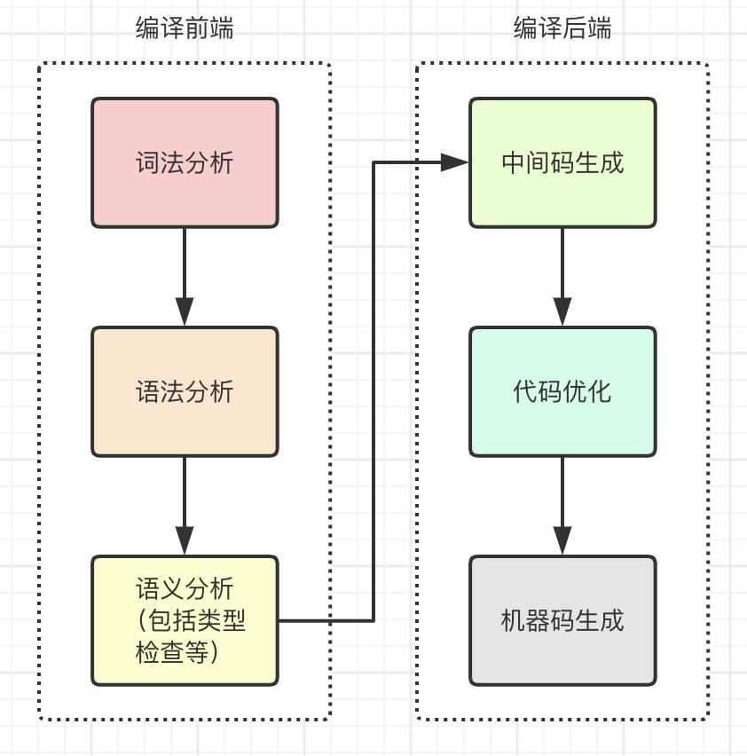

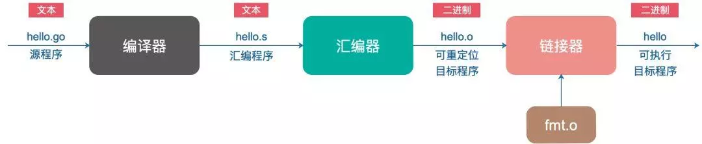

源码执行顺序：先执行全局变量，再执行init函数，再执行main函数。

**与其他语言的区别** <br>
* C、C++这类语言执行速度很快
* Ruby、Python这类语言擅长快速开发
* Go语言不仅提供了高性能，同时也让开发更迅速

## 特点
* 语法简洁，语法与C相近
* 编译速度非常快
* **内置并发机制**，不需要使用特定的线程库
* 自带垃圾回收器，不需要用户自己管理内存

为什么编译速度快<br>
使用了更加智能的编译器，并简化了解决依赖的算法。编译Go程序时，编译器只会关注那些直接被引用的库，而不是像Java、C和C++那样，要遍历依赖链中所有依赖的库。

## 标准交互输入
* fmt.Scan<br>
fmt.Scan交互式接受输入，通过空格来分词。调用Scan函数时，要指定接收输入的变量名和变量数。<br>
直到接收完所有指定的变量数，Scan函数才会返回，回车符也无法提前让它返回。
* fmt.Scanln<br>
Scanln调用时，也要指定接收输入的变量名和变量数。<br>
它同Scan的区别，在于\n会让函数提前返回，将返回时还未接收到值的变量赋为空。
* fmt.Scanf<br>
用Scanf处理输入，是比较灵活的一种处理方式。<br>
需要指定输入的格式，适用于完全了解输入格式的场景，可以直接把不需要的部分过滤掉。
```golang
package main

import "fmt"

func main() {
	//获取一行的数据
	var name string
	var age byte
	var sal float32
	var isPass bool

	fmt.Println("请输入姓名， 年龄， 薪水 是否通过考试， 使用空格隔开")
	fmt.Scan(&name, &age, &sal, &isPass)
	fmt.Scanln(&name, &age, &sal, &isPass)
	fmt.Scanf("%s %d %f %t", &name, &age, &sal, &isPass)
	fmt.Printf("名字：%v \n年龄：%v \n薪水：%v \n是否通过考试：%v \n", name, age, sal, isPass)
}
```

## 数据类型
### 数字
### 字符串
### 数组
数组是一个**长度固定**的数据类型，用于存储一段具有相同的类型的元素的连续块。<br>

**特点**<br>
数组的每个元素类型相同，又是连续分配，因此可以以固定速度索引数组中的任意数据，速度非常快。

声明方式<br>
**一旦声明，数组里存储的数据类型和数组长度就都不能改变了**。
```golang
//方式一
//声明一个包含5个元素的整型数组，默认为零值
var array [5]int

//方式二
//声明一个包含5个元素的整型数组
//用具体值初始化每个元素
array := [5]int{10,20,30,40,50}

//方式三
//声明一个整型数组
//用具体值初始化每个元素
//容量由初始化值的数量决定
array := [...]int{10,20,30,40,50}

//方式四
//声明一个有五个元素的数组
//用具体值初始化索引为1和2的元素
//其余元素保持零值 
array := [5]int{1:10, 2:20}
```

数组之间的赋值<br>
数组变量的类型包括数组长度和每个元素的类型。只有这两部分都相同的数组，才是类型相同的数组，才能互相赋值。<br>

复制
```golang
array1 := [5]int{1,2,3,4,5}
array2 = array1 //拷贝副本，数组修改没有联动性
```

在函数间传递数组<br>
如果是值传递，要复制整个数组。如果传递数组的指针，会更有效地利用内存，性能也更好。但是如果改变指针的值，会改变共享的内存。使用切片能更好地处理这类共享问题。

### 切片
**特点**<br>
切片可以动态增长。因为切片的底层内存也是在连续块中分配的，所以切片还能获得索引、迭代以及为垃圾回收优化的好处。

**内部实现**<br>
切片对底层数组进行了抽象，并提供相关的操作方法。切片有三个字段的数据结构，这些数据结构包含Go语言需要操作底层数组的元数据。这3个字段分别是指向底层数组的指针、切片访问的元素的个数（即长度）和切片允许增长到的元素个数（即容量）。

**创建和初始化**
* 使用内置的make函数<br>
make函数需要传入切片的长度。不允许创建容量小于长度的切片。
```golang
//创建一个字符串切片
//其长度和容量都是5个元素
slice := make([]string, 5)

//创建一个整型切片
//其长度为3个元素，容量为5个元素
slice := make([]int, 3, 5) //底层数组拥有5个元素，切片能访问3个元素
```
底层数组的长度是指定的容量。
* 通过切片字面量来声明切片<br>
```golang
//创建字符串切片
//其长度和容量都是5个元素
slice := []string{"Red", "Blue", "Green", "Yellow", "Pink"}

slice := []string{99: ""}
```
如果在[]运算符里指定了一个值，那么创建的就是数组而不是切片。只有不指定值的时候，才会创建切片。
```golang
//创建有3个元素的整型数组
array := [3]int{10, 20, 30}

//创建长度和容量都是3的整型切片
slice := []int{10, 20, 30}
```

nil和空切片
* 创建nil切片
```golang
//创建nil整型切片
var slice []int
```
* 声明空切片
```golang
//使用make创建空的整型切片
slice := make([]int, 0)

//使用切片字面量创建空的整型切片
slice := []int{}
```

使用切片<br>
* 赋值<br>
可以使用索引，使用[]操作符就可以改变某个元素的值。
* 切片<br>
使用切片创建切片
```golang
//创建一个整型切片
//其长度和容量都是5个元素
slice := []int{10, 20, 30, 40, 50}

//创建一个新切片
//其长度为2个元素，容量为4个元素
newSlice := slice[1:3]
```
底层数组

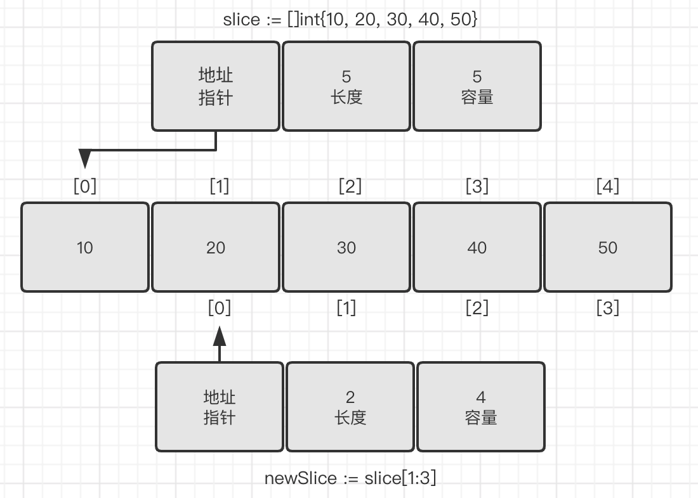

切片slice可以看到底层数组全部5个元素的容量。切片newSlice底层数组容量只有4个元素，无法访问到它所指向的底层数组的第一个元素之前的部分。

计算长度和容量
> 对底层数组容量是k的切片slice[i:j]来说<br>
长度：j - i<br>
容量：k - i<br>
容量是与切片相关联的所有元素的数量。

**修改切片内容可能导致的结果**<br>
两个切片共享同一个底层数组。如果一个切片修改了该底层数组的共享部分，另一个切片也能感知到。
```golang
//创建一个整型切片
//其长度和容量都是5个元素
slice := []int{10, 20, 30, 40, 50}

//创建一个新切片
//其长度是2个元素，容量是4个元素
newSlice := slice[1:3]

//修改newSlice索引为1的元素
//同时也修改了原来的slice的索引为2的元素
newSlice[1] = 35
```
底层数组

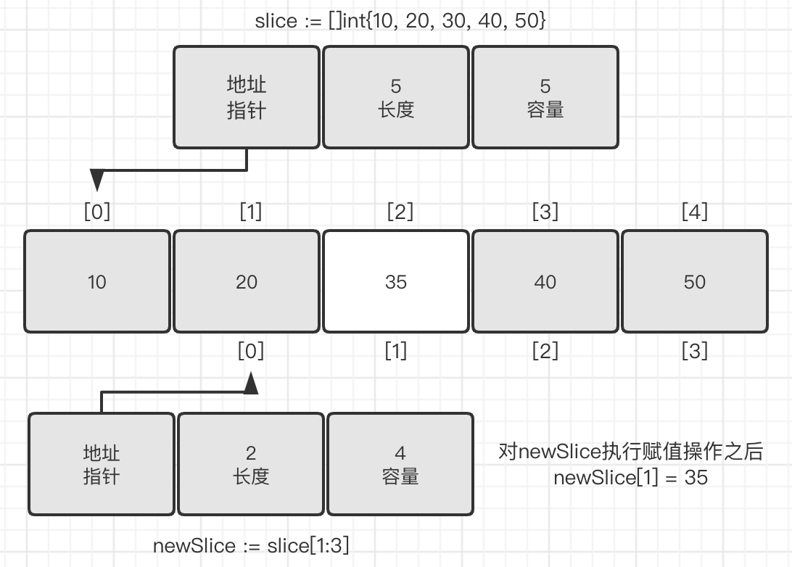

切片只能访问其长度内的元素。与切片的容量相关联的元素只能用于增长切片。在使用这部分元素前，必须将其合并到切片的长度里。使用内置函数append来做这种合并。

切片增长<br>
相对于数组而言，使用切片的一个好处是，可以按需增加切片的容量。

使用append向切片增加元素
```golang
//创建一个整型切片
//其长度和容量都是5个元素
slice := []int{10, 20, 30, 40, 50}

//创建一个新切片
//其长度为2个元素，容量为4个元素
newSlice := slice[1:3]

//使用原有的容量来分配一个新元素
//将新元素赋值为60
newSlice = append(newSlice, 60)
```
底层数组

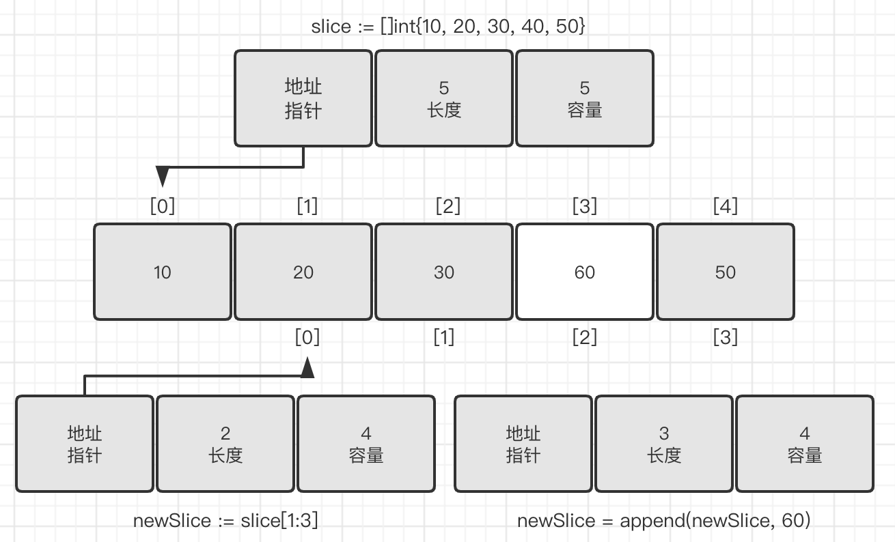

因为newSlice在底层数组里还有额外的容量可用，append操作将可用的元素合并到切片的长度，并对其进行赋值。由于和原始的slice共享同一个底层数组，slice中索引为3的元素的值也被改动了。<br>
如果切片的底层数组没有足够的可用容量，append函数会创建一个新的底层数组，将被引用的现有的值复制到新数组里，再追加新的值。<br>
函数append会智能地处理底层数组的容量增长。

**创建切片时的3个索引**<br>
第三个索引可以用来控制新切片的容量。其目的并不是要增加容量，而是要限制容量。允许限制新切片的容量为底层数组提供了一定的保护，可以更好地控制追加操作。
```golang
//创建字符串切片
//其长度和容量都是5个元素
source := []string{"Apple", "Orange", "Plum", "Banana", "Grape"}

//将第三个元素切片，并限制容量
//其长度为1个元素，容量为2个元素
slice := source[2:3:4]
```

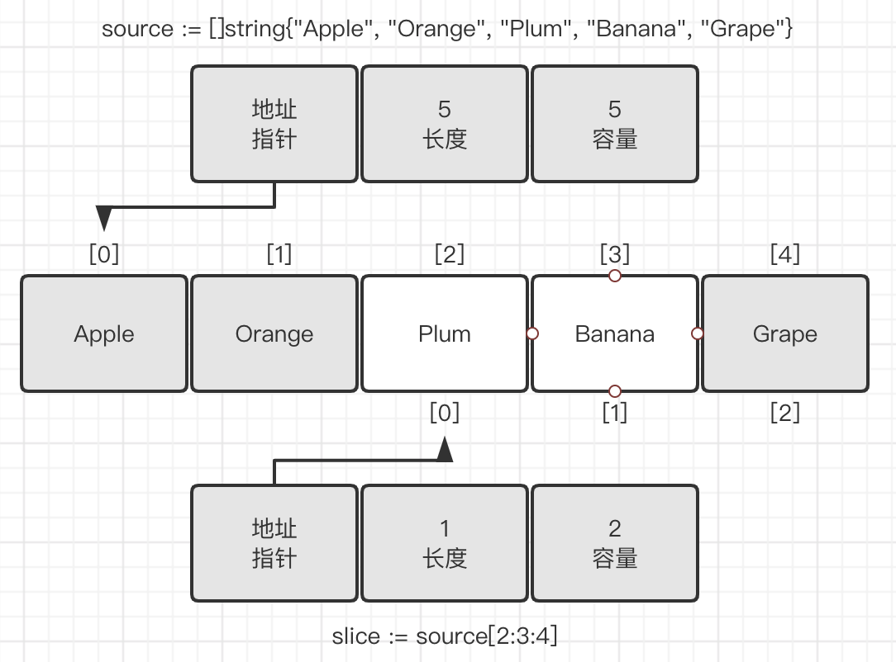

如果试图设置的容量比可用的容量还大，就会得到一个语言运行时错误。<br>

内置函数append会首先使用可用容量。一旦没有可用容量，会分配一个新的底层数组。这导致很容易忘记切片间正在共享同一个底层数组。一旦发生这种情况，对切片进行修改，很可能会导致随机且奇怪的问题。**对切片内容的修改会影响多个切片，却很难找到问题的原因**。<br>
**如果在创建切片时设置切片的容量和长度一样，就可以强制让切片的第一个append操作创建新的底层数组，与原有的底层数组分离。新切片与原有的底层数组分离后，可以安全地进行后续修改**。

迭代切片<br>
range创建了每个元素的副本，而不是直接返回对该元素的引用。

在函数间传递切片<br>
在函数间传递切片就是要在函数间以值的方式传递切片。由于切片的尺寸很小，**在函数间复制和传递切片成本也很低**。
```golang
//分配包含100万个整型值的切片
slice := make([]int, 1e6)

//将slice传递到函数foo
slice = foo(slice)

//函数foo接收一个整型切片，并返回这个切片
func foo(slice []int)[]int{
    ...
    return slice
}
```
在64位架构的机器上，一个切片需要24字节的内存：指针字段需要8字节，长度和容量字段分别需要8字节。由于与切片关联的数据包含在底层数组里，不属于切片本身，所以将切片复制到任意函数的时候，对底层数组大小都不会有影响。复制时只会复制切片本身，不会涉及底层数组。

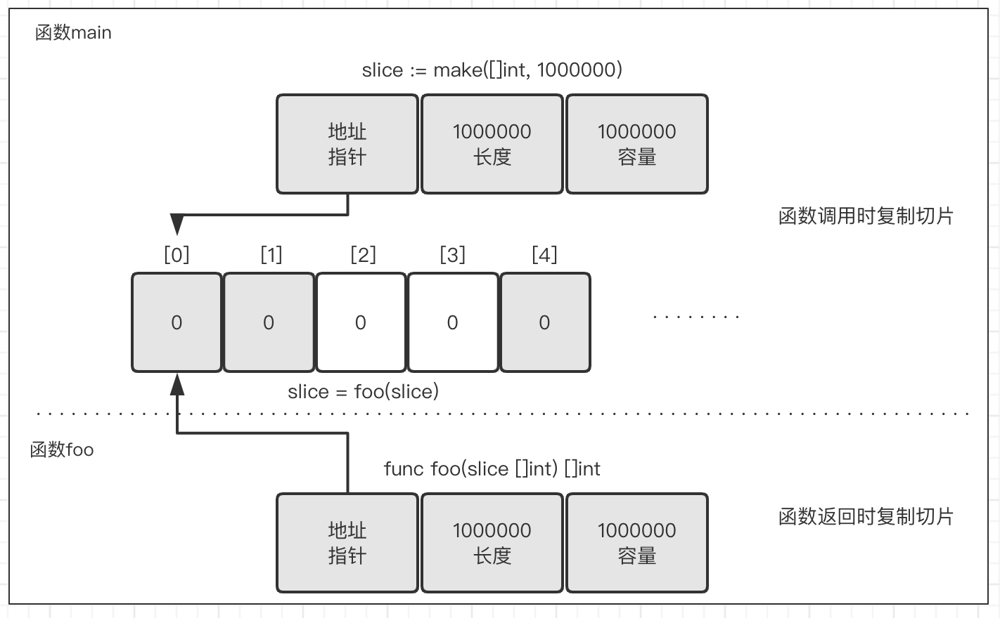

在函数间传递24字节的数据会非常快速、简单。这也是切片效率高的地方。不需要传递指针和处理复杂的语法，只需要复制切片，按想要的方式修改数据，然后传递回一份新的切片副本。

### 映射
映射是一种数据结构，用于存储一系列无序的键值对。<br>
映射基于键来存储值。映射功能强大的地方是，能够基于键快速检索数据。键就像索引一样，指向与该键关联的值。

内部实现<br>
映射是无序的集合，映射的实现使用了散列表。<br>
散列表是由hmap实现的，hmap中维护着存储键值对的bucket数组，hmap和bucket数组的关系如下图所示。

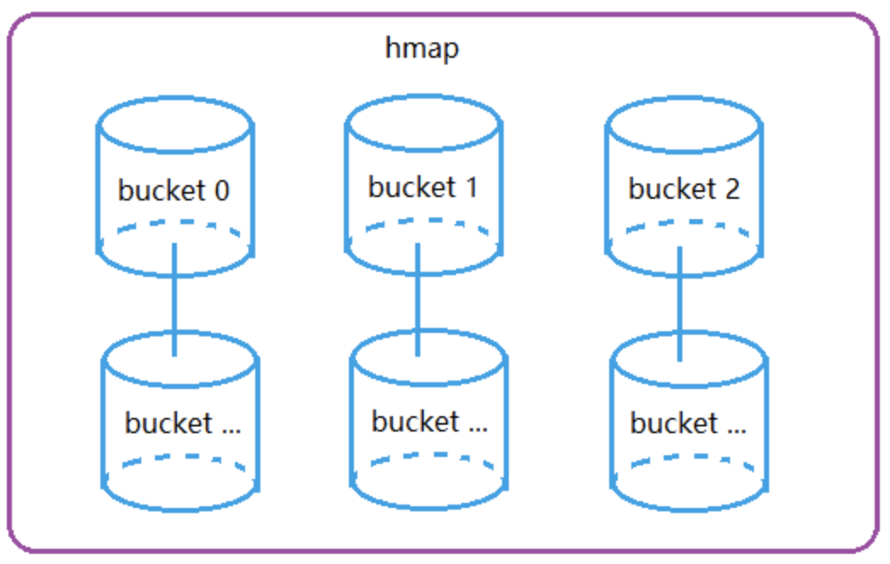

bucket是一个链表结构，每一个bucket后面连接的bucket表示bucket容量不够用时进行扩容添加新的bucket，bucket的数据结构如下图所示。


说到散列表，一定要有散列函数，散列函数是散列表中存取元素的关键。Go语言的映射中也有这样的散列函数(或叫哈希函数)。它把散列值分成了高8位和低8位两部分，如下图所示。

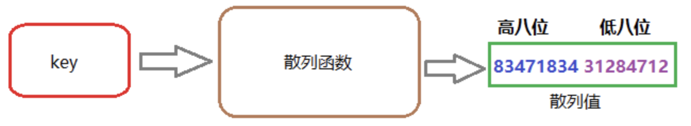

映射的存取过程：在存储、删除或者查找键值对的时候，都要先将指定的键传给散列函数得到一个散列值，然后根据散列值的低8位选中对应的桶，最终再根据桶中的索引(散列值的高8位)将键值对分布到这个桶里。随着映射中存储的增加，索引分布越均匀，访问键值对的速度就越快。因此，映射通过设置合理数量的桶平衡键值对的分布。整个过程如下图所示。<br>

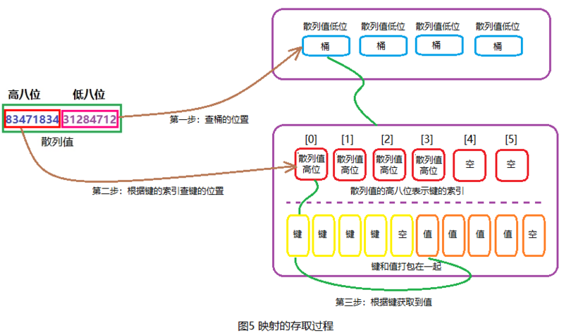

* 散列值的作用<br>
低8位散列值：用于寻找当前key位于哪个bucket。<br>
高8位散列值：用于寻找当前key位于bucket中的哪个位置。<br>
* **键值对的存储方式**：键值对的存储不是以key1，value1，key2，value2这样的形式存储，**主要是为了在key和value所占字节长度不同的时候，可以消除padding带来的空间浪费**。
* 映射的扩容：当散列表的容量需要增长的时候，Go语言会将bucket数组的容量扩充一倍，产生新的bucket数组，并将旧数据迁移到新数组。
* 判断是否扩充的条件，就是散列表的加载因子，加载因子是一个阈值，表示散列表的空间利用率，Go语言map中的加载因子计算公式为：map长度/2^B，阈值是6.5，B表示已扩容的次数。
* 映射中数据的删除<br>
如果key是指针类型的，直接将其置空，等待GC清除；<br>
如果是值类型的，则清除相关内存；<br>
对value做同样的操作；<br>
把key对应的索引置为空。

创建和初始化<br>
* 使用make声明映射<br>
```golang
//创建一个映射，键的类型是string，值的类型是int
dict := make(map[string]int)
```
* 使用映射字面量
```golang
//创建一个映射，键和值的类型都是string
//使用两个键值对初始化映射
dict := map[string]string{"Red": "#da1337", "Orange": "#e95a22"}
```
**映射的键**：可以是内置的类型，也可以是结构类型，只要这个值可以使用==运算符做比较。切片、函数以及包含切片的结构类型这些类型由于具有引用语义，不能作为映射的键，使用这些类型会造成编译错误。

使用映射<br>
* 为映射赋值
```golang
//创建一个空映射
colors := map[string]string{}
//为映射赋值
colors["Red"] = "#da1337"
```
可以通过声明一个未初始化的映射来创建一个值为nil的映射（称为nil映射）。nil映射不能用于存储键值对，否则，会产生一个语言运行时错误。
```golang
//通过声明映射创建一个nil映射
var colors map[string]string
//为映射赋值
colors["Red"] = "#da1337"

Runtime Error:
panic: runtime error: assignment to entry in nil map
```
* 复制
```golang
map1 := map[string]int{"like":1}
map2 = map1 //修改有联动性
```
* 从映射取值
```golang
//获取键对应的值
value, exists := colors["Blue"]
//这个键存在吗？
if exists{
    fmt.Println(value)
}
```
* 使用range迭代映射<br>
range返回的是键值对
* 从映射中删除一项
```golang
delete(colors, "Coral")
```

映射的增长没有容量或者任何限制。没有内置函数cap。

**在函数间传递映射**<br>
**当传递映射给一个函数，并对这个映射做了修改时，所有对这个映射的引用都会察觉到这个修改。这个特性和切片类似，保证可以用很小的成本来复制映射。**

### 结构体
声明和初始化
```golang
//user在程序里定义一个用户类型
type user struct{
    name        string
    email       string
    ext         int
    privileged  bool
}

//三种声明方式
//声明user类型的变量，默认值为对应数据类型的零值
var lisa user
//声明user类型的变量，并初始化所有字段
lisa := user{
    name:       "Lisa",
    email:      "lisa@email.com",
    ext:        123,
    privileged: true,
}
//声明user类型的变量
lisa := user{"Lisa", "lisa@email.com", 123, true}
```
编译器不会对不同类型的值做隐式转换。

**在函数间传递结构体**<br>
**传递结构体给函数，是值传递，修改没有联动性；传递结构体的地址给函数时，是指针传递，修改有联动性。**

## 方法
方法能给用户定义的类型添加新的行为。方法实际上也是函数，只是在声明时，在关键字func和方法名之间增加了一个参数。
```golang
package main

import(
	"fmt"
)

//user在程序里定义一个用户类型
type user struct{
	name 	string
	email 	string
}

//notify使用值接收者实现了一个方法
func (u user) notify(){
	fmt.Printf("Sending User Email To %s<%s>\n", u.name, u.email)
}

//changeEmail使用指针接收者实现了一个方法
func (u *user) changeEmail(email string){
	u.email = email
}

//main是应用程序的入口
func main(){
	//user类型的值可以用来调用使用值接收者声明的方法
	bill := user{"Bill", "bill@email.com"}
	bill.notify() //方法notify会接收到bill的值的一个副本

	//指向user类型值的指针也可以用来调用使用值接收者声明的方法
	lisa := &user{"Lisa", "lisa@email.com"}
	lisa.notify() //Go编译器将指针解引用为值，(*)lisa.notify()，操作的是从lisa指针指向的值的副本

	//user类型的值可以用来调用使用指针接收者声明的方法
	bill.changeEmail("bill@newdomain.com")
	bill.notify() //Go编译器首先引用bill值得到一个指针，这样这个指针就能够匹配方法的接收者类型，再进行调用。(&bill).changeEmail("bill@newdomain.com")
	

	//指向user类型值的指针可以用来调用使用指针接收者声明的方法
	lisa.changeEmail("lisa@comcast.com") //当调用使用指针接收者声明的方法时，这个方法会共享调用方法时接收者所指向的值
	lisa.notify()
}
```
关键字func和和函数名之间的参数被称作接收者，将函数与接收者的类型绑在一起。如果一个函数有接收者，这个函数就被称为方法。<br>
**值接收者使用值的副本来调用方法，而指针接收者使用实际值来调用方法**。<br>
**Go语言既允许使用值，也允许使用指针来调用方法，不必严格符合接收者的类型**。<br>
使用值接收者还是指针接收者，不应该由该方法是否修改了接收者的值来决定。这个决策应该基于该类型的本质。这条规则的一个例外是，需要让类型值符合某个接口的时候，即便类型的本质是非原始本质的，也可以选择使用值接收者声明方法。

## 接口
接口是声明了一组行为并支持多态的类型。<br>
接口是用来定义行为的类型。这些被定义的行为不由接口直接实现，而是通过方法由用户定义的类型实现。如果用户定义的类型实现了某个接口类型声明的一组方法，那么这个用户定义的类型的值就可以赋给这个接口类型的值。这个赋值会把用户定义的类型的值存入接口类型的值。<br>
对接口值方法的调用会执行接口值里存储的用户定义的类型的值对应的方法。因为任何用户定义的类型都可以实现任何接口，所以对接口值方法的调用自然就是一种多态。

## 方法集
方法集定义了接口的接受规则。<br>
方法集的规则

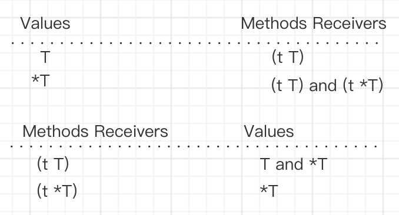

因为不是总能获取一个值的地址，所以值的方法集只包括了使用值接收者实现的方法。

## 多态
对接口值方法的调用会执行接口值里存储的用户定义的类型的值对应的方法。因为任何用户定义的类型都可以实现任何接口，所以对接口值方法的调用自然就是一种多态。
```golang
//这个示例程序使用接口展示多态行为
package main

import (
	"fmt"
)

//notifier是一个定义了通知类行为的接口
type notifier interface{
	notify()
}

//user在程序里定义一个用户类型
type user struct{
	name	string
	email 	string
}

//notify使用指针接收者实现了notifier接口
func (u *user)notify(){
	fmt.Printf("Sending user email to %s<%s>\n", u.name, u.email)
}

//admin定义了程序里的管理员
type admin struct{
	name 	string
	email 	string
}

//notify使用指针接收者实现了notifier接口
func (a *admin)notify(){
	fmt.Printf("Sending admin email to %s<%s>\n", a.name, a.email)
}

//main程序是应用程序的入口
func main(){
	//创建一个user值并传给sendNotification
	bill := user{"Bill", "bill@email.com"}
	sendNotification(&bill)

	//创建一个admin值并传给sendNotification
	lisa := admin{"Lisa", "lisa@email.com"}
	sendNotification(&lisa)

}

//sendNotification接受一个实现了notifier接口的值
//并发送通知
func sendNotification(n notifier){
	n.notify()
}
```

## 嵌入类型
嵌入类型是将已有的类型直接声明在新的结构类型里。被嵌入的类型被称为新的外部类型的内部类型。<br>
通过嵌入类型，与内部类型相关的标识符会提升到外部类型上。这些被提升的标识符就像直接声明在外部类型里的标识符一样，也是外部类型的一部分。这样外部类型就组合了内部类型包含的所有属性，并且可以添加新的字段和方法。外部类型也可以通过声明与内部类型标识符同名的标识符来覆盖内部标识符的字段或者方法。这就是扩展或者修改已有类型的方法。<br>
嵌入类型提供了扩展类型的能力，而无需使用继承。
```golang
//这个示例程序展示如何将一个类型嵌入另一个类型，以及内部类型和外部类型之间的关系
package main

import (
	"fmt"
)

//user在程序里定义一个用户类型
type user struct{
	name 	string
	email 	string
}

//notifier是一个定义了通知类行为的接口
type notifier interface{
	notify()
}

//notify实现了一个可以通过user类型值的指针调用的方法
func(u *user) notify(){
	fmt.Printf("Sending user email to %s<%s>\n", u.name, u.email)
}

//admin代表一个拥有权限的管理员用户
type admin struct {
	user    //嵌入类型
	level 	string
}

//main是应用程序的入口
func main(){
	//创建一个admin用户
	ad := admin{
		user:  user{
			name:	"john smith",
			email:	"john@yahoo.com",
		},
		level: "super",
	}

	//内部类型的方法被提升到外部类型
	sendNotification(&ad)

	//可以直接访问内部类型的方法
	ad.user.notify()

	//内部类型的方法也被提升到外部类型
	ad.notify()
}

//sendNotification接受一个实现了notifier接口的值并发送通知
func sendNotification(n notifier){
	n.notify()
}
```

当内部类型和外部类型要实现同一个接口时
```golang
//这个示例程序展示当内部类型和外部类型要实现同一个接口时的做法
package main

import (
	"fmt"
)

//notifier是一个定义了通知类行为的接口
type notifier interface{
	notify()
}

//user在程序里定义一个用户类型
type user struct{
	name 	string
	email 	string
}

//通过user类型值的指针调用的方法
func(u *user) notify(){
	fmt.Printf("Sending user email to %s<%s>\n", u.name, u.email)
}

//admin代表一个拥有权限的管理员用户
type admin struct {
	user    //嵌入类型
	level 	string
}

//通过admin类型值的指针调用的方法
func(a *admin) notify(){
	fmt.Printf("Sending admin email to %s<%s>\n", a.name, a.email)
}

//main是应用程序的入口
func main(){
	//创建一个admin用户
	ad := admin{
		user:  user{
			name:	"john smith",
			email:	"john@yahoo.com",
		},
		level: "super",
	}

	//给admin用户发送一个通知
	//接口的嵌入的内部类型实现并没有提升到外部类型
	sendNotification(&ad)

	//可以直接访问内部类型的方法
	ad.user.notify()

	//内部类型的方法没有被提升
	ad.notify()
}

//sendNotification接受一个实现了notifier接口的值并发送通知
func sendNotification(n notifier){
	n.notify()
}
```
如果外部类型实现了同名的方法，内部类型的实现不会被提升。不过内部类型的值一直存在，因此还可以直接访问内部类型的值，来调用没有被提升的内部类型实现的方法。

## 异常处理
Golang的异常处理组合panic，defer，recover。

defer<br>
作用：defer表达式通常用来处理一些清理和释放资源的操作。<br>
调用顺序：defer表达式会被放入一个类似于栈(stack)的结构，所以调用的顺序是后进先出的。

panic：在go中，当程序出现异常时，会发生panic。当发生panic后，需要使用recover捕获，如果没有捕获，则程序退出。

recover：捕获异常。

* defer需要放在panic之前定义，另外recover只有在defer调用的函数中才有效。
* recover处理异常后，逻辑并不会恢复到panic那个点去，函数跑到defer之后的那个点。
* 多个defer会形成defer栈，后定义的defer语句会被最先调用。

recover用来对panic的异常进行捕获。panic用于向上传递异常，执行顺序是在defer之后。
```Golang
package main 
import "fmt" 
import "runtime/debug" 
 
func fun() {
    fmt.Println("fun begin")
 
	defer func() {
			//捕获panic
		if err := recover(); err != nil {
			debug.PrintStack()
			//获取堆栈信息的字符串
			fmt.Println("xxx", string(debug.Stack()))
		}
	}()
 
	var p *int
	//产生异常
	*p = 0
	fmt.Println("fun end")
 	//这里不执行
	for {}
}
 
func main() {
	fmt.Println("main begin")
	fun()
	//因为panic被recover捕获，所以下面继续执行
	fmt.Println("main end")
 
	for {}
}
```

## 并发
Go语言的并发同步模型通过在goroutine之间传递数据来传递消息，而不是对数据进行加锁来实现同步访问。用于在goroutine之间同步和传递数据的关键数据类型叫作通道（channel）。

### **进程和线程**
当运行一个应用程序（如一个IDE或者编辑器）的时候，操作系统会为这个应用程序启动一个进程。可以将这个进程看作一个包含了应用程序在运行中需要用到和维护的各种资源的容器。这些资源包括但不限于内存地址空间、文件和设备的句柄以及线程。<br>
一个线程是一个执行空间，这个空间会被操作系统调度来运行函数中所写的代码。每个进程至少包含一个线程，每个进程的初始线程被称作主线程。因为执行这个线程的空间是应用程序的本身的空间，所以当主线程终止时，应用程序也会终止。操作系统将线程调度到某个处理器上运行，这个处理器并不一定是进程所在的处理器。不同操作系统使用的线程调度算法一般都不一样，但是这种不同会被操作系统屏蔽，并不会展示给程序员。<br>

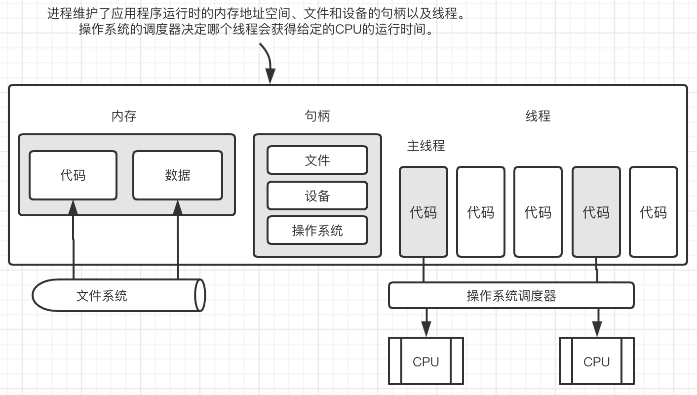

操作系统会在物理处理器上调度线程来进行，而Go语言的运行时会在逻辑处理器上调度goroutine来运行。每个逻辑处理器都分别绑定到单个操作系统线程。Go语言的运行时默认会为每个可用的物理处理器分配一个逻辑处理器。这些逻辑处理器会用于执行所有被创建的goroutine。

### **Go并发调度模型**
[参考](https://www.cnblogs.com/yangfantuan/p/12533463.html#1516809659)<br>
使用两级线程模型，用户线程与KSE（内核调度实体）是多对多关系（M:N），用户调度器实现用户线程到KSE的“调度”，内核调度器实现KSE到CPU上的调度。

Go运行时系统通过构造G-P-M对象模型实现了一套用户态的并发调度系统，可以自己管理和调度自己的并发任务，所以可以说Go语言原生支持并发。自己实现的调度器负责将并发任务分配到不同的内核线程上运行，然后内核调度器接管内核线程在CPU上的执行与调度。

G：Goroutine（协程），用户态线程。属于用户级资源，对OS透明，具备轻量级，可以大量创建，上下文切换成本低等特点。<br>
M：内核线程。由操作系统管理。<br>
P：Processor的简称，逻辑处理器，主要作用是管理G对象（每个P都有一个G队列），并为G在M上的运行提供本地化资源。表示执行上下文，用于匹配M和G。对于G而言，P就是cpu core。对于M而言，P就是上下文。

如果创建一个goroutine并准备运行，这个goroutine就会被放到调度器的全局运行队列中。之后，调度器就将这些队列中的goroutine分配给一个逻辑处理器，并放到这个逻辑处理器对应的本地运行队列中。本地运行队列中的goroutine会一直等待直到自己被分配的逻辑处理器执行。<br>

如何在一个多核心系统上尽量合理分配G到多个M上运行，充分利用多核，提高并发能力呢？<br>
Go运行时系统始终能保证至少有一个（通常也只有一个）活跃的M与空闲P绑定去各种G队列去寻找可运行的G任务，该种M称为自旋的M。**一般寻找顺序为：自己绑定的P的队列，全局队列，然后其他P队列**。如果自己P队列找到就拿出来开始运行，否则去全局队列看看，由于全局队列需要锁保护，如果里面有很多任务，会转移一批到本地P队列中，避免每次都去竞争锁。如果全局队列还是没有，就要开始玩狠的了，直接从其他P队列偷任务了（偷一半任务回来）。这样就保证了在还有可运行的G任务的情况下，总有与CPU核心数相等的M+P组合在执行G任务或在执行G的路上(寻找G任务)。

如果某个M在执行G的过程中被G中的系统调用阻塞了，怎么办？<br>
在这种情况下，这个M将会被内核调度器调度出CPU并处于阻塞状态，与该M关联的其他G就没有办法继续执行了，但Go运行时系统的一个监控线程(sysmon线程)能探测到这样的M，并把与该M绑定的P剥离，寻找其他空闲或新建M接管该P，然后继续运行其中的G。然后等到该M从阻塞状态恢复，需要重新找一个空闲P来继续执行原来的G，如果这时系统正好没有空闲的P，就把原来的G放到全局队列当中，等待其他M+P组合发掘并执行。

如果某一个G在M运行时间过长，有没有办法做抢占式调度，让该M上的其他G获得一定的运行时间，以保证调度系统的公平性？<br>
Go的运行时调度器中有抢占机制，但并不能保证抢占能成功，因为Go运行时系统并没有内核调度器的中断能力，它只能通过向运行时间过长的G中设置抢占flag的方法温柔的让运行的G自己主动让出M的执行权。<br>
Go抢占式调度的机制就是利用在判断要不要扩栈的时候顺便查看一下自己的抢占flag，决定是否继续执行，还是让出自己。<br>
运行时系统的监控线程会计时并设置抢占flag到运行时间过长的G，然后G在有函数调用的时候会检查该抢占flag，如果已设置就将自己放入全局队列，这样该M上关联的其他G就有机会执行了。但如果正在执行的G是个很耗时的操作且没有任何函数调用(如只是for循环中的计算操作)，即使抢占flag已经被设置，该G还是将一直霸占着当前M直到执行完自己的任务。

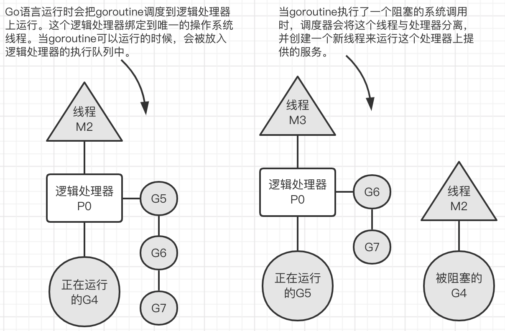

### **并发和并行**
并行是让不同的代码片段同时在不同的物理处理器上执行。并行的关键是同时做很多事情，而并发是指同时管理很多事情，这些事情可能只做了一半就被暂停去做别的事情了。如果希望让goroutine并行，必须使用多于一个逻辑处理器。当有多个逻辑处理器时，调度器会将goroutine平等分配到每个逻辑处理器上。这会让goroutine在不同的线程上运行。**不过要想真的实现并行的效果，用户需要让自己的程序运行在有多个物理处理器的机器上**。否则，哪怕Go语言运行时使用多个线程，goroutine依然会在同一个物理处理器上并发运行，达不到并行的效果。

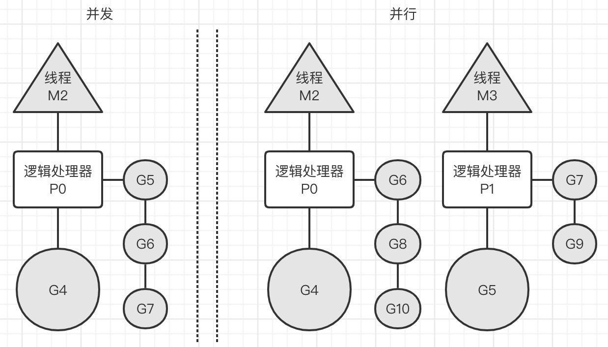

### **协程（goroutine）**
```golang
//这个示例程序展示如何创建goroutine以及goroutine调度器的行为
package main

import (
	"fmt"
	"runtime"
	"sync"
)

//main是所有Go程序的入口
func main(){
	//分配2个逻辑处理器给调度器使用
	runtime.GOMAXPROCS(2)

	//wg用来等待程序完成
	//计数加2，表示要等待两个goroutine
	var wg sync.WaitGroup
	wg.Add(2)

	fmt.Println("Start Goroutines")

	//声明一个匿名函数，并创建一个goroutine
	go func() {
		//在函数退出时调用Done来通知main函数工作已经完成
		defer wg.Done()

		//显示字母表3次
		for count := 0; count < 3; count++{
			for char := 'a'; char < 'a' + 26; char++ {
				fmt.Printf("%c ", char)
			}
		}
	}()

	//声明一个匿名函数，并创建一个goroutine
	go func() {
		//在函数退出时调用Done来通知main函数工作已经完成
		defer wg.Done()

		//显示字母表3次
		for count := 0; count < 3; count++{
			for char := 'A'; char < 'A' + 26; char++ {
				fmt.Printf("%c ", char)
			}
		}
	}()

	//等待goroutine结束
	fmt.Println("Waiting To Finish")
	wg.Wait()

	fmt.Println("\nTerminating Program")
}

//输出：
Start Goroutines
Waiting To Finish
A B C D E F G H I J K L M N O P Q R S a b c d e f g h i j k l m n o p q r s t u v w x y z a b c d e f g h i j k l m n o p q T U V W X Y Z A B C D E F G H I J K L r s t u v w x y z M N O P Q R a b c d e f S T U V W X Y Z A B C D E F G H I J K L M N O P Q R S T U V g h i j k l W X Y m n o p q r s t u Z v w x y z 
Terminating Program
```
只有在有多个逻辑处理器且可以同时让每个goroutine运行在一个可用的物理处理器上的时候，goroutine才会并行运行。

### 竞争状态
如果两个或者多个goroutine在没有互相同步的情况下，访问某个共享的资源，并试图同时读和写这个资源，就处于相互竞争的状态，这种情况被称作竞争状态。<br>
对一个共享资源的读和写操作必须是原子化的，换句话说，同一时刻只能有一个goroutine对共享资源进行读和写操作。
```golang
//这个示例程序展示如何在程序里造成竞争状态
//实际上不希望出现这种情况
package main

import (
	"fmt"
	"runtime"
	"sync"
)

var (
	//counter是所有goroutine都要增加其值的变量
	counter int

	//wg用来等待程序结束
	wg sync.WaitGroup
)

//main是所有Go程序的入口
func main(){
	runtime.GOMAXPROCS(1)
	//计数加2，表示要等待两个goroutine
	wg.Add(2)

	go incCounter(1)
	go incCounter(2)

	//等待goroutine结束
	wg.Wait()
	fmt.Println("Final Counter: ", counter)
}

//incCounter增加包里counter变量的值
func incCounter(id int){
	//在函数退出时调用Done来通知main函数工作已经完成
	defer wg.Done()

	for count := 0; count < 2; count++{
		//捕获counter的值
		value := counter
		//当前goroutine从线程退出，并放回到队列
		//强制调度器切换goroutine，以便让竞争状态的效果变得更明显
		runtime.Gosched()
		//增加本地value变量的值
		value++
		//将该值保存回counter
		counter = value
	}
}
```

### 锁住共享资源
* 原子函数<br>
原子函数能够以很底层的加锁机制来同步访问整型变量和指针。<br>
原子函数会将这些调用互相同步，保证这些操作都是安全的，不会进入竞争状态。
```golang
//这个示例程序展示如何使用atomic包来提供对数值类型的安全访问
package main

import (
	"fmt"
	"runtime"
	"sync"
	"sync/atomic"
)

var (
	//counter是所有goroutine都要增加其值的变量
	counter int64

	//wg用来等待程序结束
	wg sync.WaitGroup
)

//main是所有Go程序的入口
func main(){
	runtime.GOMAXPROCS(1)
	//计数加2，表示要等待两个goroutine
	wg.Add(2)

	//创建两个goroutine
	go incCounter(1)
	go incCounter(2)

	//等待goroutine结束
	wg.Wait()
	//显示最终的值
	fmt.Println("Final Counter: ", counter)
}

//incCounter增加包里counter变量的值
func incCounter(id int){
	//在函数退出时调用Done来通知main函数工作已经完成
	defer wg.Done()

	for count := 0; count < 2; count++{
		//安全地对counter加1
		atomic.AddInt64(&counter, 1)
		//当前goroutine从线程退出，并放回到队列
		runtime.Gosched()
	}
}
```
```golang
//这个示例程序展示如何使用atomic包里的Store和Load类函数来提供对数值函数的安全访问
package main

import (
	"fmt"
	"runtime"
	"sync"
	"sync/atomic"
	"time"
)

var (
	//shutdown是通知正在执行的goroutine停止工作的标志
	shutdown int64

	//wg用来等待程序结束
	wg sync.WaitGroup
)

//main是所有Go程序的入口
func main(){
	runtime.GOMAXPROCS(1)
	//计数加2，表示要等待两个goroutine
	wg.Add(2)

	//创建两个goroutine
	go doWork("A")
	go doWork("B")
	
	//给定goroutine执行的时间
	time.Sleep(1 * time.Second)
	
	//该停止工作了，安全地设置shutdown标志
	fmt.Println("Shutdown Now")
	atomic.StoreInt64(&shutdown, 1)

	//等待goroutine结束
	wg.Wait()
}

//doWork用来模拟执行工作的goroutine，检测之前的shutdown标志来决定是否提前终止
func doWork(name string){
	//在函数退出时调用Done来通知main函数工作已经完成
	defer wg.Done()

	for{
		fmt.Printf("Doing %s Work\n", name)
		time.Sleep(250 * time.Millisecond)
		
		//要停止工作了吗？
		if atomic.LoadInt64(&shutdown) == 1{
			fmt.Printf("Shutting %s Down\n", name)
			break
		}
	}
}
```
* 互斥锁<br>
互斥锁（mutex）用于在代码上创建一个临界区，保证同一时间只有一个goroutine可以执行这个临界代码区。
```golang
//这个示例程序展示如何使用互斥锁来定义一段需要同步访问的代码临界区
//资源的同步访问
package main

import (
	"fmt"
	"runtime"
	"sync"
)

var (
	//counter是所有goroutine都要增加其值的变量
	counter int

	//wg用来等待程序结束
	wg sync.WaitGroup

	//mutex用来定义一段代码临界区
	mutex sync.Mutex
)

//main是所有Go程序的入口
func main(){
	runtime.GOMAXPROCS(1)
	//计数加2，表示要等待两个goroutine
	wg.Add(2)

	//创建两个goroutine
	go incCounter(1)
	go incCounter(2)

	//等待goroutine结束
	wg.Wait()
	fmt.Printf("Final Counter: %d\n", counter)
}

//incCounter使用互斥锁来同步并保证安全访问，增加包里counter变量的值
func incCounter(id int){
	//在函数退出时调用Done来通知main函数工作已经完成
	defer wg.Done()

	for count := 0; count < 2; count++{
		//同一时刻只允许一个goroutine进入这个临界区
		mutex.Lock()

		//捕获counter的值
		value := counter
		//当前goroutine从线程退出，并放回到队列
		runtime.Gosched()
		//增加本地value变量的值
		value++
		//将该值保存回counter
		counter=value

		mutex.Unlock()
		//释放锁，允许其他正在等待的goroutine进入临界区
	}
}
```

### **通道**
通道通过发送和接收需要共享的资源，在goroutine之间做同步。<br>
当一个资源需要在goroutine之间共享时，通道在goroutine之间架起了一个管道，并提供了确保同步交换数据的机制。声明通道时，需要指定将要被共享的数据的类型。可以通过通道共享内置类型、命名类型、结构类型和引用类型的值或者指针。
```golang
//使用make创建通道
//无缓冲的整型通道
unbuffered := make(chan int) //指定交换的数据类型
//有缓冲的字符串通道
buffered := make(chan string, 10) //指定交换的数据类型和缓冲区大小

//向通道发送值
//有缓冲的字符串通道
buffered := make(chan string, 10)
//通过通道发送一个字符串
buffered <- "Gopher"

//从通道里接收值
//从通道接收一个字符串
value := <-buffered
```
* 无缓冲的通道<br>
无缓冲的通道是指在接收前没有能力保存任何值的通道。这种类型的通道要求发送goroutine和接收goroutine同时准备好，才能完成发送和接收操作。如果两个goroutine没有同时准备好，通道会导致先执行发送或接收操作的goroutine阻塞等待。这种对通道进行发送和接收的交互行为本身就是同步的。其中任意一个操作都无法离开另一个操作单独存在。
```golang
//这个示例程序展示如何用无缓冲的通道来模拟2个goroutine间的网球比赛
package main

import (
	"fmt"
	"math/rand"
	"sync"
	"time"
)

//wg用来等待程序结束
var wg sync.WaitGroup

func init(){
	rand.Seed(time.Now().UnixNano())
}

//main是所有Go程序的入口
func main(){
	//创建一个无缓冲的通道
	court := make(chan int)
	//计数加2，表示要等待两个goroutine
	wg.Add(2)

	//启动两个选手
	go player("Nadal", court)
	go player("Djokovic", court)

	//发球
	court <- 1

	//等待游戏结束
	wg.Wait()
}

//player模拟一个选手在打网球
func player(name string, court chan int){
	//在函数退出时调用Done来通知main函数工作已经完成
	defer wg.Done()

	for{
		//等待球被击打过来
		ball, ok := <-court
		if !ok{
			//如果通道被关闭，我们就赢了
			fmt.Printf("Player %s Won \n", name)
			return
		}

		//选随机数，然后用这个数来判断我们是否丢球
		n := rand.Intn(100)
		if n %13 == 0{
			fmt.Printf("Player %s Missed\n", name)
			//关闭通道，表示我们输了
			close(court)
			return
		}

		//显示击球数，并将击球数加1
		fmt.Printf("Player %s Hit %d\n", name, ball)
		ball++
		//将球打向对手
		court <- ball
	}
}
```
```golang
//这个示例程序展示如何用无缓冲的通道来模拟4个goroutine间的接力比赛
package main

import (
	"fmt"
	"sync"
	"time"
)

//wg用来等待程序结束
var wg sync.WaitGroup

//main是所有Go程序的入口
func main()  {
	//创建一个无缓冲的通道
	baton := make(chan int)
	//为最后一位跑步者将计数加1
	wg.Add(1)
	//第一位跑步者持有接力棒
	go Runner(baton)
	//开始比赛
	baton<-1
	//等待比赛结束
	wg.Wait()
}

//Runner模拟接力比赛中的一位跑步者
func Runner(baton chan int){
	var newRunner int
	//等待接力棒
	runner := <-baton
	//开始绕着跑道跑步
	fmt.Printf("Runner %d Running With Baton\n", runner)

	//创建下一位跑步者
	if runner != 4{
		newRunner = runner + 1
		fmt.Printf("Runner %d To The Line\n", runner)
		go Runner(baton)
	}

	//围绕跑道跑
	time.Sleep(100 * time.Millisecond)

	//比赛结束了吗？
	if runner == 4{
		fmt.Printf("Runner %d Finished, Race Over\n", runner)
		wg.Done()
		return
	}

	//将接力棒交给下一位跑步者
	fmt.Printf("Runner %d Exchange With Runner %d\n", runner, newRunner)

	baton<-newRunner
}
```

* 有缓冲的通道<br>
有缓冲的通道是一种在被接收前能存储一个或者多个值的通道。这种类型的通道并不强制要求goroutine之间必须同时完成发送和接收。通道会阻塞发送和接收动作的条件也会不同。只有在通道中没有要接收的值时，接收动作才会阻塞。只有在通道没有可用缓冲容纳被发送的值时，发送动作才会阻塞。这导致有缓冲的通道和无缓冲的通道之间的一个很大的不同：无缓冲的通道保证进行发送和接收的goroutine会在同一时间进行数据交换；有缓冲的通道没有这种保证。
```golang
//这个示例程序展示如何使用有缓冲的通道和固定数目的goroutine来处理一堆工作
package main

import (
	"fmt"
	"math/rand"
	"sync"
	"time"
)

const (
	numberGoroutines = 4	//要使用的goroutine的数量
	taskLoad		 = 10	//要处理的工作的数量
)

//wg用来等待程序完成
var wg sync.WaitGroup

//init初始化包，Go语言运行时会在其他代码执行之前优先执行这个函数
func init(){
	//初始化随机数种子
	rand.Seed(time.Now().Unix())
}

//main是所有Go程序的入口
func main()  {
	//创建一个有缓冲的通道来管理工作
	tasks := make(chan string, taskLoad)
	//启动goroutine来处理工作
	wg.Add(numberGoroutines)
	for gr := 1; gr <= numberGoroutines; gr++{
		go worker(tasks, gr)
	}
	//增加一组要完成的工作
	for post := 1; post <= taskLoad; post++{
		tasks <- fmt.Sprintf("Task : %d", post)
	}
	//当所有工作都处理完时关闭通道以便所有goroutine退出
	close(tasks)
	//等待所有工作完成
	wg.Wait()
}

//worker作为goroutine启动来处理从有缓冲的通道传入的工作
func worker(tasks chan string, worker int){
	//通知函数已经返回
	defer wg.Done()

	for{
		//等待分配工作
		task, ok := <-tasks
		if !ok{
			//这意味着通道已经空了，并且已被关闭
			fmt.Printf("Worker: %d : Shutting Down\n", worker)
			return
		}
		//显示我们开始工作了
		fmt.Printf("Worker: %d : Started %s\n", worker, task)
		//随机等一段时间来模拟工作
		sleep := rand.Int63n(100)
		time.Sleep(time.Duration(sleep) * time.Millisecond)
		//显示我们完成了工作
		fmt.Printf("Worker: %d : Completed %s\n", worker, task)
	}
}
```
**当通道关闭后，goroutine依旧可以从通道接收数据，但是不能再向通道里发送数据**。能够从已经关闭的通道接收数据这一点非常重要，因为这允许通道关闭后依旧能取出其中缓冲的全部值，而不会有数据丢失。

## 内存管理
[参考](https://www.jianshu.com/p/7405b4e11ee2)
### 内存分配
[参考](https://www.jianshu.com/p/7405b4e11ee2)<br>
内存分配模型

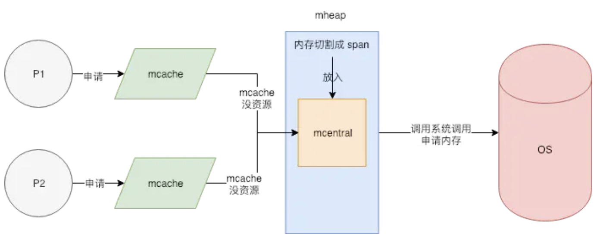

> mheap：内存池。Golang的程序在启动之初，会一次性从操作系统那里申请一大块内存作为内存池。这块内存空间会放在一个叫mheap的struct中管理，mheap负责将这一整块内存切割成不同的区域，并将其中一部分的内存切割成合适的大小，分配给用户使用。
* page: 内存页，一块8K大小的内存空间。Go与操作系统之间的内存申请和释放，都是以page为单位的。
* span: 内存块，一个或多个连续的page组成一个span。如果把page比喻成工人，span可看成是小队，工人被分成若干个队伍，不同的队伍干不同的活。
* sizeclass: 空间规格，每个span都带有一个sizeclass，标记着该span中的page应该如何使用。使用上面的比喻，就是sizeclass标志着span是一个什么样的队伍。
* object: 对象，用来存储一个变量数据内存空间，一个span在初始化时，会被切割成一堆等大的object。假设object的大小是16B，span大小是8K，那么就会把span中的page就会被初始化8K / 16B = 512 个object。所谓内存分配，就是分配一个object出去。
> mcentral：用途相同的span会以链表的形式组织在一起。这里的用途用sizeclass来表示，就是指该span用来存储哪种大小的对象。比如当分配一块大小为n的内存时，系统计算n应该使用哪种sizeclass，然后根据sizeclass的值去找到一个可用的span来用作分配。找到合适的span后，会从中取一个object返回给上层使用。这些span被放在一个叫做mcentral的结构中管理。

> mcache：并发情况下，很有可能多个线程同时从mcentral那里申请内存的，必须要用锁来避免冲突。但锁是低效的，在高并发的服务中，它会使内存申请成为整个系统的瓶颈。所以在mcentral的前面又增加了一层mcache。
每一个mcache和每一个处理器是一一对应的，也就是说每一个P都有一个mcache成员。Goroutine申请内存时，首先从其所在的P的mcache中分配，如果mcache没有可用span，再从mcentral中获取，并填充到mcache中。
**从mcache上分配内存空间是不需要加锁的，因为在同一时间里，一个P只有一个线程在其上面运行，不可能出现竞争。没有了锁的限制，大大加速了内存分配**。

其他优化
* zero size：有一些对象所需的内存大小是0，比如[0]int, struct{}，这种类型的数据根本就不需要内存。系统会直接返回一个固定的内存地址。
* Tiny对象：sizeclass=1 的 span，用来给 <= 8B 的对象使用，所以像 int32, byte, bool 以及小字符串等常用的微小对象，都会使用 sizeclass=1 的 span，但分配给他们 8B 的空间，大部分是用不上的。并且这些类型使用频率非常高，就会导致出现大量的内部碎片。所以 Go 尽量不使用 sizeclass=1 的 span， 而是将 < 16B 的对象为统一视为 tiny 对象(tinysize)。分配时，从 sizeclass=2 的 span 中获取一个 16B 的 object 用以分配。如果存储的对象小于 16B，这个空间会被暂时保存起来 (mcache.tiny 字段)，下次分配时会复用这个空间，直到这个 object 用完为止。如果要存储的数据里有指针，即使 <= 8B 也不会作为 tiny 对象对待，而是正常使用 sizeclass=1 的 span。
* 大对象：最大的 sizeclass 最大只能存放 32K 的对象。如果一次性申请超过 32K 的内存，系统会直接绕过 mcache 和 mcentral，直接从 mheap 上获取，mheap 中有一个 freelarge 字段管理着超大 span。

优势<br>
* 内存分配大多时候都是在用户态完成的，不需要频繁进入内核态。
* 内存碎片的问题：Go是自己在用户态管理的，在OS层面看是没有碎片的，使得操作系统层面对碎片的管理压力也会降低。
* mcache的存在使得内存分配不需要加锁。各个处理器都有自己独立的mcache。
* 每个线程都有独立的span cache，多个CPU不会并发读写同一块内存，进而减少CPU L1 cache的cacheline出现dirty情况，增大cpu cache命中率。

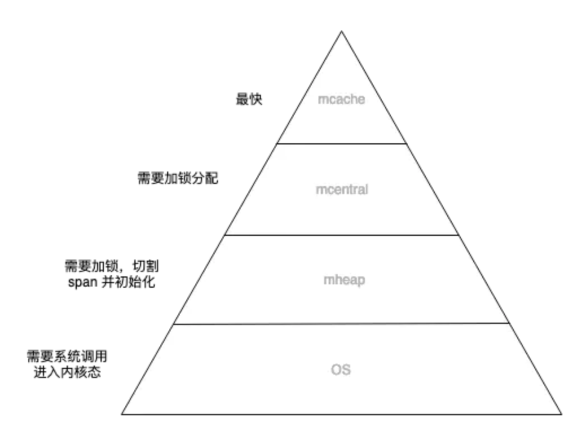

将有限的计算资源布局成金字塔结构，再将数据从热到冷分为几个层级，放置在金字塔结构上。调度器不断做调整，将热数据放在金字塔顶层，冷数据放在金字塔底层。这种设计利用了计算的局部性特征，认为冷热数据的交替是缓慢的。所以最怕的就是，数据访问出现冷热骤变。在操作系统上称这种现象为内存颠簸，系统架构上通常被说成是缓存穿透。其实都是一个意思，就是过度的使用了金字塔低端的资源。

内存分配出现压力的情况
* 频繁申请大对象，常见于文本处理，比如写一个海量日志分析的服务，很多日志内容都很长。这种情况建议自己维护一个对象([]byte)池，避免每次都要去mheap上分配。
* 滥用指针，指针的存在不仅容易造成内存浪费，对GC也会造成额外的压力，所以尽量不要使用指针。

名词介绍<br>
>内存碎片：系统在内存管理过程中，会不可避免的出现一块块无法被使用的内存空间，这是内存管理的产物。

>内部碎片：为了字节对齐，会导致一部分内存空间直接被放弃掉，不做分配使用。比如申请28B大小的内存空间，系统会分配32B的空间给它，这也导致了其中4B空间是被浪费掉的。

>外部碎片：一般是因为内存的不断分配释放，导致一些释放的小内存块分散在内存各处，无法被分配。

### 逃逸分析
栈空间和堆空间<br>
* 栈分配廉价，堆分配昂贵。
* 栈空间会随着一个函数的结束自动释放，堆空间需要GC模块不断的跟踪扫描回收。

Go编译器会自动找出需要进行动态分配的变量，它是在编译时追踪一个变量的生命周期，如果能确认一个数据只在函数空间内访问，不会被外部使用，则使用栈空间，否则就要使用堆空间。

逃逸分析的缺陷<br>
需要使用堆空间则逃逸。但编译器有时会将不需要使用堆空间的变量，也逃逸掉。这里是容易出现性能问题的大坑。

容易造成逃逸的情况<br>
* 多级间接赋值容易导致逃逸。多级间接指的是对某个引用类对象中的引用类成员进行赋值。Go语言中的引用类数据类型有func，interface，slice，map，chan，*Type(指针)。

### **垃圾回收**
[参考](https://www.jianshu.com/p/0083a90a8f7e)<br>
标记清除<br>
当GC开始时，从root开始一层层扫描，这里的root区指当前所有goroutine的栈和全局数据区的变量（主要是这2个地方)。扫描过程中把能被触达object 标记出来，那么堆空间未被标记的object就是垃圾了。最后遍历堆空间所有object，对垃圾（未标记）的object进行清除，清除完成则表示GC完成。清除的object会被放回到mcache中以备后续分配使用。

**三色标记法**<br>
为了能让标记过程也能并行，Go 采用了三色标记 + 写屏障的机制。它的步骤大致如下：
1. GC开始时，认为所有object都是白色，即垃圾。
2. 从root区开始遍历，被触达的object置成灰色。
3. 遍历所有灰色object，将他们内部的引用变量置成灰色，自身置成黑色。
4. 循环第3步，直到没有灰色object了，只剩下了黑白两种，白色的都是垃圾。
5. 对于黑色object，如果在标记期间发生了写操作，写屏障会在真正赋值前将新对象标记为灰色。
6. 标记过程中，mallocgc新分配的object，会先被标记成黑色再返回。

GC流程
1. 正常情况下，写操作就是正常的赋值。
2. GC开始，开启写屏障等准备工作。开启写屏障等准备工作需要短暂的STW（stop the world，挂起所有用户goroutine）。
3. Stack scan阶段，从全局空间和goroutine栈空间上收集变量。
4. Mark阶段，执行上述的三色标记法，直到没有灰色对象。
5. Mark termination阶段，开启STW，回头重新扫描root区域新变量，对他们进行标记。
6. Sweep阶段，关闭STW和写屏障，对白色对象进行清除。

## 包管理工具
[Go依赖包管理工具对比](https://studygolang.com/articles/10523)
### module
参考：<br>
[Go语言go mod包依赖管理工具使用详解](http://c.biancheng.net/view/5712.html)<br>
[Go语言编译与工具](http://c.biancheng.net/golang/build/)
### glide
参考：<br>
[Go的包管理工具：glide](https://www.jianshu.com/p/8b80208a5034)

# 面试
## golang语言的特点以及与其他语言的区别
特点：golang语言是编译型、静态数据类型的语言，编译速度快，内置并发机制，自带垃圾回收器。具备高性能、开发快的特点。<br>
与其他语言的对比
* 与c、c++等编译型语言比较<br>
都是编译型、静态数据类型语言；比c、c++编译速度快，因为编译的时候只需要编译被直接引用的库，不需要编译依赖链中所有依赖的库；golang自带内存回收机制，c、c++需要用户管理内存；golang内置并发机制，不需要使用特定的线程库，c、c++要使用特定的线程库。
* 与python比较
golang是编译型、静态数据类型语言，python是解释型、动态数据类型语言；都自带内存回收机制，不需要用户管理内存；golang内置并发机制，python要使用特定的线程库。
## golang的编译过程
先进行词法分析、语法分析、语义分析（包括数据类型检查等），生成中间码，再进行代码优化，最后生成机器码。
## golang的源码执行顺序
先执行全局变量，再执行init函数，再执行main函数。
## 数组、切片、映射
### 数组与切片的比较
* 数组是长度固定的，声明之后，不能再改变了；切片长度不固定，声明之后，可以改变长度。
* 数组分配的内存是连续的；切片的底层数组也是连续的。
* 数组复制是值复制，要复制整个数组；切片复制，只需要复制切片的三个字段，指向同一个底层数组。<br>
### 切片的好处
在函数间复制和传递切片成本很低，只需要复制切片的三个字段（指向底层数组的指针、切片的长度、切片的容量），64位系统中，三个字段总共24个字节。
### 切片要注意的地方
两个切片共享底层数组时，如果一个切片更改底层数组的共享部分，另一个切片也能感知到。
### 简述映射
映射的底层实现是散列表，映射的键通过散列函数，得到16位的散列值。低8位选中对应的桶，高8位索引桶中的位置（数组），存储了键值对（字节数组），键和值分别存放，先存放键，再存放值。<br>
函数间复制和传递映射，成本也很低，当对映射进行修改时，所以对这个映射的引用也会感知到。
### 哪些不能作为映射的键
不可变的可以作为映射的键，如数字、字符串、数组，只包含不可变的结构体。可变的不能作为映射的键，比如切片，映射，函数，以及包含可变的结构体。
## new和make的区别
new和make都在堆上分配内存。
* new可以分配任意类型的数据；make只能用来分配及初始化类型为slice、map、channel的数据。
* new分配返回的是指针，即类型*T；make返回引用，即T。
* new分配的空间被清零，不会被初始化；make分配后，会进行初始化（非零值），**slice、map、channel为引用类型，在使用前必须初始化**。

内存是否为零值
* new：以下分配了一个slice结构，但是结构中的应该指向底层数组的ptr指针为空，故实际不能往这个slice里面存取数据。
```Golang
var p *[]int = new([]int)
//或 p := new([]int)
```
* make：以下分配了一个slice结构，且结构中的应该指向底层数组的ptr指针已经指向了某个底层数组，这个底层数组应该已经分配了，故这个slice已经可以使用了。
```Golang
var v []int = make([]int, 0)
//或 v := make([]int, 0)
```

用new来分配slice的意义不大，因为没有恰当的初始化，无法直接使用。有附带空间的结构，使用make来初始化，可以完成内部指针初始化，其后可以立即使用。
## 方法、接口
方法能给用户定义的类型添加新的行为。方法实际上也是函数，只是在声明时，在关键字func和方法名之间增加了一个参数。<br>
接口是声明了一组行为并支持多态的类型。
## 怎么实现多态
对接口值方法的调用会执行接口值里存储的用户定义的类型的值对应的方法。因为任何用户定义的类型都可以实现任何接口，所以对接口值方法的调用自然就是一种多态。[详情](#多态)
## 并发模型
Go语言的并发同步模型通过在goroutine之间传递数据来传递消息，而不是对数据进行加锁来实现同步访问。用于在goroutine之间同步和传递数据的关键数据类型叫作通道（channel）。<br>

**Go调度器如何管理goroutine**<br>
如果创建一个goroutine并准备运行，这个goroutine就会被放到调度器的全局运行队列中。之后，调度器就将这些队列中的goroutine分配给一个逻辑处理器，并放到这个逻辑处理器对应的本地运行队列中。本地运行队列中的goroutine会一直等待直到自己被分配的逻辑处理器执行。<br>
有时，正在运行的goroutine需要执行一个阻塞的系统调用，如打开一个文件。当这类调用发生时，线程和goroutine会从逻辑处理器上分离，该线程会继续阻塞，等待系统调用的返回。与此同时，这个逻辑处理器就失去了用来运行的线程。所以，调度器会创建一个新线程，并将其绑定到该逻辑处理器上。之后，调度器会从本地运行队列里选择另一个goroutine来运行。一旦被阻塞的系统调用执行完成并返回，对应的goroutine会放回到本地运行队列，而之前的线程会保存好，以便之后可以继续使用。
## 垃圾回收机制
使用[三色标记法](#垃圾回收)回收内存
* 灰色：对象已被标记，但这个对象包含的子对象未标记。
* 黑色：对象已被标记，且这个对象包含的子对象也已标记，gcmarkBits对应的位为1（该对象不会在本次GC中被清理）。
* 白色：对象未被标记，gcmarkBits对应的位为0（该对象将会在本次GC中被清理）。

例如，当前内存中有A~F一共6个对象，根对象a，b本身为栈上分配的局部变量，根对象a、b分别引用了对象A、B, 而B对象又引用了对象D，则GC过程如下：
1. 初始状态下所有对象都是白色的。
2. 接着开始扫描根对象a、b，由于根对象引用了对象A、B，那么A、B变为灰色对象。接下来就开始分析灰色对象，分析A时，A没有引用其他对象很快就转入黑色。B引用了D，则B转入黑色的同时还需要将D转为灰色，进行接下来的分析。
3. 灰色对象只有D，由于D没有引用其他对象，所以D转入黑色。标记过程结束。
4. 最终，黑色的对象会被保留下来，白色对象会被回收掉。
## 不同语言使用的垃圾回收机制
常见的GC算法：引用计数法、Mark-Sweep（标记-清除）法、三色标记法、分代回收法。
* 引用计数：对每个对象维护一个引用计数，当引用该对象的对象被销毁时，引用计数减1，当引用计数器为0时回收该对象。<br>
优点：对象可以很快的被回收，不会出现内存耗尽或达到某个阈值时才回收。<br>
缺点：不能很好的处理循环引用，而且实时维护引用计数，也有一定的代价。<br>
代表语言：Python、PHP、Swift
* 标记-清除：从根变量开始遍历所有引用的对象，引用的对象标记为"被引用"，没有被标记的进行回收。<br>
优点：解决了引用计数的缺点。
缺点：需要STW，即要暂时停掉程序运行。<br>
代表语言：Golang(其采用三色标记法)
* 分代收集：按照对象生命周期长短划分不同的代空间，生命周期长的放入老年代，而短的放入新生代，不同代有不同的回收算法和回收频率。<br>
优点：回收性能好<br>
缺点：算法复杂<br>
代表语言：JAVA

不同语言使用的垃圾回收机制
* golang使用的垃圾回收机制：三色标记法。
* python使用的垃圾回收机制：引用计数法、标记-清除法、分代回收法。
* java使用的垃圾回收机制：引用计数法、标记-清除法、分代回收法。