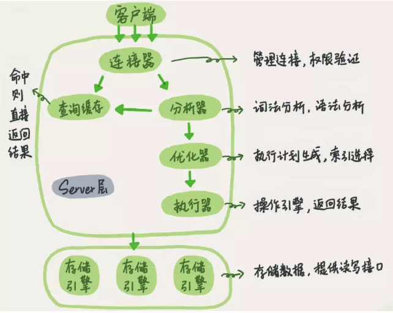
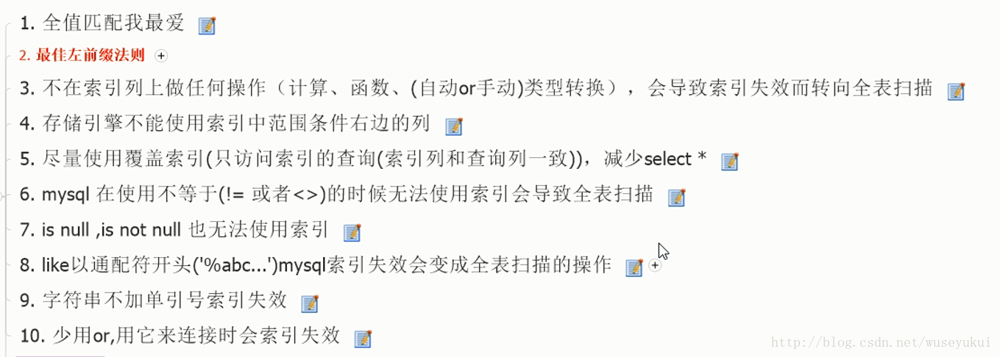
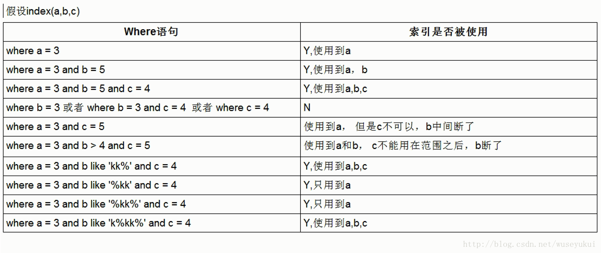
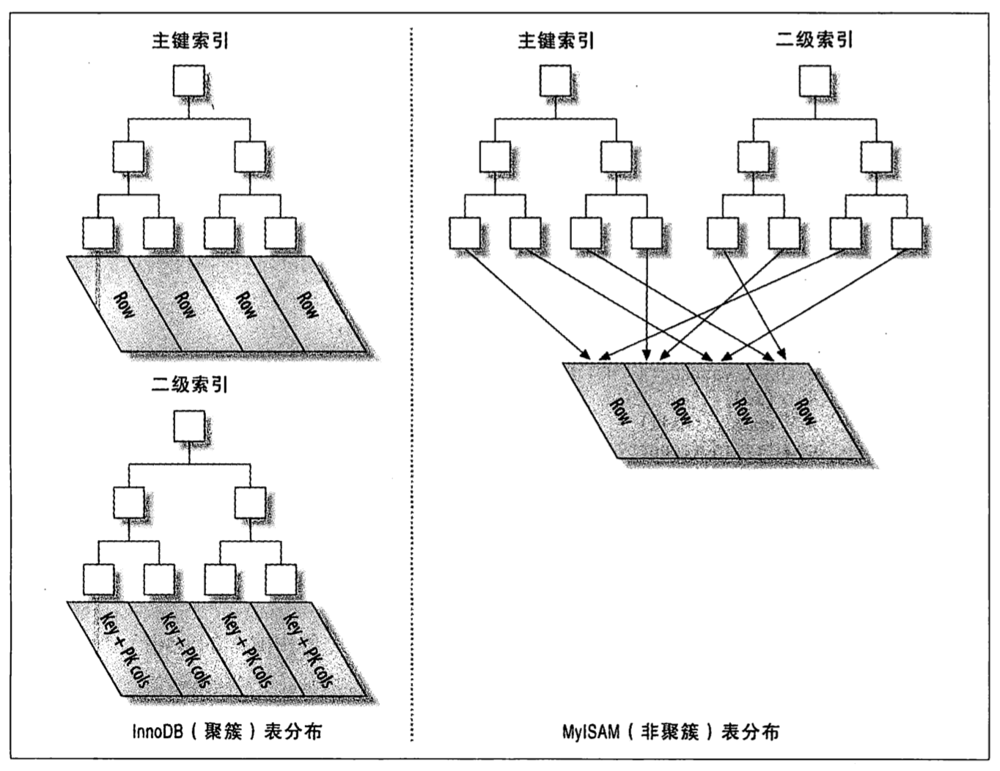

- [基础](#基础)
    - [架构](#架构)
    - [并发控制](#并发控制)
        - [读写锁](#读写锁)
            - [读锁（共享锁）](#读锁（共享锁）)
            - [写锁（排他锁）](#写锁（排他锁）)
        - [锁粒度](#锁粒度)
            - [表级锁](#表级锁)
            - [页面锁](#页面锁)   
            - [行级锁](#行级锁)  
            - [三种级别的锁的区别](#三种级别的锁的区别) 
        - [多版本并发控制（MVCC）](#多版本并发控制（MVCC）)
    - [事务](#事务)
        - [ACID](#ACID)
        - [并发带来的问题](#并发带来的问题)
        - [隔离级别](#隔离级别)
        - [死锁](#死锁)
    - [数据类型的选择](#数据类型的选择)
    - [索引](#索引)
        - [索引类型](#索引类型)
            - [B+Tree索引](#B+Tree索引)
            - [哈希索引](#哈希索引)
            - [全文索引](#全文索引)
        - [索引种类](#索引种类)
            - [聚簇索引](#聚簇索引)
            - [非聚簇索引](#非聚簇索引)
            - [联合索引](#联合索引)
            - [覆盖索引](#覆盖索引)
            - [多列索引](#多列索引)
        - [使用索引扫描做排序](#使用索引扫描做排序)
        - [LIMIT分页](#LIMIT分页)
        - [索引和数据的碎片](#索引和数据的碎片)
        - [索引的特点](#索引的特点)
        - [索引检索为什么快](#索引检索为什么快)
        - [建索引的原则](#建索引的原则)
        - [选择索引和编写利用这些索引的查询的原则](#选择索引和编写利用这些索引的查询的原则)
        - [索引生效的查询](#索引生效的查询)
    - [存储引擎](#存储引擎)
        - [InnoDB存储引擎和MyISAM存储引擎的区别](#InnoDB存储引擎和MyISAM存储引擎的区别)
        - [InnoDB存储引擎和MyISAM存储引擎加锁](#InnoDB存储引擎和MyISAM存储引擎加锁)
            - [MyISAM加锁](#MyISAM加锁)
            - [InnoDB加锁](#InnoDB加锁)
        - [InnoDB存储引擎和MyISAM存储引擎索引结构](#InnoDB存储引擎和MyISAM存储引擎索引结构)
    - [MySQL日志类型](#MySQL日志类型)
    - [MySQL的恢复策略](#MySQL的恢复策略)
    - [主从同步](#主从同步)
    - [其他](#其他)
    - [SQL语句](#SQL语句)
        - [管理数据库](#管理数据库)
        - [操作表结构](#操作表结构)
        - [操作表数据](#操作表数据)
    - [查询性能优化](#查询性能优化)
    - [MySQL优化](#MySQL优化)
        - [导致SQL执行慢的原因](#导致SQL执行慢的原因)
        - [为什么要优化](#为什么要优化)
        - [如何优化](#如何优化)
        - [水平分库分表](#水平分库分表)
            - [水平分库分表的切分规则](#水平分库分表的切分规则)
            - [数据切分之后的问题解决](#数据切分之后的问题解决)
            - [分布式全局唯一ID](#分布式全局唯一ID)
            - [如何进行分库分表的数据迁移](#如何进行分库分表的数据迁移)
- [面试](#面试)
    - [多版本并发控制（MVCC）实现](#多版本并发控制（MVCC）实现)
    - [事务的ACID](#事务的ACID)
    - [事务的隔离级别](#事务的隔离级别)
    - [B+Tree索引实现](#B+Tree索引实现)
    - [索引的优势](#索引的优势)
    - [创建索引的原则](#创建索引的原则)
    - [联合主键和唯一索引的区别](#联合主键和唯一索引的区别)
    - [主键的选择](#主键的选择)
    - [InnoDB和MyISAM的区别](#InnoDB和MyISAM的区别)
    - [InnoDB索引和MyISAM索引的区别](#InnoDB索引和MyISAM索引的区别)
    - [MySQL性能优化](#MySQL性能优化)    

---
# 基础
## 架构



线程池中少量的线程服务大量的连接。不同存储引擎之间不会相互通信，只是简单地响应上层服务器的请求。

## 并发控制
[参考1](https://blog.csdn.net/z50L2O08e2u4afToR9A/article/details/81843971) [参考2](https://www.cnblogs.com/leedaily/p/8378779.html)
### 读写锁
#### 读锁（共享锁）
读锁是共享的，相互不阻塞的。多个客户在同一时刻可以同时读取同一个资源，而互不干扰。<br>
事务A加共享锁：事务A只能读，不能写。其他事物可以读，不能写，可以加共享锁。阻塞其他事物加排他锁，直到事务A共享锁释放。
#### 写锁（排他锁）
写锁是排他的，一个写锁会阻塞其他的写锁和读锁。确保在给定的时间里，只有一个用户能执行写入，并防止其他用户读取正在写入的同一资源。<br>
事务A加排他锁：事务A可读可写。其他事物可以读（普通查询select，不加锁），不能写，阻塞加锁（共享锁+排他锁），直至锁释放。<br>
InnoDB中查询（select）默认不加锁，更新（update、insert、delete）默认加排他锁。<br>

### 锁粒度
锁策略：在锁的开销和数据的安全性之间寻求平衡，这种平衡也会影响到性能。
#### 表级锁
表锁会锁定整张表。一个用户在对表进行写操作（插入、删除、更新等）前，需要先获得写锁，这会阻塞其他用户对该表的所有读写操作。读锁之间是不相互阻塞的。表锁是开销最小的策略。<br>
#### 页面锁
#### 行级锁
锁定行级数据。**行级锁可以最大程度地支持并发处理，同时也带来了最大的锁开销**。行级锁只在存储引擎层实现，MySQL服务器层没有实现。<br>

#### 三种级别的锁的区别
* 表级锁：开销小，加锁快；不会出现死锁；锁定粒度大，发生锁冲突的概率最高，并发度最低。
* 行级锁：开销大，加锁慢；会出现死锁；锁定粒度最小，发生锁冲突的概率最低，并发度最高。
* 页面锁：开销和加锁时间界于表锁和行锁之间；会出现死锁；锁定粒度界于表锁和行锁之间，并发度一般。

表级锁更适合于以查询和插入为主，只有少量按索引条件条件更新数据的应用，如Web应用；而行级锁则更适合于有大量按索引条件并发更新少量不同数据，同时又有并发查询的应用，如一些在线事务处理（OLTP）系统。<br>
MyISAM和MEMORY存储引擎采用的是表级锁；BDB存储引擎采用的是页面锁，但也支持表级锁；InnoDB存储引擎既支持行级锁，也支持表级锁，但默认情况下采用行级锁（可通过共享锁、排他锁实现）。 

### 多版本并发控制（MVCC）
多版本并发控制（MVCC）是通过保存数据在某个时间点的快照来实现的。根据事务开始的时间不同，每个事务对同一张表，同一时刻看到的数据可能是不一样的。<br>
MVCC是行级锁的一个变种，在很多情况下避免了加锁操作，开销更低。虽然实现机制有所不同，但大都实现了非阻塞的读操作，写操作也只锁定必要的行。<br>
MySQL、Oracle、PostgreSQL等其他数据库系统都实现了MVCC，但各自的实现机制不尽相同。<br>

MVCC的实现有乐观并发控制和悲观并发控制。悲观锁和乐观锁是定义出来的概念，是利用数据库本身提供的锁机制来实现的。针对于不同的业务场景，应该选用不同的并发控制方式。
* 悲观锁：每次操作之前先上锁，借助数据库锁机制，比如行锁，表锁，读锁，写锁等。悲观锁主要是共享锁或排他锁。适用于多写的应用类型。
* 乐观锁：不上锁。可以使用版本号机制实现。适用于多读的应用类型，适用于并发量大的业务场景。

如果追求响应速度，建议采用乐观锁，因为乐观锁不需要等待释放锁和获取锁。如果在一个数据冲突非常多的情况下，建议采用悲观锁，因为悲观锁保证了数据执行的成功率。

InnoDB的MVCC的实现<br>
MVCC（多版本并发控制协议）在InnoDB存储引擎中主要提供两种读方式，一种是快照读，一种是当前读。
* 快照读：是一致性非锁定读，读取的是历史版本，不用加锁，提高并发。在数据库不同的隔离级别下读取的历史版本有所不同，在RR（REPEATABLE READ）隔离级别下读的历史版本总是事务刚开始的那一个版本，所以可以避免不可重复读与幻读，因为其对其他事务提交的数据是不可见的。在RC（READ COMMITTED）隔离级别下读的是最新的历史版本，或者是可见版本（另一个事务刚已经提交的数据），这样就会出现不可重复读现象。
* 当前读：是一致性锁定读，采取加锁（共享锁/排他锁）的方法保证并发数据的一致性。

InnoDB的MVCC，是通过在每行记录后面保存两个隐藏的列来实现的。这两个列，一个保存了行的创建时间，一个保存行的过期时间（或删除时间）。存储的是系统版本号。每开始一个新的事务，系统版本号都会自动递增。事务开始时刻的系统版本号会作为事务的版本号，用来和查询到的每行记录的版本号进行比较。<br>

在REPEATABLE READ隔离级别下，MVCC的操作：
> SELECT：InnoDB根据以下两个条件检查每行记录，只有符合下述两个条件的记录，才能返回作为查询结果。
* InnoDB只查找版本早于当前事务版本的数据行（行的系统版本号小于或等于事务的系统版本号），这样可以确保事务读取的行，要么是在事务开始前已经存在的，要么是事务自身插入或者修改过的。
* 行的删除版本要么未定义，要么大于当前事务版本号。这可以确保事务读取到的行，在事务开始之前未被删除。
> INSERT：InnoDB为新插入的每一行保存当前系统版本号作为行版本号。<br>
> DELETE：InnoDB为删除的每一行保存当前系统版本号作为行删除标识。<br>
> UPDATE：InnoDB插入一行新记录，保存当前系统版本号作为行版本号，同时保存当前系统版本号到原来的行作为行删除标识。且必须在更新的时候同时检查目前数据库里version值是不是之前的那个version，如果是，则正常更新。如果不是，则更新失败，说明在这个过程中有其它的进程去更新过数据了。

保存这两个额外系统版本号，使大多数读操作都可以不用加锁。这样设计使得读数据操作很简单，性能很好，并且也能保证只会读取到符合标准的行。不足之处是每行记录都需要额外的存储空间，需要做更多的行检查工作，以及一些额外的维护工作。<br>
**MVCC只在REPEATABLE READ和READ COMMITTED两个隔离级别下工作**。其他两个隔离级别都和MVCC不兼容，因为READ UNCOMMITTED总是读取最新的数据行，而不是符合当前事务版本的数据行。而SERIALIZABLE则会对所有读取的行都加锁。

* 在REPEATABLE READ 隔离级别下：通过record lock（行锁，加共享锁/排他锁）与gap lock（间隙锁）解决不可重复读与幻读问题；也可以通过MVCC解决不可重复读与幻读问题。
* 在READ COMMITTED隔离级别下：系统通过record lock解决不可重复读问题，解决不了幻读问题（采取锁算法不一样）。

## 事务
事务是一组原子性的SQL查询，或者说一个独立的工作单元。事务内的语句，要么全部执行成功，要么全部执行失败。
### ACID
ACID表示原子性（atomicity）、一致性（consistency）、隔离性（isolation）和持久性（durability）。
* 原子性（atomicity）：一个事务必须被视为一个不可分割的最小工作单元，整个事务中的所有操作要么全部提交成功，要么全部失败回滚。对于一个事务来说，不可能只执行其中的一部分操作，这就是事务的原子性。使用undo和redo日志实现。
* 一致性（consistency）：数据库总是从一个一致性的状态转换到另外一个一致性的状态。使用读写锁或者MVCC机制实现。
* 隔离性（isolation）：通常来说，一个事务所做的修改在最终提交以前，对其他事务是不可见的。使用事务的隔离级别实现。
* 持久性（durability）：一旦事务提交，则其所做的修改就会永久保存到数据库中。Force Log at Commit 机制保证事务提交后redo log日志都已经持久化。
### 并发带来的问题
* 更新丢失：多个事务同时更新，更新覆盖。
* 脏读：一个事务正在对一条记录做修改，在这个事务提交前，这条记录的数据就处于不一致状态。这时，另一个事务也来读取同一条记录，如果不加控制，第二个事务读取了这些“脏”的数据，并据此做进一步的处理，就会产生未提交的数据依赖关系。这种现象叫做“脏读”。
* 不可重复读：一个事务在读取某些数据时，数据已经发生了改变或某些记录已经被删除了。这种现象叫做“不可重复读”。不可重复读一般是针对同一条记录而言。
* 幻读：一个事务按相同的查询条件重新读取以前检索过的数据，却发现其他事务插入了满足其查询条件的新数据。这种现象就称为“幻读”。幻读是针对不同的记录而言，一般是范围查询。

脏读、不可重复读、幻读都是数据库读一致性问题，由事务隔离机制解决。
### 隔离级别
定义了四种隔离级别，每一种级别都规定了一个事务中所做的修改，哪些在事务内和事务间是可见的，哪些是不可见的。较低级别的隔离通常可以执行更高的并发，系统的开销也更低。
* READ UNCOMMITTED（未提交读）：在READ UNCOMMITTED级别，事务中的修改，即使没有提交，对其他事务也都是可见的。事务可以读取未提交的数据，这也被称为脏读。
* READ COMMITTED（提交读）：大多数数据库系统的默认隔离级别都是READ COMMITTED（MySQL不是）。READ COMMITTED满足隔离性。这个级别有时候也叫做不可重复读，因为两次执行同样的查询，可能会得到不一样的结果。
* REPEATABLE READ（可重复读）：REPEATABLE READ解决了脏读的问题。保证了在同一个事务中多次读取同样记录的结果是一致的。但是理论上，无法解决幻读。幻读指的是当某个事务在读取某个范围内的记录时，另外一个事务又在该范围内插入了新的记录，当之前的事务再次读取该范围的记录时，会产生幻行。**InnoDB存储引擎通过多版本并发控制（MVCC）解决了幻读的问题**。**可重复读是MySQL的默认事务隔离级别**。
* SERIALIZABLE（可串行化）：SERIALIZABLE是最高的隔离级别。它通过强制事务串行执行，避免了幻读的问题。SERIALIZABLE会在读取的每一行数据上都加锁，所以可能导致大量的超时和锁争用的问题。

SQL隔离级别
隔离级别 | 脏读可能性 | 不可重复读可能性 | 幻读可能性 | 加锁读
---|---|---|---|---
READ UNCOMMITTED（未提交读）| Yes | Yes | Yes | No
READ COMMITTED（提交读）    | No | Yes | Yes | No
REPEATABLE READ（可重复读） | No | No | Yes | No
SERIALIZABLE（可串行化）    | No | No | No | Yes

[参考](https://blog.csdn.net/Wenlong_L/article/details/84074761)
* 在REPEATABLE READ 隔离级别下：通过record lock（行锁，加共享锁/排他锁）与gap lock（间隙锁）解决不可重复读与幻读问题；也可以通过MVCC解决不可重复读与幻读问题。
* 在READ COMMITTED隔离级别下：系统通过record lock解决不可重复读问题，解决不了幻读问题（采取锁算法不一样）。

### 死锁
死锁是指两个或者多个事务在同一资源上相互占用，并请求锁定对方占用的资源，从而导致恶性循环的现象。当多个事务试图以不同的顺序锁定资源或者同时锁定同一个资源时，也会发生死锁。<br>

死锁成因<br>
* 不同表相同记录行锁冲突：事务A和事务B操作两张表，但出现循环等待锁情况。
* 相同表记录行锁冲突：两个job在执行数据批量更新时，job A处理的的id列表为[1,2,3,4]，而job B处理的id列表为[8,9,10,4,2]，这样就造成了死锁。
* 不同索引锁冲突：事务A在执行时，除了在二级索引加锁外，还会在聚簇索引上加锁，在聚簇索引上加锁的顺序是[1,4,2,3,5]，而事务B执行时，只在聚簇索引上加锁，加锁顺序是[1,2,3,4,5]，这样就造成了死锁的可能性。
* 间隙锁冲突。

间隙锁<br>
当用范围条件而不是相等条件检索数据，并请求共享或排他锁时，InnoDB会给符合条件的已有数据记录的索引项加锁。对于键值在条件范围内但并不存在的记录，叫做“间隙”，InnoDB也会对这个“间隙”加锁，这种锁机制就是间隙锁。它是一种实施在索引上，锁定索引某个区间范围的锁。使用间隙锁可以防止幻读。

死锁处理<br>
* 等待，直至超时。
* 发起死锁检测，主动回滚一条事务（选择更新行数最少的），让其他事务正常执行。

减少锁冲突<br>
* 选择合理的事务大小，小事务发生锁冲突的几率也更小。
* 给记录集显式加锁时，最好一次性请求足够级别的锁。比如要修改数据，最好直接申请排他锁，而不是先申请共享锁，修改时再请求排他锁，这样容易产生死锁。
* 不同的程序访问一组表时，应尽量约定以相同的顺序访问各表，对一个表而言，尽可能以固定的顺序存取表中的行。这样可以大大减少死锁的机会。
* 尽量用相等条件访问数据，这样可以避免间隙锁对并发插入的影响。不要申请超过实际需要的锁级别。除非必须，查询时不要显式加锁。
* 对于一些特定的事务，可以使用表锁来提高处理速度或减少死锁的可能。

mysql锁表时：杀掉锁表的进程。

## 数据类型的选择
* 使用可以正确存储数据的最小数据类型。更小的数据类型通常更快，因为它们占用更少的磁盘、内存和CPU缓存，并且处理时需要的CPU周期也更少。
* 简单数据类型的操作通常需要更少的CPU周期。如：整型比字符操作代价更低。应该使用MySQL内建的类型而不是字符串来存储日期和时间。应该用整型存储IP地址。
* 尽量避免NULL。通常情况下最好指定列为NOT NULL。可为NULL的列使得索引、索引统计和值比较都更复杂。可为NULL的列会使用更多的存储空间，在MySQL里也需要特殊处理。当可为NULL的列被索引时，每个索引记录需要一个额外的字节。InnoDB使用单独的位（bit）存储NULL值。

## 索引
在MySQL中，索引是在存储引擎层而不是服务器层实现的。

### 索引类型
#### B+Tree索引
B+Tree：每一个叶子节点都包含指向下一个叶子节点的指针，从而方便叶子节点的范围遍历。<br>
索引存在磁盘中，使用索引查询时要从磁盘中读取索引到内存中，数据量大的时候，索引的I/O操作会影响数据库的性能。相比磁盘I/O的速度，内存中的比较耗时几乎可以忽略。所以树的高度要足够低，I/O次数足够少，就可以提升查找性能。树要“矮胖”，这正是B+Tree的特征之一。

B+Tree的查找过程<br>
如图所示，如果要查找数据项29，那么首先会把磁盘块1由磁盘加载到内存，此时发生一次I/O，在内存中用二分查找确定29在17和35之间，锁定磁盘块1的P2指针，内存时间因为非常短（相比磁盘的I/O）可以忽略不计，通过磁盘块1的P2指针的磁盘地址把磁盘块3由磁盘加载到内存，发生第二次I/O，29在26和30之间，锁定磁盘块3的P2指针，通过指针加载磁盘块8到内存，发生第三次I/O，同时内存中做二分查找找到29，结束查询，总计三次I/O。三层的B+Tree可以表示上百万的数据，如果上百万的数据查找只需要三次I/O，性能提高将是巨大的，如果没有索引，每个数据项都要发生一次I/O，那么总共需要百万次的I/O，显然成本非常高。


B+Tree索引适用于全键值、键值范围或键前缀查找。其中键前缀查找只适用于根据最左前缀的查找。

B+Tree索引的限制：
* 如果不是按照索引的最左列开始查找，则无法使用索引。
* 不能跳过索引中的列。
* 如果查询中有某个列的范围查找，则其右边所有列都无法使用索引优化查找。
#### 哈希索引
哈希索引基于哈希表实现，只有精确匹配索引所有列的查询才有效。对于每一行数据，存储引擎都会对所有的索引列计算一个哈希码，哈希码是一个较小的值，并且不同键值的行计算出来的哈希码也不一样。哈希索引将所有的哈希码存储在索引中，同时在哈希表中保存指向每个数据行的指针。<br>
在MySQL中，只有Memory引擎显式支持哈希索引。Memory引擎支持非唯一哈希索引，如果多个列的哈希值相同，索引会以链表的方式存放多个记录指针到同一个哈希条目中。
#### 全文索引
全文索引是一种特殊类型的索引，它查找的是文本中的关键词，而不是直接比较索引中的值。在相同的列上同时创建全文索引和基于值的B+Tree索引不会有冲突，全文索引适用于MATCH AGAINST操作，而不是普通的WHERE条件操作。

### 索引种类
#### 聚簇索引
"聚簇"表示数据行和相邻的键值紧凑地存储在一起。因为无法同时把数据行存放在两个不同的地方，所以一个表只能有一个聚簇索引。<br>
叶子页包含了行的全部数据，但是节点页只包含了索引列。<br>
InnoDB通过主键聚集数据。如果没有定义主键，InnoDB会选择一个唯一的非空索引代替。如果没有这样的索引，InnoDB会隐式定义一个主键来作为聚簇索引。InnoDB只聚集在同一个页面的记录。包含相邻键值的页面可能会相距甚远。<br>

聚簇索引的优点：
* 可以把相关数据保存在一起，减少磁盘I/O。
* 数据访问更快。聚簇索引将索引和数据保存在同一个B+Tree中，因此从聚簇索引中获取数据通常比在非聚簇索引中查找更快。
* 使用覆盖索引扫描的查询可以直接使用页节点中的主键值。

聚簇索引的缺点：
* 聚簇数据最大限度地提高了I/O密集型应用的性能，但如果数据全部都放在内存中，则访问的顺序就没有那么重要了，聚簇索引也就没什么优势了。
* 插入速度严重依赖于插入顺序。按照主键的顺序插入是加载数据到InnoDB表中速度最快的方式。
* 更新聚簇索引列的代价很高，因为会强制InnoDB将每个被更新的行移动到新的位置。
* 基于聚簇索引的表在插入新行，或者主键被更新导致需要移动行的时候，可能面临“页分裂”的问题。当行的主键值要求必须将这一行插入到某个已满的页中时，存储引擎会将该页分裂成两个页面来容纳该行，这就是一次页分裂操作。页分裂会导致表占用更多的磁盘空间。
* 聚簇索引可能导致全表扫描变慢，尤其是行比较稀疏，或者由于页分裂导致数据存储不连续的时候。
* 二级索引（非聚簇索引）可能比想象的要更大，因为在二级索引的叶子节点包含了引用行的主键列。
* 二级索引访问需要两次索引查找，而不是一次。二级索引叶子节点保存的不是指向行的物理位置的指针，而是行的主键值。通过二级索引查找行，存储引擎需要找到二级索引的叶子节点获得对应的主键值，然后根据这个值去聚簇索引中查找到对应的行。对于InnoDB，自适应哈希索引能够减少这样的重复工作。

使用InnoDB时应该尽可能地按主键顺序插入数据，并且尽可能地使用单调增加的聚簇键的值来插入新行。最好避免随机的（不连续且值的分布范围非常大）聚簇索引，特别是对于I/O密集型的应用。例如，从性能的角度考虑，使用UUID来作为聚簇索引则会很糟糕：它使得聚簇索引的插入变得完全随机，这是最坏的情况，使得数据没有任何聚集特性。

主键的选择
> 自增主键
* 优点：
1. 自动编号，速度快。聚集索引主键按顺序存放，检索快。
2. 数字型，占用空间小。
3. 易排序。
* 缺点：
1. 不支持水平分片架构，不能保证主键全局唯一。
2. 易暴露。
> UUID
* 优点：
1. 全局唯一，适合水平分片架构（可以生成唯一的有序uuid）。
2. 安全。
* 缺点：
1. 页分裂，产生碎片：插入/删除不是顺序的，会引起数据位置频繁变动，涉及到页分裂，会产生碎片（并且会造成页存储空间的浪费），查询时要查询很多碎片，访问多页，影响性能。
2. 从磁盘读取目标页产生大量随机I/O：待插入的页因为是随机的，可能已写入磁盘，从磁盘加载到内存中这里会有大量的I/O。
3. UUID长度（128位）过长，占内存更大。二级索引叶子结点存储UUID需要更多的存储空间，影响基于内存的二级索引的记录数量，继而影响内存的索引命中率。基于硬盘进行索引查询性能很差。
> [id生成器](#分布式全局唯一ID)：基于redis的自增：持久化问题导致重复ID；雪花算法：给每台机器分配一个唯一标识，然后通过时间戳+机器标识+自增序列实现全局唯一ID。
* 优点：
1. 数据递增，全局唯一。用于水平分表保证ID全局唯一性。
* 缺点：
1. 雪花算法：依赖于系统时钟的一致性。如果某台机器的系统时钟回拨，有可能造成ID冲突，或者ID乱序。

使用场景：
* 非分布式架构直接套用自增id做主键。
* 小规模分布式架构用UUID或者自增id+步长做主键。
* 大规模分布式架构用自建的id生成器做主键，参考twitter的snowflake算法。

#### 非聚簇索引
数据行和索引键值不在一起。
#### 联合索引
索引列上包含联合索引列的键，满足最左前缀原则。
#### 覆盖索引
如果一个索引包含（或者说覆盖）所有需要查询的字段的值，称为“覆盖索引”。<br>
覆盖索引的好处：
* 索引条目通常远小于数据行大小，所以如果只需要读取索引，那MySQL就会极大地减少数据访问量。
* 因为索引是按照列值顺序存储的（至少在单个页内是如此），所以对于I/O密集型的范围查询会比随机从磁盘读取每一行数据的I/O要少得多。
* InnoDB的二级索引在叶子节点中保存了行的主键值，所以如果二级主键能够覆盖查询，则可以避免对主键索引的二次查询。
当发起一个被索引覆盖的查询（也叫做索引覆盖查询）时，在EXPLAIN的Extra列可以看到“Using index”的信息。
#### 多列索引
使用OR条件查询时，会造成索引合并：查询同时使用两个单列索引进行扫描，并将结果进行合并。<br>
索引合并说明索引建地很糟糕：
* 当出现服务器对多个索引做相交操作时（有多个AND条件），通常意味着需要一个包含所有相关列的多列索引，而不是多个独立的单列索引。
* 当服务器需要对多个索引做联合操作时（通常有多个OR条件），通常需要耗费大量CPU和内存资源在算法的缓存、排序和合并操作上。特别是当其中有些索引的选择性不高，需要合并扫描返回的大量数据的时候。

如果在EXPLAIN中看到有索引合并（Using union），应该检查一下查询和表的结构，说明索引建得很糟糕。

索引合并：查询同时使用两个单列索引进行扫描，并将结果进行合并。

### 使用索引扫描做排序
MySQL有两种方式可以生成有序的结果：通过排序操作；或者按索引顺序扫描。如果EXPLAIN出来的type列的值为“index”，则说明MySQL使用了索引扫描来做排序。<br>
**只有当索引的列顺序和ORDER BY子句的顺序完全一致，并且所有列的排序方向（倒序或正序）都一样时，MySQL才能够使用索引来对结果做排序**。如果查询需要关联多张表，则只有当ORDER BY子句引用的字段全部为第一个表时，才能使用索引做排序。<br>
ORDER BY子句和查找型查询的限制是一样：**需要满足索引的最左前缀的要求**。否则，MySQL都需要执行排序操作，而无法利用索引排序。有一种情况下ORDER BY子句可以不满足索引的最左前缀的要求，就是前导列为常量的时候。如果WHERE子句或者JOIN子句中对这些列指定了常量，就可以“弥补”索引的不足。

索引对多个值进行排序的依据是CREATE TABLE语句中定义索引时列的顺序。<br>

### LIMIT分页
同时使用ORDER BY和LIMIT时，随着偏移量的增加，MySQL需要花费大量的时间来扫描需要丢弃的数据。可以使用延迟关联，通过使用覆盖索引查询返回需要的主键，再根据这些主键关联原表获得需要的行。这可以减少MySQL扫描那些需要丢弃的行数。

### 索引和数据的碎片
B+Tree索引可能会碎片化，这会降低查询的效率。碎片化的索引可能会以很差或者无序的方式存储在磁盘上。根据设计，B+Tree需要随机磁盘访问才能定位到叶子页，所以随机访问是不可避免的。然而，如果叶子页在物理分布上是顺序且紧密的，那么查询的性能就会更好。否则，对于范围查询、索引覆盖扫描等操作来说，速度可能会降低很多倍，对于索引覆盖扫描这一点更加明显。

数据碎片的类型：
* 行碎片：这种碎片指的是数据行被存储为多个地方的多个片段中。即使查询只从索引中访问一行记录，行碎片也会导致性能下降。
* 行间碎片：行间碎片是指逻辑上顺序的页，行在磁盘上不是顺序存储的。行间碎片对诸如全表扫描和聚簇索引扫描之类的操作有很大的影响，因为这些操作原本能够从磁盘上顺序存储的数据中获益。
* 剩余空间碎片：剩余空间碎片是指数据页中有大量的空余空间。这会导致服务器读取大量不需要的数据，从而造成浪费。

对于MyISAM表，这三类碎片化都可能发生。但InnoDB不会出现短小的行碎片，InnoDB会移动短小的行并重写到一个片段中。

### 索引的特点
* 对于主键会自动创建主键索引。
* 索引的效率取决于索引列的值是否散列，即该列的值如果越互不相同，那么索引效率越高。反过来，如果记录的列存在大量相同的值，例如gender列，大约一半的记录值是M，另一半是F，对该列创建索引就没有意义。
* 索引的优点是提高了查询效率，可以帮助服务器避免排序和临时表。缺点是在插入、更新和删除记录时，需要同时修改索引，因此，索引越多，插入、更新和删除记录的速度就越慢。

### 索引检索为什么快
* 关键字相对于数据本身数据量小。
* 关键字是有序的，二分查找可快速确定位置。

### 建索引的原则
* 最左前缀匹配原则，MySQL会一直向右匹配直到遇到范围查询(>、<、between、like)。
* =和in可以乱序。
* 尽量选择区分度高的列作为索引。
* 索引列不能参与计算，保持列“干净”。
* 尽量的扩展索引，不要新建索引。

### 选择索引和编写利用这些索引的查询的原则
* 单行访问是很慢的。如果服务器从存储中读取一个数据块只是为了获取其中一行，那么就浪费了很多工作。最好读取的块中能包含尽可能多所需要的行。使用索引可以创建位置引用以提升效率。
* 按顺序访问范围数据是很快的，这有两个原因。第一，顺序I/O不需要多次磁盘寻道，所以比随机I/O要快很多。第二，如果服务器能够按需要顺序读取数据，那么就不再需要额外的排序操作，并且GROUP BY查询也无须再做排序和将行按组进行聚合计算了。
* 索引覆盖查询是很快的。如果一个索引包含了查询需要的所有列，那么存储引擎就不需要再回表查找行。这避免了大量的单行访问。

编写查询语句时应该尽可能选择合适的索引以避免单行查找，尽可能地使用数据原生顺序从而避免额外的排序操作，并尽可能使用索引覆盖查询。

### 索引生效的查询
索引对如下类型的查询有效：
* 全值匹配。全值匹配指的是和索引中的所有列进行匹配。
* 匹配最左前缀。
* 匹配列前缀。
* 匹配范围值。
* 精确匹配某一列并范围匹配另外一列。
* 只访问索引的查询

索引失效的情形：


实例：


## 存储引擎
不同的存储引擎保存数据和索引的方式是不同的，但表的定义则是在MySQL服务层统一处理的。
### InnoDB存储引擎和MyISAM存储引擎的区别
* InnoDB是聚簇索引（数据文件本身就是索引文件，叶节点data域保存了完整的数据记录），MyISAM是非聚簇索引（数据文件和索引文件是分离的，索引文件仅仅保存数据记录的地址）。
* InnoDB支持事务，MyISAM不支持事务。
* InnoDB是行级锁，MyISAM是表级锁。
* InnoDB支持外键，MyISAM不支持。
* 都支持全文索引，MySQL5.6.4已经支持全文索引。
* MyISAM崩溃后无法安全恢复。
* InnoDB没有存储行记录数，MyISAM存储了行记录数。
* 使用场景：如果数据表插入和查询操作多，使用MyISAM，如文章表。如果数据表查询、修改操作多，要求实现并发控制时，使用InnoDB，如订单表。

### InnoDB存储引擎和MyISAM存储引擎加锁
#### MyISAM加锁 
* 共享读锁之间是兼容的，但共享读锁与排他写锁之间，以及排他写锁之间是互斥的，也就是说读和写是串行的。 
* 在一定条件下，MyISAM允许查询和插入并发执行，可以利用这一点来解决应用中对同一表查询和插入的锁争用问题。 
* MyISAM默认的锁调度机制是写优先，这并不一定适合所有应用，可以通过设置参数来调节读写锁的争用。 
* 由于表锁的锁定粒度大，读写之间又是串行的，因此，如果更新操作较多，MyISAM表可能会出现严重的锁等待，可以考虑采用InnoDB表来减少锁冲突。
MyISAM表不太适合于有大量更新操作和查询操作的应用，因为，大量的更新操作会造成查询操作很难获得读锁，从而可能永远阻塞。

MyISAM总是一次获得SQL语句所需要的全部锁，因此MyISAM表不会出现死锁。
#### InnoDB加锁
* InnoDB的行锁是基于索引实现的，如果不通过索引访问数据，InnoDB会使用表锁，出现锁等待，影响并发性能。 
* 由于MySQL的行锁是针对索引加的锁，不是针对记录加的锁，所以虽然是访问不同行的记录，但是如果是使用相同的索引键，是会出现锁冲突的。应用设计的时候要注意这一点。
* 当表有多个索引的时候，不同的事务可以使用不同的索引锁定不同的行。另外，不论是使用主键索引、唯一索引或普通索引，InnoDB都会使用行锁来对数据加锁。
* InnoDB使用间隙锁可以防止幻读，以满足相关隔离级别的要求。在使用范围条件检索并锁定记录时，InnoDB的加锁机制会阻塞符合条件范围内键值的并发插入，这往往会造成严重的锁等待。因此，在实际应用开发中，尤其是并发插入比较多的应用，要尽量优化业务逻辑，尽量使用相等条件来访问更新数据，避免使用范围条件。

### InnoDB存储引擎和MyISAM存储引擎索引结构
MyISAM和InnoDB索引都是B+Tree存储。



MyISAM
* 主键索引：叶子结点存储行数据的地址，不存储行数据。主键索引是非聚簇索引。主键不是必须的。
* 二级索引：与主键索引一样，叶子结点存储行数据的地址，不存储行数据。

InnoDB
* 主键索引：叶子结点存储索引键，包含这一行剩下的数据，即存储完整的行数据。是聚簇索引。数据文件按主键聚集，所以必须有主键。如果没有，用唯一键，否则，生成隐形主键。
* 二级索引：叶子结点存储索引键，包含主键值。获取完整的行数据，要进行两次B+Tree索引：先根据二级索引查找主键值，再使用主键值进行主键索引，查找完整数据。所以，必须要有主键。
* 联合索引：符合最左前缀原则，叶子结点和非叶子结点都存储了联合索引每个字段，先按照第一字段排序，再按照第二字段排序。所以必须要从第一字段开始才能利用索引。叶子结点也包含了主键值。索引只能高效地使用索引的最左前缀列。重复索引键，b+树会处理，也是一个节点。

## MySQL日志类型
[参考](https://blog.csdn.net/qq_41151659/article/details/99559397)<br>
[待细看](https://www.cnblogs.com/f-ck-need-u/p/9001061.html)<br>
MySQL有六种日志文件，分别是：重做日志（redo log）、回滚日志（undo log）、二进制日志（bin log）、错误日志（error log）、慢查询日志（slow query log）（设置超时时间）、一般查询日志（general log），中继日志（relay log）。
* undo log：回滚日志，记录修改前的值。
* redo log：重做日志，记录修改后最新的数据和冗余的undo日志。redo日志必须先于数据写入磁盘。因为如果不这样，在数据提交之后再写redo日志，一旦redo日志的写入过程出现异常，将无法保证持久性。记录redo日志时，先记入redo log buffer，最后再一起写入磁盘，这样可以减少IO，提升性能。另外，未提交的事务和回滚了的事务也会计入redo日志。
* bin log：二进制日志，记录执行过的事务中的SQL语句。用于复制，在主从复制中，从库利用主库上的binlog进行重播，实现主从同步；用于数据库基于时间点的还原。
* relay log：中继日志，用于主从复制，临时存储从主库同步的二进制日志。

## MySQL的恢复策略
1. 恢复时，先根据redo重做所有事务（包括未提交和回滚了的）。
2. 再根据undo回滚未提交的事务。
redo日志会随着时间推移而越来越大，为了提升redo的恢复性能，引入了checkpoint机制，在恢复的时候，只需要从checkpoint的位置往后恢复即可。

## **主从同步**
从库从主库拉取binlog日志（二进制文件，记录数据库的更新），再执行一遍，需要时间，在这个同步时间内可能出现主库和从库数据不一致的情况。不能保证集群的ACID，能保证最终一致性。应用于主从读写分离和冗余备份。

数据不一致解决方案：
* 半同步复制：等主从同步完成之后，主库上的写请求再返回，这就是常说的“半同步复制"。
* 消息中间件：所有的读写都走中间件，在主从同步时间内，读请求路由到主库，主从同步时间过后，读请求路由到从库。<br>
常用消息中间件：Kafka等。<br>
缺点：成本高。
* 缓存记录写key<br>
写流程：
1. 如果key要发生写操作，记录在cache里，并设置“经验主从同步时间”的cache超时时间，例如500ms。
2. 然后修改主数据库。<br>
读流程：
1. 先到缓存里查看，对应key有没有相关数据。
2. 有相关数据，说明缓存命中，这个key刚发生过写操作，此时需要将请求路由到主库读最新的数据。
3. 如果缓存没有命中，说明这个key上近期没有发生过写操作，此时将请求路由到从库，继续读写分离。<br>
优点：成本低。<br>
缺点：为了保证“一致性”，引入了一个cache组件，并且读写数据库时都多了缓存操作。

## 其他
对于范围条件查询，MySQL无法再使用范围列后面的其他索引列了，但是对于IN()列表（多个等值条件查询）则没有这个限制。

MySQL中IN()列表不等同于多个OR条件的子句。MySQL将IN()列表中的数据先进行排序，然后通过二分查找的方式来确定列表中的值是否满足条件。复杂度为O(logn)，等价地转换成OR查询的复杂度为O(n)。对于IN()列表中有大量取值的时候，MySQL的处理速度将会更快。

文件排序（filesort）：当不能使用索引生成排序结果时，MySQL需要自己进行排序，如果数据量小则在内存中进行，如果数据量大则需要使用磁盘，这个过程称为文件排序。

MySQL不原生支持物化视图。

吞吐量：吞吐量指的是单位时间内的事务处理数。

MySQL UNION操作符用于连接两个以上的SELECT语句的结果组合到一个结果集合中。多个SELECT语句会删除重复的数据。UNION ALL不去重。

ALTER TABLE在大部分情况下，都会锁表并且重建整张表。对大部分场景，可以使用方法：在备机执行ALTER并在完成后把它切换为主库。

## SQL语句
### 管理数据库
```SQL
-- 查看所有数据库：
show databases;
-- 创建数据库：
create database test;
-- 删除数据库：
drop database test;
-- 切换数据库：
use test;
-- 查看所有表：
show tables;
-- 查看表结构：
desc test; 
show create table test;
-- 删除表：
drop table test;
```
### 操作表结构
```SQL
-- 添加字段：
alter table table_name add column name varchar(128) default null;
-- 修改字段：
alter table table_name modify name varchar(256) default null;
-- 重命名字段：
alter table table_name chage name class_name varchar(256) default null;
-- 删除字段：
alter table table_name drop column name;
-- 添加主键：
alter table table_name add primary_key(id);
-- 添加联合主键：
alter table table_name add primary_key(id,name);
-- 删除主键：
alter table table_name drop primary_key;
-- 添加索引：
alter table table_name add index idx_name_score(name,score);（联合索引）
-- 删除索引：
alter table table_name drop index idx_name_score;
-- 添加唯一索引：
alter table table_name add unique key uniq_idx_name_score(name,score);
-- 删除唯一索引：
alter table table_name drop index uniq_idx_name_score;
```
### 操作表数据
```SQL
-- 添加数据（添加多条）：
insert into table_name (name,score) values ("test_user",90), ("fake_user",100);
-- 更改数据：
update table_name set score=100 where name="test_user";
-- 删除数据：
delete from table_name where name="test_user";
-- 聚合查询：
select count(*) from table_name;
-- 条件查询：
select * from table_name where name like "test" and score<=100 group by name order by create_time desc limit 10,20;
-- 多表查询（笛卡尔查询）（结果集列数求和，行数求积）（小心使用）：
select students.id sid,students.name,students.gender,students.score,classes.id cid,classes.name cname FROM students, classes;  
-- 连接查询：连接查询是另一种类型的多表查询。连接查询对多个表进行JOIN运算，简单地说，就是先确定一个主表作为结果集，然后，把其他表的行有选择性地“连接”在主表结果集上。
INNER JOIN：-- tableA交tableB，查询两张表都存在的记录（匹配）
LEFT OUTER JOIN：-- tableA，查询左表存在的记录，右表不存在的记录补充为null
RIGHT OUTER JOIN：-- tableB，查询右表存在的记录，左表不存在的记录补充为null
FULL OUTER JOIN：-- tableA并tableB，查询两张表都存在的记录（匹配+各自多余）
SELECT s.id, s.name, s.class_id, c.name class_name, s.gender, s.score FROM students s INNER JOIN classes c ON s.class_id = c.id;
```

## 查询性能优化
可以通过以下两个步骤分析：
1. 确认应用程序是否在检索大量超过需要的数据。这通常意味着访问了太多的行，但有时候也可能是访问了太多的列。
2. 确认MySQL服务器是否在分析大量超过需要的数据行。

衡量查询开销的三个指标：
* 响应时间
* 扫描的行数
* 返回的行数

## MySQL优化
### 导致SQL执行慢的原因
* 硬件问题。如网络速度慢，内存不足，I/O吞吐量小，磁盘空间满了等。
* 没有索引或者索引失效。
* 数据过多（分库分表）。
* 服务器调优及各个参数设置（调整my.cnf）。
### 为什么要优化
系统的吞吐量瓶颈往往出现在数据库的访问速度上。随着应用程序的运行，数据库中的数据会越来越多，处理时间会相应变慢。
### 如何优化
[参考](https://blog.51cto.com/lizhenliang/2095526)
* 设计数据库时：数据库表、字段的设计，存储引擎的选择，添加索引。例：尽可能不要使用NULL值，NULL列需要一个额外字节作为判断是否为NULL的标志位。
* 优化SQL语句：可以查看慢查询日志，分析慢查询SQL（使用explain命令）。
* 数据库配置优化：修改配置文件。
* 数据库架构扩展，主要思想是分解单台数据库负载，突破磁盘I/O性能，热数据存放缓存中，降低磁盘I/O访问频率。
1. 增加缓存。可以使用Redis等。
2. 主从复制与读写分离。注意主从的数据同步。
3. 分库。
4. 分表。<br>
垂直分表：分字段，解耦模块，解决表的宽度问题。<br>
水平分表：分数据，解决单表数据量大的问题。
5. 分区
6. 网页静态化。

优化SQL语句<br>
使用explain/desc命令分析SQL执行情况，相关列简单解释。<br>
type（表的连接类型）：const：单表中最多有一行匹配，比如primary key，unique index；ref：使用普通索引；range：单表中范围查看，使用like模糊查询（索引范围查询）；index：对于后面每一行都通过查询索引得到数据（全索引扫描）；all：表示全表扫描。性能由好到差。<br>
key：表示实际使用的索引。<br>
rows：查询时实际扫描的行数。<br>
Extra：执行情况的说明和描述。

优化查询语句
1. 尽量使用简单的查询，避免使用表连接。
2. 尽量避免全表扫描，包括但不限于：
* where子句条件横真或为空。
* 使用LIKE。
* 使用不等操作符（<>、!=）。
* 查询含义is null的列。
* 在非索引列上使用or。
3. 多条件查询时，请把简单查询条件或索引列查询置于前面。
4. 尽量指定需要查询的列，不要偷懒使用select *。如果不指定，一方面会返回多余的数据，占用宽带。另一方面MySQL执行查询的时候，没有字段时会先去查询表结构有哪些字段。
5. 大写的查询关键字比小写快一点点。
6. 使用子查询会创建临时表，会比连接（JOIN）和联合（UNION）稍慢。
7. 在索引字段上查询尽量不要使用数据库函数，不便于缓存查询结果。
8. 当只要一行数据时，请使用LIMIT 1。如果数据过多，请适当设定LIMIT，分页查询。
9. 千万不要ORDER BY RAND()，性能极低。

### 水平分库分表
[参考](https://www.cnblogs.com/butterfly100/p/9034281.html)<br>
#### 水平分库分表的切分规则
* 按区间范围分：user_id为区分，1～1000的对应DB1，1001～2000的对应DB2，以此类推。<br>
优点：便于水平扩展。
缺点：数据分布不均。
* hash取模分：对user_id进行hash，然后用一个特定的数字，比如应用中需要将一个数据库切分成4个数据库的话，就用4这个数字对user_id的hash值进行取模运算，也就是user_id%4，这样的话每次运算就有四种可能：结果为0的时候对应DB1；结果为1的时候对应DB2；结果为2的时候对应DB3；结果为3的时候对应DB4，这样一来就非常均匀的将数据分配到4个DB中。<br>
优点：数据分布均匀。
缺点：不便于水平扩展，数据迁移的时候麻烦，不能按照机器性能分摊数据（使用一致性hash算法能较好的避免这个问题）。
* 在认证库中保存数据库配置：建立一个DB，这个DB单独保存user_id到DB的映射关系，每次访问数据库的时候都要先查询一次这个数据库，以得到具体的DB信息，然后才能进行需要的查询操作。<br>
优点：灵活性强，一对一关系。
缺点：每次查询之前都要多一次查询，性能大打折扣。
* 按照地理区域：比如按照华东，华南，华北这样来区分业务。
* 按照时间切分，就是将6个月前，甚至一年前的数据切出去放到另外的一张表，因为随着时间流逝，这些表的数据被查询的概率变小，所以没必要和“热数据”放在一起，这个也是“冷热数据分离”。

#### 数据切分之后的问题解决
数据库中的数据在经过垂直和（或）水平切分被存放在不同的数据库（表）主机之后，应用系统面临的最大问题就是怎样来让这些数据源得到较好的整合，当然也包括切分的一个唯一性保障的问题。
综合来说，主要有以下两个问题：
* 分离之后多张表，就会导致原有的自增长主键不唯一，导致跨库主键重复。**所以要保证[ID全局唯一性](#分布式全局唯一ID)**：通过ID生成器，可以一次生成一定数量的ID放置内存。
* 查询数据结果集合并问题，这里包括跨节点Join的问题，跨节点合并排序分页问题以及分布式事务（跨分片事务）问题。

#### 分布式全局唯一ID
* UUID：缺点：由于UUID非常长，会占用大量的存储空间；另外，作为主键建立索引和基于索引进行查询时都会存在性能问题，在InnoDB下，UUID的无序性会引起数据位置频繁变动，导致分页。
* 结合数据库维护主键ID表：缺点：存在单点问题，强依赖DB，当DB异常时，整个系统都不可用。配置主从可以增加可用性，但当主库挂了，主从切换时，数据一致性在特殊情况下难以保证。另外性能瓶颈限制在单台MySQL的读写性能。
* 基于redis的自增：缺点：持久化问题导致重复ID。
* Snowflake分布式自增ID算法（雪花算法）：给每台机器分配一个唯一标识，然后通过时间戳+机器标识+自增序列实现全局唯一ID。缺点：强依赖机器时钟，如果时钟回拨，则可能导致生成ID重复。

#### 如何进行分库分表的数据迁移
[双写不停机迁移](https://blog.csdn.net/u013536313/article/details/95320618)，可以使用数据迁移工具（mycat等）。

# 面试
## 多版本并发控制（MVCC）实现
[多版本并发控制（MVCC）](#多版本并发控制（MVCC）)可以解决幻读。
## 事务的ACID
[事务的ACID](#ACID)
## 事务的隔离级别
[事务的隔离级别](#隔离级别)
## B+Tree索引实现
[B+Tree索引实现](#B+Tree索引)
## 索引的优势
[索引的特点](#索引的特点)，[索引检索为什么快](#索引检索为什么快)
## 创建索引的原则
[建索引的原则](#建索引的原则)
## 联合主键和唯一索引的区别
主键不能为空，索引可以为空。
## 主键的选择
* 不建议使用过长的字段作为主键，因为所有二级索引都引用主键索引，过长的主键索引会令二级索引变得过大，MySQL不会压缩索引。
* 用自增字段作为主键比较好，因为InnoDB数据文件本身是一棵B+Tree，非单调的主键会造成在插入新记录时数据文件为了维持B+Tree的特性而频繁的页分裂调整，十分低效。
* 可以使用id生成器。
## InnoDB和MyISAM的区别
[InnoDB和MyISAM的区别](#InnoDB存储引擎和MyISAM存储引擎的区别)
## InnoDB索引和MyISAM索引的区别
[InnoDB索引和MyISAM索引的区别](#InnoDB存储引擎和MyISAM存储引擎索引结构)
## MySQL性能优化
[MySQL性能优化](#如何优化)