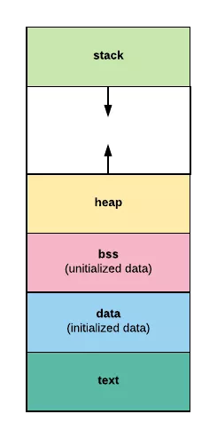

- [基础](#基础)
    - [程序的内存布局](#程序的内存布局)
- [面试](#面试)

---
# 基础
## 程序的内存布局
使用高级语言时，无论是C还是Go，都是通过变量名来访问数据的，编译器会自动将变量名转换成真正的虚拟地址。编译出来的二进制文件，被操作系统加载到内存中并执行。

操作系统的内存布局

* text段：存储程序的二进制指令，及其他的一些静态内容。
* data段：用来存储已被初始化的全局变量。比如常量（const）。
* bss段：用来存放未被初始化的全局变量。和.data段一样都属于静态分配，在这里面的变量数据在编译就确定了大小，不释放。
* stack段：栈空间，主要用于函数调用时存储临时变量的。这部分的内存是自动分配自动释放的。
* heap段：堆空间，用于动态分配，C语言中malloc和free操作的内存就在这里；Go语言主要靠GC自动管理这部分。

栈空间和堆空间
* 栈空间是通过压栈出栈方式自动分配释放的，由系统管理，使用起来高效无感知。
* 堆空间是动态分配的，由程序自己管理分配和释放。Go语言虽然可以帮我们自动管理分配和释放，但是代价也是很高的。

局部性好的程序，可以提高缓存命中率，这对底层系统的内存管理是很友好的，可以提高程序的性能。CPU的Cache层面的低命中率导致的是程序运行缓慢，内存层面的低命中率会出现内存颠簸。

内存颠簸 
如果物理内存不足了，数据会在主存和磁盘之间频繁交换，命中率很低，性能出现急剧下降，我们称这种现象叫内存颠簸。这时系统的swap（磁盘）空间利用率开始增高，CPU利用率中iowait占比开始增高。

# 面试