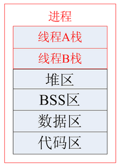

- [基础](#基础)
    - [进程、线程、协程](#进程、线程、协程)
        - [进程](#进程)
        - [线程](#线程)
        - [协程](#协程)
        - [死锁](#死锁)
    - [CPU密集型和I/O密集型](#CPU密集型和I/O密集型)
    - [阻塞和非阻塞](#阻塞和非阻塞)
    - [同步和异步](#同步和异步)
    - [并发和并行](#并发和并行)
    - [IO模型](#IO模型)
    - [IO多路复用](#IO多路复用)
    - [select、poll、epoll](#select、poll、epoll)
        - [select](#select)
        - [poll](#poll)
        - [epoll](#epoll)
    - [零拷贝](#零拷贝)
        - [mmap](#mmap)
        - [sendfile](#sendfile)
        - [mmap和sendfile的区别](#mmap和sendfile的区别)
- [面试](#面试)
    - [进程和线程的区别与联系](#进程和线程的区别与联系)
    - [进程间通信方式](#进程间通信方式)
    - [同步/异步和阻塞/非阻塞](#同步/异步和阻塞/非阻塞)
    - [select、poll、epoll的区别](#select、poll、epoll的区别)
    - [linux基本命令](#linux基本命令)

---
# 基础
## 进程、线程、协程
[参考](https://blog.csdn.net/daaikuaichuan/article/details/82951084)
### 进程
概念 
**计算机程序只不过是磁盘中可执行的二进制(或其它类型)的数据。它们只有在被读取到内存中，被操作系统调用的时候才开始它们的生命期。进程是程序的一次执行。每个进程都有自己的地址空间、内存、数据栈以及其它记录其运行轨迹的辅助数据。操作系统管理在其上运行的所有进程，并为这些进程公平地分配时间。进程也可以通过fork和spawn操作来完成其它的任务。不过各个进程有自己的内存空间，数据栈等，所以只能使用进程间通讯(IPC)，而不能直接共享信息**。 
由于CPU同一时刻只能执行一个进程，如果不加以控制的话，一个进程可能使用CPU直到运行结束，于是出现了操作系统调度器，而进程也成为了调度单位。
进程的运行不仅需要CPU，还需要很多其他资源，如内存，显卡，GPS，磁盘等，统称为程序的执行环境，也就是程序上下文。 
单CPU进行进程调度的时候，需要读取上下文+执行程序+保存上下文，即进程切换。 
在这里就出现了并发的概念，调度器切换CPU给不同进程使用的速度非常快，于是在使用者看来程序是在同时运行，这就是并发，而实际上CPU在同一时刻只在运行一个进程。 

特点 
* 进程是程序的一次执行。
* 进程是操作系统资源分配的基本单位（调度单位）：分配执行程序所需的资源，除了CPU，还有内存、显卡、磁盘等。统称为程序的执行环境，也就是程序上下文。

* 进程可以包括多个线程。
* 一个进程至少有一个线程。
* 进程有独立的地址空间，一个进程崩溃后，在保护模式下不会对其它进程产生影响。
* 进程之间的交流必须通过中间代理。

进程通信 [参考](#进程、线程、协程) 
进程之间互相交换信息的工作称之为进程通信IPC （InterProcess Communication）（主要是指大量数据的交换）。

进程通信的应用场景
* 数据传输：一个进程需要将它的数据发送给另一个进程，发送的数据量在一个字节到几兆字节之间。
* 共享数据：多个进程想要操作共享数据，一个进程对共享数据的修改，别的进程应该立刻看到。
* 通知事件：一个进程需要向另一个或一组进程发送消息，通知它（它们）发生了某种事件（如进程终止时要通知父进程）。
* 资源共享：多个进程之间共享同样的资源。为了作到这一点，需要内核提供锁和同步机制。
* 进程控制：有些进程希望完全控制另一个进程的执行（如Debug进程），此时控制进程希望能够拦截另一个进程的所有陷入和异常，并能够及时知道它的状态改变。

进程通信方式
* 管道（Pipe） 
特点
1. 它是半双工的（即数据只能在一个方向上流动），具有固定的读端和写端。
2. 它只能用于具有亲缘关系的进程之间的通信（父子进程或者兄弟进程之间）。
3. 它可以看成是一种特殊的文件，对于它的读写也可以使用普通的read、write等函数。但是它不是普通的文件，并不属于其他任何文件系统，并且只存在于内存中。
* 命名管道（FIFO） 
特点
1. FIFO可以在无关的进程之间交换数据，与无名管道不同。
2. FIFO有路径名与之相关联，它以一种特殊设备文件形式存在于文件系统中。
* 消息队列（Message Queue） 
消息队列，是消息的链接表，存放在内核中。一个消息队列由一个标识符（即队列ID）来标识。 
特点
1. 消息队列是面向记录的，其中的消息具有特定的格式以及特定的优先级。
2. 消息队列独立于发送与接收进程。进程终止时，消息队列及其内容并不会被删除。
3. 消息队列可以实现消息的随机查询,消息不一定要以先进先出的次序读取,也可以按消息的类型读取。
* 共享内存（Shared Memory） 
共享内存（Shared Memory），指两个或多个进程共享一个给定的存储区。 
特点
1. **共享内存是最快的一种IPC，因为进程是直接对内存进行存取**。
2. **因为多个进程可以同时操作，所以需要进行同步**。
3. 信号量+共享内存通常结合在一起使用，**信号量用来同步对共享内存的访问**。
* 信号量（Semaphore） 
信号量（semaphore）它是一个计数器。信号量用于实现进程间的互斥与同步，而不是用于存储进程间通信数据。 
特点
1. 信号量用于进程间同步，若要在进程间传递数据需要结合共享内存。
2. 信号量基于操作系统的PV操作，程序对信号量的操作都是原子操作。
3. 每次对信号量的PV操作不仅限于对信号量值加1或减1，而且可以加减任意正整数。
4. 支持信号量组。
* 套接字（Socket） 
套接字也是一种进程间通信机制，与其他通信机制不同的是，它可用于不同设备间的进程通信。它可以让不在同一台计算机，但通过网络连接计算机上的进程进行通信。

[参考](https://www.cnblogs.com/youngforever/p/3250270.html) 
进程同步方式
* 互斥量：只有拥有互斥对象的线程才能访问，因为互斥对象只有一个，所以能保证公共资源不会同时被多个线程访问。互斥不仅仅能够在同一应用程序不同线程中实现资源的安全共享，而且可以在不同应用程序的线程之间实现对资源的安全共享。
* 信号量：允许多个线程在同一时刻访问同一资源，但是需要限制在同一时刻访问此资源的最大线程数目。
* 管程：管程将共享变量和对它们的操作集中在一个模块中。管程是一种用于进程间同步的程序结构，能保证同一时刻只有一个进程在管程内活动，能有效解决信号量因不正确的使用而导致的一些时序错误。由于程序执行顺序的不确定性，进程在entry序列中的顺序并不一定是想要的，而condition变量就是用来操作entry序列的。有了condition变量，就可以让在自己前驱进程之前提前进入管程的进程挂起自己，退回到entry序列中重新排队。

同步和互斥
* 互斥：是指某一资源同时只允许一个访问者对其进行访问，具有唯一性和排它性。但互斥无法限制访问者对资源的访问顺序，即访问是无序的。
* 同步：是指在互斥的基础上（大多数情况），通过其它机制实现访问者对资源的有序访问。在大多数情况下，同步已经实现了互斥，特别是所有写入资源的情况必定是互斥的。少数情况是指可以允许多个访问者同时访问资源，如“第一类读写者模型”。

进程互斥、同步与通信的关系：进程竞争资源时要实施互斥，互斥是一种特殊的同步，实质上需要解决好进程同步问题，进程同步是一种进程通信。由此看来，进程互斥、同步都可以看作进程的通信。

父子进程的关系 
* 资源方面：子进程得到的是除了代码段是与父进程共享的意外事件，其他所有的都是得到父进程的一个副本，子进程的所有资源都继承父进程，得到父进程资源的副本。既然为副本，也就是说，二者并不共享地址空间。两个是单独的进程，继承了以后二者就没有什么联系了，子进程单独运行。（采用写时复制计数）
* 文件描述符方面：继承父进程的文件描述符时，相当于调用dup函数，父子进程共享文件表项，即共同操作同一个文件，一个进程修改了文件，另一个进程也知道此文件被修改了。

孤儿进程：一个父进程退出，而它的一个或多个子进程还在运行，那么那些子进程将成为孤儿进程。孤儿进程将被init进程（进程号为1）所收养，并由init进程对它们完成状态收集工作。

僵尸进程：一个进程使用fork创建子进程，如果子进程退出，而父进程并没有调用wait或waitpid获取子进程的状态信息，那么子进程的进程描述符仍然保存在系统中。这种进程称之为僵尸进程。

僵尸进程解决方法 
* 通过信号机制：子进程退出时向父进程发送SIGCHILD信号，父进程处理SIGCHILD信号。在信号处理函数中调用wait进程处理僵尸进程。
* fork两次，将子进程变为孤儿进程。

### 线程
概念 
CPU进程无法同时刻共享，但是出现一定要共享CPU的需求呢？此时线程的概念就出现了。线程被包含在进程当中，进程的不同线程间共享CPU和程序上下文。（共享进程分配到的资源） 
如果这个CPU是单核的话，那么在进程中的不同线程为了使用CPU核心，则会进行线程切换，但是由于共享了程序执行环境，这个线程切换比进程切换开销少了很多。在这里依然是并发，一个核心同时刻只能执行一个线程。 
如果这个CPU是多核的话，那么进程中的不同线程可以使用不同核心，真正的并行出现了。 
并行运行相互独立的子任务，这样的并行处理可以大幅度地提升整个任务的效率。这就是多线程编程的目的。 
线程的运行可能被抢占(中断)，或暂时地被挂起(也叫睡眠)，让其它的线程运行，这叫做让步。 
如果多个线程共同访问同一片数据，则由于数据访问的顺序不一样，有可能导致数据结果的不一致的问题。这叫做竞态条件(race condition)。 
另一个要注意的地方是，由于有的函数会在完成之前阻塞住，在没有特别为多线程做修改的情况下，这种“贪婪”的函数会让CPU的时间分配有所倾斜。导致各个线程分配到的运行时间可能不尽相同，不尽公平。

特点 
* 线程是cpu调度和分配的基本单位。
* 进程内的线程共享CPU和程序上下文（共享进程分配到的资源）。
* 不拥有系统资源，只拥有在运行中必不可少的资源。
* 线程有自己的栈空间和局部变量，但线程之间没有单独的地址空间，一个线程死掉就等于整个进程死掉，所以多进程的程序要比多线程的程序健壮。
* 线程之间可以直接进行交流。

线程同步方式 
线程同步是多线程中必须考虑和解决的问题，因为有可能发生多个线程同时访问（主要是写操作）同一资源，如果不进行线程同步，很可能会引起数据混乱，造成线程死锁等问题。
* 临界区：通过对多线程的串行化来访问公共资源或一段代码，速度快，适合控制数据访问。在任意时刻只允许一个线程对共享资源进行访问。
* 互斥量：只有拥有互斥对象的线程才能访问，因为互斥对象只有一个，所以能保证公共资源不会同时被多个线程访问。互斥不仅仅能够在同一应用程序不同线程中实现资源的安全共享，而且可以在不同应用程序的线程之间实现对资源的安全共享。
* 信号量：允许多个线程在同一时刻访问同一资源，但是需要限制在同一时刻访问此资源的最大线程数目。
* 事件：通过通知操作的方式来保持线程的同步，还可以方便实现对多个线程的优先级比较的操作。

总结：线程执行开销小，但不利于资源的管理和保护；而进程正相反。
* 单CPU中进程只能是并发，多CPU中进程可以并行。
* 单CPU单核中线程只能并发，单CPU多核中线程可以并行。
* 无论是并发还是并行，使用者来看，看到的是多进程，多线程。

### 协程
概念 
协程比线程更轻量级，在单线程中实现并发，**是用户级在程序中控制的，不是操作系统管理的**。

协程让出CPU，由用户控制。线程由操作系统控制调度CPU，用户无感知。

特点 
* 性能提升了，没有线程切换的开销。
* 和多线程比，线程数量越多，协程的性能优势就越明显。
* 协程在子程序内部是可中断的，然后转而执行别的子程序，在适当的时候再返回来接着执行。非阻塞。
* 访问共享资源的时候，也有锁的概念。
* 协程适合高并发处理：高并发+高扩展性+低成本

协程对比多线程的优势
* 极高的执行效率：子程序切换不是线程切换，而是由程序自身控制，因此，没有线程切换的开销，和多线程比，线程数量越多，协程的性能优势就越明显。
* 不需要多线程的锁机制：因为只有一个线程，也不存在同时写变量冲突，在协程中控制共享资源不加锁，只需要判断状态就好了，所以执行效率比多线程高很多。

### 死锁
概念 
是指两个或两个以上的进程在执行过程中，因争夺资源而造成的一种互相等待的现象，若无外力作用，他们都将无法推进下去。 

产生死锁的原因
* 系统资源不足。
* 进程运行时推进的顺序不合适。
* 资源分配不等当。

如果系统资源充足，进程的资源请求都能够得到满足，死锁出现的可能性就很低，否则就会因争夺有限的资源而陷入死锁。其次，进程运行推进顺序与速度不同，也可能产生死锁。

产生死锁的四个必要条件
* 互斥条件：一个资源每次只能被一个进程使用。
* 请求与保持条件：一个进程因请求资源而阻塞时，对已获得的资源保持不放。
* 不剥夺条件：进程已获得的资源，在未使用完之前，不能强行剥夺。
* 循环等待条件：若干进程之间形成一种头尾相接的循环等待资源关系。
这四个条件是死锁的必要条件，只要系统发生死锁，这些条件必然成立，而只要上述条件之一不满足，就不会发生死锁。

死锁的解除与预防 
理解了死锁的原因，尤其是产生死锁的四个必要条件，就可以最大可能地避免、预防和解除死锁。所以，在系统设计、进程调度等方面注意如何不让这四个必要条件成立，如何确定资源的合理分配算法，避免进程永久占据系统资源。此外，也要防止进程在处于等待状态的情况下占用资源。因此，对资源的分配要给予合理的规划。

## CPU密集型和I/O密集型
计算密集型程序（CPU密集型）：CPU计算花费时间多，任务越多，切换任务的时间越多，CPU执行任务的时间越少，效率越低。适合C语言多线程，适合用多进程，提高CPU的利用率。 
I/O密集型：I/O花费时间多，任务越多，CPU利用率越高，适合脚本语言开发的多线程。如web应用，线程、协程适用在I/O密集型。

对所有面向I/O的（会调用内建的操作系统C代码的）程序来说，GIL会在这个I/O调用之前被释放，以允许其它的线程在这个线程等待I/O的时候运行。如果某线程并未使用很多I/O操作，它会在自己的时间片内一直占用处理器(和GIL)。也就是说，I/O密集型的Python程序比计算密集型的程序更能充分利用多线程环境的好处。

## 阻塞和非阻塞
阻塞这个词来自操作系统的线程/进程的状态模型中。 
阻塞状态，就是说当线程中调用某个函数，需要IO请求，或者暂时得不到竞争资源的，操作系统会把该线程阻塞起来，避免浪费CPU资源，等到得到了资源，再变成就绪状态，等待CPU调度运行。 
* 阻塞调用：是指调用结果返回之前，当前线程会被挂起，函数只有在得到结果之后才会返回。
* 非阻塞调用：是指在不能立刻得到结果之前，该函数不会阻塞当前线程，而会立刻返回。

如果线程始终阻塞着，永远得不到资源，就会发生死锁。注意共享资源的使用，用信号量控制好，避免造成死锁。 
阻塞和挂起：阻塞是被动的，比如抢不到资源。挂起是主动的，线程自己调用suspend()把自己退出运行态了，某些时候调用resume()又恢复运行。

## 同步和异步
* 同步：在发出一个同步调用时，在没有得到结果之前，该调用就不返回。
* 异步：在发出一个异步调用后，调用者不会立刻得到结果，该调用就返回了。实际处理这个调用的部件在完成后，通过状态、通知和回调来通知调用者。

同步/异步和阻塞/非阻塞的区别 
同步的定义看起来跟阻塞很像，但是同步跟阻塞是两个概念，同步调用的时候，线程不一定阻塞，调用虽然没返回，但它还是在运行状态中的，CPU很可能还在执行这段代码。而阻塞的话，它就肯定不在CPU中跑这个代码了。这就是同步和阻塞的区别。同步是肯定可以在，阻塞是肯定不在。 
异步和非阻塞的定义比较像，两者的区别是异步是说调用的时候结果不会马上返回，线程可能被阻塞起来，也可能不阻塞，两者没关系。非阻塞是说调用的时候，线程肯定不会进入阻塞状态。

* 同步阻塞调用：得不到结果不返回，线程进入阻塞态等待。
* 同步非阻塞调用：得不到结果不返回，线程不阻塞一直在CPU运行。
* 异步阻塞调用：去到别的线程，让别的线程阻塞起来等待结果，自己不阻塞。
* 异步非阻塞调用：去到别的线程，别的线程一直在运行，直到得出结果。

同步只能让调用者去轮询自己，异步可以通过回调函数等通知。
一般异步是配合非阻塞使用的，这样才能发挥异步的效用。

阻塞，非阻塞：进程/线程要访问的数据是否就绪，进程/线程是否需要等待。 
同步，异步：访问数据的方式，同步需要主动读写数据，在读写数据的过程中还是会阻塞；异步只需要I/O操作完成的通知，并不主动读写数据，由操作系统内核完成数据的读写。

## 并发和并行
* 并发：多个程序在一个CPU上运行，CPU在多个程序之间快速切换。微观上不是同时运行，任意一个时刻只有一个程序在运行，但宏观上看起来就像多个程序同时运行一样，因为CPU切换速度非常快。
* 并行：多个程序在多个CPU上同时运行，任意一个时刻可以有很多个程序同时运行，互不干扰。

## IO模型
* 同步阻塞IO（Blocking IO）：即传统的IO模型。
* 同步非阻塞IO（Non-blocking IO）：默认创建的socket都是阻塞的，非阻塞IO要求socket被设置为NONBLOCK。注意这里所说的NIO并非Java的NIO（New IO）库。
* **[IO多路复用](#IO多路复用)**（IO Multiplexing）：即经典的Reactor设计模式，有时也称为异步阻塞IO，Java中的Selector和Linux中的epoll都是这种模型。
* 异步IO（Asynchronous IO）：即经典的Proactor设计模式，也称为异步非阻塞IO。

## IO多路复用
可以处理大量客户端的同时连接。 
基本原理 
select，poll，epoll，kqueue这些function会不断的轮询所负责的所有socket，当某个socket就绪（一般是读就绪或者写就绪），就通知用户进程。

好处 
单个进程/线程可以同时处理多个网络连接的IO，可以提高服务器的吞吐能力。

使用场合 
* 当客户处理多个描述字时（一般是交互式输入和网络套接口），必须使用I/O复用。
* 当一个客户同时处理多个套接口时，而这种情况是可能的，但很少出现。
* 如果一个TCP服务器既要处理监听套接口，又要处理已连接套接口，一般也要用到I/O复用。
* 如果一个服务器即要处理TCP，又要处理UDP，一般要使用I/O复用。
* 如果一个服务器要处理多个服务或多个协议，一般要使用I/O复用。

多路复用的实现有多种方式：select、poll、epoll，kqueue。

## **select、poll、epoll**
[参考1](https://blog.csdn.net/davidsguo008/article/details/73556811) 
[参考2](https://www.cnblogs.com/aspirant/p/9166944.html) 
[参考视频](https://www.bilibili.com/video/BV1qJ411w7du?from=search&seid=12098233179004224040) 
是用单线程实现的，由内核监听文件描述符。 
### select
实现原理：
1. 比如创建了5个文件描述符（socket），处理5个客户端的连接。
2. 数组存储5个文件描述符，创建一个bitmap（1024位），位对应文件描述符（数字）。需要被监听的位置1，不需要被监听的位置0.
3. 调用select函数，用户态复制bitmap到内核态，由内核态轮询监听文件描述符的读写情况。如果文件描述符产生读（有数据来时）写，bitmap中文件描述符置位（多个文件描述符同时有数据则多个文件描述符置位），select函数返回，没有返回值。内核态监听到文件描述符有读写时，才返回，否则，select函数一直阻塞。
4. 用户态不知道哪个文件描述符就绪，遍历文件描述符数组，查看bitmap（有修改）相应文件描述符的置位情况，有置位则处理。

特点 
* 单个进程能监视的文件描述符数量（bitmap）有限制，默认值是1024。
* bitmap不可重用，因为每次循环文件描述符有读写的时候都会修改文件描述符的置位情况。
* 用户态到内核态内存拷贝问题，用户态要拷贝bitmap到内核态，产生巨大的开销。
* 用户态不知道哪个文件描述符产生读写，需要遍历文件描述符数组才能知道哪些文件描述符发生了事件并处理。
* select的触发方式是水平触发，应用程序如果没有完成对一个已经就绪的文件描述符进行IO操作，那么之后每次select调用还是会将这些文件描述符通知进程。

### poll
实现原理：
1. 比如创建了5个文件描述符（socket），处理5个客户端的连接。
2. poll使用一个pollfd的指针实现。pollfd结构包含了文件描述符、要监视的event和发生的event。
3. 调用poll函数，文件描述符有读写时，pollfd结构体中发生的event置位，poll函数返回，没有返回值。没有发生文件描述符读写时，则阻塞。
4. 用户态不知道哪个文件描述符就绪，需轮询pollfd来获取就绪的描述符并处理，并且将pollfd结构体中发生的event重新恢复，因此，pollfd可以重用。

特点 
* pollfd并没有最大数量限制（但是数量过大后性能也是会下降）。 
* pollfd可以重用。
* 用户态到内核态内存拷贝问题，用户态要拷贝pollfd到内核态，产生巨大的开销。
* 和select函数一样，poll返回后，需要轮询pollfd来获取就绪的描述符。

### epoll
[参考](https://baike.baidu.com/item/epoll) 
实现原理
1. 比如创建了5个文件描述符（socket），处理5个客户端的连接。
2. 调用epoll_create()建立一个epoll对象(在epoll文件系统中为这个句柄对象分配资源)。使用结构体数组存储文件描述符，结构体包括文件描述符和要监视的event。
3. 调用epoll_ctl向epoll对象中添加（注册）文件描述符。
3. 调用epoll_wait。内核态轮询注册的文件描述符数组，不需要从用户态拷贝到内核态，通过共享内存。文件描述符有读写时，置位是通过重排实现的，将有数据的文件描述符放到数组前面，函数返回有就绪态的文件描述符个数。无文件描述符读写时，函数阻塞。
4. 用户态遍历数组，只需遍历数组前面的元素并处理，个数等于有就绪态的文件描述符个数。

特点 
* 单个进程能监视的文件描述符不受限制。所支持的FD上限是最大可以打开文件的数目，这个数字一般远大于2048。如在1GB内存的机器上大约是10万左右。一般来说这个数目和系统内存关系很大。
* 零拷贝，利用[mmap](#mmap)内存映射文件，避免了内核态到用户态的拷贝，减少复制开销。
* 用户态只需遍历就绪的文件描述符。

一点疑问：
* epoll_wait函数返回的到底是什么，是重排后的文件描述符数组还是包含就绪态的文件描述符的双链表，但是不管是哪种，用户态都只需轮询就绪的文件描述符。

应用：Ninx、Redis、HTTP2.0、Tornado。

epoll的ET与LT模式 
LT（水平触发）：当检测到描述符事件通知应用程序，如果应用程序没有立即处理该事件，那么下次会再次通知应用程序此事件。 
ET（边缘触发）：当检测到描述符事件通知应用程序，如果这次没有把数据全部读写完(如读写缓冲区太小)，那么下次调用epoll_wait()时，它不会通知应用程序，也就是它只会通知应用程序一次，直到该文件描述符上出现第二次可读写事件才会通知应用程序。ET模式减少了epoll被重复触发的次数，效率比LT高。

libevent 
由于epoll（Linux）, kqueue（FreeBSD）, IOCP（Windows）每个接口都有自己的特点，程序移植非常困难，于是需要对这些接口进行封装，以让它们易于使用和移植，其中libevent库就是其中之一。跨平台，封装底层平台的调用，提供统一的API，但底层在不同平台上自动选择合适的调用。按照libevent的官方网站，libevent库提供了以下功能：当一个文件描述符的特定事件（如可读，可写或出错）发生了，或一个定时事件发生了，libevent就会自动执行用户指定的回调函数，来处理事件。

## 零拷贝
零拷贝就是一种避免 CPU 将数据从一块存储拷贝到另外一块存储的技术。
零拷贝技术减少了用户应用程序地址空间和操作系统内核地址空间之间因为上下文切换而带来的开销，带来更少的数据复制。

Linux中的零拷贝技术
* 直接 I/O。
* 在数据传输的过程中，避免数据在操作系统内核地址空间的缓冲区和用户应用程序地址空间的缓冲区之间进行拷贝。Linux中提供类似的系统调用主要有mmap()，sendfile()以及splice()。
* 对数据在Linux的页缓存和用户进程的缓冲区之间的传输过程进行优化。

### mmap
[参考](https://blog.csdn.net/Holy_666/article/details/86532671) 
mmap（memory map）：即地址的映射, 是一种内存映射文件的方法。mmap用来在进程虚拟内存地址空间中分配地址空间，创建和物理内存的映射关系。**mmap()系统调用使得进程之间通过映射同一个普通文件实现共享内存**。

mmap只是在虚拟内存分配了地址空间，只有在第一次访问虚拟内存的时候才分配物理内存。

**常规文件操作需要从磁盘到页缓存（Page Cache）再到用户主存的两次数据拷贝。而mmap操控文件，只需要从磁盘到用户主存的一次数据拷贝过程**。

mmap内存映射的实现过程
1. 进程启动映射过程，并在虚拟地址空间中为映射创建虚拟映射区域。
2. 调用内核空间的系统调用函数mmap（不同于用户空间函数），实现文件物理地址和进程虚拟地址的一一映射关系。
3. 进程发起对这片映射空间的访问，引发缺页异常，实现文件内容到物理内存（主存）的拷贝。

优点
* 对文件的读取操作跨过了页缓存，减少了数据的拷贝次数（避免了内核态到用户态的数据拷贝），用内存读写取代I/O读写，提高了文件读取效率。
* 用户空间和内核空间的各自修改操作可以直接反映在映射的区域内，从而被对方空间及时捕捉。
* 提供进程间共享内存及相互通信的方式。
* 可用于实现高效的大规模数据传输。

缺点
* 对变长文件不适合。
* 如果更新文件的操作很多，mmap避免两态拷贝的优势就被摊还，最终还是落在了大量的脏页回写及由此引发的随机IO上。所以在随机写很多的情况下，mmap方式在效率上不一定会比带缓冲区的一般写快。

### sendfile
sendfile系统调用在两个文件描述符之间直接传递数据(完全在内核中操作)，从而避免了数据在内核缓冲区和用户缓冲区之间的拷贝，操作效率很高，被称之为零拷贝。

实现过程
1. sendfile系统调用利用DMA引擎将文件数据拷贝到内核缓冲区，之后数据被拷贝到内核socket缓冲区中。
2. DMA引擎将数据从内核socket缓冲区拷贝到协议引擎中。

没有用户态和内核态之间的切换，也没有内核缓冲区和用户缓冲区之间的拷贝，大大提升了传输性能。

### mmap和sendfile的区别
* mmap适合小数据量读写；sendfile适合大文件传输。
* sendfile是将读到内核空间的数据，转到socket buffer，进行网络发送；mmap将磁盘文件映射到内存，支持读和写，对内存的操作会反映在磁盘文件上。
* mmap需要4次上下文切换，3次数据拷贝；sendfile需要3次上下文切换，最少2次数据拷贝。
* sendfile可以利用DMA方式，减少CPU拷贝，mmap则不能（必须从内核拷贝到Socket缓冲区）。

# 面试
## **进程和线程的区别与联系**
区别
* 调度：线程作为调度和分配的基本单位，进程作为拥有资源的基本单位。
* 并发性：不仅进程之间可以并发执行，同一个进程的多个线程之间也可并发执行。
* 拥有资源：进程是拥有资源的一个独立单位，线程不拥有系统资源，但可以访问隶属于进程的资源。进程所维护的是程序所包含的资源（静态资源），如：地址空间，打开的文件句柄集，文件系统状态，信号处理handler等。线程所维护的是运行相关的资源（动态资源），如：运行栈，调度相关的控制信息，待处理的信号集等。
* 系统开销：在创建或撤消进程时，由于系统都要为之分配和回收资源，导致系统的开销明显大于创建或撤消线程时的开销。但是进程有独立的地址空间，一个进程崩溃后，在保护模式下不会对其它进程产生影响，而线程只是一个进程中的不同执行路径。线程有自己的堆栈和局部变量，但线程之间没有单独的地址空间，一个进程死掉就等于所有的线程死掉，所以多进程的程序要比多线程的程序健壮。但在进程切换时，耗费资源较大，效率要差一些。

联系
* 一个线程只能属于一个进程。而一个进程可以有多个线程，但至少有一个线程。
* 资源分配给进程，同一进程的所有线程共享该进程的所有资源。
* 处理机分给线程，即真正在处理机上运行的是线程。
* 线程在执行过程中，需要协作同步。不同进程的线程间要利用消息通信的办法实现同步。 

## 进程间通信方式
* 管道：只有父子进程或者兄弟进程能通讯。速度慢，容量有限。
* 命名管道：任何进程间都能通讯。速度慢。    
* 消息队列：容量受到系统限制，且要注意第一次读的时候，要考虑上一次没有读完数据的问题。  
* 共享内存区：能够很容易控制容量，速度快。但要保持同步，比如一个进程在写的时候，另一个进程要注意读写的问题，相当于线程中的线程安全。当然，共享内存区同样可以用作线程间通讯，不过没这个必要，线程间本来就已经共享了同一进程内的一块内存。
* 信号量：只能传递信号，没有传递数据的能力。只能用来同步，与共享内存区配合使用。
* 套接字：与其他通信机制不同的是，它可用于不同设备间的进程通信。它可以让不在同一台计算机，但通过网络连接计算机上的进程进行通信。
## 同步/异步和阻塞/非阻塞
同步和异步的概念描述的是用户线程与内核的交互方式。
* 同步：指用户线程发起IO请求后需要等待或者轮询内核IO操作完成后才能继续执行。
* 异步：指用户线程发起IO请求后仍继续执行，当内核IO操作完成后会通知用户线程，或者调用用户线程注册的回调函数。

阻塞和非阻塞的概念描述的是用户线程调用内核IO操作的方式。
* 阻塞：指IO操作需要彻底完成后才返回到用户空间。
* 非阻塞：指IO操作被调用后立即返回给用户一个状态值，无需等到IO操作彻底完成。
## select、poll、epoll的区别
[select、poll、epoll](#select、poll、epoll)
1. 支持一个进程所能打开的最大连接数
* select：进程能监听的文件描述符有数量限制，默认为bitmap的大小：1024。
* poll：没有最大连接数的限制，通过链表存储文件描述符（？）。
* epoll：虽然连接数有上限，但是很大。1G内存的机器上可以打开10万左右的连接，2G内存的机器可以打开20万左右的连接。 
2. 用户态到内核态的拷贝
* select：拷贝bitmap（1024位），开销大。
* poll：拷贝结构体数组，开销大。
* epoll：使用共享内存或者mmap()文件映射内存（？），减少复制开销。
3. 用户态轮询时间复杂度
* select：用户态不知道哪些文件描述符就绪，需要轮询所有文件描述符。
* poll：用户态不知道哪些文件描述符就绪，需要轮询所有文件描述符。
* epoll：用户态只需轮询就绪的文件描述符。
## linux基本命令
* 查看文件尾内容：tail 
查看desc.txt的最后100行内容：tail -100 desc.txt
* 搜索文件：find 
在opt目录下查找以.txt结尾的文件：find /opt -name '*.txt'
* 显示或配置网络设备：ifconfig 
显示网络设备情况：ifconfig
* 显示网络相关信息：netstat 
列出所有端口：netstat -a
* 显示进程状态：ps 
显示当前所有进程：ps -ef 
显示当前所有java相关进程：ps -ef | grep java
* 查看目录使用情况：du 
查看/opt/test目录的磁盘使用情况：du -h /opt/test
* 查看磁盘空间使用情况：df 
查看磁盘空间使用情况：df -h 
* 显示系统当前进程信息：top 
显示系统当前进程信息：top
* 改变文件或目录的访问权限：chmod 
权限范围：u（拥有者）、g（群组）、o(其它用户)，权限代号：r（读权限/4）、w（写权限/2）、x（执行权限/1）。 
给文件拥有者增加test.sh的执行权限：chmod u+x test.sh 
给文件拥有者增加test目录及其下所有文件的执行权限：chmod u+x -R test
* 帮助命令：man 
查看ls命令的帮助文档：man ls
* linux压缩、解压命令 
tar文件（打包工具，把很多文件打包成一个文件，⼤⼩不变）。 
压缩：tar cvf FileName.tar FileName 
解压：tar xvf FileName.tar 
gz文件，容量更小，压缩文件⼤小。 
压缩：tar zcvf FileName.tar.gz FileName  
解压：tar zxvf FileName.tar.gz
* 统计输出信息的⾏数 
wc -l