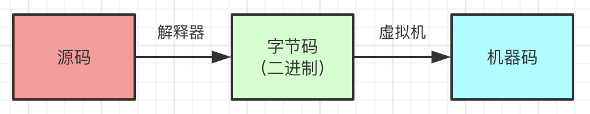
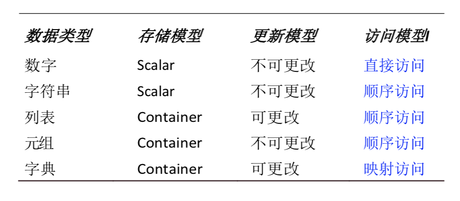
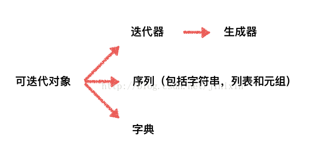
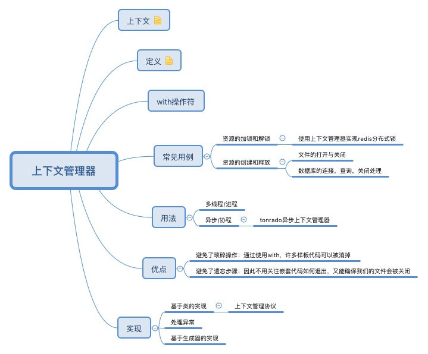

- [基础](#基础)
    - [简介](#简介)
    - [特点](#特点)
    - [标准交互输入](#标准交互输入)
    - [数据类型](#数据类型)
        - [数字](#数字)
        - [序列](#序列)
            - [字符串](#字符串)
            - [列表](#列表)
            - [元祖](#元祖)
        - [映射](#映射)
            - [字典](#字典)
        - [集合](#集合)
        - [Null对象](#Null对象)
    - [函数](#函数)
        - [可变长度的参数](#可变长度的参数)
        - [参数组](#参数组)
        - [函数式编程](#函数式编程)
            - [lambda匿名函数](#lambda匿名函数)
            - [filter()函数](#filter()函数)
            - [map()函数](#map()函数)
            - [zip()函数](#zip()函数)
            - [reduce()函数](#reduce()函数)
    - [可迭代对象和迭代器](#可迭代对象和迭代器)
    - [生成器](#生成器) 
    - [装饰器](#装饰器)
    - [异常](#异常)
    - [上下文管理](#上下文管理)
    - [内存管理](#内存管理)
    - [GIL锁](#GIL锁)
    - [协程](#协程)
- [面试](#面试)
    - [python的解释过程](#python的解释过程)
    - [python跟其他语言的区别](#python跟其他语言的区别)
    - [python的代码执行顺序](#python的代码执行顺序)
    - [数据类型列表（list）、元祖（tuple）、字典（dict）、集合（set）的区别](#数据类型列表（list）、元祖（tuple）、字典（dict）、集合（set）的区别)
    - [哪些可以作为字典的键](#哪些可以作为字典的键)
    - [浅拷贝和深拷贝](#浅拷贝和深拷贝)
    - [*、**参数](#*、**参数)
    - [简述__new__和__init__的区别](#简述__new__和__init__的区别)
    - [迭代器和生成器](#迭代器和生成器)
    - [讲述装饰器](#讲述装饰器)
    - [讲述上下文管理](#讲述上下文管理)
    - [当退出python时是否释放所有内存分配](#当退出python时是否释放所有内存分配)
    - [内存回收机制](#内存回收机制)
    - [讲述GIL锁](#讲述GIL锁)

---
# 基础
## 简介
python是解释型语言。<br>
过程：python源文件通常用.py扩展名，当源文件被解释器（CPython等）加载或者显式地进行字节码编译的时候会被编译成字节码。由于调用解释器的方式不同，源文件会被编译成带有.pyc或.pyo扩展名的文件。字节码是跨平台的，再由平台的虚拟机解释成机器指令。



特点：python源码是可移植的，解释器生成的字节码是跨平台的。

源码执行顺序：.py文件单独执行时，其__name__的值为"`__main__`"，按照自上而下的顺序首先执行没有缩进的代码和包含在Class定义中的代码，但是包含在def中的代码不会被执行(除非被调用)，然后执行if `__name__` == "`__main__`":中的代码；当文件被import时，同样按照import顺序执行被导入的文件。

**与其他语言的区别** <br>
> 与c++（编译型语言）区别
* python是解释性语言，c++是编译型语言。python运行慢，运行的时候还要将字节码解释成机器指令；而c++运行之前已经被编译成机器码。
* python是动态类型的，不需要声明变量类型，在运行时才会检查数据类型；c++是静态类型，要事先声明变量类型，在编译时执行类型检查。
* 跨平台的级别不一样。python是字节码跨平台；c++是源码跨平台。
> 与java（解释型语言）区别
* python是动态类型的，不需要声明变量类型，在运行时才会检查数据类型；java是静态类型，要事先声明变量类型，在编译时执行类型检查。

.pyc文件：如果程序没有修改过，那么下次运行程序的时候，可以跳过从源码到字节码的过程，直接加载pyc文件，加快启动速度。与python版本相关。<br>
字节码：是一种中间状态（中间码）的二进制代码（文件）。跨平台（操作系统）的，不同的平台有各自的虚拟机，可以将字节码解释成机器指令。<br>
机器码：电脑CPU直接读取运行的机器指令。不同的机器有不同的机器指令，因此编译语言要重新编译。<br>
字节码需要直译器转译后才能成为机器码。

`__name__`指示模块应如何被加载<br>
由于主程序代码无论模块是被导入还是被直接执行都会运行，必须知道模块如何决定运行方向。一个应用程序可能需要导入另一个应用程序的一个模块，以便重用一些有用的代码 (否则就只能用拷贝粘贴那种非面向对象的愚蠢手段)。这种情况下，如果只想访问那些位于其它应用程序中的代码，而不是想运行那个应用程序。使用`__name__`系统变量。
* 如果模块是被导入，`__name__`的值为模块名字。
* 如果模块是被直接执行，`__name__`的值为"`__main__`"。

## 特点
高级：有高级的数据结构，列表、字典是内建于语言本身的；可以缩短开发时间和代码量，产生出可读性更好的代码。<br>
面向对象<br>
可升级<br>
可扩展：可以使用编译型代码（如C）重写程序的瓶颈部分，能明显提升整体性能。<br>
**可移植性**：是用C写的，具备C的可移植性。这种可移植性既适用于不同的架构，也适用于不同的操作系统。<br>
易维护<br>
健壮性<br>
易读、易学<br>
**内存管理器**：内存管理是由python解释器负责的，开发人员可以从内存事物中解放出来。这会使错误 更少、程序更健壮、开发周期更短。<br>
**解释性和（字节）编译性**：python是一种解释型语言，纯粹的解释型语言通常比编译型语言运行的慢。类似java，python解释器将python源文件编译成字节码（近似机器码的中间形式），改善了python的性能并保持了解释型语言的优点。

## 标准交互输入
使用input()内建函数。它读取标准输入，并将读取到的数据赋值给指定的变量。其接收任意类型输入，将所有输入默认为字符串处理，并返回字符串类型。
```python
>>> user = input('Enter login name: ')
Enter login name: root
>>> print(user)
root
```

## 数据类型
没有char（字符）、byte类型以及指针<br>

数据类型对比



### 数字
**特点**
* **不可变**
### 序列
#### 字符串
**特点**
* **是有序序列**
* 可以通过索引访问
* **不可变**
#### 列表
数据结构：大小可变的数组<br>

**特点**
* **是有序序列**
* 可以存储任何数据类型
* 可以通过索引访问
* 元素可以重复，可以修改，**是可变的**
* 可以复制
* 内存开销大
* 通常用于存放同类项目的集合

构建其他数据结构
> 列表作为栈使用<br>
列表方法使得列表作为堆栈非常容易，最后一个插入，最先取出（”后进先出“）。要添加一个元素到堆栈的顶端，使用append()。要从堆栈顶部取出一个元素，使用pop()，不用指定索引。<br>

> 列表作为队列使用<br>
列表也可以用作队列，其中先添加的元素被最先取出 (”先进先出“)。然而列表用作这个目的相当低效。因为在列表的末尾添加和弹出元素非常快，但是在列表的开头插入或弹出元素却很慢 (因为所有的其他元素都必须移动一位)。

list（列表）和array（数组）的区别
* 元素的数据类型要求不一样<br>
list：元素的数据类型可以不相同。<br>
numpy库中array：里面元素的数据类型必须一致。<br>
* 存储空间不一样<br>
list：动态指针数组，内存不连续，要保存数据存放的地址（指针）和数据本身，增加了存储和消耗cpu。<br>
array：动态数组，所占的存储空间大小就是数据的大小。<br>

extend与append的区别<br>
* extend：接受一个参数，这个参数总是一个list，并且把这个list中的每个元素添加到原list中。
* append：接受一个参数，这个参数可以是任何数据类型，简单地追加到list的尾部。（接受参数为list，也是只增加了一个元素）

for循环中删除列表元素
* 倒序遍历
```python
num_list = [1, 2, 3, 4, 5]
print(num_list)

for i in range(len(num_list)-1, -1, -1):
    if num_list[i] == 2:
        num_list.pop(i)
    else:
        print(num_list[i])

print(num_list)
```
* 复制一个list,然后在原list上做删除操作
```python
num_list = [1, 2, 3, 4, 5]
print(num_list)

for item in num_list[:]:
    if item == 2:
        num_list.remove(item)
    else:
        print(item)

print(num_list)
```
这种方法有一定的代价，如果列表很大，使用拷贝，将会将列表读取到内存中，大列表会很占内存空间，所以如果数据量大不建议使用这种方法。
* 对原来的列表做过滤，生成一个新的列表
```python
num_list = [1, 2, 3, 4, 5]

def determine(temp):
    return temp == 2

return_list = [x for x in num_list if not determine(x)]

print(return_list)
```

list去重
* 遍历<br>
先建立一个新的空列表，通过遍历原来的列表，再利用逻辑关系not in来去重。<br>
这样可以做出来，但是过程不够简单。不过此方法保证了列表的顺序性。
* 利用set<br>
将列表转化为集合再转化为列表，利用集合的自动去重功能。优点：简单快速。缺点：使用set方法无法保证去重后的顺序。
* 利用set+索引<br>
```python
list1=[1,2,3,3,4,5,2,8,1,7]
new_list=list(set(list1))
new_list.sort(key=list1.index)
print(new_list)
```
可以通过列表中索引（index）的方法保证去重后的顺序不变。
* 使用keys()
```python
list1 = [1,2,3,3,4,5,2,8,1,7]
new_list = list({}.fromkeys(list1).keys())
print (new_list)
```
不能保证原有的顺序
* 用reduce
思路是先把ids变为[[], 1,4,3,……]，然后再利用reduce的特性。这里的去重不会改变原来的顺序。
```python
from functools import reduce

list1 = [1,2,3,3,4,5,2,8,1,7]
func = lambda x,y:x if y in x else x + [y]
new_list =reduce(func, [[], ] + list1)
print(new_list)
```

#### 元祖
**特点**
* **是有序序列**
* 可以存储任何数据类型
* 可以通过索引访问
* 元素可以重复，不能修改，**不可变**
* 不可以复制，tuple(a)将返回自己
* 内存开销小
* 通常用于储存异构数据的多项集

### 映射
#### 字典
数据结构：哈希表<br>

**特点**
* **无序**
* 值可以是任意类型
* **键**：所有python自带类型中，除了list、dict、set和内部至少带有上述三种类型之一的tuple之外，其余的对象都能当key
* 与以连续整数为索引的序列不同，字典是以关键字为索引的

**哪些可以作为键**<br>
不可变对象的值是不可改变的。这就意味着它们通过hash算法得到的值总是一个值。这是作为字典键值的一个必备条件。**键值必须是可哈希的对象**，元组变量符合这个标准，而列表变量就不行。<br>
为什么键必须是可哈希的？解释器调用哈希函数，根据字典中键的值来计算存储的数据的位置。如果键是可变对象，它的值可改变。如果键发生变化，哈希函数会映射到不同的地址来存储数据。如果这样的情况发生，哈希函数就不能可靠地存储或获取相关的数据。选择可哈希的键的原因就是因为它们的值不能改变。<br>
用元组做有效的键，必须要加限制：元组中只包括像数字和字符串这样的不可变参数，才可以作为字典中有效的键。<br>
**所有python自带类型中，除了list、dict、set和内部至少带有上述三种类型之一的tuple之外，其余的对象都能当key**。

for循环中删除字典元素
```python
d = {'a':1, 'b':2, 'c':3}
for key in d.keys():
	d.pop(key)

print(d)
```
```python
d = {'a':1, 'b':2, 'c':3}
for key in list(d):
	d.pop(key)

print(d)
```
一个序列的迭代器只是记录当前到达第多少个元素, 所以如果在迭代时改变了元素, 更新会立即反映到所迭代的条目上。在迭代字典的key时, 绝对不能改变这个字典。 使用字典的keys()方法是可以的，因为keys()返回一个独立于字典的列表。而迭代器是与实际对象绑定在一起的, 它将不会继续执行下去。

### 集合
**特点**
* **无序不重复**
* 可以使用大括号{}或者set()函数创建集合，注意：创建一个空集合必须用set()而不是{}，因为{}是用来创建一个空字典。

分为可变集合和不可变集合
* 可变集合：s=set('cheeseshop')。可变集合(set)是不可哈希的，因此既不能用做字典的键也不能做其他集合中的元素。   
* 不可变集合：t=frozenset('bookshop')。不可变集合(frozenset)有哈希值，能被用做字典的键或是作为集合中的一个成员。

### Null对象
python有一个特殊的类型，被称作Null对象或者NoneType，它只有一个值，那就是None。 它不支持任何运算也没有任何内建方法。

**浅拷贝和深拷贝**
* 直接赋值：是对象的引用（别名）。b=a，赋值引用，a和b指向同一个对象。
* 浅拷贝(copy)：拷贝父对象，不会拷贝对象的内部的子对象。b=copy.copy(a)，浅拷贝，a和b是一个独立的对象，但他们的子对象还是指向同一对象（是引用）。子对象（可变对象）改变元素时，是联动的。
* 深拷贝(deepcopy)：copy模块的deepcopy方法，完全拷贝了父对象及其子对象。b=copy.deepcopy(a)，深度拷贝, a和b完全拷贝了父对象及其子对象，两者是完全独立的。<br>

浅层复制和深层复制之间的区别仅与复合对象（即包含其他对象的对象，如列表或类的实例）相关。<br>
浅层复制会构造一个新的复合对象，然后（在可能的范围内）将原对象中找到的引用（是同一个对象）插入其中。<br>
深层复制会构造一个新的复合对象，然后递归地将原始对象中所找到的对象的副本插入。

## 函数
### 可变长度的参数
*、**作为函数定义括号内的参数
```python
def test(*args,**kwargs):
    print("args=", args)
    print("kwargs=", kwargs)

a={'a':'11','b':'22','c':'33'}
test(1,2,3)
test([1,2,3])
test(a=11,b=22,c=33)
test(1,2,3,a=11,b=22,c=33)

#输出：
args= (1, 2, 3)
kwargs= {}
args= ([1, 2, 3],)
kwargs= {}
args= ()
kwargs= {'a': 11, 'b': 22, 'c': 33}
args= (1, 2, 3)
kwargs= {'a': 11, 'b': 22, 'c': 33}
```
`*args`：接收序列（tuple）。<br>
`**kwargs`：接收键值对（dict），`*args`参数列必须在`**kwargs`前。
### 参数组
*、**作为函数调用括号内的参数：
```python
def test(*args,**kwargs):
    print("args=", args)
    print("kwargs=", kwargs)

a={'a':'11','b':'22','c':'33'}
test(*(1,2,3))
test(*[1,2,3])
test(*a)
test(**a)

#输出：
args= (1, 2, 3)
kwargs= {}
args= (1, 2, 3)
kwargs= {}
args= ('a', 'b', 'c')
kwargs= {}
args= ()
kwargs= {'a': '11', 'b': '22', 'c': '33'}
```
`*`
* 解析序列（tuple、list）为依次排列的单个元素，如：test(`*`(1,2,3))和test(`*`[1,2,3])被解析为test(1,2,3)。
* 解析映射（dict）的键为依次排列的单个元素，如：test(`*`{"a":1,"b":2,"c":3})被解析为test("a","b","c")。

`**`
* 只解析映射（dict），解析为关键字参数，如：test(`**`{"a":1,"b":2,"c":3})被解析为test(a=1,b=2,c=3)。

### 函数式编程
#### lambda匿名函数
lambda [arg1[, arg2, ... argN]]: expression参数是可选的。如果使用的参数话，参数通常也是表达式的一部分。
```python
>>> a = lambda x, y=2: x + y
>>> a(3)
5
>>> a(3,5)
8
>>> a(0)
2
>>> a(0,9)
9
>>>
>>> b = lambda *z: z
>>> b(23, 'zyx')
(23, 'zyx')
>>> b(42)
(42,)
```
#### filter()函数
filter()函数用于过滤序列，过滤掉不符合条件的元素，返回一个迭代器对象，如果要转换为列表，可以使用list()来转换。<br>
函数接收两个参数，第一个为函数，第二个为序列，序列的每个元素作为参数传递给函数进行判断，然后返回True或False，最后将返回True的元素放到新列表中。
* 语法<br>
filter(function, iterable)<br>
* 参数<br>
function -- 判断函数<br>
iterable -- 可迭代对象<br>
* 返回值<br>
返回一个迭代器对象<br>
```python 
def is_odd(n):
    return n % 2 == 1
 
tmplist = filter(is_odd, [1, 2, 3, 4, 5, 6, 7, 8, 9, 10])
newlist = list(tmplist)
print(newlist)

#输出结果：
[1, 3, 5, 7, 9]
```
#### map()函数
根据提供的函数对指定序列做映射。第一个参数function以参数序列中的每一个元素调用function函数，返回包含每次 function函数返回值的新列表。
* 语法<br>
map(function, iterable, ...)
* 参数<br>
function -- 函数<br>
iterable -- 一个或多个序列
* 返回值<br>
python 2.x 返回列表<br>
python 3.x 返回迭代器<br>
```python
>>> def square(x): #计算平方数
...     return x ** 2
... 
>>> map(square, [1,2,3,4,5]) #计算列表各个元素的平方
[1, 4, 9, 16, 25]
>>> map(lambda x: x ** 2, [1, 2, 3, 4, 5]) #使用lambda匿名函数
[1, 4, 9, 16, 25]
# 提供了两个列表，对相同位置的列表数据进行相加
>>> map(lambda x, y: x + y, [1, 3, 5, 7, 9], [2, 4, 6, 8, 10])
[3, 7, 11, 15, 19]
```
#### zip()函数
用于将可迭代的对象作为参数，将对象中对应的元素打包成一个个元组，然后返回由这些元组组成的对象，这样做的好处是节约了不少的内存。<br>
可以使用list()转换来输出列表。<br>
如果各个迭代器的元素个数不一致，则返回列表长度与最短的对象相同，利用*号操作符，可以将元组解压为列表。<br>
zip方法在python2和python3中的不同：在python2.x中zip()返回的是一个列表。
* 语法<br>
zip([iterable, ...])
* 参数说明<br>
iterabl -- 一个或多个迭代器
* 返回值<br>
返回一个对象
```python
>>> a = [1,2,3]
>>> b = [4,5,6]
>>> c = [4,5,6,7,8]
>>> zipped = zip(a,b) #返回一个对象
>>> zipped
<zip object at 0x103abc288>
>>> list(zipped) #list()转换为列表
[(1, 4), (2, 5), (3, 6)]
>>> list(zip(a,c)) #元素个数与最短的列表一致
[(1, 4), (2, 5), (3, 6)]
 
>>> a1, a2 = zip(*zip(a,b)) #与zip 相反，zip(*)可理解为解压，返回二维矩阵式
>>> list(a1)
[1, 2, 3]
>>> list(a2)
[4, 5, 6]
```
#### reduce()函数
reduce()函数会对参数序列中元素进行累积。<br>
函数将一个数据集合（链表，元组等）中的所有数据进行下列操作：用传给reduce中的函数function（有两个参数）先对集合中的第1、2个元素进行操作，得到的结果再与第三个数据用function函数运算，最后得到一个结果。<br>
python3中，reduce函数不再是内建函数，已经从全局名字空间里移除了，被放置在 functools 模块里，使用时：<br>
```python
from functools import reduce
```
* 语法<br>
reduce(function, iterable[, initializer])
* 参数<br>
function -- 函数，有两个参数<br>
iterable -- 可迭代对象<br>
initializer -- 可选，初始参数<br>
* 返回值<br>
返回函数计算结果
```python
>>> def add(x, y): #两数相加
...     return x + y
... 
>>> reduce(add, [1,2,3,4,5]) #计算列表和：1+2+3+4+5
15
>>> reduce(lambda x, y: x+y, [1,2,3,4,5]) #使用lambda匿名函数
15
```

## 可迭代对象和迭代器
可迭代对象（Iterable）：可以直接作用于for循环的对象统称为可迭代对象。<br>
迭代器（Iterator）：一个实现了iter方法和next方法的对象就是迭代器。
* 可迭代对象包含迭代器。<br>
* 如果一个对象拥有__iter__方法，其是可迭代对象；如果一个对象拥有next方法，其是迭代器。<br>
* 定义可迭代对象，必须实现__iter__方法；定义迭代器，必须实现__iter__和next方法。<br>
* 集合数据类型如list、dict、str等是Iterable但不是Iterator，不过可以通过iter()函数获得一个Iterator对象。
* 文件是可迭代对象，也是迭代器。



```python
# 首先获得Iterator对象:
it = iter([1, 2, 3, 4, 5])
# 循环:
while True:
    try:
        # 获得下一个值:
        x = next(it)
    except StopIteration:
        # 遇到StopIteration就退出循环
        break
```

**优势**<br>
迭代器（生成器）在python中是一种很常用也很好用的数据结构，比起列表(list)来说，迭代器最大的优势就是**延迟计算，按需使用，从而提高开发体验和运行效率**，以至于在python3中map，filter等操作返回的不再是列表而是迭代器。

## 生成器
通过列表生成式，可以直接创建一个列表，但是，受到内存限制，列表容量肯定是有限的，而且创建一个包含100万个元素的列表，不仅占用很大的存储空间，而且如果仅仅需要访问前面几个元素，那后面绝大多数元素占用的空间都白白浪费了。<br>

所以，如果列表元素可以按照某种算法推算出来，那是否可以在循环的过程中不断推算出后续的元素呢？这样就不必创建完整的list，从而**节省大量的空间**，**在python中，这种一边循环一边计算的机制，称为生成器：generator**

**生成器是一个特殊的程序，可以被用作控制循环的迭代行为，python中生成器是迭代器的一种，使用yield返回值函数，每次调用yield会暂停，而可以使用next()函数和send()函数恢复生成器。**

生成器类似于返回值为数组的一个函数，这个函数可以接受参数，可以被调用。但是，不同于一般的函数会一次性返回包括所有数值的数组，生成器一次只能产生一个值，这样消耗的内存数量将大大减小，而且允许调用函数可以很快的处理前几个返回值，因此生成器看起来像是一个函数，但是表现得却像是迭代器。

**生成器**<br>
**如果列表元素可以按照某种算法推算出来，可以使用生成器。生成器可以一边循环一边计算，不需要生成新的列表，可以减少内存的占用。**

**优势**<br>
**可以一边循环一边计算，延迟计算，按需使用，减少内存的占用，提高运行效率。**

方式<br>
* 生成器表达式：返回一个对象，这个对象只有在需要的时候才产生结果。
```python
generator_ex = (x**2 for x in range(10))
print(generator_ex)
#print(next(generator_ex))
for i in generator_ex:
    print(i)

#输出：
<generator object <genexpr> at 0x1031f4b90>
0
1
4
9
16
25
36
49
64
81
```
* 生成器函数：用def定义的，利用关键字yield一次性返回一个结果，阻塞，重新开始。
```python
def fib(max):
    n,a,b =0,0,1
    while n < max:
        yield b
        a,b =b,a+b
        n = n+1
    return
g = fib(6)
while True:
    try:
        x = next(g)
        print('generator: ',x)
    except StopIteration as e:
        print("done")
        break

#输出：
('generator: ', 1)
('generator: ', 1)
('generator: ', 2)
('generator: ', 3)
('generator: ', 5)
('generator: ', 8)
done
```

## 装饰器
装饰器是在函数调用之上的修饰。这些修饰仅是当声明一个函数或者方法的时候，才会应用的额外调用。<br>

语法
```python
@deco1(deco_arg)
@deco2
def func(): 
    pass
#This is equivalent to:这等价于:
func = deco1(deco_arg)(deco2(func))
```

装饰器函数定义了某个函数并在定义内的某处嵌入了对目标函数的调用或者至少一些引用。<br>
**装饰器@functools.wraps(func)作用**：把原函数的元信息拷贝到装饰器里面的 func函数中。函数的元信息包括docstring、name、参数列表等等。<br>

* 不带参数的装饰器
```python
import functools

def log(func):
    @functools.wraps(func)
    def wrapper(*args, **kwargs):
        print('call %s():' % func.__name__)
        print('args = {}'.format(*args))
        return func(*args, **kwargs)

    return wrapper

@log
def test(p):
    print(test.__name__ + " param: " + p) #注释掉@functools.wraps(func)时，test.__name__等于wrapper
    
test("I am a param")

#输出：
call test():
args = I am a param
test param: I am a param

#等同于调用方式：
def test(p):
    print(test.__name__ + " param: " + p)

wrapper = log(test)
wrapper("I am a param")
```

* 带参数的装饰器
```python
import functools

def log_with_param(text):
    def decorator(func):
        @functools.wraps(func)
        def wrapper(*args, **kwargs):
            print('call %s():' % func.__name__)
            print('args = {}'.format(*args))
            print('log_param = {}'.format(text))
            return func(*args, **kwargs)

        return wrapper

    return decorator
    
@log_with_param("param")
def test_with_param(p):
    print(test_with_param.__name__)

test_with_param("I am a param")

#输出：
call test_with_param():
args = I am a param
log_param = param
test_with_param

#等同于调用方式：
# 传入装饰器的参数，并接收返回的decorator函数
decorator = log_with_param("param")
# 传入test_with_param函数
wrapper = decorator(test_with_param)
# 调用装饰器函数
wrapper("I am a param")
```

**用途**<br>
可以考虑在装饰器中置入通用功能的代码来降低程序复杂度。
* 引入日志
* 增加计时逻辑来检测性能 
* 给函数加入事务的能力

## 异常
* 解释器触发异常
```python
try:
    try_suite
except Exception1:
    suite_for_Exception1
except (Exception2, Exception3, Exception4):
    suite_for_Exceptions_2_3_and_4
except Exception5 as Argument5:
    suite_for_Exception5_plus_argument
except (Exception6, Exception7) as Argument67:
    suite_for_Exceptions6_and_7_plus_argument
except:
    suite_for_all_other_exceptions
else:
    no_exceptions_detected_suite
finally:
    always_execute_suite
```
* 程序员触发异常
```python
raise [SomeException [, args [, traceback]]]
```

## 上下文管理



**使用场景**：上下文管理器常用于一些资源的操作，资源的创建和释放场景。如数据库连接，锁分配，信号量加减，状态管理，打开/关闭文件，异常处理等等。 

上下文管理器：实现了上下文协议的函数/对象。<br>
上下文管理协议：实现了__enter__和__exit__方法。
```python
class Contextor:
    def __enter__(self):
        pass
        
    def __exit__(self, exc_type, exc_val, exc_tb):
        pass

contextor = Contextor()

with contextor [as var]:
    with_body
```
Contextor实现了__enter__和__exit__这两个上下文管理器协议，当Contextor调用/实例化的时候，则创建了上下文管理器contextor。

**with语句的执行原理**
* 执行contextor以获取上下文管理器
* 加载上下文管理器的exit()方法以备稍后调用
* 调用上下文管理器的enter()方法
* 如果有as var从句，则将enter()方法的返回值赋给var
* 执行子代码块with_body
* 调用上下文管理器的exit()方法，如果with_body的退出是由异常引发的，那么该异常的type（异常类）、value（异常实例）和traceback（回溯）会作为参数传给exit()，否则传三个None。
* exit()函数里面处理异常：如果处理完异常时不返回任何值，或返回None，或返回其他布尔值为False的对象，异常会上抛。如果没有发生异常或处理异常后返回True，程序会继续执行with子句后的下一段代码。 

切换上下文环境：往往是在多线程/进程这种编程模型。单线程异步或者协程的时候，也容易出现函数的上下文环境经常变动。

## 内存管理
* 变量无须事先声明
* 变量无须指定类型
* 程序员不用关心内存管理 
* 变量名会被“回收”
* del语句能够直接释放资源

**内存回收机制**<br>
[参考](https://testerhome.com/topics/16556)<br>
**python采用的是引用计数机制为主，标记-清除和分代收集两种机制为辅的策略**。<br>
* 引用计数<br>
解释器跟踪对象的引用计数，一个对象的引用计数为0时，该对象立即被回收，对象占用的内存空间将被释放。<br>
缺点：需要额外的空间维护引用计数，最重要的是，**不能解决对象的“循环引用”**。

导致引用计数+1的情况
- 对象被创建，例如a=23
- 对象被引用，例如b=a
- 对象被作为参数，传入到一个函数中，例如func(a)
- 对象作为一个元素，存储在容器中，例如list1=[a,a]

导致引用计数-1的情况
- 对象的别名被显式销毁，例如del a
- 对象的别名被赋予新的对象，例如a=24
- 一个对象离开它的作用域，例如f函数执行完毕时，func函数中的局部变量（全局变量不会）
- 对象所在的容器被销毁，或从容器中删除对象

**循环引用会导致内存泄露**
```python
def f2():
    '''循环引用'''
    while True:
        c1=A()
        c2=A()
        c1.t=c2
        c2.t=c1
        del c1
        del c2
```
> 创建了c1，c2后，这两个对象的引用计数都是1，执行c1.t=c2和c2.t=c1后，引用计数变成2。<br>
在del c1后，内存c1的对象的引用计数变为1，由于不是为0，所以c1的对象不会被销毁。同理，在del c2后也是一样的。<br>
虽然它们两个的对象都是可以被销毁的，但是由于循环引用，导致垃圾回收器都不会回收它们，所以就会导致内存泄露。

* 标记-清除<br>
标记清除（Mark—Sweep）算法是一种基于追踪回收（tracing GC）技术实现的垃圾回收算法。它分为两个阶段：第一阶段是标记阶段，GC会把所有的『活动对象』打上标记，第二阶段是把那些没有标记的对象『非活动对象』进行回收。

实现方法：从根对象出发（全局变量、调用栈、寄存器），遍历以对象为节点、以引用为边构成的图，把所有可以访问到的对象打上标记，然后清扫一遍内存空间，把所有没标记的对象释放。

处理对象：作为python的辅助垃圾收集技术，主要处理的是一些容器对象，比如list、dict、tuple，instance等，因为对于字符串、数值对象是不可能造成循环引用问题。python使用一个双向链表将这些容器对象组织起来。

缺点：清除非活动的对象前它必须顺序扫描整个堆内存，哪怕只剩下小部分活动对象也要扫描所有对象。

* 分代回收<br>
分代回收是一种以空间换时间的操作方式，python将内存根据对象的存活时间划分为不同的集合，每个集合称为一个代，Python将内存分为了3“代”，分别为年轻代（第0代）、中年代（第1代）、老年代（第2代），他们对应的是3个链表，它们的垃圾收集频率与对象的存活时间的增大而减小。<br>
新创建的对象都会分配在年轻代，年轻代链表的总数达到上限时，python垃圾收集机制就会被触发，把那些可以被回收的对象回收掉，而那些不会回收的对象就会被移到中年代去，依此类推，老年代中的对象是存活时间最久的对象，甚至是存活于整个系统的生命周期内。<br>

**分代回收是建立在标记清除技术基础之上。分代回收同样作为python的辅助垃圾收集技术处理那些容器对象**。

gc模块的一个主要功能：解决循环引用的问题。

python GC主要使用引用计数（reference counting）来跟踪和回收垃圾。在引用计数的基础上，通过“标记-清除”（mark and sweep）解决容器对象可能产生的循环引用问题，通过“分代回收”（generation collection）以空间换时间的方法提高垃圾回收效率。

## GIL锁
python解释器执行代码时，有一个GIL锁（全局解释器锁）：Global Interpreter Lock，任何Python线程执行前，必须先获得GIL锁。然后，每执行100条字节码，解释器就自动释放GIL锁，让别的线程有机会执行。这个GIL全局锁实际上把所有线程的执行代码都给上了锁。所以，多线程在Python中只能交替执行，即使100个线程跑在100核CPU上，也只能用到1个核。<br>
所以，在python中，可以使用多线程，但不要指望能有效利用多核。如果一定要通过多线程利用多核，那只能通过C扩展来实现，不过这样就失去了Python简单易用的特点。<br>
在Python中由于全局解释器锁的存在，一个进程中同一时间最多只能执行一个线程，所以Python原生是不支持异步并发的。<br>
不过，python虽然不能利用多线程实现多核任务，但可以通过多进程实现多核任务。多个python进程有各自独立的GIL锁，互不影响。多进程利用cpu资源。<br>
python使用多协程<br>
Python多协程下的全局变量不需要加锁，因为以下两个条件保证了它不会出现 race condiction：
* 一个进程内，任何时候只有一个协程在运行。
* 协程的切换是有条件的，它只有在遇上IO和sleep等场景时才会触发切换。

缺点
* 不能利用多核，只能与进程结合，才能利用多CPU。
* 如果阻塞了会阻塞掉整个程序（线程）。

对所有面向I/O的（会调用内建的操作系统C代码的）程序来说，GIL会在这个I/O调用之前被释放，以允许其它的线程在这个线程等待I/O的时候运行。如果某线程并未使用很多I/O操作，它会在自己的时间片内一直占用处理器(和GIL)。也就是说，I/O密集型的Python程序比计算密集型的程序更能充分利用多线程环境的好处。

## 协程
python可以通过yield/send的方式实现协程。在python 3.5以后，async/await成为了更好的替代方案。

# 面试
## python的解释过程
python是解释型语言，源文件被解释器解释成字节码（中间码），字节码是跨平台的，各平台提供的虚拟机将字节码解释成机器指令。
## python跟其他语言的区别
* python：解释型语言，动态类型语言，基于字节码的跨平台。优点：易读易写，可扩展，跨平台，内存管理由python解释器负责，不需要开发人员管理事务。缺点：运行速度慢，运行时要将字节码解释成机器能识别的机器码，还要进行数据类型检查等。
* c++：编译型语言，静态类型语言，基于源码的跨平台。优点：更底层，运行快。
* java：解释型语言，静态类型语言，基于字节码的跨平台。运行速度介于c++和python之间。
## python的代码执行顺序
按照自上而下的顺序首先执行没有缩进的代码和包含在Class定义中的代码，但是包含在def中的代码不会被执行(除非被调用)，然后执行if name == "main":中的代码；当文件被import时，同样按照import顺序执行被导入的文件。
## 数据类型列表（list）、元祖（tuple）、字典（dict）、集合（set）的区别
* 列表：有序序列；可变；可以索引；不能作为字典的键。
* 元祖：有序序列；不可变；可以索引；可以作为字典的键（元祖中不包含可变的）。
* 字典：无序映射；可变。
* 集合：无序；可变集合（set）可变，不可以作为字典的键；不可变集合（frozenset）不可变，可以作为字典的键。


## 哪些可以作为字典的键
可哈希的可以作为字典的键。不可变的哈希时哈希值唯一，可以作为字典的键。所有python自带类型中，除了list、dict、set和内部至少带有上述三种类型之一的tuple之外，其余的对象都能当key。
## 浅拷贝和深拷贝
* 浅拷贝(copy)：拷贝父对象，不会拷贝对象的内部的子对象。子对象还是指向同一对象（是引用）。子对象（可变对象）改变元素时，是联动的。
* 深拷贝(deepcopy)：copy模块的deepcopy方法，完全拷贝了父对象及其子对象。两者是完全独立的。
## *、**参数
*、**作为函数定义括号内的参数：[可变长度的参数](#可变长度的参数)<br>
*、**作为函数调用括号内的参数：[参数组](#参数组)
## 简述__new__和__init__的区别
创建一个新实例时调用__new__，初始化一个实例时用__init__，这是它们最本质的区别。<br>
new方法会返回所构造的对象，init则不会。<br>
new函数必须以cls作为第一个参数，而init则以self作为其第一个参数。
## 迭代器和生成器
[生成器](#生成器)也是一种[迭代器](#可迭代对象和迭代器)。<br>
如果列表元素可以按照某种算法推算出来，可以使用生成器。生成器可以一边循环一边计算，不需要生成新的列表，可以减少内存的占用。<br>
**优势**：可以一边循环一边计算，延迟计算，按需使用，减少内存的占用，提高运行效率。
## 讲述装饰器
[装饰器](#装饰器)
## 讲述上下文管理
**使用场景**：上下文管理器常用于一些资源的操作，资源的创建和释放场景。如数据库连接，锁分配，信号量加减，状态管理，打开/关闭文件，异常处理等等。 

**with语句的执行原理**
* 执行contextor以获取上下文管理器
* 加载上下文管理器的exit()方法以备稍后调用
* 调用上下文管理器的enter()方法
* 如果有as var从句，则将enter()方法的返回值赋给var
* 执行子代码块with_body
* 调用上下文管理器的exit()方法，如果with_body的退出是由异常引发的，那么该异常的type（异常类）、value（异常实例）和traceback（回溯）会作为参数传给exit()，否则传三个None。
* exit()函数里面处理异常：如果处理完异常时不返回任何值，或返回None，或返回其他布尔值为False的对象，异常会上抛。如果没有发生异常或处理异常后返回True，程序会继续执行with子句后的下一段代码。 
## 当退出python时是否释放所有内存分配
答案是否定的。那些具有对象循环引用或者全局命名空间引用的变量，在python退出是往往不会被释放。
## 内存回收机制
**python采用的是引用计数机制为主，标记-清除和分代收集两种机制为辅的策略**。<br>
* 引用计数<br>
解释器跟踪对象的引用计数，一个对象的引用计数为0时，该对象立即被回收，对象占用的内存空间将被释放。<br>
缺点：需要额外的空间维护引用计数，最重要的是，**不能解决对象的“循环引用”**。
* 标记-清除<br>
实现方法：从根对象出发（全局变量、调用栈、寄存器），遍历以对象为节点、以引用为边构成的图，把所有可以访问到的对象打上标记，然后清扫一遍内存空间，把所有没标记的对象释放。<br>
处理对象：主要处理一些容器对象。<br>
缺点：清除非活动的对象前它必须顺序扫描整个堆内存，哪怕只剩下小部分活动对象也要扫描所有对象。
* 分代回收<br>
分代回收是一种以空间换时间的操作方式，python将内存根据对象的存活时间划分为不同的集合，每个集合称为一个代，Python将内存分为了3“代”，分别为年轻代（第0代）、中年代（第1代）、老年代（第2代），他们对应的是3个链表，它们的垃圾收集频率与对象的存活时间的增大而减小。<br>
## 讲述GIL锁
GIL锁是python的全局解释器锁，每个进程有各自的GIL锁，同个进程的所有线程共用一个GIL锁。<br>
任何python线程执行前，必须先获得GIL锁。其他线程必须等待GIL锁的释放。所以，同一时刻，只有一个线程拥有GIL锁，可以执行。<br>
所以，python的多线程实际只使用到了一个核。如果要有效利用多核，要通过多进程使用。