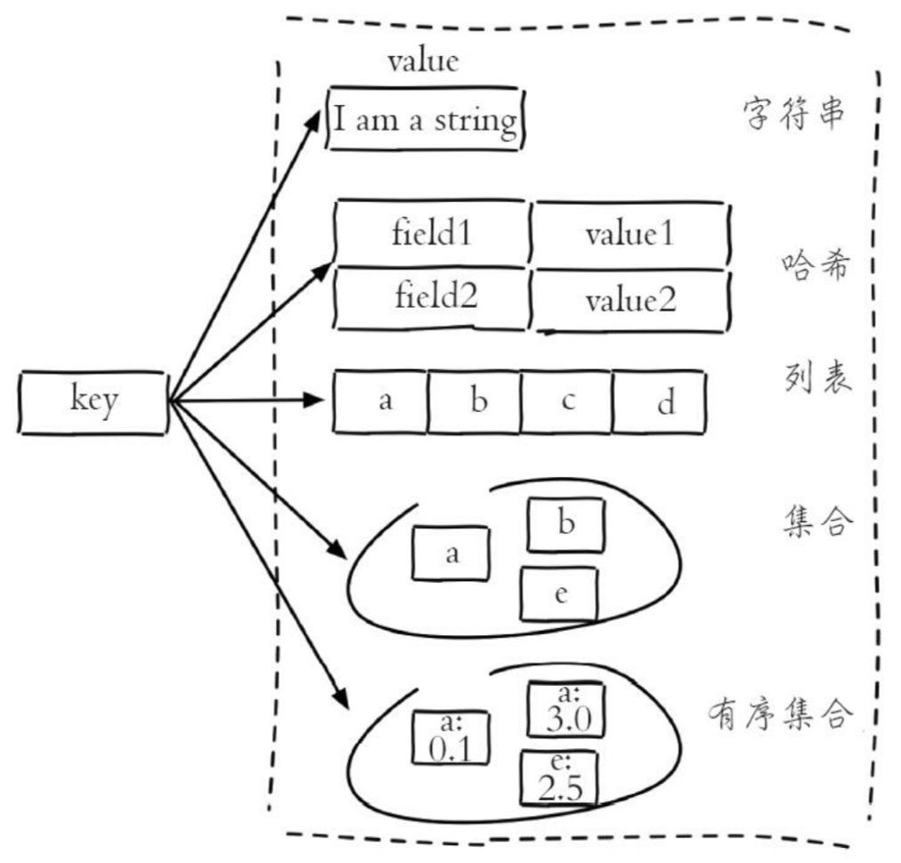
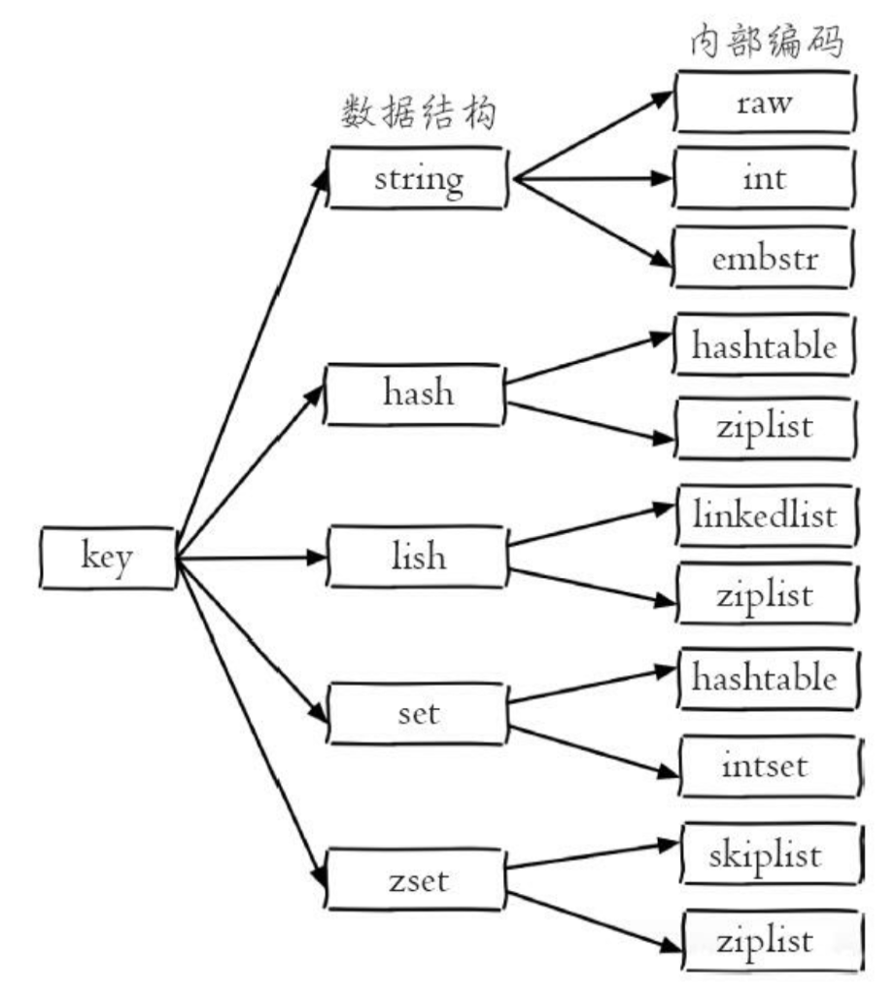
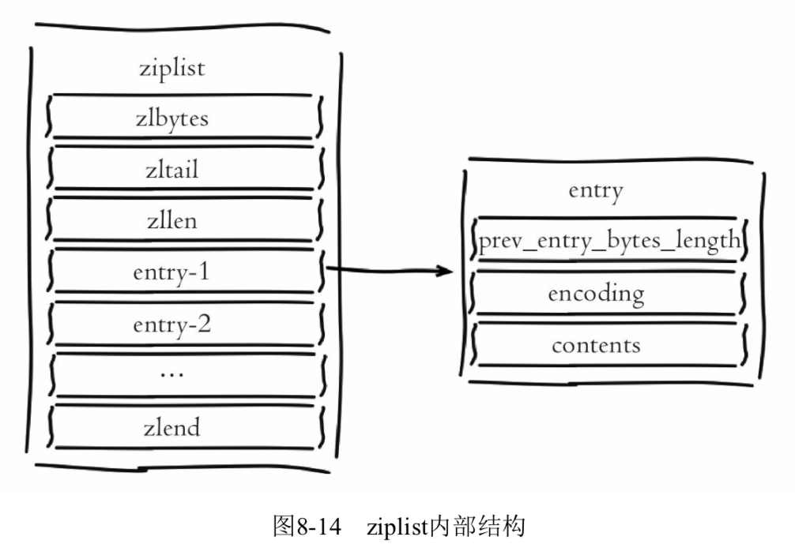
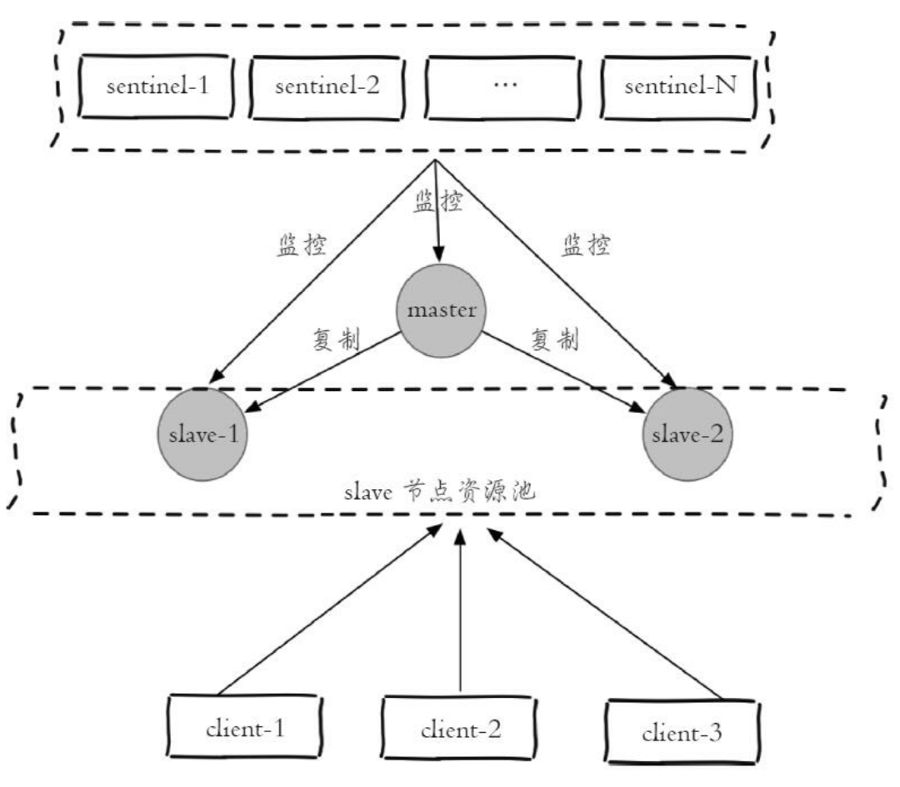
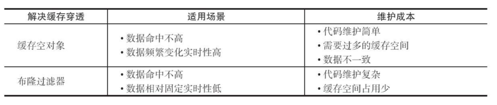
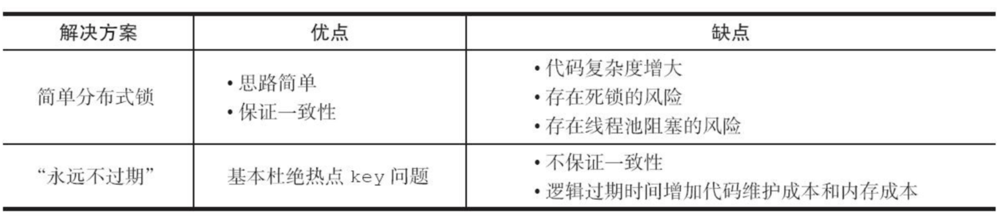
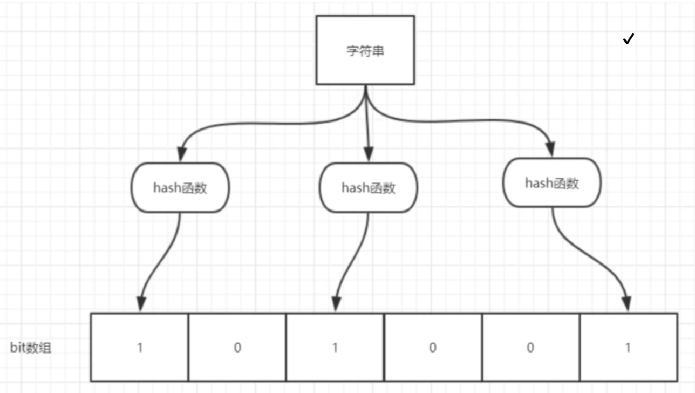

- [基础](#基础)
    - [数据结构](#数据结构)
    - [批量指令](#批量指令)
    - [Redis的高并发和快速原因](#Redis的高并发和快速原因)
    - [缓存优点](#缓存优点)
    - [使用场景](#使用场景)
    - [Redis与Memcached的区别](#Redis与Memcached的区别)
    - [Redis数据丢失的情况](#Redis数据丢失的情况)
    - [持久化](#持久化)
    - [重启恢复](#重启恢复)
    - [过期策略](#过期策略)
    - [高可用](#高可用)
    - [集群](#集群)
    - [主从复制](#主从复制)
    - [缓存设计](#缓存设计)
        - [缓存穿透](#缓存穿透)
        - [缓存雪崩](#缓存雪崩)
        - [热点key重建优化](#热点key重建优化)
        - [防止缓存失效方法](#防止缓存失效方法)
    - [布隆过滤器](#布隆过滤器)
- [面试](#面试)
    - [Redis的高并发](#Redis的高并发)
    - [Redis优点](#Redis优点)
    - [Redis的持久化](#Redis的持久化)
    - [Redis哨兵](#Redis哨兵)
    - [Redis缓存穿透和缓存雪崩](#Redis缓存穿透和缓存雪崩)

---
# 基础
## 数据结构

[五种数据结构的编码](https://www.cnblogs.com/MouseDong/p/11134039.html)

有序集合的编码
> ziplist编码  
ziplist编码的有序集合对象底层实现是压缩列表，其结构与哈希对象类似，不同的是两个紧密相连的压缩列表节点，第一个保存元素的成员，第二个保存元素的分值，而且分值小的靠近表头，大的靠近表尾。

> skiplist编码 
skiplist编码的有序集合对象底层实现是跳跃表和字典两种。
* [跳跃表](https://www.cnblogs.com/paulversion/p/8194966.html)：每个跳跃表节点都保存一个集合元素，并按分值从小到大排列；节点的object属性保存了元素的成员，score属性保存分值。
* 字典：字典的每个键值对保存一个集合元素，字典的键保存元素的成员，字典的值保存分值。

为何skiplist编码要同时使用跳跃表和字典实现？ 
跳跃表优点是有序，但是查询分值复杂度为O(logn)；字典查询分值复杂度为O(1) ，但是无序，所以结合连个结构的优点进行实现。 
虽然采用两个结构但是集合的元素成员和分值是共享的，两种结构通过指针指向同一地址，不会浪费内存。

有序集合编码转换：有序集合对象使用ziplist编码需要满足两个条件：一是所有元素长度小于64字节；二是元素个数小于128个。不满足任意一条件将使用skiplist编码。 
以上两个条件可以在Redis配置文件中修改zset-max-ziplist-entries选项和zset-max-ziplist-value选项。

压缩列表 
使用压缩列表结构的条件都是在元素个数比较少、字节长度较短的情况下。 
优点：
* 节约内存，减少内存开销，Redis是内存型数据库，所以一定情况下减少内存开销是非常有必要的。
* 减少内存碎片，压缩列表的内存块是连续的，并分配内存的次数一次即可。
* 压缩列表的新增、删除、查找操作的平均时间复杂度是O(N)，N在一定的范围内，这个时间几乎是可以忽略的，并且N的上限值是可以配置的。
* 四种数据对象都有两种编码结构，灵活性增加。

## 批量指令
* 批量get/set(multi get/set)，一条指令，性能好。
* 管道（pipelining），多条指令包在一起，只请求一次redis。
* 事务（transaction），同个事务中指令串行执行，具有原子性。
* 基于事务的管道（transaction in pipelining）。

## Redis的高并发和快速原因
* redis是基于内存的，内存的读写速度非常快。
* redis是单线程的，省去了很多上下文切换线程的时间，预防了多线程可能产生的竞争问题。
* redis使用多路复用技术，可以处理并发的连接。非阻塞I/O内部实现采用[epoll](./operating_system.md#epoll)，再加上redis自身的事件处理模型将epoll中的连接、读写、关闭都转换为事件，不在网络I/O上浪费过多的时间。

## 缓存优点
* 加速读写
* 降低后端负载

## 使用场景
* 缓存
* 排行榜系统：可以使用有序集合。
* 计数器应用：可以使用字符串。
* 社交网络
* 消息队列系统：可以使用列表。
* 分布式锁

## Redis与Memcached的区别
* Redis不仅仅支持简单的k/v类型的数据，同时还提供list，set，zset，hash等数据结构的存储。
* Redis支持数据的备份，即master-slave模式的数据备份。
* Redis支持数据的持久化，可以将内存中的数据保持在磁盘中，重启的时候可以再次加载进行使用。
* 速度更快。
* 单个value的最大限制是1GB，不像memcached只能保存1MB的数据。

## Redis数据丢失的情况
* 是否有大量过期key被清理 
分析原因：这种情况并不是真正的“丢失”键值，只是达到了设置的key的过期值。 
应对方案：根据项目情况设置合理的键值过期时间，或者设置为不过期，对不使用的key进行删除。
* 是否maxmemory不足导致redis自动清理部分key以节省空间 
分析原因：redis内存使用达到设置的可用内存的上限，redis自动清理部分key以节省空间给新的key使用。 
应对方案：适当的调大maxmemory。
* 主库故障后自动重启 
分析原因：主库由于某种原因挂掉，但是在redis哨兵发现并启动切换之前被监控程序重启，如果主库有完整的备份策略，则丢失重启之前的一小段时间的数据，如果主库为了性能没有设置备份策略，则可能重启之后成为一个空的库，一段时间后，从库发现主库的runid发生变化，自动同步主库，导致数据丢失严重。 
应对方案： 
1、建议对主库使用至少一种持久化策略，即使频率低。 
2、如果没有完整的持久化策略不建议使用自动重启操作，特别是在redis集群方案中，因为在集群方案中使用哨兵的判断和操作是最安全的。
* 网络分区的问题，可能导致短时间的写入数据丢失 
分析原因：网络不稳定导致的短时写入失败或触发哨兵的自动切换（单独的主备方案触发切换期间会有数据丢失）。 
应对方案：保障网络环境稳定可达。

## 持久化
Redis持久化（数据落地）：把数据保存到硬盘中。 

Redis持久化目的 
Redis的数据操作都在内存中，Redis崩掉的话，会丢失数据。Redis持久化对数据的更新异步地保存在磁盘上，以便数据恢复。

Redis持久化方式
* RDB：指定时间间隔进行快照存储，恢复速度快，可能丢失数据。
* AOF：记录写操作，文件大，保存频率高。

默认情况下，是快照rdb的持久化方式，将内存中的数据以快照的方式写入二进制文件中，默认的文件名是dump.rdb。这种方式不能完全保证数据持久化，因为是定时保存，所以当redis服务kill掉，就会丢失一部分数据，而且数据量大，写操作多的情况下，会引起大量的磁盘IO操作，会影响性能。
所以还要再使用aof做持久化，每一个写命令都通过write函数追加到appendonly.aof中。

## 重启恢复
当Redis服务器挂掉时，重启时将按照以下优先级恢复数据到内存：
1. 如果只配置AOF，重启时加载AOF文件恢复数据。
2. 如果同时配置了RDB和AOF，启动时只加载AOF文件恢复数据。
3. 如果只配置RDB，启动是加载dump文件恢复数据。

## 过期策略
内存回收策略：
* 惰性删除：读取键时，如果过期，删除并返回空，释放内存。缺点：容易导致内存泄漏：如果键一直没有被访问到则无法被及时删除，导致内存不能及时释放。
* 定时删除：定时任务循环采样一定数量的键，过期则删除。

## 高可用
当主节点出现故障时，Redis Sentinel（哨兵）能自动完成完成故障发现和故障转移，并通知应用方，从而实现真正的高可用。 
Redis Sentinel是一个分布式架构，其中包含若干个Sentinel节点和Redis数据节点，每个Sentinel节点会对数据节点和其余Sentinel节点进行监控，当它发现节点不可达时，会对节点做下线标识。如果被标识的是主节点，它还会和其他Sentinel节点进行“协商”，当大多数Sentinel节点都认为主节点不可达时，它们会选举出一个Sentinel节点来完成自动故障转移的工作，同时会将这个变化实时通知给Redis应用方。

Redis Sentinel的实现原理
1. 三个定时任务
* 每隔10秒，每个Sentinel节点会向主节点和从节点发送info命令获取最新的拓扑结构。
* 每隔2秒，每个Sentinel节点会向Redis数据节点的__sentinel__:hello频道上发送该Sentinel节点对于主节点的判断以及当前Sentinel节点的信息，同时每个Sentinel节点也会订阅该频道，来了解其他Sentinel节点以及它们对主节点的判断。
* 每隔1秒，每个Sentinel节点会向主节点、从节点、其余Sentinel节点发送一条ping命令做一次心跳检测，来确定这些节点当前是否可达。实现了对每个节点的监控。
2. 主观下线和客观下线
* 主观下线：Sentinel节点发送ping命令做心跳检测，当这些节点超过down-after-milliseconds没有进行有效回复，Sentinel节点就会对该节点做失败判定，这个行为叫做主观下线。存在误判的可能。
* 客观下线：当Sentinel主观下线的节点是主节点时，该Sentinel节点会通过sentinel is-master-down-by-addr命令向其他Sentinel节点询问对主节点的判断，当超过<quorum>个数，Sentinel节点认为主节点确实有问题，这时该Sentinel节点会做出客观下线的决定。
3. Sentinel领导者选举： 
1、每个在线的Sentinel节点都有资格成为领导者，当它确认主节点主观下线时候，会向其他Sentinel节点发送sentinel is-master-down-by-addr命令，要求将自己设置为领导者。 
2、收到命令的Sentinel节点，如果没有同意过其他Sentinel节点的sentinel is-master-down-by-addr命令，将同意该请求，否则拒绝。
3、如果该Sentinel节点发现自己的票数已经大于等于max(quorum,num(sentinels)/2+1)，那么它将成为领导者。 
4、如果此过程没有选举出领导者，将进入下一次选举。
4. 故障转移： 
1、在从节点列表中选出一个节点作为新的主节点，选择方法如下： 
（a）过滤：“不健康”（主观下线、短线）、5秒内没有回复过Sentinel节点ping响应、与主节点失联超过down-after-milliseconds*10秒。 
（b）选择slave-priority（从节点优先级）最高的从节点列表，如果存在则返回，不存在则继续。 
（c）选择复制偏移量最大的从节点（复制的最完整），如果存在则返回，不存在则继续。 
（d）选择runid最小的从节点。 
2、Sentinel领导者节点会对第一步选出来的从节点执行slaveof no one命令让其成为主节点。 
3、Sentinel领导者节点会向剩余的从节点发送命令，让它们成为新主节点的从节点，复制规则和parallel-syncs参数有关。 
4、Sentinel节点集合会将原来的主节点更新为从节点，并保持着对其关注，当其恢复后命令它去复制新的主节点。 

从节点的作用
* 当主节点出现故障时，作为主节点的后备“顶”上来实现故障转移，Redis Sentinel已经实现了该功能的自动化，实现了真正的高可用。
* 扩展主节点的读能力，尤其是在读多写少的场景非常适用。

Redis Sentinel下的读写分离架构图

## 集群
Redis Cluster是Redis的分布式解决方案，有效地解决了Redis分布式方面的需求。当遇到单机内存、并发、流量等瓶颈时，可以采用Cluster架构方案达到负载均衡的目的。

Redis集群自身实现了高可用。高可用首先需要解决集群部分失败的场景：当集群内少量节点出现故障时通过自动故障转移保证集群可以正常对外提供服务。

## 主从复制
复制偏移量：参与复制的主从节点都会维护自身复制偏移量。通过对主从节点的复制偏移量，可以判断主从节点数据是否一致。 
复制积压缓冲区：是保存在主节点上的一个固定长度的队列。主节点相应写命令时，不但会把命令发送给从节点，还会写入复制积压缓冲区。用于部分复制和复制命令丢失的补救。保证复制的数据一致性。 
主节点运行ID（runid）：运行ID用来唯一识别Redis节点。

* 全量复制：Redis全量复制一般发生在Slave初始化阶段，这时Slave需要将Master上的所有数据都复制一份。具体步骤如下： 
1. 从节点连接主节点，发送SYNC命令。
2. 主节点接收到SYNC命名后，开始执行BGSAVE命令生成RDB文件并使用缓冲区记录此后执行的所有写命令。
3. 主节点BGSAVE执行完后，向所有从节点发送快照文件，并在发送期间继续记录被执行的写命令。
4. 从节点收到快照文件后丢弃所有旧数据，载入收到的快照。
5. 主节点快照发送完毕后开始向从节点发送缓冲区中的写命令。
6. 从节点完成对快照的载入，开始接收命令请求，并执行来自主节点缓冲区的写命令。
* 部分复制：部分复制是指Slave初始化后开始正常工作时主服务器发生的写操作同步到从服务器的过程。主节点每执行一个写命令就会向从节点发送相同的写命令，从节点接收并执行收到的写命令。

## 缓存设计
### 缓存穿透
缓存穿透是指查询一个根本不存在的数据，缓存层和存储层都不会命中，通常出于容错的考虑，如果从存储层查不到数据则不写入缓存层。

缓存穿透带来的问题 
缓存穿透将导致不存在的数据每次请求都要到存储层去查询，失去了缓存保护后端存储的意义。缓存穿透问题可能会使后端存储负载加大，由于很多后端存储不具备高并发性，甚至可能造成后端存储宕掉。 
通常可以在程序中分别统计总调用数、缓存层命中数、存储层命中数，如果发现大量存储层空命中，可能就是出现了缓存穿透问题。

造成缓存穿透的基本原因
* 自身业务代码或者数据出现问题。
* 一些恶意攻击、爬虫等造成大量空命中。

解决缓存穿透问题的方法
* 缓存空对象：存储层不命中后，仍然将空对象保留到缓存层中，之后再访问这个数据将会从缓存中获取，这样就保护了后端数据源。
* [布隆过滤器](#布隆过滤器)：在访问缓存层和存储层之前，将存在的key用户用布隆过滤器提前保存起来，做第一层拦截。如果布隆过滤器认为该用户id不存在，那么就不会访问存储层，在一定程度保护了存储层。

### 缓存雪崩
缓存雪崩：由于缓存层承载着大量请求，有效地保护了存储层，但是如果缓存层由于某些原因不能提供服务，于是所有的请求都会到达存储层，存储层的调用量会暴增，造成存储层也会级联宕机的情况。

预防和解决缓存雪崩问题
* 保证缓存层服务高可用性。
* 依赖隔离组件为后端限流并降级。
* 提前演练。

### 热点key重建优化
热点key，并发量非常大。在缓存失效的瞬间，有大量线程来重建缓存，造成后端负载加大，甚至可能会让应用崩溃。

解决方法
* 互斥锁：如果构建缓存过程出现问题或者时间长，可能会出现死锁和线程池阻塞的风险。能保证数据一致性。
* 永远不过期：会存在数据不一致的情况。

### 防止缓存失效方法
* 保证内存充足，淘汰的数据都是非热点的数据，不会导致系统崩溃。可以采用redis集群分片部署。
* 对于大量的过期数据，设置过期错开，不要设置同一个过期时间，导致某一时刻，大量数据不命中。
* 做好数据备份，做好主从复制。

## 布隆过滤器
布隆过滤器（Bloom Filter）是Redis的插件。

实现：使用Hash算法和Bitmap位存储的方式。使用多个无偏（能够把元素的Hash值算得比较均匀）哈希函数对元素进行哈希，算出一个整数索引值，然后对位图长度进行取模运算得到一个位置，每个无偏哈希函数都会得到一个不同的位置，再把位图的这几个位置都设置为1。布隆过滤器可以用于检索一个元素是否在一个集合中。

优点：
* 可以更高效地插入和查询。因为基于Hash来计算数据所在位置，所以布隆过滤器的添加和查询操作的时间复杂度都是O(1)。
* 占用空间更少，可以存储海量数据。

缺点：
* 存在误判。因为Hash是存在冲突的，同一个位置可能被多次置1。这样在判断的时候，有可能一个不存在的数据就会误判成存在。但是判断存在的数据一定是存在的。可以通过调节参数，比如使用Hash函数的个数、位数组的大小来降低失误率。
* 删除困难。因为碰撞，会出现误删。

应用：一般适用于大数据量的对精确度要求不是100%的去重场景。
* 解决[缓存穿透](#缓存穿透)的问题。
* 爬虫URL的去重。
* 网站UV统计。
* 黑名单校验。

Redis的Bitmap只支持2^32大小，对应到内存也就是512MB。可以通过构建多个Redis的Bitmap，通过Hash取模的方式分散一下。万分之一的误判率，512MB可以放下2亿条数据。

# 面试
## Redis的高并发
[Redis的高并发](#Redis的高并发和快速原因)
## Redis优点
[Redis优点](#缓存优点)
## Redis的持久化
[Redis的持久化](#持久化)
## Redis哨兵
[Redis哨兵](#高可用)
## Redis缓存穿透和缓存雪崩
[缓存穿透](#缓存穿透) [缓存雪崩](#缓存雪崩)